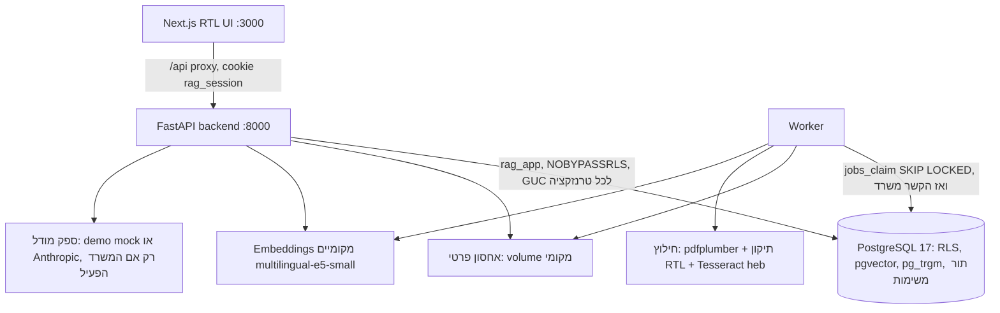
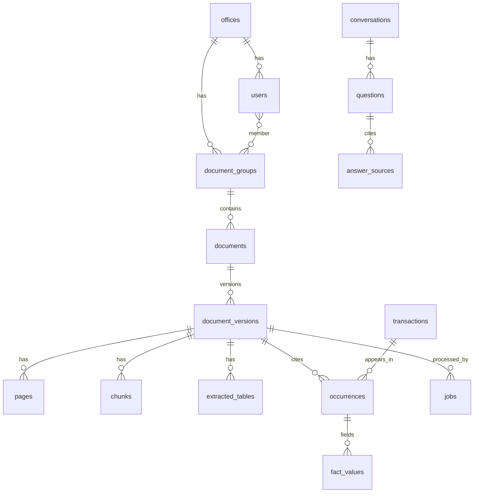

# ארכיטקטורה

מסמך זה מתאר את רכיבי ה-MVP, את מודל הנתונים, את מודל הבידוד בין משרדים ואת נתיבי המידע. ההחלטות המלאות ונימוקיהן נמצאים בתוכנית: `docs/plans/2026-10-05-2234-feat-appraisal-knowledge-engine-mvp-plan.md` (סעיף Key Technical Decisions, ‏KTD1–KTD17). חוזה ה-API: `docs/api-contract.md`.

## רכיבים



- `backend/app/platform/` — תשתית שאינה תלויה בתחום: הזדהות, משרדים, משתמשים, קבוצות מסמכים, מסמכים וגרסאות, אחסון, תור משימות, חיפוש, ניהול.
- `backend/app/appraisal/` — הסכמה השמאית: נרמול ערכים, חילוץ עובדות, ולידציה, איחוד כפילויות, פרסום, בדיקת נתונים, שאילתות SQL.
- `backend/app/extraction/` — חילוץ PDF/DOCX מאחורי ממשק `Extractor` (ניתן להחליף ב-Docling או ב-OCR ענן).
- `backend/app/answering/` — פירוש שאלות, הבהרות, תבניות, תשובות תוכן, אימות, שיחה ו-cache.
- `backend/app/providers/` — ממשקי ספקים: LLM ו-embeddings.

ההפרדה בין `platform` ל-`appraisal` מאפשרת בהמשך להוסיף תחום (משפט, ביטוח) בלי לגעת בתשתית המסמכים וההרשאות.

## מודל הבידוד

| שכבה | מה אוכף |
|---|---|
| הזדהות | session בצד השרת (טבלת `sessions`, hash של token). המשרד והמשתמש נגזרים רק מה-session; `office_id` שהלקוח שולח מתעלמים ממנו. |
| טרנזקציה | כל בקשה וכל משימת worker פותחות טרנזקציה וקובעות `app.office_id`, `app.user_id`, `app.role` עם `set_config(..., true)`. ההגדרה מתה עם הטרנזקציה, ולכן חיבור ממאגר החיבורים לא נושא הקשר לבקשה אחרת. |
| RLS | `FORCE ROW LEVEL SECURITY` על כל טבלה. מדיניות `office_id = app_office()`; כשה-GUC חסר — אין שורות. בטבלת `documents` גם הרשאת קבוצה; טבלאות התוכן מגיעות ל-`documents` דרך תת-שאילתה שעוברת RLS. |
| תפקידים | `rag_owner` — בעלים ו-migrations. `rag_app` — runtime, ‏NOBYPASSRLS, לא בעלים. `rag_lookup` — ‏NOLOGIN BYPASSRLS, הבעלים היחיד של פונקציות SECURITY DEFINER צרות: ארבע ב-runtime (כניסה לפי דוא״ל, פענוח session, תפיסת משימה, חיפוש hash בתוך המשרד) ושתיים לתפעול שרק `rag_owner` רשאי להריץ (הקמת משרד, רשימת משרדים לתחזוקה). ראו `docs/solutions/database-issues/force-rls-security-definer-lookups-need-bypassrls-owner.md`. |
| קוד | פעולות כתיבה שנוגעות בעסקה שאוחדה מכמה קבוצות רצות בהקשר `system` רק אחרי בדיקת הרשאה של המשתמש. |

## מודל הנתונים



- `transactions` — עסקה או שווי ייחודיים (ערכים מוסכמים: מחיר, שטח, סוג שטח, תאריך, מחיר למ״ר מחושב עם `calc_definition`).
- `occurrences` — הופעה של עסקה במסמך מסוים: עמוד, טבלה, שורה, וכל הערכים המנורמלים כפי שהופיעו באותו מסמך, סטטוס אימות, דגל סתירה ושדות קריטיים חסרים.
- `fact_values` — לכל שדה בהופעה: הטקסט המקורי, הערך המנורמל, נתיב המקור (`source_path`), גרסת חילוץ, היסטוריית תיקונים.
- `dedup_candidates` — זוגות חשודים ככפילות שממתינים להחלטה אנושית.
- כל סכום ושטח נשמר כ-`NUMERIC` ומחושב כ-`Decimal`.

## נתיב הקליטה

1. `POST /api/documents` — בדיקת הרשאה, סוג (סיומת + magic bytes), גודל, מגבלות DOCX; hash ‏SHA-256; כפילות בתוך המשרד (קובץ שמוחזק בקבוצה שהמשתמש לא רואה משוכפל בלי עיבוד חוזר ובלי לחשוף את הקבוצה); שמירה פרטית; גרסה ומשימה בטרנזקציה אחת.
2. Worker: `jobs_claim` עם `FOR UPDATE SKIP LOCKED` ו-lease. lease שפג נתפס מחדש; כשל זמני — ניסיון חוזר עם backoff; כשל קבוע (מוצפן, פגום, חריגה) — `failed` עם סיבה בעברית.
3. חילוץ: שכבת טקסט + תיקון סדר עברי לכל שורה; ציון איכות; OCR ‏`heb+eng` לעמודים שנכשלו; טבלאות עם עמוד לכל שורה, כולל טבלה שחוצה עמודים; chunks לפי סעיפים עם רשימת עמודים מדויקת.
4. Embeddings מקומיים לכל chunk (מודל + גרסה בכל שורה).
5. פרסום בטרנזקציה אחת תחת נעילת משרד: עובדות, ולידציה, איחוד כפילויות, סטטוס הגרסה (`ready` / `needs_review`), החלפת הגרסה הקודמת, העלאת גרסת הנתונים.

## נתיב המענה

```mermaid
flowchart TB
  Q[שאלה + תנאים מאושרים בשיחה] --> P{פירוש: כללים / המשך שיחה / מודל רק אם הענן מופעל}
  P -->|חסר תנאי שמשנה תוצאה| C[הבהרה עם אפשרויות]
  P -->|חישוב| K{cache: משרד, היקף הרשאות, כוונה, תנאים, גרסת נתונים, הגדרות}
  K -->|hit + מקורות עדיין מורשים| A
  K -->|miss| S[SQL פרמטרי על כל העסקאות המאומתות הייחודיות]
  S --> T[תבנית: תנאים, n, ממוצע ומשוקלל, חציון וטווח, מקורות, כיסוי]
  P -->|תוכן| R[חיפוש משולב: FTS + trigram + וקטורי, RRF]
  R --> G{ספק}
  G -->|ענן מופעל| M[תשובת מודל עם [E#]] --> V{אימות: מקורות קיימים ומורשים, מספרים מהראיות, בלי קישורים}
  V -->|נכשל| X[תשובה מצוטטת מהקטעים]
  G -->|demo| D[mock מסומן כדמו]
  G -->|כבוי| X
  T --> A[תשובה + מקורות + מגבלות]
```

- חישובים ב-SQL בלבד, על כל הרשומות המורשות התואמות — לא על top-k של החיפוש.
- "בשנת 2024" הופך לטווח מפורש `[2024-01-01, 2025-01-01)` על שדה התאריך שנבחר.
- תנאים שמשנים תוצאה ואינם בשאלה (מחיר עסקה מול שווי, סוג תאריך, ובסיס שטח, סוג נכס או מע״מ כשהם מעורבים ברשומות) — הבהרה.
- שורת הכיסוי מחושבת מחדש בכל תשובה, גם מ-cache.

## Cache ופסילה

מפתח: משרד, hash של היקף ההרשאות (תפקיד + קבוצות), כוונה, תנאים מנורמלים, גרסת נתונים של המשרד, גרסת הגדרות הספק, מודל ה-embeddings וגרסת התבנית. גרסת הנתונים עולה בכל פרסום, אישור, תיקון, מחיקה ושינוי הרשאות — כך שרשומות ישנות פשוט אינן נגישות. לפני החזרה מ-cache נבדק שכל מקור עדיין קיים, נוכחי ומורשה.

## מה לא נבנה

ראו `README.md` ("מה עדיין חסר") ו-`docs/evaluation/report.md`.
