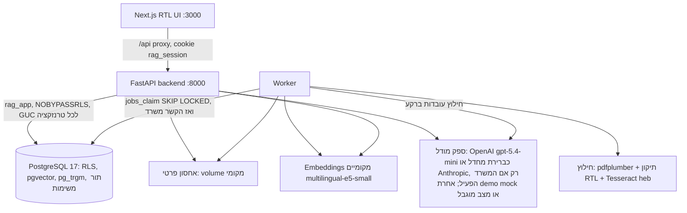
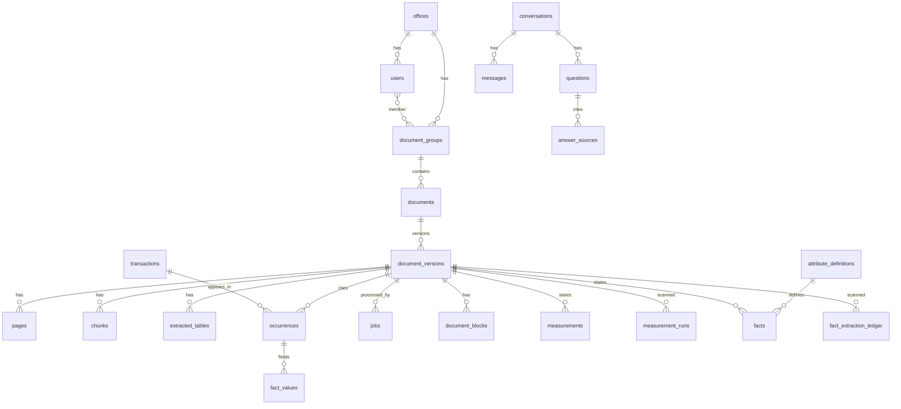
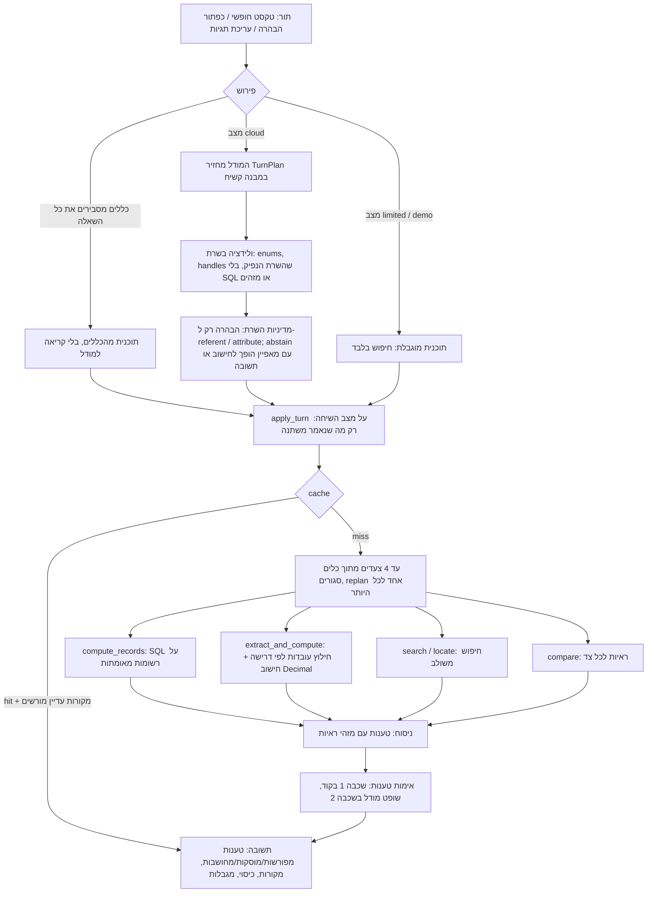

# ארכיטקטורה

מסמך זה מתאר את רכיבי המערכת, את מודל הנתונים, את מודל הבידוד בין משרדים ואת נתיבי המידע. ההחלטות המלאות ונימוקיהן נמצאים בתוכניות: `docs/plans/2026-10-05-2234-feat-appraisal-knowledge-engine-mvp-plan.md` (ה-MVP, ‏KTD1–KTD17) ו-`docs/plans/2026-10-06-0856-feat-general-question-engine-plan.md` (מנוע השאלות הכללי, ‏KTD1–KTD16 שלה). חוזה ה-API: `docs/api-contract.md`.

## רכיבים

- `backend/app/platform/` — תשתית שאינה תלויה בתחום: הזדהות, משרדים, משתמשים, קבוצות מסמכים, מסמכים וגרסאות, אחסון, תור משימות, חיפוש, ניהול.
- `backend/app/appraisal/` — הסכמה השמאית: נרמול ערכים, חילוץ עובדות, ולידציה, איחוד כפילויות, פרסום, בדיקת נתונים, שאילתות SQL.
- `backend/app/extraction/` — חילוץ PDF/DOCX מאחורי ממשק `Extractor` (ניתן להחליף ב-Docling או ב-OCR ענן).
- `backend/app/chat/` — מנוע השיחה: לולאת המודל עם כלים, הכלים עצמם, אימות התשובה, ה-API של השיחות וההודעות.
- `backend/app/measurements/` — נתונים כמותיים עם משמעותם: חילוץ, ולידציה, שמירה שמכבדת החלטות סוקרים, ממשק הסקירה.
- `backend/app/answering/` — המנוע הקודם (`/api/ask`): פירוש שאלות לתוכנית, הבהרות, תבניות, תשובות תוכן, אימות ו-cache. נשאר זמין ובבדיקות, אבל הממשק עובד מול מנוע השיחה.
- `backend/app/providers/` — ממשקי ספקים: LLM ו-embeddings.

ההפרדה בין `platform` ל-`appraisal` מאפשרת בהמשך להוסיף תחום (משפט, ביטוח) בלי לגעת בתשתית המסמכים וההרשאות.

## מודל הבידוד

| שכבה | מה אוכף |
|---|---|
| הזדהות | session בצד השרת (טבלת `sessions`, hash של token). המשרד והמשתמש נגזרים רק מה-session; `office_id` שהלקוח שולח מתעלמים ממנו. |
| טרנזקציה | כל בקשה וכל משימת worker פותחות טרנזקציה וקובעות `app.office_id`, `app.user_id`, `app.role` עם `set_config(..., true)`. ההגדרה מתה עם הטרנזקציה, ולכן חיבור ממאגר החיבורים לא נושא הקשר לבקשה אחרת. |
| RLS | `FORCE ROW LEVEL SECURITY` על כל טבלה. מדיניות `office_id = app_office()`; כשה-GUC חסר — אין שורות. בטבלת `documents` גם הרשאת קבוצה; טבלאות התוכן מגיעות ל-`documents` דרך תת-שאילתה שעוברת RLS. |
| תפקידים | `rag_owner` — בעלים ו-migrations. `rag_app` — runtime, ‏NOBYPASSRLS, לא בעלים. `rag_lookup` — ‏NOLOGIN BYPASSRLS, הבעלים היחיד של פונקציות SECURITY DEFINER צרות: ארבע ב-runtime (כניסה לפי דוא״ל, פענוח session, תפיסת משימה, חיפוש hash בתוך המשרד) ושתיים לתפעול שרק `rag_owner` רשאי להריץ (הקמת משרד, רשימת משרדים לתחזוקה). ראו `docs/solutions/database-issues/force-rls-security-definer-lookups-need-bypassrls-owner.md`. |
| קוד | פעולות כתיבה שנוגעות בעסקה שאוחדה מכמה קבוצות רצות בהקשר `system` רק אחרי בדיקת הרשאה של המשתמש. |

## מודל הנתונים

- `transactions` — עסקה או שווי ייחודיים (ערכים מוסכמים: מחיר, שטח, סוג שטח, תאריך, מחיר למ״ר מחושב עם `calc_definition`).
- `occurrences` — הופעה של עסקה במסמך מסוים: עמוד, טבלה, שורה, וכל הערכים המנורמלים כפי שהופיעו באותו מסמך, סטטוס אימות, דגל סתירה ושדות קריטיים חסרים.
- `fact_values` — לכל שדה בהופעה: הטקסט המקורי, הערך המנורמל, נתיב המקור (`source_path`), גרסת חילוץ, היסטוריית תיקונים.
- `dedup_candidates` — זוגות חשודים ככפילות שממתינים להחלטה אנושית.
- `attribute_definitions`, `facts`, `fact_extraction_ledger` — מאגר העובדות של מאפיינים שאין להם עמודה (ראו "מאגר העובדות" למטה). שלושתן תחת RLS; עובדה נראית רק אם המסמך שלה נראה.
- `conversations.state` — מצב השיחה המובנה (JSON) עם `state_version`; `questions` שומרת לכל תור את התוכנית, הצעדים, גרסאות העובדות ו-`turn_id`. שיחות ושאלות גלויות רק למשתמש שלהן (מדיניות restrictive).
- `document_blocks` — כל יחידה במסמך לפי סדר הקריאה: כותרת, פסקה, תיבת טקסט, טבלה או תמונה, עם הסעיף (נתיב הכותרות), מספר הפסקה, שם קובץ התמונה, מקור הקריאה (`text`, `word_table`, `emf`, `ocr`, `vision`) וסטטוס הקריאה (`read`, `read_uncertain`, `no_text`, `decorative`, `unread`). ל-chunks יש `block_start`/`block_end`, ולכן אפשר להרחיב הקשר ולפתוח מקור במקום המדויק. ב-`document_versions.ingestion` נשמר דוח הקריאה (מה נקרא, מה לא ולמה, `partial`).
- `measurements` — נתון כמותי עם משמעותו: התיאור כפי שנכתב, סוג המדד, ערך (מדויק, מקורב, טווח, מינימום, מקסימום), יחידה, תקופה, בסיס שטח כפי שנכתב, מע״מ, הנכס או הרכיב, תפקיד הקביעה (קביעת שמאי, עסקת השוואה, מחיר מבוקש, נתון סקר, תחשיב), ציטוט ומיקום. ערכים מאותו משפט או מאותה שורה חולקים `statement_key`. `measurement_runs` — אילו גרסאות נקראו ובאיזו מידה.
- `messages` — הודעות השיחה החדשה: הודעת המשתמש, ותשובת העוזר עם `progress`, `status` (`running`, `cancelling`, `cancelled`, `done`, `failed`), בקשת ביטול, התשובה המאומתת ומקורותיה, וגרסת הנתונים וההרשאות שעליהן נבנתה. גלויות רק למשתמש שלהן ולמשרד שלו.
- כל סכום ושטח נשמר כ-`NUMERIC` ומחושב כ-`Decimal`.

## נתיב הקליטה

1. `POST /api/documents` — בדיקת הרשאה, סוג (סיומת + magic bytes), גודל, מגבלות DOCX; hash ‏SHA-256; כפילות בתוך המשרד (קובץ שמוחזק בקבוצה שהמשתמש לא רואה משוכפל בלי עיבוד חוזר ובלי לחשוף את הקבוצה); שמירה פרטית; גרסה ומשימה בטרנזקציה אחת.
2. Worker: `jobs_claim` עם `FOR UPDATE SKIP LOCKED` ו-lease. lease שפג נתפס מחדש; כשל זמני — ניסיון חוזר עם backoff; כשל קבוע (מוצפן, פגום, חריגה) — `failed` עם סיבה בעברית.
3. חילוץ PDF: שכבת טקסט + תיקון סדר עברי לכל שורה; ציון איכות; OCR ‏`heb+eng` לעמודים שנכשלו; טבלאות עם עמוד לכל שורה, כולל טבלה שחוצה עמודים; chunks לפי סעיפים עם רשימת עמודים מדויקת.
   חילוץ DOCX (`app/extraction/docx.py`): בלי עמודים. הגוף נקרא לפי סדר: פסקאות (כולל hyperlinks ותוצאות שדות), כותרות לפי סגנונות Word ולפי פסקאות ממוספרות קצרות (דוחות משתמשים בסגנונות רשימה מותאמים), תיבות טקסט (פעם אחת, בלי עותק ה-Fallback), טבלאות Word ותמונות. תמונות EMF נקראות מרשומות הטקסט שלהן (`app/extraction/emf.py`): מיקום כל ריצת טקסט, קווי הגבול, תאים ממוזגים לאורך ולרוחב, כותרות והערות, בלי OCR. תמונות רסטר נבדקות ב-OCR; תמונה עם טקסט נקראת בקריאה חזותית של המודל כשהמשרד במצב ענן, והמספרים נבדקים מול ה-OCR בשני הכיוונים (מספר שהמודל כתב ו-OCR לא ראה, ומספר ש-OCR ראה והמודל השמיט). בלי מודל — OCR בלבד, ורק כשרוב המילים ודאיות. כל טבלה שומרת את המשפט שמציג אותה (`caption`), כותרת והערות; לכל תמונה סטטוס, ותמונה שלא נקראה הופכת את המסמך ל"נקרא חלקית".
   קריאה מחדש: `POST /api/admin/reprocess` מתזמן משימות `reindex` שמחליפות בלוקים, טבלאות, chunks ו-embeddings, שומרות רשומות והחלטות סוקרים, מוחקות עובדות לא-מאומתות של המנוע הקודם ו-cache, ומעלות את גרסת הנתונים.
4. Embeddings מקומיים לכל chunk (מודל + גרסה בכל שורה).
5. פרסום בטרנזקציה אחת תחת נעילת משרד: עובדות, ולידציה, איחוד כפילויות, סטטוס הגרסה (`ready` / `needs_review`), החלפת הגרסה הקודמת, העלאת גרסת הנתונים.
6. נתונים כמותיים (משימת `extract_measurements`, רק במצב ענן): כל קטע טקסט נקרא בידי המודל, שרושם כל ערך עם המילים המדויקות שקובעות את משמעותו. בטבלאות המודל רק מתאר עמודות (או שורות בטבלת תחשיב), והקוד מרחיב כל תא. הוולידציה דטרמיניסטית: הציטוט והערך חייבים להופיע במקור; מע״מ, תקופה ובסיס שטח נחשבים רק אם המילים שקובעות אותם נמצאות בקטע של הערך עצמו (מתחילת התיאור שלו עד תחילת התיאור של הערך הבא) או בכותרות הטבלה. כך "9,500 ₪, ללא מע״מ ודמ״ש ... 55 ₪ למ״ר/חודש" נותן "ללא מע״מ" רק ל-9,500. ערך עם בעיה עובר לבדיקה; החלטת סוקר לעולם לא נדרסת, וחילוץ חדש שסותר אותה מסומן כסתירה.

## נתיב המענה השיחתי (RAG עם כלים)

מסלול ברירת המחדל של הממשק. כל הודעה רצה ב-thread רקע (`app/chat/api.py`), והלקוח מושך את ההתקדמות:

1. **הקשר המודל:** המודל מקבל:
   - את המדיניות;
   - את סיכום השיחה, רק אם הוא עדיין תקף;
   - את ההודעות האחרונות. תשובות קודמות מקוצרות ל-600 תווים, כי הן אינן מקור;
   - את "הנתון שבמרכז השיחה" מהתשובה הקודמת;
   - את המסמכים שהשיחה עסקה בהם;
   - הפניות `P#` למקורות של התשובה הקודמת, שצריך לפתוח מחדש;
   - את ההודעה החדשה.
   
   **סיכום תקף:** הסיכום שומר `summary_meta`: המסמכים שמאחורי התשובות שקופלו, `scope_hash` של ההרשאות, גרסת הנתונים וההודעה האחרונה שקופלה. הסיכום מוצג למודל רק אם ה-scope זהה ואם כל המסמכים שלו עדיין גלויים. אחרת התור רץ בלעדיו, והסיכום נבנה מחדש אחרי התור מההודעות המותרות עכשיו בלבד. סיכום בלי `summary_meta` לא מוצג לעולם.
   
   **הודעה מוסתרת:** הודעה מוסתרת, וגם לא נכנסת להקשר, אם מסמך כלשהו שהיא נשענת עליו או מזכירה אינו גלוי עוד. זה כולל מקורות, נתונים, מסמכים ברישום הכיסוי ומסמכי ה-focus.
2. **כלים מוגדרים בלבד** (`app/chat/tools.py`). כל כלי רץ בטרנזקציה קצרה בהקשר המשתמש, כלומר תחת RLS:
   - `search`: לקסיקלי, טריגרמים וסמנטי. כולל גרסאות קיצורים (דמ״ש/דמי שכירות), חיפוש ממוקד במסמך כשהשאלה נוקבת בשמו, ולא יותר משתי שורות מאותה טבלה.
   - `open_source`: פסקאות סמוכות, הסעיף כולו, או הטבלה המלאה עם שורת גודל ("הטבלה: N שורות").
   - `find_documents`: כל המסמכים שמכילים את **כל** המונחים שמגדירים קבוצה, בכותרת או בתוכן. הכלי מחזיר עמודים וסך הכול.
   - `list_documents`: מצב הקריאה של המסמכים, בעמודים.
   - `outline`.
   - `find_measurements`: נתונים כמותיים מקובצים לפי מה שניתן להשוות, עם כיסוי, בעמודים ובסדר מלא.
   - `compute`: חישוב ב-`Decimal`. הוא מסרב לערבב סוגי מדד, יחידות, תקופות, מע״מ, בסיסי שטח או תפקידים, ומסמן את החישוב כחלקי כשלא נקראו כל העמודים.
   
   אין SQL שהמודל כותב. קטע שכבר הוחזר בתור נשלח שוב רק כהפניה `same_as`. כל כלי רושם אילו מסמכים הוא נגע בהם.
3. התשובה ב-Markdown עם מראי מקום `[S#]`, `[M#]`, `[C#]` שהונפקו בתור הזה בלבד. בנוסף, התשובה מצהירה על `scope_kind` (מסמך אחד או קבוצה), `scope_query`, `omitted` (נתונים שהושמטו ולמה) ו-`focus`.
4. **אימות** (`app/chat/verify.py`, `app/chat/evidence.py`):
   - קודם בדיקה דטרמיניסטית של מזהים ומספרים.
   - אחר כך קריאות שופט. השופט קורא לכל טענה את חלקי המקור שמכסים אותה: כל קטע שמציין את מספרי הטענה, הקטעים עם הכי הרבה מילים משותפות והשכנים שלהם, ובטבלה גם כותרת, שורת גודל, שורת עמודות והערות. קטע חתוך מסומן `excerpt`. כל מקור נשלח פעם אחת לקריאה, והקריאות נארזות לפי גודל הראיות.
   - משפט בלי פסק דין נכשל, אלא אם הוא מבנית לא-טענה: כותרת, תווית, שאלה או פתיח פתוח.
   - קריאת שופט שנכשלה מנוסה שוב פעם אחת. אם השופט עדיין לא עונה, התור נכשל עם ניסיון חוזר, ותשובה לא בדוקה לא מוצגת.
   - משפט שנכשל מקבל תיקון, ואם צריך גם ניסוח מחדש מתוכן מאומת. מה שעדיין נכשל מוסר, והתשובה אומרת זאת.
5. **כיסוי** (`app/chat/coverage.py`): השרת בונה `answer.ledger` ממה שהכלים עשו בפועל: המסמכים המתאימים, מה נבדק, מה בשימוש, מה נקרא חלקית ומה הושמט.
   - **תשובה על קבוצה** שלא בדקה מסמך מתאים, או שבדקה מסמך ולא השתמשה בו בלי לנמק, מקבלת הערת כיסוי, והסטטוס שלה לכל היותר `partial`.
   - **תשובה ממוקדת** לשאלה שלא נוקבת במסמך: כשמסמכים נוספים חולקים מילה ייחודית מהשאלה בכותרתם, הם מצוינים.
6. עצירה: הבקשה מסמנת `cancel_requested`. הלולאה בודקת לפני ואחרי כל צעד; קריאה למודל שכבר נשלחה מסתיימת והתוצאה שלה נזרקת, והממשק מציג "עוצר…" עד שהשרת מאשר `cancelled`.
7. בלי מצב ענן: מוצגות תוצאות חיפוש עם מקורות, ומסומנות במפורש כ"תוצאות חיפוש בלבד". בכשל ספק: הודעת כשל וכפתור ניסיון חוזר, אף פעם לא תשובת תבנית.

## המנוע הקודם: מנוע השאלות הכללי (`/api/ask`)

כל תור בשיחה עובר את אותו נתיב, בלי קשר לנושא. אין ניתוב לפי מילות נושא: שאלה על ממ״ד, מרפסת או יתרת זכויות עוברת באותה דרך כמו שאלת מחיר (בדיקת `tests/unit/test_no_topic_vocabulary.py` נכשלת אם מילת נושא כזו מופיעה ב-`backend/app`).

1. **פירוש** (`answering/interpret.py`, `plan.py`). המודל מקבל את השאלה, תצוגה מבנית של מצב השיחה, רשימת מקומות וה-handles של המאפיינים (`A1`...) ושל המקורות (`S1`...). הוא מחזיר `TurnPlan`: סוג משימה (`locate | answer | compare | compute | compute_explain | clarify | abstain`), יחס לתור הקודם (שאלה חדשה, המשך, תשובה להבהרה, שינוי נושא, "למה?", "תראה לי את המקור"), דלתא של תנאים, מאפיין, מדד, שאילתות חיפוש ועד ארבעה צעדים. הסכמה strict; השרת מאמת כל שדה ודוחה תוכנית עם SQL, מזהה גולמי או handle שלא הנפיק. תוכנית לא תקינה — נתיב מוגבל, לא ניחוש.
2. **מדיניות השרת** (`normalize_model_plan`). המודל מציע, השרת מחליט: הבהרה נשמרת רק כשלא ברור על איזה מסמך או מאפיין מדובר; הבהרות על סוג נתון ובסיס שטח שואלת רק פעולת החישוב, ורק כשהרשומות המורשות באמת שונות בהן — לכן שאלה על ממ״ד לא מגיעה להבהרת מחיר.
   - מקום שהשאלה עצמה לא מזכירה נמחק מהתוכנית (`_grounded_places`). כך מעבר נושא לא יורש את העיר הקודמת, ועיר שהמודל הוסיף מעצמו לא מצמצמת את התחום. "שינוי הבהרה" כשאין הבהרה פתוחה, שמשנה רק תנאי, הוא שאלת המשך.
   - **תשובה להבהרה** נבדקת לפי מבנה ולא לפי אורך:
     - בנתיב הכללים, שאלה (מילת שאלה, "X או Y") או "אין X" אינן בחירה.
     - שלילה חלה עד סוף הפסוקית ("לעסקאות ולא לשומות").
     - בנתיב המודל, תור שהמודל קרא כתשובה הופך לשאלה חדשה כשהוא מביא מאפיין, ישויות, תנאים או חישוב משלו, או כשהוא שואל ואינו מזכיר את האפשרות שנבחרה.
     - בחירת מקור בהבהרת השוואה ממשיכה את ההשוואה עם שני הצדדים.
3. **מצב השיחה** (`state.py`, KTD12). מצב מובנה בצד השרת: סוג משימה, נושא, ישויות, תנאים, מאפיין, מדד, handles של מקורות, הבהרה ממתינה ושלוש השאלות האחרונות. לא נשמר בו טקסט של תשובות או מסמכים. `apply_turn` היא פונקציה טהורה, ולכן שליחה חוזרת של אותו תור (`turn_id`) לא מחילה שינוי פעמיים; "השנה הקודמת" נפתרת מול המצב שממנו התור התחיל. שינוי נושא או מאפיין מנקה את התנאים שתלויים בו.
4. **כלים חסומים** (`turn.py`). כל כלי פותח טרנזקציה קצרה משלו תחת הקשר המשתמש; קריאות מודל לעולם לא רצות בתוך טרנזקציה. לתור יש deadline (`TURN_DEADLINE_SECONDS`, מתחת ל-timeout של ה-proxy); תוצאה שנחתכה מסומנת `partial` ולא נשמרת ב-cache. השוואה פועלת על מקורות שכבר הופיעו בשיחה (handles `S#`); שתי גרסאות של אותו מסמך מורחבות אוטומטית.
5. **ניסוח ואימות טענות** (`compose.py`, `verify.py`, KTD11). המודל מחזיר טענות, כל אחת עם סוג (`explicit`, `inferred`, `computed`) ומזהי ראיות. שכבה 1 בקוד: המזהים קיימים ומורשים, כל מספר מופיע בראיה או בערך מחושב, אין קישורים. שכבה 2: קריאת שופט שמסמנת כל טענה supported / partial / unsupported; טענה לא נתמכת נשמטת וזה מוצג. ערך מחושב מוכנס לטקסט על ידי השרת, לא על ידי המודל. כשהמודל מדווח שאין בסיס — הימנעות מנומקת עם `abstention_kind` (`not_found`, `not_stated`, `not_extracted_or_verified`, `insufficient_permission_scope`).

### מאגר העובדות ודרגות אמון (KTD7–KTD9)

- `attribute_definitions` — רישום מאפיינים למשרד: ארבעה מובנים (מחיר, שטח, מחיר למ״ר, חדרים) ומאפיינים שנוצרים לפי שאלה (`x_<hash>`) עם תווית, כינויים, ממד יחידה, יחידה קנונית, גרסת פרומפט חילוץ ו-`facts_version`.
- `facts` — ערך לכל ישות (הנכס הנישום, נכס השוואה, אחר) בגרסת מסמך: ערך כפי שנכתב, יחידה, ערך קנוני, **ציטוט מילולי** ונתיב מקור (chunk, או תא בטבלה עם שורה ועמודה), סטטוס והיסטוריה.
- `fact_extraction_ledger` — מצב לכל (גרסה, מאפיין, גרסת חילוץ): `found`, `not_stated`, `partial_scan`, `failed`, `pending`. ממנו נבנית שורת הכיסוי: כמה מסמכים בתחום, בכמה נמצא ערך, כמה לא מציינים, כמה טרם חולצו, כמה ממתינים לבדיקה.
- חילוץ לפי דרישה: עד `EXTRACT_SYNC_MAX_VERSIONS` גרסאות בתוך התור (שלוש במקביל), השאר כמשימות `extract_facts` ב-worker; התשובה מציינת כמה ממתינים, ושאלה חוזרת אחרי שה-worker סיים מקבלת תוצאה מלאה.
- ולידציה בשרת: הציטוט חייב להופיע מילה במילה בקטע או בתא שצוטט; הערך והיחידה נקראים מהציטוט בקוד; היחידה חייבת להתאים לממד המאפיין; המונח שמכנה את הערך חייב להיות שם המאפיין (מספר של "שטח הנכס" אינו שטח ממ״ד).
- דרגות אמון: `verified`/`corrected` (אדם בדק) — המספר הראשי; `auto_validated` — מתווסף רק ל"נתון ראשוני" שמוצג בנפרד; `needs_review` (סתירה, מונח נרדף, יחידה שהוסקה, ישות שאינה הנכס הנישום) — לא נספר ומדווח בכיסוי. ערכים סותרים לאותו נכס מחושבים בזמן קריאה תחת RLS של הקורא ועוברים לבדיקה. החישוב תמיד `Decimal`, על כל המסמכים בתחום — לא על top-k.
- **משמעות, לא רק טקסט** (גרסת חילוץ `x7`). ציטוט שלא נמצא במקור שצוטט מחופש רק בסביבתו: אותה שורה בטבלה או אותו chunk. ציטוט שנמצא רק במקום אחר במסמך, למשל בשורה של נכס השוואה, נדחה. רק handle לא מוכר עובר למקום היחיד שמכיל את הציטוט, והערך עובר לבדיקה. ספירה סופרת את שם העצם שנכתב איתה: "בקומה 3" סופר קומות. מילת אפס ("אין", "ללא") חייבת לחול על מילה של המאפיין. אפס עם מגדיר שהמאפיין אינו מזכיר ("אין X נוספת") עובר לבדיקה. ערך שהמונח שמכנה אותו הוא כולו שם של מאפיין אחר במשרד נדחה (`other_attribute`).
- **זהות מאפיין יציבה** (`same_attribute`). ניסוח אחר של אותן מילים (יחיד או רבים, תחילית או ה' הידיעה, סדר מילים) מגיע לאותה הגדרה ונשמר ככינוי. לכן שאלה חוזרת משתמשת בעובדות שכבר חולצו ואומתו, בלי לקרוא שוב את המסמכים. שמות שונים במילה, במילת מדידה ("גובה" מול "רוחב"), במגדיר ("נטו" מול "ברוטו") או בממד היחידה נשארים הגדרות נפרדות. הגדרה מספרית והגדרה לא-מספרית לא חולקות עובדות.
- **החלטת אדם גוברת על חילוץ חוזר**. ערכים `verified` ו-`corrected` נספרים גם אחרי העלאת גרסת חילוץ. ערך שאדם דחה לא נספר שוב כשחילוץ חדש מוצא אותו.
- **ביקורת חישוב ושלמות** (`compute_facts.audit`). לכל גרסה בתחום מתועד מצבה:
  - `used`: הערך נכלל;
  - `duplicate`: אותו נכס, אותו ערך, נספר פעם אחת;
  - `conflict`: ערכים סותרים לאותו נכס;
  - `filtered_out`: הערך לא עמד בתנאי;
  - `awaiting_review`, `not_stated`, `partial_scan`, `not_yet_extracted`.

  מכאן נקבעת שלמות התוצאה:
  - `complete`: אין חוסרים.
  - `subset`: התוצאה מוצגת "על N התצפיות שנמצאו בלבד", עם רשימת החוסרים, ולא כנתון של כל המאגר.
  - `insufficient`: אין תוצאה כוללת, רק הערכים שנמצאו עד כה. זה המצב כשלא נמצא אף ערך, בסכום שיש בו חוסר, או כשמסמכים שטרם נקראו רבים מהערכים שנמצאו.

  נכס שנישום בשני דוחות מזוהה גם לפי גוש/חלקה מכותרת הדוח.
- **כשלי חילוץ**. כשל שנובע מתוכן המסמך (refusal, invalid, incomplete) לא נשלח שוב בכל תור. כשל אחר נשלח שוב רק אחרי השהיה.
- בדיקת עובדות: `/api/review/facts` (ראו חוזה ה-API). כל שינוי מעלה את `facts_version` של אותו מאפיין בלבד. פעולה מרשימה ישנה נדחית ב-409.

### נתיב מחיר (נשמר מה-MVP)

- חישובי מחיר ב-SQL בלבד, על כל הרשומות המורשות התואמות — לא על top-k של החיפוש. שאלת מחיר שהכללים מסבירים במלואה לא מגיעה למודל גם במצב cloud.
- "בשנת 2024" הופך לטווח מפורש `[2024-01-01, 2025-01-01)` על שדה התאריך שנבחר.
- תנאים שמשנים תוצאה ואינם בשאלה (מחיר עסקה מול שווי, סוג תאריך, ובסיס שטח, סוג נכס או מע״מ כשהם מעורבים ברשומות) — הבהרה, שאפשר לענות עליה גם בטקסט חופשי.
- שורת הכיסוי מחושבת מחדש בכל תשובה, גם מ-cache.

### ספקים ומצבים

`providers/status.py` הוא המקום היחיד שמחליט מי עונה: `cloud`, `error`, `demo` או `limited` (ראו README וחוזה ה-API). OpenAI נקרא דרך ה-SDK הרשמי וה-Responses API עם פלט מובנה ו-`store=false`; המפתח (`OPENAI_KEY`, אחריו `OPENAI_API_KEY`) נשאר בשרת. כל קריאה נרשמת ב-`provider_usage` (מטרה, מודל, סטטוס, טוקנים, זמן). כשל של הספק מוצג כמגבלה בתשובה ולעולם לא מוסתר מאחורי תשובת דמו.

## Cache ופסילה

מפתח (KTD14): המשימה הקנונית אחרי ולידציה — משרד, hash של היקף ההרשאות (תפקיד + קבוצות), סוג משימה, כלים, מאפיין וגרסת החילוץ שלו, `facts_version` של המאפיין, מדד, יחידה, תנאים מנורמלים, שאילתות החיפוש (לתשובות תוכן), גרסאות המקורות שנבחרו, גרסת הנתונים של המשרד, גרסת הגדרות הספק, מצב/ספק/מודל, גרסת פרומפט התשובה, מודל ה-embeddings וגרסת התבנית — ולא טקסט השאלה הגולמי. גרסת הנתונים עולה בכל פרסום, אישור, תיקון, מחיקה ושינוי הרשאות; `facts_version` עולה בכל חילוץ או בדיקה של אותו מאפיין. לפני החזרה מ-cache נבדק שכל מקור עדיין קיים, נוכחי ומורשה, והכיסוי מחושב מחדש. לא נשמרים ב-cache: הבהרות, תורות meta, תוצאות חלקיות, fallback, תורות עם סטטוס ספק שאינו ok ומצב `error`. הודעה ישנה מסומנת `stale` כשהנתונים, ההרשאות או העובדות של המאפיין שלה השתנו, ו-`hidden` כשמקור שלה נמחק או נחסם.

## מה לא נבנה

ראו `README.md` ("מגבלות ידועות ומה עדיין חסר") ו-[`docs/evaluation/report.md`](evaluation/report.md) (סעיף המגבלות).
