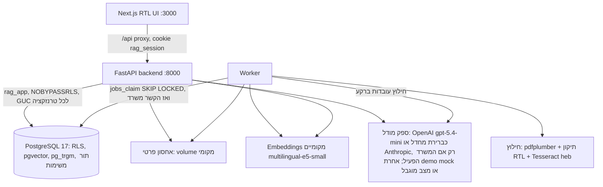
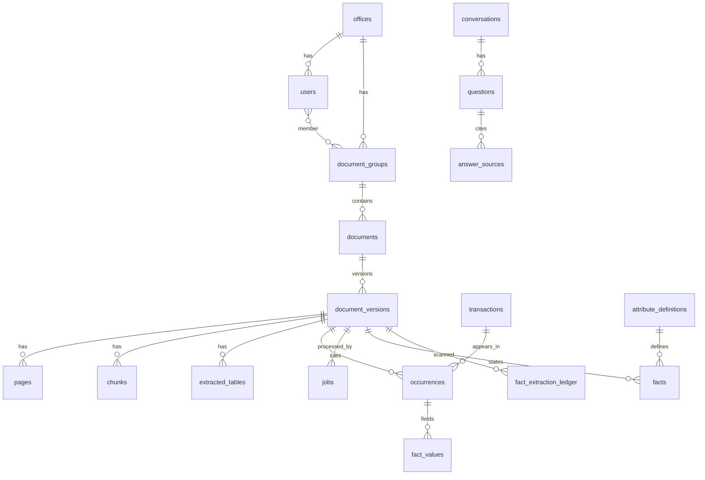
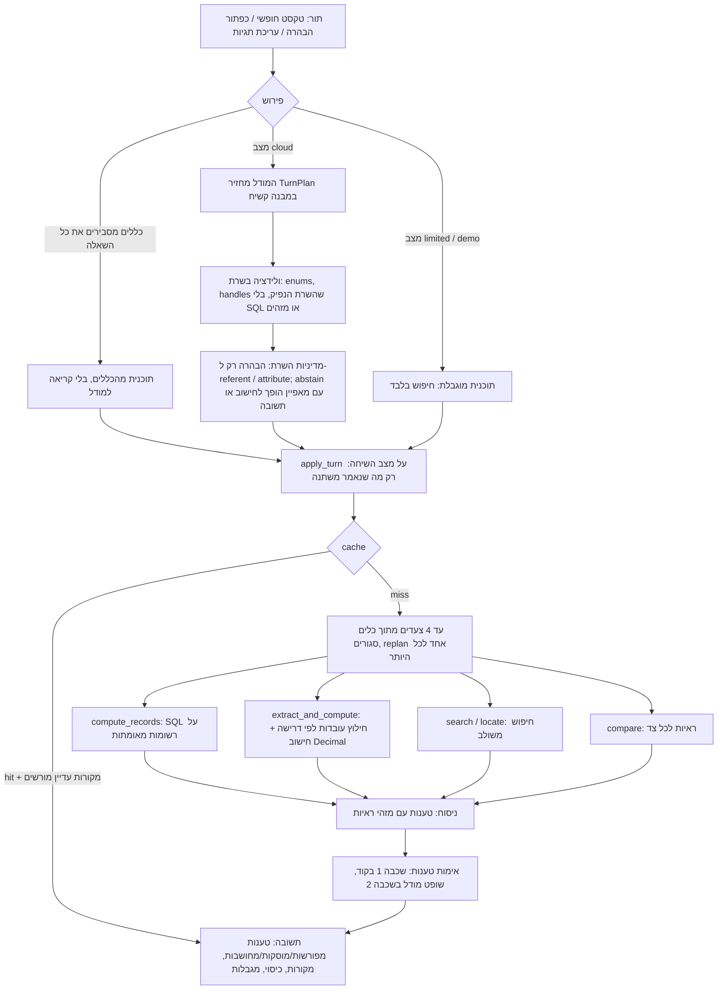

# ארכיטקטורה

מסמך זה מתאר את רכיבי המערכת, את מודל הנתונים, את מודל הבידוד בין משרדים ואת נתיבי המידע. ההחלטות המלאות ונימוקיהן נמצאים בתוכניות: `docs/plans/2026-10-05-2234-feat-appraisal-knowledge-engine-mvp-plan.md` (ה-MVP, ‏KTD1–KTD17) ו-`docs/plans/2026-10-06-0856-feat-general-question-engine-plan.md` (מנוע השאלות הכללי, ‏KTD1–KTD16 שלה). חוזה ה-API: `docs/api-contract.md`.

## רכיבים

- `backend/app/platform/` — תשתית שאינה תלויה בתחום: הזדהות, משרדים, משתמשים, קבוצות מסמכים, מסמכים וגרסאות, אחסון, תור משימות, חיפוש, ניהול.
- `backend/app/appraisal/` — הסכמה השמאית: נרמול ערכים, חילוץ עובדות, ולידציה, איחוד כפילויות, פרסום, בדיקת נתונים, שאילתות SQL.
- `backend/app/extraction/` — חילוץ PDF/DOCX מאחורי ממשק `Extractor` (ניתן להחליף ב-Docling או ב-OCR ענן).
- `backend/app/answering/` — פירוש שאלות, הבהרות, תבניות, תשובות תוכן, אימות, שיחה ו-cache.
- `backend/app/providers/` — ממשקי ספקים: LLM ו-embeddings.

ההפרדה בין `platform` ל-`appraisal` מאפשרת בהמשך להוסיף תחום (משפט, ביטוח) בלי לגעת בתשתית המסמכים וההרשאות.

## מודל הבידוד

| שכבה | מה אוכף |
|---|---|
| הזדהות | session בצד השרת (טבלת `sessions`, hash של token). המשרד והמשתמש נגזרים רק מה-session; `office_id` שהלקוח שולח מתעלמים ממנו. |
| טרנזקציה | כל בקשה וכל משימת worker פותחות טרנזקציה וקובעות `app.office_id`, `app.user_id`, `app.role` עם `set_config(..., true)`. ההגדרה מתה עם הטרנזקציה, ולכן חיבור ממאגר החיבורים לא נושא הקשר לבקשה אחרת. |
| RLS | `FORCE ROW LEVEL SECURITY` על כל טבלה. מדיניות `office_id = app_office()`; כשה-GUC חסר — אין שורות. בטבלת `documents` גם הרשאת קבוצה; טבלאות התוכן מגיעות ל-`documents` דרך תת-שאילתה שעוברת RLS. |
| תפקידים | `rag_owner` — בעלים ו-migrations. `rag_app` — runtime, ‏NOBYPASSRLS, לא בעלים. `rag_lookup` — ‏NOLOGIN BYPASSRLS, הבעלים היחיד של פונקציות SECURITY DEFINER צרות: ארבע ב-runtime (כניסה לפי דוא״ל, פענוח session, תפיסת משימה, חיפוש hash בתוך המשרד) ושתיים לתפעול שרק `rag_owner` רשאי להריץ (הקמת משרד, רשימת משרדים לתחזוקה). ראו `docs/solutions/database-issues/force-rls-security-definer-lookups-need-bypassrls-owner.md`. |
| קוד | פעולות כתיבה שנוגעות בעסקה שאוחדה מכמה קבוצות רצות בהקשר `system` רק אחרי בדיקת הרשאה של המשתמש. |

## מודל הנתונים

- `transactions` — עסקה או שווי ייחודיים (ערכים מוסכמים: מחיר, שטח, סוג שטח, תאריך, מחיר למ״ר מחושב עם `calc_definition`).
- `occurrences` — הופעה של עסקה במסמך מסוים: עמוד, טבלה, שורה, וכל הערכים המנורמלים כפי שהופיעו באותו מסמך, סטטוס אימות, דגל סתירה ושדות קריטיים חסרים.
- `fact_values` — לכל שדה בהופעה: הטקסט המקורי, הערך המנורמל, נתיב המקור (`source_path`), גרסת חילוץ, היסטוריית תיקונים.
- `dedup_candidates` — זוגות חשודים ככפילות שממתינים להחלטה אנושית.
- `attribute_definitions`, `facts`, `fact_extraction_ledger` — מאגר העובדות של מאפיינים שאין להם עמודה (ראו "מאגר העובדות" למטה). שלושתן תחת RLS; עובדה נראית רק אם המסמך שלה נראה.
- `conversations.state` — מצב השיחה המובנה (JSON) עם `state_version`; `questions` שומרת לכל תור את התוכנית, הצעדים, גרסאות העובדות ו-`turn_id`. שיחות ושאלות גלויות רק למשתמש שלהן (מדיניות restrictive).
- כל סכום ושטח נשמר כ-`NUMERIC` ומחושב כ-`Decimal`.

## נתיב הקליטה

1. `POST /api/documents` — בדיקת הרשאה, סוג (סיומת + magic bytes), גודל, מגבלות DOCX; hash ‏SHA-256; כפילות בתוך המשרד (קובץ שמוחזק בקבוצה שהמשתמש לא רואה משוכפל בלי עיבוד חוזר ובלי לחשוף את הקבוצה); שמירה פרטית; גרסה ומשימה בטרנזקציה אחת.
2. Worker: `jobs_claim` עם `FOR UPDATE SKIP LOCKED` ו-lease. lease שפג נתפס מחדש; כשל זמני — ניסיון חוזר עם backoff; כשל קבוע (מוצפן, פגום, חריגה) — `failed` עם סיבה בעברית.
3. חילוץ: שכבת טקסט + תיקון סדר עברי לכל שורה; ציון איכות; OCR ‏`heb+eng` לעמודים שנכשלו; טבלאות עם עמוד לכל שורה, כולל טבלה שחוצה עמודים; chunks לפי סעיפים עם רשימת עמודים מדויקת.
4. Embeddings מקומיים לכל chunk (מודל + גרסה בכל שורה).
5. פרסום בטרנזקציה אחת תחת נעילת משרד: עובדות, ולידציה, איחוד כפילויות, סטטוס הגרסה (`ready` / `needs_review`), החלפת הגרסה הקודמת, העלאת גרסת הנתונים.

## נתיב המענה: מנוע השאלות הכללי

כל תור בשיחה עובר את אותו נתיב, בלי קשר לנושא. אין ניתוב לפי מילות נושא: שאלה על ממ״ד, מרפסת או יתרת זכויות עוברת באותה דרך כמו שאלת מחיר (בדיקת `tests/unit/test_no_topic_vocabulary.py` נכשלת אם מילת נושא כזו מופיעה ב-`backend/app`).

1. **פירוש** (`answering/interpret.py`, `plan.py`). המודל מקבל את השאלה, תצוגה מבנית של מצב השיחה, רשימת מקומות וה-handles של המאפיינים (`A1`...) ושל המקורות (`S1`...). הוא מחזיר `TurnPlan`: סוג משימה (`locate | answer | compare | compute | compute_explain | clarify | abstain`), יחס לתור הקודם (שאלה חדשה, המשך, תשובה להבהרה, שינוי נושא, "למה?", "תראה לי את המקור"), דלתא של תנאים, מאפיין, מדד, שאילתות חיפוש ועד ארבעה צעדים. הסכמה strict; השרת מאמת כל שדה ודוחה תוכנית עם SQL, מזהה גולמי או handle שלא הנפיק. תוכנית לא תקינה — נתיב מוגבל, לא ניחוש.
2. **מדיניות השרת** (`normalize_model_plan`). המודל מציע, השרת מחליט: הבהרה נשמרת רק כשלא ברור על איזה מסמך או מאפיין מדובר; הבהרות על סוג נתון ובסיס שטח שואלת רק פעולת החישוב, ורק כשהרשומות המורשות באמת שונות בהן — לכן שאלה על ממ״ד לא מגיעה להבהרת מחיר.
3. **מצב השיחה** (`state.py`, KTD12). מצב מובנה בצד השרת: סוג משימה, נושא, ישויות, תנאים, מאפיין, מדד, handles של מקורות, הבהרה ממתינה ושלוש השאלות האחרונות. לא נשמר בו טקסט של תשובות או מסמכים. `apply_turn` היא פונקציה טהורה, ולכן שליחה חוזרת של אותו תור (`turn_id`) לא מחילה שינוי פעמיים; "השנה הקודמת" נפתרת מול המצב שממנו התור התחיל. שינוי נושא או מאפיין מנקה את התנאים שתלויים בו.
4. **כלים חסומים** (`turn.py`). כל כלי פותח טרנזקציה קצרה משלו תחת הקשר המשתמש; קריאות מודל לעולם לא רצות בתוך טרנזקציה. לתור יש deadline (`TURN_DEADLINE_SECONDS`, מתחת ל-timeout של ה-proxy); תוצאה שנחתכה מסומנת `partial` ולא נשמרת ב-cache. השוואה פועלת על מקורות שכבר הופיעו בשיחה (handles `S#`); שתי גרסאות של אותו מסמך מורחבות אוטומטית.
5. **ניסוח ואימות טענות** (`compose.py`, `verify.py`, KTD11). המודל מחזיר טענות, כל אחת עם סוג (`explicit`, `inferred`, `computed`) ומזהי ראיות. שכבה 1 בקוד: המזהים קיימים ומורשים, כל מספר מופיע בראיה או בערך מחושב, אין קישורים. שכבה 2: קריאת שופט שמסמנת כל טענה supported / partial / unsupported; טענה לא נתמכת נשמטת וזה מוצג. ערך מחושב מוכנס לטקסט על ידי השרת, לא על ידי המודל. כשהמודל מדווח שאין בסיס — הימנעות מנומקת עם `abstention_kind` (`not_found`, `not_stated`, `not_extracted_or_verified`, `insufficient_permission_scope`).

### מאגר העובדות ודרגות אמון (KTD7–KTD9)

- `attribute_definitions` — רישום מאפיינים למשרד: ארבעה מובנים (מחיר, שטח, מחיר למ״ר, חדרים) ומאפיינים שנוצרים לפי שאלה (`x_<hash>`) עם תווית, כינויים, ממד יחידה, יחידה קנונית, גרסת פרומפט חילוץ ו-`facts_version`.
- `facts` — ערך לכל ישות (הנכס הנישום, נכס השוואה, אחר) בגרסת מסמך: ערך כפי שנכתב, יחידה, ערך קנוני, **ציטוט מילולי** ונתיב מקור (chunk, או תא בטבלה עם שורה ועמודה), סטטוס והיסטוריה.
- `fact_extraction_ledger` — מצב לכל (גרסה, מאפיין, גרסת חילוץ): `found`, `not_stated`, `partial_scan`, `failed`, `pending`. ממנו נבנית שורת הכיסוי: כמה מסמכים בתחום, בכמה נמצא ערך, כמה לא מציינים, כמה טרם חולצו, כמה ממתינים לבדיקה.
- חילוץ לפי דרישה: עד `EXTRACT_SYNC_MAX_VERSIONS` גרסאות בתוך התור (שלוש במקביל), השאר כמשימות `extract_facts` ב-worker; התשובה מציינת כמה ממתינים, ושאלה חוזרת אחרי שה-worker סיים מקבלת תוצאה מלאה.
- ולידציה בשרת: הציטוט חייב להופיע מילה במילה בקטע או בתא שצוטט; הערך והיחידה נקראים מהציטוט בקוד; היחידה חייבת להתאים לממד המאפיין; המונח שמכנה את הערך חייב להיות שם המאפיין (מספר של "שטח הנכס" אינו שטח ממ״ד).
- דרגות אמון: `verified`/`corrected` (אדם בדק) — המספר הראשי; `auto_validated` — מתווסף רק ל"נתון ראשוני" שמוצג בנפרד; `needs_review` (סתירה, מונח נרדף, יחידה שהוסקה, ישות שאינה הנכס הנישום) — לא נספר ומדווח בכיסוי. ערכים סותרים לאותו נכס מחושבים בזמן קריאה תחת RLS של הקורא ועוברים לבדיקה. החישוב תמיד `Decimal`, על כל המסמכים בתחום — לא על top-k.
- בדיקת עובדות: `/api/review/facts` (ראו חוזה ה-API); כל שינוי מעלה את `facts_version` של אותו מאפיין בלבד.

### נתיב מחיר (נשמר מה-MVP)

- חישובי מחיר ב-SQL בלבד, על כל הרשומות המורשות התואמות — לא על top-k של החיפוש. שאלת מחיר שהכללים מסבירים במלואה לא מגיעה למודל גם במצב cloud.
- "בשנת 2024" הופך לטווח מפורש `[2024-01-01, 2025-01-01)` על שדה התאריך שנבחר.
- תנאים שמשנים תוצאה ואינם בשאלה (מחיר עסקה מול שווי, סוג תאריך, ובסיס שטח, סוג נכס או מע״מ כשהם מעורבים ברשומות) — הבהרה, שאפשר לענות עליה גם בטקסט חופשי.
- שורת הכיסוי מחושבת מחדש בכל תשובה, גם מ-cache.

### ספקים ומצבים

`providers/status.py` הוא המקום היחיד שמחליט מי עונה: `cloud`, `error`, `demo` או `limited` (ראו README וחוזה ה-API). OpenAI נקרא דרך ה-SDK הרשמי וה-Responses API עם פלט מובנה ו-`store=false`; המפתח (`OPENAI_KEY`, אחריו `OPENAI_API_KEY`) נשאר בשרת. כל קריאה נרשמת ב-`provider_usage` (מטרה, מודל, סטטוס, טוקנים, זמן). כשל של הספק מוצג כמגבלה בתשובה ולעולם לא מוסתר מאחורי תשובת דמו.

## Cache ופסילה

מפתח (KTD14): המשימה הקנונית אחרי ולידציה — משרד, hash של היקף ההרשאות (תפקיד + קבוצות), סוג משימה, כלים, מאפיין וגרסת החילוץ שלו, `facts_version` של המאפיין, מדד, יחידה, תנאים מנורמלים, שאילתות החיפוש (לתשובות תוכן), גרסאות המקורות שנבחרו, גרסת הנתונים של המשרד, גרסת הגדרות הספק, מצב/ספק/מודל, גרסת פרומפט התשובה, מודל ה-embeddings וגרסת התבנית — ולא טקסט השאלה הגולמי. גרסת הנתונים עולה בכל פרסום, אישור, תיקון, מחיקה ושינוי הרשאות; `facts_version` עולה בכל חילוץ או בדיקה של אותו מאפיין. לפני החזרה מ-cache נבדק שכל מקור עדיין קיים, נוכחי ומורשה, והכיסוי מחושב מחדש. לא נשמרים ב-cache: הבהרות, תורות meta, תוצאות חלקיות, fallback, תורות עם סטטוס ספק שאינו ok ומצב `error`. הודעה ישנה מסומנת `stale` כשהנתונים, ההרשאות או העובדות של המאפיין שלה השתנו, ו-`hidden` כשמקור שלה נמחק או נחסם.

## מה לא נבנה

ראו `README.md` ("מגבלות ידועות ומה עדיין חסר") ו-[`docs/evaluation/report.md`](evaluation/report.md) (סעיף המגבלות).
