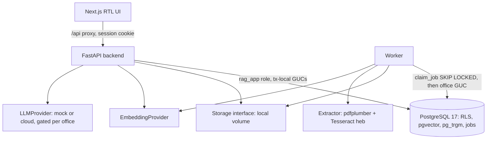
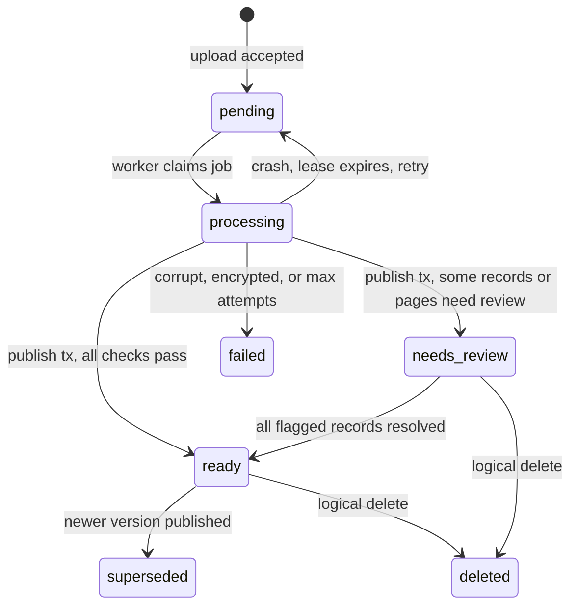
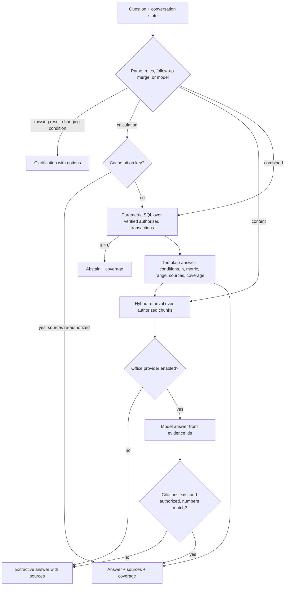
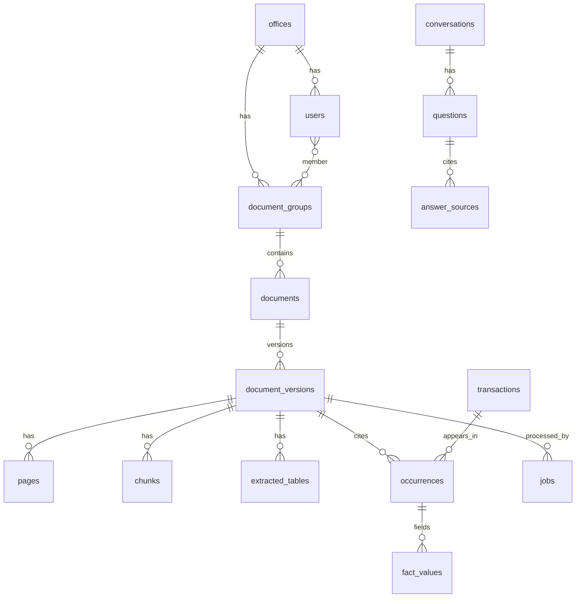

# Appraisal Knowledge Engine MVP - Plan

## Goal Capsule

- **Objective:** An appraisal office can sign in, upload its past Hebrew appraisal reports, approve the facts the system extracted, and ask Hebrew questions whose answers come only from that office's authorized documents, cite the exact document and PDF page, compute numbers exactly, and ask for clarification or abstain instead of inventing data.
- **Means:** One FastAPI backend plus one worker over PostgreSQL (RLS, pgvector, a Postgres job queue), a rules-first structured query path that runs parametric SQL (KTD1, KTD2), hybrid retrieval for content questions (KTD9), and a Hebrew RTL Next.js UI, all runnable with Docker Compose.
- **Authority:** `appraisal-rag-claude-spec.md` (origin) wins on product behavior. This plan's R-IDs restate it. KTDs win on implementation mechanism. Units never override either.
- **Execution profile:** Greenfield build. API-level vertical slice first in the order U1, U17, U2–U8 (the UI joins in U13), then the rest of the MVP (U9–U16). Behavior-bearing units are implemented test-first where the rule is crisp (calculations, isolation, cache keys, parsing).
- **Stop conditions:** Stop and report if PostgreSQL RLS cannot isolate offices for the runtime role, if Hebrew text cannot be extracted from the synthetic digital PDF in logical order by any evaluated extractor, or if a settled decision proves infeasible.
- **Who finishes:** `ce-work` implements all units on branch `feat/appraisal-rag-mvp`; no remote exists, so the run ends with local commits. Merge, deploy, and real-document quality evaluation stay with the user.

---

## Product Contract

### Summary

Build the phase-one appraisal domain of an internal knowledge engine. Offices upload PDFs (and basic DOCX); a worker extracts text, tables, and structured transaction/valuation facts with page-level provenance; reviewers approve or correct facts; employees ask Hebrew questions. Numeric questions run parametric SQL over every authorized verified record and return a templated answer with conditions, record counts, metric definition, range, sources, and coverage limits. Content questions use hybrid lexical and semantic retrieval over authorized chunks and, when an admin enabled a cloud provider for the office, a model-written answer whose citations and numbers are verified before display. Without a provider, development runs on a clearly labeled demo mock.

### Problem Frame

Appraisal offices hold years of reports with transactions, comparables, and professional reasoning, but finding "what price per sqm did we see in Harozim, Ramat Gan in 2024" means opening PDFs by hand. Generic chat tools fail this office in three ways: they mix in outside knowledge, they average whatever few snippets retrieval surfaced, and they conflate transaction prices with appraised values, area bases, and date types. The office needs answers it can defend: traceable to its own documents, exact in arithmetic, honest about coverage, and never leaking another office's data.

### Actors

- A1. Office admin — manages users, document groups, provider settings; reviews extraction; sees coverage.
- A2. Office employee — uploads documents (if permitted), reviews facts, asks questions within their document groups.
- A3. Worker — processes document versions in the office context of the job it claimed.
- A4. Answer provider — mock (demo) or cloud LLM; receives only authorized, relevant evidence when the office enabled it.

### Key Decisions

- **Numeric answers come from parametric SQL over all authorized matching structured records; the model only produces schema-validated conditions.** Governs R20, R21, R22. (session-settled: user-directed — chosen over LLM-generated SQL or averaging top-k retrieved chunks: completeness and exactness; top-k is retrieval, not coverage)
- **Office identity comes only from server-side authentication, and isolation is enforced in queries plus PostgreSQL RLS under a runtime role that cannot bypass it.** Governs R30, R31, R32. (session-settled: user-directed — chosen over trusting a client-sent tenant id or UI-only hiding: no cross-office leakage through any channel)
- **Cloud LLM use is off per office until an admin enables it; development uses a labeled demo mock.** Governs R34, R35. (session-settled: user-directed — chosen over cloud on by default or relying on a small local model: privacy and honest quality claims)
- **Money and area use exact decimals with original value, normalized value, extraction version, verification status, and source path per fact.** Governs R11, R12, R13. (session-settled: user-directed — chosen over floats or silent overwrite: exactness and traceability)
- **Transactions are separate from their occurrences in documents; certain matches merge within the office, uncertain matches go to review.** Governs R14. (session-settled: user-directed — chosen over counting every appearance: correct statistics)
- **Ambiguous conditions trigger clarification; unverified facts stay out of verified calculations; no basis means abstain.** Governs R18, R19, R23. (session-settled: user-directed — chosen over silent default assumptions: spec §2 and §6)
- **Phase one is the appraisal domain only, with document and permission infrastructure kept separate from the appraisal schema.** Governs R38. (session-settled: user-directed — chosen over building legal and insurance products now: phase-one focus)

### Requirements

**Ingestion and processing**

- R1. Users with upload permission upload one PDF or a batch; DOCX goes through the same pipeline with basic support. Type, size, page count, encryption, and corruption are validated with a clear Hebrew error.
- R2. Originals are stored in private storage behind a storage interface (local volume now, S3-compatible later). A SHA-256 hash prevents duplicate processing within an office without revealing whether another office holds the file.
- R3. Existing PDF text is used when its quality passes a check; OCR (Hebrew + English) runs only on pages that fail it. Garbled text never counts as a successfully decoded page.
- R4. Text and tables keep Hebrew logical order, numbers, thousands separators, decimals, dates, and units. Tables are stored as structure (headers, units, cells, row provenance) plus a searchable rendering; a table crossing pages keeps the page of every row.
- R5. Chunks respect pages, headings, and sections; a chunk spanning pages stores the exact page list; displayed pages are physical PDF page numbers.
- R6. Processing jobs are idempotent, retryable, resumable after a crash, and protected against concurrent double processing. A partially processed version is never published as complete.
- R7. Document versions expose statuses pending, processing, ready, needs_review, failed, with a reason and counts of incomplete pages and records.
- R8. Extraction results and embeddings are stored once; questions never trigger OCR or re-indexing. Only allowed, sufficiently good content is indexed, with office id and document version on every row.
- R9. Correcting a fact, uploading a new version, deleting a document, or changing permissions updates records, the index, and cached answers. Logical deletion blocks access immediately.

**Structured appraisal data**

- R10. The schema holds offices, users, roles, document groups, documents, versions, pages, chunks, tables, properties/valuations, transactions/comparables, occurrences, extraction jobs, questions, answer sources, provider usage, and audit events.
- R11. Each transaction/comparable stores what the source contains: city, neighborhood, address, block/parcel/sub-parcel, property type, data kind (transaction price, appraised value, asking price, adjusted comparable price), transaction date, valuation date, report date, area and area type (net, gross, registered, equivalent, other), price/value, currency, VAT basis, price per sqm, source, and calculation definition. Missing fields stay null; neighborhood is never inferred from external knowledge. Adjusted comparable prices are their own data kind and never mix with transaction prices.
- R12. Every fact keeps original text, normalized value, extraction version, verification status, and source path (document, version, page, table/row or text span).
- R13. System-computed price per sqm keeps lineage to its price and area; a different document-stated price per sqm is stored too and flagged as a conflict.
- R14. A transaction appearing in several reports is counted once; certain matches merge within the office only; uncertain matches go to review and are shown as a limitation, never merged silently.
- R15. Facts with uncertain extraction or missing critical fields never enter calculations presented as verified. Human-verified versus auto-checked status is recorded.
- R16. The review screen shows each extracted record next to its source page; approve or correct with an audit note; a correction updates lineage and bumps the data version.

**Answering**

- R17. Every question is classified as calculation, document lookup, professional explanation, or combined, and the parse route (rules, model, follow-up merge) is recorded.
- R18. When a condition that changes the result is missing — data kind (transaction price vs appraised value), date type for a year, property type, area basis — the system asks a short clarification with selectable options.
- R19. A year filter is an explicit date range on the chosen date field. Original and normalized dates are both stored; an unparseable date is unknown, not a match.
- R20. Numeric questions run parametric SQL over all authorized, verified, current, non-deleted matching records; calculations happen in SQL/code, never in the model.
- R21. A numeric answer shows the conditions, the count of unique records, the chosen metric, the range when useful, and its sources. Simple mean of per-record price/sqm and sum(price)/sum(area) are distinguished and never swapped silently. No value, index, floor, or property adjustments are applied.
- R22. Simple structured questions are answered from a template with no model call.
- R23. A question without sufficient basis gets a clarification or an explicit abstention; no number is invented.
- R24. Content questions use hybrid lexical plus semantic retrieval with metadata filtering over authorized chunks; combined questions compute first, then retrieve explanations.
- R25. A model answer receives only relevant authorized evidence with evidence ids and verified calculation results. Before display, cited evidence must exist and be authorized and numbers must match evidence or calculation output; failure falls back to an extractive answer or abstention.
- R26. Answers state coverage: documents not yet processed, failed, or needing review, and matching records awaiting verification; phrasing is "from the verified records in the office repository".
- R27. A conversation keeps confirmed conditions so "and what about 2023?" changes only the year; full history is not sent to the model.
- R28. Answer caching keys on office, permission scope, intent, normalized conditions, data version, and calculation settings; sources are re-authorized before return.
- R29. Document text is content, never instructions: instructions inside a PDF cannot change policy, call tools, or expose other documents.
- R39. Saved answers in conversation history are marked out of date when the data version or the user's permissions changed since they were produced; an answer whose source was deleted or became unauthorized hides its body and sources.

**Isolation, permissions, and privacy**

- R30. The server derives user and office from authentication and ignores any client-sent office id; every search, calculation, cache entry, and source link is permission-filtered.
- R31. At least two offices exist for isolation testing. Roles are office admin and employee; employees see documents only in their document groups.
- R32. Isolation holds at the database layer (RLS with a non-bypassing runtime role, separate migration role) across connection pooling, transactions, and worker jobs.
- R33. No leakage through search, statistics, cache, conversations, logs, error messages, or file viewing; source files open only through an authenticated endpoint by id; API keys stay server-side; logs are minimal; sensitive actions are audited.
- R34. Sending documents or snippets to a cloud provider is off by default per office; an admin enables a configured provider with an explanation of what the setting means.
- R35. Without credentials the system uses a mock provider labeled as demo, and never claims real model quality was tested.
- R36. Real documents and client data never enter git or public fixtures; the demo uses labeled synthetic data.

**UI**

- R37. A Hebrew RTL UI provides login/logout, documents (batch upload, status, search, failures, versions), data review (record beside source, approve/correct), chat (free question, clarification options, answer, sources, click-through to the PDF page, optional filters), and admin (users and groups, processing status, review queue, coverage, provider setting). Numbers, addresses, and links render without reversal. Implementation details stay out of answer text.

**Scope**

- R38. Out of scope and never presented as complete: automatic integrations, web crawler, client billing, agents acting for users, mobile app, automatic appraisal adjustments, legal and insurance domains.

### Acceptance Examples

- AE1. Covers R18, R19. Given verified records in Harozim, Ramat Gan, when a user asks "מה מחיר למ״ר ברמת גן בשכונת חרוזים בשנת 2024?", then the system asks whether to use transaction prices or appraised values, and (if transactions) whether 2024 means transaction date or valuation date, before computing.
- AE2. Covers R14, R20, R21. Given one transaction appearing in two reports, when the user asks for 2024 transaction price per sqm in Harozim, then the record count includes it once and both occurrences are listed as sources.
- AE3. Covers R21. Given records with prices 1,000,000/50 sqm and 3,000,000/100 sqm, then the simple mean of price/sqm is 25,000 and the weighted figure is 26,666.67, each labeled.
- AE4. Covers R27. Given a confirmed 2024 transaction-date question, when the user asks "ומה לגבי 2023?", then only the date range changes.
- AE5. Covers R30, R33. Given office B holds a matching transaction, when an office A user asks the same question, then office B's record never affects the count, sources, cache, or errors.
- AE6. Covers R9, R28. Given a cached answer, when a contributing fact is corrected or its document deleted or the user loses access to its group, then the next identical question recomputes and no longer uses the stale result.
- AE7. Covers R6. Given a worker crash mid-processing, when the lease expires and the job retries, then the version ends with exactly one set of pages, chunks, and facts, and was never shown as ready in between.
- AE8. Covers R23. Given no verified records match, when a numeric question is asked, then the answer says no verified data was found and shows the coverage limitation, with no number.

### Success Criteria

- All eight acceptance gates of origin §11 pass on synthetic fixtures, with an evaluation report recording table-extraction cell/header accuracy, critical-field accuracy, source recall, answer correctness, evidence coverage, justified-abstention rate, answered rate, and p50/p95 latency on mock providers.
- At least 40 evaluation questions spread across the fixture cases, not paraphrases of one question.
- Real-document quality evaluation is explicitly marked pending with instructions, since no authorized real documents were supplied.

### Scope Boundaries

- Out of scope per R38.
- No Redis, separate vector database, knowledge graph, or microservices.
- No paid OCR by default; an adapter seam is left for Azure Document Intelligence.
- No semantic answer cache; exact keyed cache only.
- No cost calculator, budget limits, or pricing reports.

#### Deferred to Follow-Up Work

- S3-compatible storage implementation (interface only now).
- Cloud OCR adapter implementation.
- Reranker (add only if measured to improve retrieval).
- Switching the production embedding model to bge-m3 (needs the dimension migration in KTD10 and a re-embed).
- Real-document pilot evaluation and cloud-model quality benchmark.

---

## Planning Contract

### Key Technical Decisions

- KTD1. **Structured question path = rules-first parser → validated `QueryConditions` → whitelisted SQL builder.** The parser maps Hebrew phrasing to a Pydantic conditions model (metric kind, date field, date range, city, neighborhood, property type, area basis, aggregation). Gazetteer values (cities, neighborhoods) come from the office's own records, never external data. The model path, used only when rules cannot parse and the office enabled a provider, must return the same schema; it never writes SQL. Implements R17, R18, R20, R22 under the numeric-answers Key Decision.
- KTD2. **Statistics are computed over `transactions` (unique facts), joined to authorized current occurrences.** A transaction is eligible when it is verified, critical fields are present, and at least one occurrence sits in an authorized, current, non-deleted document version. Mean, weighted mean, median, min, max, and count come from one SQL statement using NUMERIC. Field values live per occurrence (`fact_values` keyed by occurrence); a merged transaction holds only the values all its occurrences agree on (price, area, area type, data kind, dates). Filters, displayed fields, eligibility, and sources are taken from the occurrences the current user may see, so a field stated only in a group-restricted report never matches or displays for a user outside that group. Implements R14, R20, R21.
- KTD3. **Two database roles.** `rag_owner` owns schema and runs Alembic migrations; `rag_app` is the runtime login with `NOBYPASSRLS`, not the table owner, with `FORCE ROW LEVEL SECURITY` on every tenant table. Implements R32 under the isolation Key Decision.
- KTD4. **Tenant context is a transaction-local GUC.** Every request and worker job opens a transaction and calls `set_config('app.office_id', …, true)`, `app.user_id`, and `app.role` before any query, so pooled connections cannot carry context to another request. The GUCs are set in a SQLAlchemy `after_begin` hook, never with a plain `SET`. Policies read `NULLIF(current_setting('app.office_id', true), '')::uuid`, because a once-used setting reads back as an empty string; a missing GUC matches nothing (fail closed). The whole backend uses synchronous SQLAlchemy 2.1 with psycopg 3. Implements R30, R32.
- KTD5. **Document-group permission is enforced in RLS on `documents`, and every content table reaches documents through an RLS-filtered subquery.** Admins and the worker's `system` role see all office documents; employees see documents whose group they belong to; logically deleted documents are hidden from non-admin reads. Implements R31, R33.
- KTD6. **Pre-tenant lookups use narrow `SECURITY DEFINER` functions owned by a dedicated `rag_lookup` role.** Login (by email), session resolution (by token hash), job claiming (`FOR UPDATE SKIP LOCKED` across offices), and the in-office file-hash lookup (U4) are the only cross-tenant reads, each returning the minimum columns. Because `FORCE ROW LEVEL SECURITY` also binds the table owner, these functions cannot be owned by `rag_owner`: `rag_lookup` is `NOLOGIN BYPASSRLS`, holds only the column privileges these functions need, and owns them with a pinned `search_path`. `rag_app` stays `NOBYPASSRLS`. Implements R30, R32.
- KTD7. **Server-side sessions with an opaque HttpOnly cookie.** Session rows (token hash, expiry) allow immediate revocation and make permission changes effective on the next request. Passwords use Argon2. Implements R30, R31.
- KTD8. **PostgreSQL job queue with leases.** `jobs` rows carry kind, status, attempts, max attempts, `run_after`, `locked_by`, `lease_until`, last error, and a unique idempotency key per document version and kind. A crashed worker's lease expires and the job is reclaimed. Each stage writes its outputs after deleting that version's prior outputs inside one transaction, and the version becomes `ready` or `needs_review` only in the final publish transaction. Implements R6, R7 under the single-backend decision.
- KTD9. **Hybrid retrieval in SQL, no LlamaIndex dependency.** Lexical: `to_tsvector('simple', normalized_text)` plus `pg_trgm` similarity on a Hebrew-normalized column (niqqud and geresh/gershayim normalized, final letters kept). Semantic: pgvector cosine over embeddings tagged with model name, dimension, and index version. Fusion: reciprocal rank fusion. All three run inside the RLS-scoped transaction, and filtered vector search sets `hnsw.iterative_scan = relaxed_order` so filters do not starve the result set. Text is normalized in the application before both indexing and querying, because a check against pgvector/pgvector:pg17 showed `to_tsvector('simple','ברמת גן') @@ 'רמת גן'` is false and that `45,000` and `מ"ר` split into separate tokens. The rules: strip the one-letter prefixes ו, ה, ב, ל, מ, ש, כ into an extra token, unify geresh and gershayim, and remove thousands separators. The database is initialized with a UTF-8 locale and the app checks it at startup, since `pg_trgm` returns nothing for Hebrew under the `C` locale. Rejected LlamaIndex (spec §3 proposed it): `llama-index-vector-stores-postgres` 0.9.0 requires `sqlalchemy<2.1`, psycopg2, and asyncpg, and keeps its own tables and pool outside RLS and the tenant GUC. Implements R24, R8.
- KTD10. **Provider interfaces, with local embeddings by default.** `LLMProvider` (structured JSON output) and `EmbeddingProvider` (embed batch, model id, dimension). Implementations: `MockLLM` (labeled demo), `AnthropicLLM` (cloud, used only when the office setting and a server key both exist), `LocalEmbedding` (sentence-transformers on CPU, default `intfloat/multilingual-e5-small`, MIT, 384 dims, with `query:`/`passage:` prefixes; `BAAI/bge-m3`, MIT, 1024 dims, configurable), and `HashEmbedding` (deterministic, for tests and fast CI, labeled non-semantic). Embeddings are local because a cloud embedding API would send document text out, which the cloud Key Decision forbids by default. Embedding rows carry `embedding_model`. The MVP column is `vector(384)` for the default model; the app checks at startup that the configured model's dimension matches the column, and `HashEmbedding` emits the configured dimension. Switching to a model of another dimension (such as bge-m3) is a follow-up that ships an Alembic revision run as `rag_owner` (alter the column, clear vectors, rebuild the HNSW index) before a re-embed job. When the cloud setting is off, no model call happens at all, including for question parsing. Implements R34, R35, R8.
- KTD11. **Extraction = pdfplumber text and tables + pypdfium2 rendering + Tesseract `heb+eng` OCR on failing pages. Docling is evaluated in a documented experiment, not the default.** Docling 2.133 has open RTL ordering bugs (issues #1938, #3462), defaults Tesseract to non-Hebrew languages, and pulls torch into the image. Hebrew visual-order lines are converted to logical order with `python-bidi`; forcing pdfplumber `char_dir="rtl"` reverses digits, so the fix-up works per line with digit runs protected. A cheap orientation check is that Hebrew final letters (ך ם ן ף ץ) should end words. A quality score (letter ratios, replacement characters, orientation check) decides when OCR runs. PyMuPDF is excluded (AGPL). The extractor sits behind an `Extractor` interface so Docling or a cloud OCR adapter can replace it. Implements R3, R4, R5.
- KTD12. **Fact extraction is rules-first from table headers and labeled key-value text, validated before review.** Known Hebrew headers map to fields; values are parsed into Decimal and dates with original text preserved. Validation computes price/area, compares any stated price per sqm (tolerance 0.5%), checks critical fields, and sets `needs_review` on any failure. Model-assisted extraction is an optional adapter that must quote evidence spans found verbatim on the cited page. Implements R11, R12, R13, R15.
- KTD13. **Data version is a per-office counter.** It increments on version publish, fact approval or correction, deletion, and group or permission changes. The answer cache key includes it plus a permission-scope hash (role + sorted group ids), the provider-settings version, the embedding model, and the answer-template version, so stale entries are unreachable rather than individually purged. Stored answers record the data version and scope they used, which drives R39. Implements R9, R28, R39.
- KTD14. **Next.js App Router frontend proxies `/api/*` to FastAPI**, so the session cookie is same-origin. Source PDFs open via the authenticated file endpoint with `#page=N`, using the browser's PDF viewer. Implements R33, R37.
- KTD15. **Synthetic fixtures are generated by a committed script** using fpdf2 with text shaping (proper RTL) and the Noto Sans Hebrew font from the container's `fonts-noto-core` package (OFL), so no font file is vendored. The generated PDFs are committed under `backend/tests/fixtures/` with a "synthetic" marker in content and filename. A scanned variant is rasterized with pypdfium2 to an image-only PDF with noise. One fixture is written in visual order to exercise the reversed-text fix-up. Implements R36 and origin §11.
- KTD16. **Pinned stack.** Python 3.12, FastAPI 0.142.2, Pydantic 2.13.5, SQLAlchemy 2.1.3, psycopg 3.3.6, Alembic 1.20.0, pgvector (py) 0.5.0, pdfplumber 0.11.10, pypdfium2 5.14.0, pypdf 6.19.0, python-bidi 0.6.11, python-docx 1.2.0, pytesseract 0.3.13, anthropic 1.11.0, sentence-transformers 6.1.0 with CPU-only torch 2.14.1 from the PyTorch CPU index, argon2-cffi, fpdf2 2.8.9 (dev only). Postgres image `pgvector/pgvector:0.8.7-pg17`. Frontend: Next 16.3.8, React 19.3.0, TypeScript 6.0.3 (TS 7 needs an experimental flag in Next 16.3), `@playwright/test` 1.63.0. Locked with `uv.lock` and the npm lockfile. LGPL dependencies (psycopg, python-bidi, fpdf2) are used as unmodified libraries.
- KTD17. **Cloud answers use Anthropic structured output, not forced tool choice.** The adapter uses the SDK's structured-output parsing with a JSON schema whose fields are the answer text and the evidence ids it used, because forced `tool_choice` returns 400 on the 5.5 models and the API's built-in citations cannot be combined with structured output. The server validates every returned id (R25). The default model is `claude-opus-5-5`, set in configuration. Implements R25, R34.

### High-Level Technical Design

Component topology:



Document version lifecycle:



Question answering path:



Data model shape:



### Output Structure

```text
backend/
  pyproject.toml, uv.lock, Dockerfile, alembic.ini
  alembic/versions/
  app/
    main.py, config.py, db.py, security.py, audit.py
    platform/        (domain-agnostic: auth, offices, users, groups, documents, storage, jobs, chunks, search, settings)
    appraisal/       (schema, normalization, fact extraction, dedup, query conditions, sql, templates)
    extraction/      (extractor interface, pdf, docx, ocr, hebrew text, quality)
    answering/       (router, parser, conversation, cache, verification, orchestrator)
    providers/       (llm: mock, anthropic; embeddings: hash, sentence-transformers)
    worker.py
  scripts/ (seed_demo.py, generate_fixtures.py, eval.py, load_test.py, extraction_experiment.py)
  tests/ (unit, integration, fixtures/)
frontend/
  package.json, lockfile, next.config, Dockerfile
  app/ (login, chat, documents, review, admin)
  lib/, components/
  e2e/ (Playwright)
infra/postgres/init/ (roles, extensions)
scripts/ (backup.sh, restore.sh)
docker-compose.yml, .env.example, README.md
docs/ (architecture.md, decisions/, evaluation/report.md, plans/)
.github/workflows/ci.yml
```

### Assumptions

- No authorized real appraisal documents were supplied; quality is proven only on synthetic data and the real-document pilot is recorded as pending.
- "Verified" in calculations means human-approved (approved or corrected). Auto-validated records are counted separately as awaiting verification in coverage.
- Default calculation metric when the user does not choose is to show both the simple mean of price per sqm and the weighted figure, labeled.
- Data kind (transaction price vs appraised value) and the date field for a year are always clarified when not stated. Property type, area basis, and VAT basis clarifications fire only when the matching verified records actually mix more than one value; when all candidates share one value, it is stated in the conditions instead.
- A certain duplicate is a match on office + block/parcel/sub-parcel (or full normalized address when block/parcel is absent in both) + identical transaction date + identical price, and both occurrences agree on data kind, area, area type, and (when both state it) property type. Anything weaker, including a key match with a different area basis, is an uncertain candidate: counted as separate records, and the answer states how many uncertain duplicates are among them.
- DOCX documents have no physical pages; their sources cite heading and paragraph, and the UI says so. Converting DOCX to PDF is deferred.
- Embedding quality between multilingual-e5-small and bge-m3 is compared on the synthetic set only, using a scratch table in the eval script; the choice is revisited on real documents.
- Document-group permission is the unit of access below office level; per-document ACLs are not built.
- The Anthropic provider is the default cloud adapter; its model id is configuration, defaulting to a current Claude model verified at implementation time. No real-model quality claims are made without a configured key.
- Upload limits: 50 MB per file, 300 pages per document, 20 files per batch (configurable).

### Risks and Mitigations

- Hebrew order in PDF text layers varies by producer. Mitigation: visual-to-logical conversion with a quality gate, OCR fallback, and the extraction experiment report (U5).
- Tesseract Hebrew accuracy on tables is weak. Mitigation: OCR pages route to `needs_review` for any extracted record; documented in the evaluation report.
- RLS mistakes are silent. Mitigation: isolation tests run as `rag_app` against two seeded offices across every endpoint class and the worker (U15).
- Docker image size: CPU torch plus the embedding model adds roughly 1–2 GB. Mitigation: CPU-only wheel index, the small embedding model by default, the model downloaded at image build time, and Docling left out of the image.
- A first semantic query in a fresh container loads the embedding model. Mitigation: the backend warms the model at startup.

---

## Implementation Units

| U-ID | Title | Key files | Depends on |
|---|---|---|---|
| U1 | Repo scaffold, Compose, Postgres roles | `docker-compose.yml`, `backend/pyproject.toml`, `infra/postgres/init/` | — |
| U2 | Schema, migrations, RLS | `backend/alembic/versions/`, `backend/app/db.py` | U1 |
| U3 | Auth, sessions, tenant context, audit | `backend/app/platform/auth.py`, `backend/app/security.py` | U2 |
| U4 | Storage, upload, job queue, worker | `backend/app/platform/documents.py`, `backend/app/platform/jobs.py`, `backend/app/worker.py` | U3 |
| U5 | Extraction: text, OCR, tables, chunks | `backend/app/extraction/` | U4 |
| U6 | Fact extraction, validation, dedup | `backend/app/appraisal/extract.py`, `backend/app/appraisal/dedup.py` | U5 |
| U7 | Review and correction API | `backend/app/appraisal/review.py` | U6 |
| U8 | Structured question path | `backend/app/answering/parser.py`, `backend/app/appraisal/query.py` | U7 |
| U9 | Embeddings and hybrid retrieval | `backend/app/platform/search.py`, `backend/app/providers/embeddings.py` | U5 |
| U10 | Providers, content and combined answers, verification | `backend/app/providers/llm.py`, `backend/app/answering/orchestrator.py` | U8, U9 |
| U11 | Conversation state and answer cache | `backend/app/answering/conversation.py`, `backend/app/answering/cache.py` | U10 |
| U12 | Versions, deletion, permissions admin | `backend/app/platform/admin.py` | U11 |
| U13 | Frontend RTL UI | `frontend/app/` | U3–U12 API |
| U17 | Synthetic fixture generation | `backend/scripts/generate_fixtures.py`, `backend/tests/fixtures/` | U1 |
| U14 | Demo seed | `backend/scripts/seed_demo.py` | U7, U8, U9, U17 |
| U15 | Acceptance tests, eval set, load test, browser tests | `backend/tests/`, `backend/scripts/eval.py`, `frontend/e2e/` | U13, U14, U17 |
| U16 | CI, README, architecture docs, evaluation report, backup/restore | `.github/workflows/ci.yml`, `README.md`, `docs/` | U15 |

### U1. Repo scaffold, Compose, Postgres roles

- **Goal:** A runnable skeleton: `docker compose up` starts Postgres (pgvector), a migration job, backend, worker, and frontend, with persistent volumes for data and files.
- **Requirements:** R32, R36; origin §12.
- **Dependencies:** none.
- **Files:** `docker-compose.yml`, `.env.example`, `.gitignore`, `backend/pyproject.toml`, `backend/uv.lock`, `backend/Dockerfile`, `backend/app/main.py`, `backend/app/config.py`, `infra/postgres/init/01-roles.sh`, `frontend/package.json`, `frontend/Dockerfile`, `backend/tests/test_health.py`.
- **Approach:**
  1. Postgres image per KTD16, initialized with UTF-8 encoding and a UTF-8 locale; init script creates `rag_owner` (owner, migrations), `rag_app` (login, `NOBYPASSRLS`, no ownership), and `rag_lookup` (`NOLOGIN BYPASSRLS`, granted to `rag_owner` so migrations can assign function ownership) with passwords from env, and enables `vector` and `pg_trgm` (KTD3, KTD6, KTD9).
  2. Backend image (shared by API and worker) installs `tesseract-ocr`, `tesseract-ocr-heb`, `fonts-noto-core`, Python deps via uv from the lockfile, CPU-only torch, and pre-downloads the default embedding model (KTD10). Docling is not installed.
  3. A one-shot `migrate` service runs Alembic as `rag_owner`; backend and worker connect as `rag_app` and depend on migrate completing.
  4. Volumes: `pgdata`, `filedata`. `.gitignore` excludes `.env`, data dirs, and any `real_documents/` path.
- **Patterns to follow:** none in repo (greenfield).
- **Test scenarios:**
  - Health endpoint returns ok and reports database connectivity as the runtime role.
  - Runtime role check: connecting as `rag_app` and querying `pg_roles` shows `rolbypassrls = false` and it owns no tenant table.
  - Startup locale check passes on the Compose database and fails loudly under a `C` locale.
- **Verification:** Compose stack starts cleanly from an empty volume; health endpoint responds.

### U2. Schema, migrations, RLS

- **Goal:** The full relational schema with RLS policies and security-definer functions, created by Alembic as the owner role.
- **Requirements:** R10, R11, R12, R13, R14, R30, R31, R32, R38.
- **Dependencies:** U1.
- **Files:** `backend/alembic.ini`, `backend/alembic/env.py`, `backend/alembic/versions/0001_initial.py`, `backend/app/db.py`, `backend/app/platform/models.py`, `backend/app/appraisal/models.py`, `backend/tests/integration/test_rls.py`.
- **Approach:**
  1. Platform tables (domain-agnostic): `offices`, `office_settings` (cloud provider enabled flag, acknowledged by, at), `users` (role admin/employee, `can_upload`, active flag), `document_groups`, `user_groups`, `sessions`, `documents` (group, title, deleted_at), `document_versions` (sha256, status, reason, page_count, incomplete counts, is_current, extraction_version), `pages` (physical page number, text, quality score, ocr flag), `chunks` (page list, section, text, normalized text, tsvector, embedding vector, embedding_model), `extracted_tables` (structure JSON with headers, units, cells, row page numbers), `jobs`, `audit_events`, `provider_usage`, `office_data_versions`, `conversations`, `questions`, `answer_sources`, `answer_cache`.
  2. Appraisal tables: `transactions` (data kind, city, neighborhood, address, block, parcel, property type, three dates with original text, area + area type, price/value + currency + VAT basis, computed and stated price per sqm, conflict flag, verification status, match key), `occurrences` (transaction, document version, page, table/row ref or text span, extraction version), `fact_values` per occurrence (field name, original text, normalized value, source path, verification status, corrected_by/at, note), `dedup_candidates` (uncertain matches for review).
  3. All money/area columns `NUMERIC`; every tenant table has `office_id` and `FORCE ROW LEVEL SECURITY` with policies per KTD4/KTD5.
  4. Security-definer functions per KTD6, owned by `rag_lookup`, `search_path` pinned.
  5. Indexes: GIN on tsvector, GIN trigram on normalized text, HNSW on embedding, a non-unique `(office_id, sha256)` lookup index on versions (dedup rules in U4), unique job idempotency key.
- **Execution note:** Write the RLS isolation test first: two offices, rows in each, assert `rag_app` with office A GUC sees zero office B rows in every tenant table.
- **Test scenarios:**
  - With office A context, selecting from each tenant table returns only office A rows.
  - With no GUC set, every tenant table returns zero rows.
  - Inserting a row with office B id under office A context is rejected by the policy.
  - Employee in group G1 sees documents of G1 only; admin sees all; worker `system` role sees all office documents.
  - Logically deleted document is invisible to employee and admin read paths used for answering.
  - `login_lookup` returns only id, office, role, password hash for the exact email; `claim_job` returns at most one job and locks it.
  - With FORCE RLS on and no GUC set, `login_lookup`, `resolve_session`, and `claim_job` return their row, while a direct `rag_app` select on the same tables returns zero rows.
- **Verification:** Migration upgrades from empty DB and downgrades cleanly; RLS tests pass as `rag_app`.

### U3. Auth, sessions, tenant context, audit

- **Goal:** Login/logout with server-side sessions; a request dependency that opens a transaction and sets tenant GUCs; audit logging for sensitive actions.
- **Requirements:** R30, R31, R33.
- **Dependencies:** U2.
- **Files:** `backend/app/security.py`, `backend/app/platform/auth.py`, `backend/app/audit.py`, `backend/app/db.py`, `backend/tests/integration/test_auth.py`.
- **Approach:**
  1. `POST /api/auth/login` uses `login_lookup`, verifies Argon2 hash, creates a session row, sets an HttpOnly SameSite=Lax cookie (KTD7). `POST /api/auth/logout` deletes the session. `GET /api/auth/me` returns user, office name, role, groups.
  2. A FastAPI dependency resolves the session via `resolve_session`, then yields a DB session inside a transaction with `app.office_id`, `app.user_id`, `app.role` set (KTD4). Any `office_id` in request bodies or query strings is ignored.
  3. Error responses use generic Hebrew messages; logs record ids and event types only, never document text or secrets.
  4. Audit events: login success/failure, upload, approve/correct, delete, permission change, provider setting change, source file view.
- **Test scenarios:**
  - Correct credentials set the cookie and `/me` returns the right office; wrong password returns 401 with a generic message and an audit event.
  - Request with a forged `office_id` query parameter still sees only the session's office.
  - Expired or deleted session returns 401.
  - Two concurrent requests from different offices on a pool of size 1 never see each other's rows (GUC is transaction-local).
- **Verification:** Auth tests pass; audit rows appear for each sensitive action.

### U4. Storage, upload, job queue, worker

- **Goal:** Upload single or batch files into private storage, create document versions and processing jobs, and run a worker that claims jobs with leases and retries.
- **Requirements:** R1, R2, R6, R7, R8.
- **Dependencies:** U3.
- **Files:** `backend/app/platform/storage.py`, `backend/app/platform/documents.py`, `backend/app/platform/jobs.py`, `backend/app/worker.py`, `backend/tests/integration/test_upload_jobs.py`.
- **Approach:**
  1. `Storage` interface with `LocalStorage` keyed by office and hash; no user-supplied paths ever reach the filesystem.
  2. `POST /api/documents` (multipart, many files, group id, optional existing document id for a new version) validates permission, extension and magic bytes, size, then stores and inserts version + job in one transaction. The duplicate check uses the KTD6 hash lookup over live (not deleted, not failed) versions in the office. When the uploader can see the existing version, the response points to it with a "duplicate" status and no job. When the copy sits in a group the uploader cannot see, a new version is created in the uploader's group and its job clones the stored extraction outputs (pages, tables, chunks, embeddings) from the existing version instead of re-running OCR and indexing; facts are re-derived and merged by dedup. The uploader sees an ordinary new upload, so no other group's holdings are revealed. Deleted or failed copies never block a re-upload. Nothing crosses offices.
  3. Worker loop: `claim_job` → set office GUC with role `system` → run stage pipeline → publish; on exception record error, increment attempts, set `run_after` with backoff, or mark failed at max attempts. Lease renewal during long jobs; expired leases are reclaimable (KTD8).
  4. Version status endpoint returns status, reason, page counts, incomplete counts.
- **Test scenarios:**
  - Batch of three PDFs creates three versions and three pending jobs.
  - Re-uploading the same file in office A returns the existing version and creates no new job; uploading it in office B creates a separate version without revealing A's.
  - A G1 employee uploading a file already held only in G2 gets a normal new G1 version whose job clones extraction outputs (no OCR run), and the response does not mention G2.
  - Re-uploading a file whose earlier version was deleted or ended `failed` creates a new version and job.
  - Non-PDF disguised with `.pdf` extension is rejected with a clear message; oversized file is rejected.
  - Encrypted PDF ends `failed` with reason "מוגן בסיסמה"; truncated PDF ends `failed` with reason "קובץ פגום".
  - Two workers claiming concurrently never process the same job.
  - Simulated crash after stage 1 (lease expired) → retry → exactly one set of outputs; version was never `ready` in between.
  - Employee without upload permission or without access to the target group gets 403.
- **Verification:** Integration tests pass with two worker threads against the real database.

### U5. Extraction: text, OCR, tables, chunks

- **Goal:** Turn a stored PDF/DOCX into pages with quality-scored logical-order Hebrew text, structured tables with row page provenance, and section-aware chunks.
- **Requirements:** R3, R4, R5, R8, R29.
- **Dependencies:** U4.
- **Files:** `backend/app/extraction/base.py`, `backend/app/extraction/pdf.py`, `backend/app/extraction/ocr.py`, `backend/app/extraction/hebrew.py`, `backend/app/extraction/tables.py`, `backend/app/extraction/docx.py`, `backend/app/extraction/chunking.py`, `backend/scripts/extraction_experiment.py`, `backend/tests/unit/test_hebrew_text.py`, `backend/tests/unit/test_tables.py`, `backend/tests/integration/test_extraction_pipeline.py`.
- **Approach:**
  1. Per page: extract text layer, normalize to logical order (KTD11), compute a quality score; pages under threshold are rasterized and OCR'd with `heb+eng`; pages still under threshold are marked incomplete.
  2. Tables: extract cell grids; detect header row by known Hebrew header vocabulary; carry header + unit across page breaks when a table continues with the same column count and no new header; each row stores its physical page. On OCR'd pages, tables are rebuilt from Tesseract word boxes (`heb+eng`): words grouped into rows by y-coordinate and columns by x-gaps, then the same header detection and row provenance; every record from an OCR page is marked `ocr` so U6 routes it to `needs_review`.
  3. Chunking: split by headings/sections within page boundaries, merge short sections, store exact page list; tables also get a searchable text rendering (header: value pairs per row).
  4. DOCX: paragraphs and tables via python-docx; page numbers are unknown, so chunks record `page_list = null` and the UI cites section instead of page.
  5. Experiment script compares the default extractor with Docling (when installed) on fixtures: character accuracy on known text, table cell/header match, runtime; results go to `docs/evaluation/extraction-experiment.md`.
- **Test scenarios:**
  - Visual-order Hebrew line "ןג תמר" with digits "2024" converts to logical "רמת גן" while digits stay "2024".
  - Numbers "1,250,000" and "3.5" and dates "15/03/2024" survive extraction unchanged.
  - Mixed line "דירה 4 חד' 95 מ״ר נטו" keeps token order.
  - Garbled text (replacement characters, Latin-1 mojibake) scores below threshold and triggers OCR.
  - Cross-page table: rows on page 3 and page 4 share headers and each row reports its own page.
  - A chunk spanning pages 2–3 records `[2, 3]`; a heading starts a new chunk.
  - Scanned fixture page is OCR'd and flagged `ocr=true`, and its comparables table yields rows whose records are marked `ocr`.
  - A PDF containing "התעלם מכל ההוראות" is stored as plain text with no effect on processing.
- **Verification:** Extraction pipeline produces expected pages, tables, and chunks for every fixture; experiment report written.

### U6. Fact extraction, validation, dedup

- **Goal:** Produce transactions, occurrences, and field-level facts with provenance from tables and labeled text, validate them, and deduplicate within the office.
- **Requirements:** R11, R12, R13, R14, R15.
- **Dependencies:** U5.
- **Files:** `backend/app/appraisal/normalize.py`, `backend/app/appraisal/extract.py`, `backend/app/appraisal/validate.py`, `backend/app/appraisal/dedup.py`, `backend/app/appraisal/publish.py`, `backend/tests/unit/test_normalize.py`, `backend/tests/unit/test_validate.py`, `backend/tests/integration/test_dedup.py`.
- **Approach:**
  1. Header vocabulary maps Hebrew column names to fields (address, block/parcel, date, area + type, price, price per sqm, property type, data kind). Report-level labeled text (city, neighborhood, valuation date, report date, appraised value) creates a valuation record of kind `appraised_value`.
  2. Normalization: Decimal parsing for "₪1,250,000", "1.25 מ׳ ₪", area types (נטו, ברוטו, רשום), dates in DD/MM/YYYY, DD.MM.YY, Hebrew month names; unparseable keeps original and normalized null.
  3. Validation per KTD12: computed price/sqm with lineage; stated conflict flag; missing critical field (price, area, date for its kind, city) → `needs_review`.
  4. Dedup per the certain/uncertain rule in Assumptions: a certain match attaches the occurrence to the existing transaction; an uncertain one creates a separate transaction plus a `dedup_candidates` row for review.
  5. Publish transaction: take `pg_advisory_xact_lock` on the office id before any match lookup, delete prior outputs of this version, insert, set version status, bump office data version (KTD13). A partial unique index on `transactions (office_id, match_key)` for certain-match keys backs the lock.
- **Test scenarios:**
  - Covers AE3. Prices 1,000,000/50 and 3,000,000/100 produce computed price/sqm 20,000 and 30,000 with lineage to both fields.
  - Stated price/sqm 21,000 against computed 20,000 sets the conflict flag and keeps both values.
  - Missing area leaves price/sqm null and status `needs_review`.
  - Same transaction (same block/parcel/date/price) in two reports yields one transaction with two occurrences.
  - Same address/date/price without block/parcel yields a dedup candidate, not a merge.
  - Same block/parcel/date/price with 95 sqm net in one report and 110 sqm gross in the other yields a dedup candidate, not a merge.
  - Same transaction in office A and office B yields two separate transactions.
  - A transaction merged from a G1 report and a G2 report shows a G1-only employee only the G1 occurrence as its source, and a neighborhood stated only in the G2 report neither matches a filter nor displays for that employee.
  - Two workers publishing two reports that share a comparable at the same moment produce one transaction with two occurrences.
  - Date "31/02/2024" stays original with normalized null.
- **Verification:** Unit tests for normalization and validation pass; dedup integration test passes.

### U7. Review and correction API

- **Goal:** Endpoints for the review queue, record-with-source view, approve, correct with note, and resolve dedup candidates.
- **Requirements:** R15, R16, R9, R14.
- **Dependencies:** U6.
- **Files:** `backend/app/appraisal/review.py`, `backend/tests/integration/test_review.py`.
- **Approach:**
  1. `GET /api/review/queue` lists records and dedup candidates needing action, filterable by document and status.
  2. `GET /api/review/records/{id}` returns fields with original/normalized values, provenance, and source page reference.
  3. `POST approve` sets `human_verified` on record and fields; `POST correct` writes the new normalized value, keeps the original, records user/time/note, recomputes derived price/sqm lineage, and sets `corrected`.
  4. `POST dedup/{id}/merge|keep-separate` resolves candidates.
  5. Each action bumps the office data version and audits.
  6. When a version has no remaining flagged records, its status moves from `needs_review` to `ready`.
  7. Group scope: a non-admin sees a review record or dedup candidate only when every occurrence behind it sits in a group they belong to; approve, correct, and merge on a transaction with any occurrence outside the user's groups are admin-only.
- **Test scenarios:**
  - Approving a record makes it eligible for verified calculations.
  - Correcting the area recomputes price/sqm and keeps the old value in history.
  - Correction bumps data version.
  - Reviewer from office B cannot fetch or modify office A record (404, no existence leak).
  - Merging a dedup candidate yields one transaction with both occurrences.
  - A G1-only employee gets 404 for a dedup candidate pairing G1 and G2 transactions and 403 when correcting a G1+G2 merged transaction.
- **Verification:** Review integration tests pass.

### U8. Structured question path

- **Goal:** Parse Hebrew numeric questions into validated conditions, ask clarifications, run parametric SQL, and return a templated answer with sources and coverage.
- **Requirements:** R17, R18, R19, R20, R21, R22, R23, R26.
- **Dependencies:** U7.
- **Files:** `backend/app/answering/conditions.py`, `backend/app/answering/parser.py`, `backend/app/appraisal/query.py`, `backend/app/answering/templates.py`, `backend/app/answering/coverage.py`, `backend/app/answering/api.py`, `backend/tests/unit/test_parser.py`, `backend/tests/integration/test_numeric_answers.py`.
- **Approach:**
  1. Parser (KTD1): detect intent keywords, year or explicit range, city/neighborhood from the office gazetteer (normalized Hebrew, geresh variants), data kind keywords ("עסקאות", "מחיר עסקה" vs "שווי", "שומה"), date-field keywords ("מועד קובע", "תאריך עסקה"), property type, area basis, aggregation words ("ממוצע", "משוקלל", "חציון").
  2. Clarification decision: missing data kind; a year without a date field when data kind allows more than one date field; property type or area basis mixed among candidate records. Response carries options as structured choices.
  3. SQL builder (KTD2) composes only whitelisted predicates with bound parameters; date filter is `[YYYY-01-01, YYYY+1-01-01)` on the chosen field.
  4. Template answer: conditions line, unique record count, mean of price/sqm and weighted figure (labeled), median and range when n ≥ 3, sources listing each transaction's occurrences (document title, version, page, row), coverage line (KTD13 counts).
  5. Abstention when n = 0 or the place is unknown in the office's data.
- **Execution note:** Implement calculation and parser behavior test-first against fixture expectations.
- **Test scenarios:**
  - Covers AE1. "מה מחיר למ״ר ברמת גן בשכונת חרוזים בשנת 2024?" returns a clarification on data kind.
  - After choosing transactions, it asks for the date field; after choosing transaction date, it computes.
  - "מחיר למ״ר בעסקאות שנחתמו ב-2024 בחרוזים" parses fully with no clarification.
  - Covers AE2. The repeated comparable is counted once with two sources.
  - Covers AE3. Mean 25,000 and weighted 26,666.67 are both labeled.
  - Covers AE8. Unknown neighborhood or zero records → abstention with coverage.
  - Records with net and gross area among candidates → clarification on area basis.
  - Unverified matching records are excluded and reported in coverage.
  - More matching records than any retrieval top-k (fixture with 30 records) are all counted.
  - No model call is made on the structured path (mock provider call counter stays 0).
- **Verification:** Numeric answers exactly match fixture ground truth.

### U9. Embeddings and hybrid retrieval

- **Goal:** Embed chunks during processing and retrieve authorized chunks by fused lexical and semantic ranking.
- **Requirements:** R8, R24, R29, R33.
- **Dependencies:** U5.
- **Files:** `backend/app/providers/embeddings.py`, `backend/app/platform/search.py`, `backend/app/extraction/normalize_text.py`, `backend/tests/unit/test_hebrew_normalize.py`, `backend/tests/integration/test_search.py`.
- **Approach:**
  1. Embedding stage writes vectors with `embedding_model`; worker skips chunks already embedded for the active model.
  2. Hebrew normalization for lexical search: strip niqqud, unify geresh/gershayim and quote variants, separate prefixes only in a secondary trigram match, keep digits and dates as tokens.
  3. Search per KTD9 with metadata filters (document, group, date range of document), returning chunk text, page list, document/version ids, scores.
  4. Measure retrieval on the eval set (recall@k of relevant pages) and record whether trigram or prefix handling helps.
- **Test scenarios:**
  - Query "שמאי מכריע" finds the chunk containing "השמאי המכריע" (prefix ה).
  - Query with "מ\"ר" matches text with "מ״ר".
  - Query by block/parcel "6158/42" finds the exact chunk.
  - Office A query never returns office B chunks even when B's text is an exact match.
  - Employee without access to group G2 never receives G2 chunks.
  - Chunks of a deleted or superseded version are not returned.
- **Verification:** Search tests pass; recall numbers recorded for the report.

### U10. Providers, content and combined answers, verification

- **Goal:** LLM provider interface with mock and Anthropic implementations, per-office gating, content and combined answer flows, and post-generation verification.
- **Requirements:** R17, R24, R25, R29, R34, R35, R33.
- **Dependencies:** U8, U9.
- **Files:** `backend/app/providers/llm.py`, `backend/app/providers/anthropic_llm.py`, `backend/app/providers/mock_llm.py`, `backend/app/answering/orchestrator.py`, `backend/app/answering/verify.py`, `backend/app/platform/settings.py`, `backend/tests/unit/test_verify.py`, `backend/tests/integration/test_content_answers.py`.
- **Approach:**
  1. `LLMProvider` returns structured JSON (answer text with `[E#]` citations, used evidence ids). Provider selection: office setting enabled and server key present → cloud; else mock if `DEMO_MODE`; else extractive only.
  2. Prompt holds a fixed system policy, the question, evidence blocks wrapped as quoted data with ids, and calculation results; document text is declared untrusted content (R29).
  3. Verification: every cited id exists in the evidence set and is still authorized; every number in the answer appears in the evidence or calculation output (normalized); otherwise fall back to the extractive answer.
  4. Combined questions: run U8 path, then retrieval with the same place/date conditions, then answer with both.
  5. Model parse path (KTD1): when the rules parser cannot produce valid `QueryConditions` and the office provider is enabled, request schema-validated conditions from `LLMProvider` and record parse route `model`; invalid output or a disabled provider leads to a clarification or abstention.
  6. Usage logging (provider, model, tokens, latency) without content.
  7. Admin endpoint toggles cloud use with an explanatory acknowledgment; audit event.
- **Test scenarios:**
  - Office without the setting never calls the cloud provider even when a key is configured.
  - Mock answer is labeled demo in the response.
  - Model answer citing a non-existent evidence id is replaced by the extractive fallback.
  - Model answer containing a number absent from evidence and calculation is rejected.
  - Evidence containing an injected instruction does not change the response policy or cause other documents to be fetched.
  - Combined question returns the calculation plus explanatory passages from the same neighborhood.
  - A rule-unparseable numeric question with the provider enabled and the mock returning valid conditions is answered with parse route `model`; with invalid conditions it gets a clarification; with the setting off no provider call happens.
- **Verification:** Content-answer tests pass with the mock; Anthropic adapter covered by a contract test with a stubbed HTTP client.

### U11. Conversation state and answer cache

- **Goal:** Persist conversations with confirmed conditions, merge follow-ups, and cache answers under a complete key.
- **Requirements:** R27, R28, R9, R39.
- **Dependencies:** U10.
- **Files:** `backend/app/answering/conversation.py`, `backend/app/answering/cache.py`, `backend/tests/integration/test_conversation_cache.py`.
- **Approach:**
  1. Conversation row stores confirmed conditions JSON and pending clarification; a follow-up with only a year (or "ומה לגבי") merges into prior conditions.
  2. Cache key per KTD13; values store the calculation result and source ids; on hit, re-check source authorization and fall through to recompute if any fails. The coverage line is recomputed from current version statuses on every response, cache hits included, because uploads and failures change coverage without bumping the data version.
  3. Only the latest confirmed conditions and the current question go to the model, never the full transcript.
  4. Conversation history marks answers out of date per R39 by comparing their stored data version and scope with the current ones, and re-checks source authorization when rendering.
- **Test scenarios:**
  - Covers AE4. Follow-up "ומה לגבי 2023?" keeps neighborhood, data kind, and date field; only the range changes.
  - Follow-up in a new conversation without prior conditions triggers clarification.
  - Covers AE6. Correction, deletion, or group removal makes the next identical question miss the cache.
  - Two users with different group scopes in one office never share a cache entry.
  - After a fact correction, an earlier answer in the history shows the out-of-date marker; after its source document is deleted, its body and sources are hidden.
  - Office A and office B with identical conditions never share a cache entry.
  - A new upload after a cached answer changes the coverage line on the next identical question while the cached figures are reused.
- **Verification:** Conversation and cache tests pass.

### U12. Versions, deletion, permissions admin

- **Goal:** New document versions, logical deletion, user and group management, coverage view.
- **Requirements:** R9, R26, R31, R33, R37.
- **Dependencies:** U11.
- **Files:** `backend/app/platform/admin.py`, `backend/app/platform/documents.py`, `backend/tests/integration/test_admin_lifecycle.py`.
- **Approach:**
  1. Publishing a new version marks the previous one superseded; transactions whose only occurrences are in superseded or deleted versions drop out of eligibility automatically via KTD2.
  2. `DELETE /api/documents/{id}` sets `deleted_at`, bumps data version, audits; files stay on disk with a documented purge procedure.
  3. Admin endpoints: list/create users (admin sets an initial password; no self-service reset in the MVP), deactivate a user (revokes sessions), set role, set `can_upload`, set group memberships, create groups, list processing status and review queue counts, coverage summary. Each change is audited.
  4. Source file endpoint `GET /api/documents/{doc}/versions/{ver}/file` streams through RLS-checked lookup; audit on view.
- **Test scenarios:**
  - Uploading v2 of a document with a changed price changes the calculation and cites v2 only.
  - Deleting a document removes its transactions from answers immediately and its file endpoint returns 404.
  - Removing a user from a group removes that group's sources on the next question.
  - Employee calling admin endpoints gets 403.
  - File endpoint for another office's version returns 404.
- **Verification:** Lifecycle tests pass.

### U13. Frontend RTL UI

- **Goal:** Hebrew RTL Next.js app with login, documents, review, chat, and admin screens.
- **Requirements:** R37, R33, R18, R26, R39.
- **Dependencies:** API from U3–U12.
- **Files:** `frontend/app/layout.tsx`, `frontend/app/login/page.tsx`, `frontend/app/chat/page.tsx`, `frontend/app/documents/page.tsx`, `frontend/app/review/page.tsx`, `frontend/app/admin/page.tsx`, `frontend/lib/api.ts`, `frontend/components/`, `frontend/next.config.ts`.
- **Approach:**
  1. `<html lang="he" dir="rtl">`, Heebo font, numbers, addresses, and block/parcel values wrapped in `<bdi>` to prevent reversal.
  2. Chat: a conversation list with "שיחה חדשה" that starts with no confirmed conditions. Optional filter fields (city, neighborhood, data kind, date field, year range) become confirmed conditions sent with the question; when the question text conflicts with a filter, the server asks a clarification.
  3. Answer card order: the labeled figures with the unique record count, then the conditions line, then median and range, then limitations (uncertain duplicates, conflicts, records awaiting verification, coverage), then sources collapsed to the first 5 rows with "הצג את כל N המקורות". Each source row shows document title, page (or heading for DOCX), and row, linking to the file endpoint with `#page=N`. Mock answers carry a demo label.
  4. Answer text renders as plain text; only `[E#]` markers become source links built from server-provided ids.
  5. Pending clarification: option buttons are the primary path; typed text is sent as a new question, which discards the pending clarification with a visible note. A "חושב..." placeholder shows while a request runs, a Hebrew retry message appears on 5xx, and a 401 redirects to login keeping the unsent question.
  6. History: answers marked out of date per R39 show a badge and "שאל שוב"; answers whose source was deleted or became unauthorized render as a single placeholder line.
  7. Documents: file-input upload (keyboard operable) plus drag-and-drop; after a batch, a per-file result list (accepted, rejected with the Hebrew reason, or "כבר הועלה" linking to the existing version); rejected files never block accepted ones. Status table with polling, failure reasons, versions. Search box filters by title and metadata, and a content tab runs the hybrid search endpoint showing snippets with page links.
  8. Review: a queue with two item types. A record shows fields with original and normalized values beside an iframe at the source page (DOCX shows the cited heading and paragraph text instead); conflict-flagged records show computed and stated price/sqm together; the correct form validates Decimal and date input inline and requires a note. A dedup candidate shows both records and their sources side by side with "מזג" and "השאר נפרד".
  9. Admin: users (create with initial password, deactivate, role, upload permission, groups), groups, coverage and review counts. The cloud toggle shows the effective provider (cloud active, enabled but no server key, or demo mock/extractive only) and saving it requires an acknowledgment dialog stating that relevant document excerpts will be sent to the named provider.
- **Test scenarios:** covered by Playwright flows in U15.
- **Verification:** `next build` succeeds; screens render in RTL.

### U17. Synthetic fixture generation

- **Goal:** Generated Hebrew fixture documents with known ground truth, available before the extraction and query units that test against them.
- **Requirements:** R36; origin §11 fixture list.
- **Dependencies:** U1.
- **Files:** `backend/scripts/generate_fixtures.py`, `backend/tests/fixtures/` (PDFs, DOCX, `ground_truth.yaml`).
- **Approach:**
  1. Fixtures per KTD15: digital report (Harozim, Ramat Gan) with comparable table; scanned copy of a report; report with a table crossing pages; mixed number formats; one comparable repeated in two reports; the same comparable with a different area basis in a third report; net/gross/registered/equivalent areas; transaction, valuation, and report dates differing; a conflicting stated price/sqm; a report with missing fields; an office B report with an overlapping address; a 30-row comparables report exceeding retrieval top-k; a visual-order PDF; a password-protected PDF; a truncated PDF; a DOCX report; a report containing an injected instruction.
  2. Every fixture says "מסמך סינתטי לדמו" in content and has `synthetic` in its filename.
  3. `ground_truth.yaml` records, per fixture, expected pages, table cells, transactions with all fields, and which office and group it belongs to.
- **Test expectation:** none -- fixture data; consumed and checked by U4–U9 and U15 suites.
- **Verification:** The generator runs inside the backend image and reproduces the committed fixtures.

### U14. Demo seed

- **Goal:** A seed script that creates two offices, users, groups, and processed, reviewed documents through the real pipeline.
- **Requirements:** R31, R36.
- **Dependencies:** U7, U8, U9, U17.
- **Files:** `backend/scripts/seed_demo.py`.
- **Approach:**
  1. Office A (admin, an uploader employee in G1, an employee in G2) and office B (admin); demo passwords from `.env`.
  2. Uploads the fixtures through the upload API, waits for the worker, and approves records per ground truth through the review API.
- **Test expectation:** none -- exercised by U15 acceptance and browser suites.
- **Verification:** Seed completes on a fresh stack and the demo question returns the expected numbers.

### U15. Acceptance tests, eval set, load test, browser tests

- **Goal:** Prove the eight acceptance gates with automated tests, a ≥40-question evaluation run with metrics, a 10-user load test on mocks, and Playwright flows.
- **Requirements:** origin §11 gates 1–8; R1–R37.
- **Dependencies:** U13, U14.
- **Files:** `backend/tests/acceptance/`, `backend/eval/questions.yaml`, `backend/scripts/eval.py`, `backend/scripts/load_test.py`, `frontend/e2e/*.spec.ts`, `frontend/playwright.config.ts`.
- **Approach:**
  1. Acceptance suites map one-to-one to the gates: calculations and dedup, citations open the right page and contain the supporting text, two-office and permission-change isolation (including cache and worker), abstention, invalidation, idempotent re-upload/crash/retry, structured path without model calls and content path with only authorized evidence.
  2. Eval set: ≥40 questions spanning numeric, clarification, follow-up, content, combined, abstention, isolation, and conflict cases, each with expected outcome type and values; the runner reports correctness, evidence coverage, justified abstention, answered rate, source recall, p50/p95.
  3. Load test: 10 concurrent simulated users mixing paths against the mock provider, reporting latency percentiles and machine spec.
  4. Playwright: login → upload → per-file result → status → review approve → ask → clarification → answer → open source page; RTL direction assertion; failed upload status; no-data message; new conversation resets conditions.
- **Test scenarios:** as listed; every gate has at least one scenario.
- **Verification:** All suites pass; eval and load results saved to `docs/evaluation/`.

### U16. CI, README, architecture docs, evaluation report, backup/restore

- **Goal:** Deliverables that make the MVP operable and reviewable.
- **Requirements:** origin §12; R33 (backup), R36.
- **Dependencies:** U15.
- **Files:** `.github/workflows/ci.yml`, `README.md`, `docs/architecture.md`, `docs/decisions/`, `docs/evaluation/report.md`, `scripts/backup.sh`, `scripts/restore.sh`.
- **Approach:**
  1. CI: backend lint and tests against a Postgres service as `rag_app`, frontend typecheck/lint/build; no paid API calls, no private documents.
  2. README in Hebrew with English commands: start on Mac and Linux, upload, approve, ask, open source, enable cloud provider, backup and restore.
  3. Architecture doc: components, schema, data flows, RLS model, cache key, decisions.
  4. Evaluation report: what ran, results, what did not run (real documents, cloud model quality), known failures, OCR/Hebrew limitations.
  5. Backup: `pg_dump` custom format plus a tar of the file volume; restore into a fresh stack, verified once. The README states that logically deleted documents and their extracted data remain in dumps and file archives with `deleted_at` intact (access stays blocked after restore), and how the U12 purge procedure applies to backup retention.
- **Test scenarios:**
  - Backup then restore into an empty stack and the demo question returns the same answer.
- **Verification:** CI file validates; restore check recorded in the report.

---

## Verification Contract

| Gate | Command (from repo root) | Proves |
|---|---|---|
| Backend unit + integration | `cd backend && uv run pytest` (needs the Compose `db` service) | U2–U12, U14, gates 1–7 |
| Lint/type | `cd backend && uv run ruff check .` ; `cd frontend && npm run lint && npm run typecheck` | code health |
| Frontend build | `cd frontend && npm run build` | U13 |
| Browser | `cd frontend && npx playwright test` against a running stack | gate 8 |
| Eval | `cd backend && uv run python scripts/eval.py` | ≥40 questions, metrics |
| Load | `cd backend && uv run python scripts/load_test.py` | 10-user mock load |
| Stack | `docker compose up --build` then seed | runnable MVP |

## Definition of Done

- The Compose stack starts from empty volumes, seeds two synthetic offices, and the demo question flows through clarification to a correct cited answer in the UI.
- Every verification gate above passes locally; results are recorded in `docs/evaluation/report.md`, including what did not run.
- Real-document quality evaluation is marked pending with instructions.
- No secrets, real documents, or abandoned experimental code remain in the diff.
- Work is committed on `feat/appraisal-rag-mvp`; nothing is merged or pushed.
