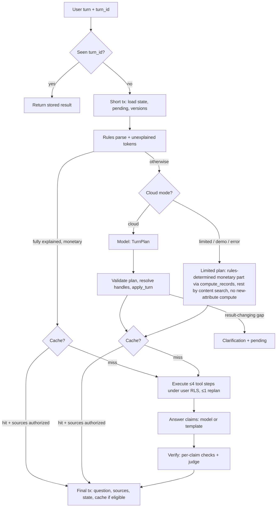
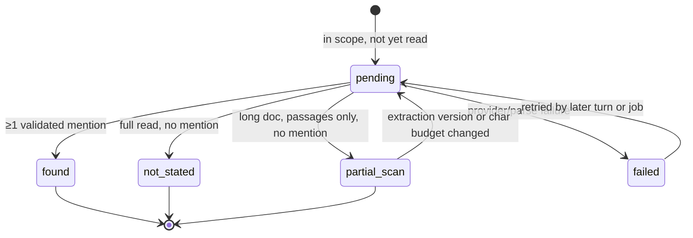
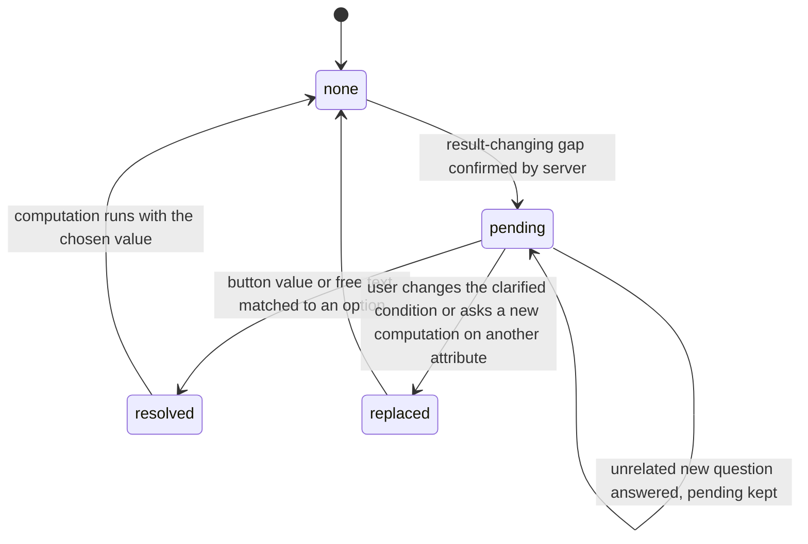
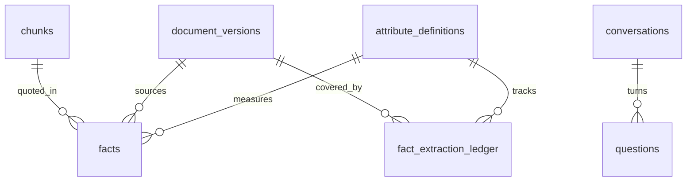

# General Question Engine - Plan

## Goal Capsule

- **Objective:** An appraisal-office employee can ask any free Hebrew question about the office's authorized documents, including topics and attributes nobody anticipated. They get either an answer they can verify against cited sources, a computation with stated coverage, or a clear explanation of what is missing. Questions are never forced into an irrelevant path such as a price clarification.
- **Means:** interpret each turn into a validated task plan, then execute bounded server-side tools: search, structured SQL, on-demand fact extraction, compare. Answer with claim-level verification, through a real OpenAI provider (KTD1, KTD3, KTD8, KTD11).
- **Authority hierarchy:** the user's request in this session → this plan's Product Contract (R-IDs, Key Decisions) → KTDs → unit Approach text. The original MVP plan `docs/plans/2026-10-05-2234-feat-appraisal-knowledge-engine-mvp-plan.md` and spec `appraisal-rag-claude-spec.md` still govern everything this plan does not change.
- **Stop conditions:** stop and report if:
  - `gpt-5.4-mini` is unavailable to the configured key or rejects structured output. Never switch models silently.
  - A settled decision proves infeasible.
  - Making a change would require weakening RLS, sending office content to the cloud while the office flag is off, or committing a secret.
- **Execution profile:** `ce-work` in return-to-caller mode inside `/lfg`, on branch `feat/general-question-engine`. Commits are allowed. Push and PR go to `origin` (github.com/AriGabay/rag, public). No merge, force-push, data deletion or production deploy.

---

## Product Contract

### Summary

Replace the keyword-routed answering path with a general question engine. A turn is interpreted into a typed `TurnPlan`:
- the task type;
- the topic, entities and attributes;
- the conditions;
- the metric, operation and unit;
- how the turn relates to the previous one;
- a standalone search query.

The server validates that plan and runs bounded tools over the office's authorized data. Attributes that were never extracted are computed through a provenance-preserving extraction into a flexible facts store, with explicit coverage. Answers are composed of claims that are verified one by one. OpenAI (official SDK, Responses API, `gpt-5.4-mini` from settings) becomes a real provider with an honest status screen. Conversation state, free-text clarifications, cache keys and invalidation are generalized to match.

### Problem Frame

The MVP answers well inside the question shapes its rules anticipate, and badly outside them. `backend/app/answering/parser.py` classifies intent by word lists:
- "ממוצע" and "מחיר" mean calculation;
- "שומות" means appraised value.

`QueryConditions` only knows money fields. `service._needs_model()` consults the cloud model only when no city, neighborhood, year or data kind was recognized.

Reproduced on `main` @ d292756:
- "מה גודל ממ״ד ממוצע ברמת גן?" parses as a calculation with `data_kind` missing, so the user is asked whether they mean transaction prices or appraised values.
- "כמה מרפסות שמש יש בשומות?" becomes an explanation about appraised values.

The model never sees either question, because a city or a value word was recognized.

The office's knowledge is far wider than the transaction tables:
- property descriptions;
- planning status;
- professional reasoning;
- version changes;
- data in tables nobody mapped.

Employees need to ask about all of it in their own words. They need answers they can trust, and they need the system to say plainly when it does not know.

### Requirements

**Interpretation and routing**

- R1. Each new user turn produces one validated task interpretation:
  - task type: locate sources, answer from content, compare, compute, compute-and-explain, clarify, or abstain;
  - topic, entities and attributes;
  - filters;
  - metric, operation and unit when computing;
  - turn relation;
  - a standalone search query.
- R2. Routing depends on the task type only. No topic, attribute or question-template vocabulary may decide the route. "ממוצע" does not imply money, and a recognized place does not mean the question is understood.
- R3. A fast rules path answers only questions whose every content word the rules account for. Anything else goes to the model when the office's cloud use is enabled. When cloud use is off, the system works in an explicitly labeled limited mode: content search plus a stated limitation. It never forces a monetary clarification on a non-monetary question.
- R4. Model outputs are structured and server-validated. The model never supplies SQL, table or column names, or record or document ids. It may reference only enums and handles the server issued.

**Cloud provider**

- R5. OpenAI is a real provider behind the existing provider interface. It uses the official `openai` SDK and the Responses API with strict structured outputs.
  - The key comes from `OPENAI_KEY`, with `OPENAI_API_KEY` as fallback. `OPENAI_KEY` wins when both are set.
  - The model comes from settings: `OPENAI_MODEL`, default `gpt-5.4-mini`.
  - A provider setting selects OpenAI or Anthropic. The model is never switched silently.
- R6. Provider keys exist only on the server. Docker Compose passes them to the backend and worker. They are never logged, printed, returned by any API, rendered in the browser, or committed. `.env.example` carries empty entries.
- R7. When OpenAI is selected, every model path uses it without needing the Anthropic key:
  - interpretation;
  - clarification reading;
  - extraction;
  - answering;
  - verification.

  No office content leaves the server unless that office's admin enabled cloud use. Cloud use is off by default.
- R8. The admin screen shows:
  - the selected provider and model;
  - whether a key was found (never its value);
  - the result and time of the last real connection test (a small request whose response is parsed);
  - the operating mode: cloud, demo, limited or error.

  Missing key, auth failure, unavailable model, timeout, rate limit, refusal and truncated or invalid output each produce a distinct status. The demo mock is never presented as a real model, and a failure is never hidden behind a demo answer.

**Search and evidence**

- R9. Search covers text chunks and table rows, including headers and units. It combines exact terms, semantic similarity and reliable metadata filters. It tries a bounded number of query variants and extra rounds, and stops when no progress is made. A passage is not admitted as evidence only because it shares a place name with the question.
- R10. A comparison retrieves evidence for each side it compares. It must not present a one-sided comparison. When the sides cannot be identified, it asks a short clarification.
- R11. A comparison between two versions of a document reads the older version explicitly and labels which version each statement comes from.

**Computation and coverage**

- R12. Attributes that exist in structured records are computed with parametric SQL over verified records, with the MVP's existing guarantees: unique transactions, Decimal arithmetic, clarification on mixed bases.
- R13. Attributes not yet extracted are computed this way:
  - identify the authorized document set by SQL;
  - extract the datum per document with page, chunk or table-cell provenance and a verbatim quote;
  - validate value, unit and context;
  - handle duplicates and missing values;
  - compute in code or SQL;
  - persist the results for reuse.

  A new attribute never requires a new column, parser rule or keyword.
- R14. Every computed answer states its coverage:
  - documents in scope;
  - values found;
  - documents where the datum is not stated;
  - documents not yet extracted;
  - values awaiting review.

  A figure that claims to describe the repository is never computed from top-k search hits. When coverage is partial, the answer says so, or abstains.
- R15. Verified facts are the basis of computed figures. Facts the server validated mechanically but no person reviewed may appear only as a separately labeled preliminary figure. Facts needing review are excluded and counted. Each answer shows the number of observations and lists the values when there are five or fewer.
- R16. People can approve, reject or correct extracted facts in the review screen. Every change invalidates dependent cached answers.

**Conversation and clarification**

- R17. The server keeps conversation state:
  - intent and task type;
  - topic and entities;
  - confirmed conditions;
  - the open clarification;
  - metric and operation;
  - referenced sources (as handles);
  - a bounded history of the user's own turns.

  The state persists across refresh and reopen. It is isolated per user and per office in the database, and it holds no document text or figures.
- R18. A follow-up changes only what it states. A change of topic or attribute clears the conditions that no longer apply. Relative references such as "השנה הקודמת" are resolved against the state. When the referent of "זה" or which documents to compare is unclear, the system asks a short clarification.
- R19. "למה?" and "תראה לי את המקור" answer from the previous answer's method and sources, re-authorized at the moment of asking. They never present a previous model answer as a factual source.
- R20. A clarification can be answered with a button or in free text. The system tells apart an answer to the clarification, a change to it, and a new question. The pending clarification is kept until it is answered or replaced. Only clarifications that change the result are asked. When a useful answer with a clear caveat is possible, the system answers instead of asking.
- R21. Sources are re-checked against current data and permissions on every turn and every cache hit.

**Answers and verification**

- R22. An answer presents, as needed:
  - a direct answer;
  - claims marked as stated in the documents, inferred, or computed;
  - documents and pages;
  - method and observation count;
  - conditions;
  - conflicts, limitations and gaps.

  An abstention explains what is missing and distinguishes not found, not stated in the document, and not yet extracted or verified.
- R23. Each claim is verified against its own cited evidence:
  - the citations are authorized;
  - its numbers appear in that evidence or in the computed result, with the same meaning;
  - a separate judging step confirms the evidence supports the claim.

  A failed or unavailable verification falls back to quoting the evidence, and that fallback is not cached.
- R24. Document content is data, never instruction. Nothing in a document can change tools, scope, permissions or statuses.

**Efficiency, cache and invalidation**

- R25. Each document is processed once, and its embeddings and extracted facts are reused. The local embedding model stays. A cache key covers:
  - the validated task;
  - conditions, operation and attribute;
  - data, facts and settings versions;
  - provider, model and prompt version;
  - office and permission scope.

  Clarifications, meta-turns, partial results and fallbacks are not cached. Deletions, permission changes and fact reviews make stale answers unreachable.
- R26. A turn holds no database transaction open across model calls. It finishes within a deadline below the UI proxy timeout and makes a bounded number of model calls. Resubmitting the same turn does not apply it twice.

**Proof and documentation**

- R27. Tests and evaluation prove generality:
  - held-out topics and attributes that do not occur anywhere in the code;
  - every one of the 14 checks the user listed (see Success Criteria);
  - browser tests of full conversations;
  - an opt-in sample with the real model when the key is available and cloud use is enabled.

  Stub results are never reported as real-model quality.
- R28. Existing tests, acceptance gates and the evaluation set stay green. Only assertions that encoded the defect being fixed are updated, and each is listed with its reason.
- R29. The documentation is updated:
  - the README, including OpenAI setup;
  - the architecture document;
  - the API contract;
  - an evaluation report;
  - example conversations on several different topics.

### Key Decisions

- **Route by task type, never by topic vocabulary.** Governs R1, R2, R3. (session-settled: user-directed — chosen over adding a ממ״ד keyword, a special balcony route or a closed list of supported questions: questions about any information in the repository must work, including unforeseen topics.)
- **OpenAI via official SDK and Responses API; key `OPENAI_KEY` then `OPENAI_API_KEY`; model `OPENAI_MODEL=gpt-5.4-mini` in settings.** Governs R5, R7. (session-settled: user-directed — chosen over Chat Completions, hardcoded model names or silently switching to a cheaper or stronger model: a cost-efficient, configurable model that must pass Hebrew quality checks.)
- **Per-office cloud opt-in stays; OpenAI works without the Anthropic key.** Governs R7. (session-settled: user-directed — chosen over global enablement: privacy by default.)
- **Keys stay server-side.** Governs R6. (session-settled: user-directed — chosen over any client-side or committed key: the repository is public.)
- **Honest provider status with a real connection test.** Governs R8. (session-settled: user-directed — chosen over a mock that looks real or failures masked by demo answers: honest status.)
- **Structured, server-validated model output; no model SQL; permissions at every stage.** Governs R4, R24. (session-settled: user-directed — chosen over model-generated SQL: isolation and correctness.)
- **Flexible extraction with provenance and coverage; no top-k statistics; model extraction is not truth.** Governs R13, R14, R15. (session-settled: user-directed — chosen over a column per attribute and averaging retrieved chunks: correctness and coverage.)
- **Structured server-side conversation state; follow-ups change only what they state.** Governs R17, R18, R19, R21. (session-settled: user-directed — chosen over sending whole history and inheriting irrelevant conditions: correct context.)
- **Free-text clarification answers; only result-changing clarifications.** Governs R20. (session-settled: user-directed — chosen over buttons only and price clarification for non-monetary questions: usability.)
- **Claim-level support verification, explicit vs inferred.** Governs R22, R23. (session-settled: user-directed — chosen over checking only that cited ids exist and numbers appear somewhere: grounded answers.)
- **Keep local embeddings; cache keyed on the parsed task, versions and model.** Governs R25. (session-settled: user-directed — chosen over replacing embeddings and caching by raw text: efficiency and correctness.)
- **Tests prove generality on held-out topics.** Governs R27. (session-settled: user-directed — chosen over tests built around ממ״ד or spec examples only: prove generality.)
- **MVP architecture continues.** FastAPI, one worker on a Postgres queue, FORCE RLS with a NOBYPASSRLS runtime role, pgvector, Decimal/NUMERIC, Next.js RTL, Docker Compose. Governs R12, R26. (session-settled: user-directed — chosen over Redis/Celery, a separate vector DB or LLM-generated SQL: no proven need.)

### Acceptance Examples

- AE1. **Covers R1, R2, R3, R13, R14.**
  - **Given** the office holds appraisals mentioning safe-room (ממ״ד) areas in Ramat Gan, and cloud use is enabled.
  - **When** a user asks "מה גודל ממ״ד ממוצע ברמת גן?"
  - **Then** no price clarification appears.
  - **And** the answer computes over documents in scope, shows n, the method and the coverage states, and cites each value's page.
- AE2. **Covers R3, R8.**
  - **Given** cloud use is off.
  - **When** the same question is asked.
  - **Then** the answer is labeled limited mode. It lists relevant passages found by search and states that computing a new attribute needs the cloud model or reviewed data.
  - **And** it shows no price clarification and no number.
- AE3. **Covers R18.**
  - **Given** a computed answer for 2023 in a neighborhood.
  - **When** the user writes "ומה לגבי השנה הקודמת?"
  - **Then** only the year changes, to 2022.
  - **And** submitting the same turn twice still yields 2022.
- AE4. **Covers R18.**
  - **Given** an answer about balcony areas filtered to Givatayim.
  - **When** the user writes "עכשיו בנושא אחר: אילו שומות מזכירות היתר בנייה?"
  - **Then** the Givatayim filter and the balcony attribute are cleared.
- AE5. **Covers R20.**
  - **Given** a pending clarification offering transaction prices or appraised values.
  - **When** the user types "התכוונתי לעסקאות".
  - **Then** the clarification resolves to transaction prices and the computation runs.
  - **When** instead the user types an unrelated new question.
  - **Then** the pending clarification is kept and the new question is answered.
- AE6. **Covers R10, R11.**
  - **Given** two versions of one appraisal with a changed adjustment rate.
  - **When** the user asks "אילו הנחות השתנו בין הגרסאות?"
  - **Then** the answer cites both versions, labeled by version.
  - **When** only one side has evidence.
  - **Then** the answer says the comparison is incomplete instead of comparing.
- AE7. **Covers R14, R15.**
  - **Given** 9 documents in scope, where:
    - 5 state the datum;
    - 2 do not;
    - 2 were not yet extracted;
    - 1 value needs review.
  - **Then** the answer shows the verified figure, the separately labeled preliminary figure, and all coverage counts.
  - **And** it does not present the figure as a repository-wide fact.
- AE8. **Covers R21, R25.**
  - **Given** a cached answer citing a document.
  - **When** the document is deleted, or the user loses its group.
  - **Then** asking again recomputes without that source, and the old message is marked hidden or stale.

### Success Criteria

The user's 14 checks are the acceptance bar. Each maps to at least one test in U12:
1. The ממ״ד question does not reach a price clarification.
2. A new-topic question reaches relevant sources or a reasoned abstention.
3. Follow-ups keep and change context correctly.
4. A comparison uses both sides.
5. An exhaustive computation is not based on top-k.
6. Missing data and duplicates do not corrupt the computation.
7. A free-text clarification answer is accepted.
8. A new question does not inherit irrelevant conditions.
9. The OpenAI provider is actually called on the relevant paths.
10. `OPENAI_KEY` reaches the server without being exposed.
11. The status is correct when there is no provider or a failure.
12. Nothing leaks across users or offices.
13. Deletion and permission changes invalidate.
14. Previous capabilities and tests still pass.

A held-out question set on topics absent from the code runs through the same path. On the real-model sample, at least 80% of held-out questions reach the correct task type and either a correct, verified answer or a correct reasoned abstention. This threshold is an assumption; see Assumptions.

### Scope Boundaries

- Automatic batch pre-extraction of attributes at ingest is not built. Extraction happens on demand and is reused.
- No new interface for external agents (MCP or API tools).
- No change to OCR, document ingestion, dedup of transactions, or the review flow for transaction records, beyond what the new tools need.
- No cost target, pricing report or budget mechanism. Bounds on steps, model calls and synchronous extraction exist for latency and safety only.
- Integrations, crawler, billing, action-taking agents, mobile, automatic appraisal adjustments, and the legal or insurance domains remain out of scope (original spec).

### Deferred to Follow-Up Work

- Letting users rename, merge or retire attribute definitions from the UI. Definitions are created and matched by the server in this plan.
- Streaming partial answers to the UI.
- More than one replan per turn.

---

## Planning Contract

### Key Technical Decisions

- KTD1. **Plan-then-execute turns, not a free tool loop.** The model returns one strict `TurnPlan`:
  - the task type and turn relation;
  - a condition delta;
  - an attribute reference;
  - a metric;
  - search queries;
  - at most four tool steps from a closed set: `search`, `compute_records`, `extract_and_compute`, `compare`, `locate`, `explain_previous`, `show_sources`;
  - an optional proposed clarification.

  The server validates the plan, executes the steps deterministically, and allows one replan, which sees step summaries only, when a step returns nothing or overruns a limit.
  - Rationale: deterministic execution makes the plan testable with scripted plans, cacheable from the validated plan, and boundable in code. A free loop makes step limits, caching and verification hard.
  - Two mechanisms were weighed (free loop vs plan-then-execute). The evidence (bounds, cache, tests) settled it without further development, so no bake-off was needed.
  - Covers R1, R4, R26.
- KTD2. **The rules fast path is gated by unexplained words, not by topic lists.** The rules parser returns its conditions plus the question's content tokens it could not explain. A token counts as explained when it is:
  - a gazetteer place;
  - a year or range;
  - a stopword;
  - a monetary term (price, value, transaction, per square meter);
  - an aggregation word;
  - a date-field phrase;
  - an area-basis or property-type term;
  - a known follow-up form.

  The fast path runs only when no unexplained content token remains and the request is monetary. Anything else goes to the model when cloud use is on (R3), or to limited mode when it is off.
  - "ממוצע" alone no longer selects money. "גודל" and "ממ״ד" stay unexplained, so the question leaves the money path in every mode.
  - A follow-up form ("ומה לגבי 2023?") counts as monetary when the conversation state holds a monetary computation; only its stated conditions change.
  - A separable explanation clause does not disqualify an explicit monetary request. When every unexplained token sits in a clause introduced by an explanation word (ומה, למה, מה נכתב, הסבר), the turn runs `compute_records` on the rules conditions and answers the clause by content search, as today's combined path does, in every mode. An unexplained token inside the monetary clause itself keeps the question non-numeric (the ממ״ד case).
  - Acceptance gate 7's "no model call" assertion is narrowed to fully explained questions.
  - Covers R2, R3.
- KTD3. **One structured provider contract with a status taxonomy.** The `LLMProvider` protocol becomes a single structured call, keeping `answer` as a thin wrapper for existing callers. The call takes a purpose, instructions, an input and a Pydantic schema. It returns:
  - the parsed object;
  - a status: `ok`, `refusal`, `incomplete`, `invalid`, `timeout`, `rate_limited`, `quota`, `auth`, `model_unavailable` or `error`;
  - usage and latency.

  Implementations:
  - **`OpenAIProvider`:** `responses.parse` with `text_format=<model>`, `store=False`, explicit `api_key`, per-purpose timeout, `max_retries=1`. It sends no `temperature`. Reasoning effort comes from a setting, default `none`.
    - `refusal` content, `status="incomplete"` and the parse-time `LengthFinishReasonError`/`ContentFilterFinishReasonError` are mapped explicitly. Those two exceptions subclass `OpenAIError`, not `APIError`.
    - `RateLimitError` with `insufficient_quota` maps to `quota`.
  - **`AnthropicLLM`:** adapted to the same contract.
  - **`MockLLM`:** supports only the `answer` purpose (labeled demo). Every other purpose returns `unsupported`, which the orchestrator treats as limited mode.
  - **`ScriptedProvider`** (tests only): replays recorded plans and extractions.

  Every call is logged to `provider_usage` with its purpose and status. Schemas are dedicated strict-mode Pydantic models (all fields required, nullable via `| None`, no `allOf`), never `QueryConditions.model_json_schema()`.
  - Covers R5, R7, R8.
- KTD4. **Settings own every provider value.**
  - `Settings` gains:
    - `llm_provider` (default `openai`);
    - `openai_api_key: SecretStr`, resolved as the first non-empty value of `OPENAI_KEY`, then `OPENAI_API_KEY`. Empty strings count as unset. This needs a validator over both names, not plain `AliasChoices`, because Compose always injects `OPENAI_KEY` (possibly empty) and pydantic-settings stops at the first alias whose value is not `None`;
    - `openai_model` (default `gpt-5.4-mini`; an empty value means the default);
    - `openai_reasoning_effort`;
    - per-purpose timeouts;
    - turn limits: `TURN_DEADLINE_SECONDS`, `EXTRACT_SYNC_MAX_VERSIONS`, `EXTRACT_ASYNC_MAX_PENDING`, `EXTRACT_DOC_CHAR_BUDGET`.
  - Compose passes `OPENAI_KEY: ${OPENAI_KEY:-}`, `OPENAI_API_KEY: ${OPENAI_API_KEY:-}` and `OPENAI_MODEL: ${OPENAI_MODEL:-}` through the existing `x-backend-env` anchor. It adds no default model, so the default lives only in settings.
  - CI sets both keys empty.
  - The repo `.env` uses `KEY = value` with spaces. Both Compose and python-dotenv were checked to read it intact (length and prefix only), so no reformatting is needed.
  - `openai==3.24.0` is added and locked. SDK 3.x no longer pulls in `httpx`, so `httpx` becomes an explicit test dependency for `TestClient`.
  - Covers R5, R6.
- KTD5. **Mode and connection test are persisted per office.** `POST /api/admin/provider/test` sends a fixed synthetic Hebrew prompt (no office content) through the structured call and checks the parsed echo. Because no office data is sent, it is allowed while cloud use is off; the UI says so. The result is stored in new `office_settings` columns:
  - provider;
  - model;
  - ok;
  - status code;
  - tested at.

  Mode is derived:
  - `cloud`: enabled, key present, and last test ok or not yet run, with the untested state shown.
  - `error`: enabled and the last test failed, or enabled with no key (status `missing_key`). Turns in this state run in limited mode with a visible limitation naming the failure, never the demo mock.
  - `demo`: disabled and `DEMO_MODE`.
  - `limited`: disabled and not demo.

  The admin JSON exposes `key_present: bool` only, never the key or a prefix of it.
  - Covers R8.
- KTD6. **Migration `0004` adds a flexible facts schema under the existing RLS patterns.**
  - Tables:
    - `attribute_definitions` (office-scoped, `tenant_isolation`);
    - `facts` (`document_access` policy, cascade on version delete);
    - `fact_extraction_ledger` (`document_access`).
  - Column changes:
    - `conversations.state jsonb` and `state_version int`;
    - `questions` gains `turn_id uuid` (unique per conversation), `status` (`pending` or `done`, for turn reservation), `plan jsonb`, `steps jsonb` and `facts_versions jsonb` (attribute → version used);
    - `attribute_definitions.facts_version bigint`, bumped per attribute;
    - `office_settings` gains provider-test columns;
    - `chunks` gains `table_index` and `row_index`;
    - `jobs.kind` is extended to `extract_facts`, with `jobs.payload jsonb`. `jobs_claim` returns kind and payload, and claims `process` jobs before `extract_facts` jobs so ingestion is never starved.
  - `conversations` and `questions` policies add `user_id = app_user()`, so per-user isolation is enforced by the database.
  - Every new table gets `ENABLE`/`FORCE` RLS, explicit `GRANT`s to `rag_app` (there are no default privileges), and an entry in `tests/conftest.py:_TABLES` and in the RLS table list in `tests/integration/test_rls.py`.
  - Covers R13, R16, R17, R26.
- KTD7. **Attributes are data in a registry.**
  - Seeded structured entries map to whitelisted record columns: `price_per_sqm`, `price` and `area` on unique transactions, and `rooms` read from `occurrences.rooms` with one value per unique transaction. Floor has no column and is handled as an extracted attribute. `compute_records` runs the existing parametric SQL, generalized to a whitelisted column and an operation (`count`, `sum`, `mean`, `weighted_mean`, `median`, `min`, `max`, `range`, `values`).
  - Each extracted attribute has:
    - a key;
    - a Hebrew label and aliases;
    - a value type;
    - a unit dimension and canonical unit;
    - an extraction prompt version;
    - a status, `proposed` or `active`.
  - The interpreter sees the office's existing definitions as handles and makes the semantic match itself. The server merges only on an interpreter-chosen handle or an exact label or alias match after Hebrew prefix and article normalization ("שטח הממ״ד" = "שטח ממ״ד"). Trigram similarity only ranks the candidate handles shown to the interpreter and never merges: "שטח מחסן" and "שטח ממ״ד" stay distinct even though they score about 0.42. With no match, the server creates a `proposed` definition from the model's description and unit dimension.
  - Covers R12, R13.
- KTD8. **On-demand extraction with ledger states and verbatim provenance.**
  1. **Document set.** The set comes from SQL under the user's RLS: current, non-deleted versions matching the validated filters. Filters use per-version metadata derived from occurrences and header facts. A version without metadata for a requested filter is counted as "unknown filter metadata", never silently included.
  2. **Reading.** Per version, the extractor reads all chunks up to `EXTRACT_DOC_CHAR_BUDGET`. A longer document reads retrieved passages only, and when it finds no mention its ledger entry records `partial_scan`. That state is re-read when the extraction version or the budget changes.
  3. **Model output.** The model returns mentions: entity role, entity descriptor, value text, unit text, quote, chunk or table-cell handle.
  4. **Server validation.** The server accepts a mention only if:
     - the quote occurs verbatim (after Hebrew normalization) in the cited chunk or cell;
     - code parses the value and unit from the quote;
     - the unit converts to the attribute's canonical unit.
  5. **Fact status.** A fact's stored status reflects only the mentions inside its own version.
     - `auto_validated`: one unambiguous value per entity.
     - `needs_review`: several conflicting values in the same version, an entity role other than the subject property, or a conversion with assumptions.
  6. **Dedup and cross-document conflicts.** These are computed at read time, under the reader's RLS, and never stored on a visible row. Facts are deduplicated by entity key: normalized address or block and parcel when present, else per document. The same entity in two visible documents counts once and is flagged when values differ. A reader who cannot see one of the documents sees neither the flag nor the other value.
  7. **Ledger.** One entry per version, attribute and extraction version, with exactly one state: `found`, `not_stated`, `partial_scan`, `failed` or `pending`. Coverage reports `partial_scan` as its own line ("נקרא חלקית, לא נמצא") and `failed` within "not yet extracted".
  8. **Synchronous vs async.**
     - Up to `EXTRACT_SYNC_MAX_VERSIONS` (default 6) versions run inline, three at a time.
     - The rest become `extract_facts` jobs, up to `EXTRACT_ASYNC_MAX_PENDING` queued jobs per office. Versions beyond the cap stay `pending` in the ledger with no job and are reported in coverage.
     - Before each model call, the worker re-checks the office cloud flag, the key, version currency and deletion.
     - A failed extraction job writes ledger state `failed` and calls only `fail_job`. It never changes `document_versions.status`.
     - Re-enqueueing a terminally failed (version, attribute, extraction version) resets that job instead of being swallowed by the idempotency key.
  - Covers R13, R14, R24.
- KTD9. **Trust tiers in computed answers.** Verified and corrected facts produce the main figure. `auto_validated` facts produce a separately labeled preliminary figure. `needs_review` facts are excluded and counted (R15). Fact review, a correction, or a finished job bumps that attribute's `facts_version`, never the global `data_version` and never another attribute's version. A balcony job finishing therefore leaves cached ממ״ד answers and unrelated history untouched.
  - Covers R15, R16, R25.
- KTD10. **Search generalization stays in SQL.**
  - `hybrid_search` gains:
    - a scope: version ids, an optional document set, and `include_noncurrent` for version comparison;
    - metadata filters;
    - multi-query fusion over the model's standalone query and up to two rewrites, through the Hebrew normalizer.
  - Evidence admission counts lexical support only from topic terms: place names and stopwords are excluded.
  - In cloud mode, semantic-only hits may be offered to the answer step, and claim verification decides whether they support anything.
  - Limited mode adds a light Hebrew inflection normalization (plural and construct suffixes) inside `query_tokens`. This is a morphological rule, not topic vocabulary.
  - Table rows are re-rendered with units, and `table_index` and `row_index` are stored on chunks through `scripts/reindex_text.py`.
  - A second search round runs only when the first admits no evidence.
  - Covers R9, R10, R11.
- KTD11. **Claims-first answer composition with two verification layers.** The answer schema returns claims, each with text, evidence ids, kind (`explicit`, `inferred` or `computed`) and numbers. The server renders the text from the claims.
  - **Layer 1** is deterministic, per claim:
    - its ids are authorized and present;
    - each number appears in its own cited evidence or in the computed result;
    - there are no links or markup.
  - **Layer 2** is one judge call over all claims with only their cited spans, returning `supported`, `partial` or `unsupported`.
  - Unsupported claims are dropped and the drop is stated. If no supported claim remains, or the judge fails, the answer falls back to quoting the evidence with `cacheable=False`. Computed claims take their numbers from tool results, never from the model.
  - Covers R22, R23.
- KTD12. **Conversation state is typed and applied by a pure function.**
  - `ConversationState` holds:
    - task type;
    - topic;
    - entities (surface text);
    - conditions;
    - attribute handle;
    - metric;
    - referenced sources as `S#` handles mapping to document, version and page;
    - the pending clarification;
    - the user's last three question texts.
  - `apply_turn(state, plan)` handles the turn:
    - merges the delta;
    - clears dependents on a topic or attribute change;
    - resolves relative years against stored conditions;
    - rejects unresolvable referents into a clarification.
  - Handles are re-authorized every turn. Answer text and document text never enter state, so later prompts cannot carry content the user can no longer see.
  - Covers R17, R18, R19, R21.
- KTD13. **Turn execution is short-transaction, idempotent and deadline-bound.**
  1. `/api/ask` accepts a client `turn_id`.
  2. A short transaction reserves the `turn_id` by inserting a `pending` question row, protected by the unique constraint, and loads state and the cache inputs.
     - A `turn_id` that is already done returns the stored result.
     - One that is still pending returns 409 with a Hebrew "still processing" message, and the client polls for the stored result.
  3. Model and tool work runs. Each tool opens its own `tenant_tx` under the user's context.
  4. A final transaction checks `state_version` and completes the reserved row, sources, state and cache together. A `state_version` conflict restarts from the state load with the same reservation and re-applies the plan to fresh state at most once. A relative delta such as "previous year" is resolved against the state version the turn started from, so it cannot apply twice.
  5. Facts and ledger rows commit as they are produced, even if the turn later fails. A failed turn marks its reservation failed so a retry can run.

  `TURN_DEADLINE_SECONDS` (default 45) bounds the turn. Next's rewrite proxy timeout is raised above it in `frontend/next.config.ts`; verify the option name for Next 16.3 during implementation. When the deadline approaches, the turn returns a partial answer with ledger counts instead of failing.
  - Covers R26.
- KTD14. **The cache key comes from the validated plan.** It combines:
  - the canonical task: type, attribute handle and extraction version, metric, operation and unit, resolved conditions, and the normalized standalone query for content tasks;
  - `data_version`, the used attribute's `facts_version`, and `settings_version`;
  - provider, model and prompt version;
  - embedding model and template version;
  - office and permission scope.

  The rules path looks up the cache before any model call; the model path after interpretation. Never cached: clarifications, meta-turns, partial or deadline answers, fallbacks, and turns that used a non-`ok` provider status. Cached sources are re-authorized on every hit, as today.
  - Covers R25.
- KTD15. **The facts review reuses the review screen.** A second tab in `frontend/app/review/page.tsx` lists `needs_review` and `auto_validated` facts with their quote and page link. Conflicting values are computed under the reviewer's RLS (KTD8 step 6). Approve, reject and correct record history and bump the attribute's `facts_version`. Facts from documents in groups the reviewer cannot see stay invisible, through RLS.
  - Covers R16.
- KTD16. **A held-out synthetic corpus proves generality.**
  - New generated documents go into a new group visible to `admin-a` and `dana` but not `yossi`. They contain varied narrative and tables:
    - safe-room and balcony areas;
    - parking and storage;
    - ceiling height and building age;
    - elevator;
    - planning status and building rights;
    - renovation;
    - a conflicting statement between two documents;
    - two versions with a changed assumption;
    - a datum absent from some documents;
    - the same subject property appraised twice.
  - Ground truth is extended by the generator in a new `general_facts` section. Existing record counts and the 77-question evaluation stay unchanged; verify with `tests/unit/test_fixtures_ground_truth.py`.
  - A guard test asserts that held-out attribute words do not occur anywhere in `backend/app`.
  - Covers R27, R28.

### High-Level Technical Design

Turn flow:

Extraction ledger states per (version, attribute, extraction version):

Pending clarification lifecycle (R20):

Decision split between model and server:

| Model decides | Server decides and enforces |
|---|---|
| Task type, turn relation, entities as text | Authorization on every tool (RLS under user context) |
| Tool steps and order (closed set) | Document set for computation (SQL from validated filters) |
| Search phrasing and rewrites | Entity resolution against the gazetteer and registry |
| Attribute description and unit dimension | Attribute matching and creation, unit conversion |
| Whether a clarification might matter | Whether it actually changes the result (`distinct_values`, ledger) |
| Claim wording and evidence choice | All arithmetic, coverage counts, trust tiers, verification |

Data model additions:

### Assumptions

- Facts the server validated mechanically (quote matched, value and unit parsed, one unambiguous value) may feed a separately labeled preliminary figure on the first ask. Only reviewed facts feed the main figure (KTD9). This resolves the ambiguity in the settled extraction decision in favor of a useful first answer with a clear caveat.
- The connection test may run while cloud use is off because it sends no office content (KTD5).
- The real-model quality bar is 80% of held-out questions correct, or correctly abstaining. This is an assumption for the first sample, not a contractual threshold.
- Synchronous extraction covers up to 6 versions per turn. More versions continue as background jobs up to the per-office queue cap, and the user re-asks or refreshes to see the updated coverage.
- Demo mode (`DEMO_MODE=true`) keeps the mock only as a labeled extractive answerer. It never interprets or extracts. The mock-based scripted plans exist in tests only.
- New attribute definitions are created automatically as `proposed` without asking the user. Wrong merges are corrected by review in a later iteration.

### Sequencing

U1 → U3 → U4 → U5 → U6 → U7 → U8 → U9, then U2, U10 and U11 in parallel, and U12 last. U2 can start right after U3. U12's fixture generation can start after U3.

### Risks and Mitigations

| Risk | Mitigation |
|---|---|
| `gpt-5.4-mini` unavailable to the key, or a parameter rejected | Connection test plus a smoke call in U1. Stop condition: no silent switch. The model is configurable in `.env`. |
| One question fans out to many documents (cost, latency, queue starvation) | Synchronous cap, queued-job cap per office, ingestion claimed first, deadline, partial answer with coverage (KTD8, KTD13) |
| Prompt injection inside documents | Enum and handle-only tool arguments, quote-must-match, model cannot set `verified`, existing injected-instruction fixture D12 extended to the extraction and judge paths |
| Async extraction after cloud is turned off | The worker re-checks the flag before every call (KTD8) |
| Turn state leaking unauthorized content | State holds handles and user question text only, and is re-authorized each turn (KTD12) |
| Stale cache after fact review | `facts_version` in the key and in stale marking (KTD9, KTD14) |
| Hebrew paraphrase misses in limited mode | Inflection normalization plus an explicit limited-mode label. Cloud mode uses model rewrites. |
| Existing tests encode the defect | R28: each changed assertion is listed in the PR with the reason |
| OpenAI data retention (`store=False` still leaves abuse-monitoring logs up to 30 days without ZDR) | Documented in the README and the admin acknowledgement text. The per-office opt-in stays the control. |

### System-Wide Impact

- **Privacy:** office content goes to OpenAI on four purposes (interpret, extract, answer, judge), and only for offices that opted in. The acknowledgement text names the provider and the retention terms.
- **Permissions:** two new document-derived tables, plus per-user database isolation of conversations. Cross-group fact reuse goes through document RLS only.
- **Operations:**
  - the worker gains a second job kind;
  - the reindex script must run once after migration 0004 so table units and indices reach existing chunks;
  - `docker compose up --build` needs the new lock.
- **UI:** chat, admin and review change. The client-only filter panel becomes a request to edit conversation conditions, so the server is the single source of truth.

---

## Implementation Units

| U-ID | Title | Key files | Depends on |
|---|---|---|---|
| U1 | Provider contract, OpenAI provider, settings and env | `backend/app/providers/llm.py`, `backend/app/config.py`, `docker-compose.yml` | — |
| U2 | Provider status and connection test | `backend/app/platform/admin.py`, `frontend/components/admin/AdminPanels.tsx` | U1, U3 |
| U3 | Migration 0004 and RLS | `backend/alembic/versions/0004_general_engine.py` | — |
| U4 | Turn interpretation and conversation state | `backend/app/answering/plan.py`, `backend/app/answering/parser.py`, `backend/app/answering/state.py` | U1 |
| U5 | Search generalization | `backend/app/platform/search.py`, `backend/app/extraction/chunking.py` | U3 |
| U6 | Attribute registry and structured compute | `backend/app/answering/attributes.py`, `backend/app/appraisal/query.py` | U3 |
| U7 | On-demand fact extraction and coverage | `backend/app/answering/facts.py`, `backend/app/worker.py` | U1, U3, U5, U6 |
| U8 | Answer composition, verification, compare | `backend/app/answering/compose.py`, `backend/app/answering/verify.py` | U1, U5 |
| U9 | Turn orchestrator, clarifications, cache | `backend/app/answering/service.py`, `backend/app/answering/api.py` | U4, U6, U7, U8 |
| U10 | Chat UI | `frontend/app/chat/page.tsx`, `frontend/components/AnswerCard.tsx` | U9 |
| U11 | Facts review | `backend/app/answering/facts_review.py`, `frontend/app/review/page.tsx` | U3, U7 |
| U12 | Corpus, evaluation, browser tests, real-model sample, docs | `backend/scripts/generate_fixtures.py`, `backend/eval/`, `frontend/e2e/`, `docs/` | all |

### U1. Provider contract, OpenAI provider, settings and env

- **Goal:** a real OpenAI provider and a single structured-call contract with a status taxonomy, configured only from settings.
- **Requirements:** R5, R6, R7, R8 (KTD3, KTD4).
- **Dependencies:** none.
- **Files:**
  - `backend/app/providers/llm.py`
  - `backend/app/config.py`
  - `backend/pyproject.toml`, `backend/uv.lock`
  - `docker-compose.yml`, `.env.example`
  - `.github/workflows/ci.yml`
  - `backend/tests/support/scripted_provider.py` (new)
  - `backend/tests/unit/test_providers.py` (new)
  - `backend/tests/unit/test_settings.py` (new)
- **Approach:**
  1. Add `openai==3.24.0` and an explicit `httpx` test dependency, then re-lock.
  2. Add the settings fields of KTD4. The key is a `SecretStr`, and `Settings` repr and logging never show it.
  3. Define the structured-call contract and status enum. Keep `answer()` as a wrapper for the existing content path until U8 replaces it.
  4. Implement `OpenAIProvider` per KTD3: client built once per (key hash, model) via the existing `lru_cache` pattern, with an explicit `api_key`.
  5. Adapt `AnthropicLLM` and `MockLLM` to the contract.
  6. `get_cloud_provider()` selects by `llm_provider`. `cloud_configured()` checks the selected provider's key.
  7. Update the test monkeypatch targets in `tests/acceptance/test_gate7_provider_use.py` and `tests/integration/test_content_answers.py`.
  8. Add the Compose and CI entries. `.env.example` gains `OPENAI_KEY=`, `OPENAI_API_KEY=` and a commented `OPENAI_MODEL=`.
- **Execution note:** smoke-test once against the real API with the repo `.env` key (a tiny structured call) before building on the provider. A failure here is a stop condition.
- **Patterns to follow:** `AnthropicLLM` and `_cloud_provider` in `backend/app/providers/llm.py`; settings in `backend/app/config.py`.
- **Test scenarios:**
  - Only `OPENAI_KEY` set: settings resolve it. With both set, `OPENAI_KEY` wins. With only `OPENAI_API_KEY` set, the fallback is used. With `OPENAI_KEY` set to an empty string and `OPENAI_API_KEY` set (the Compose case), the fallback is used.
  - `OPENAI_MODEL` empty or unset: `gpt-5.4-mini`. With `OPENAI_MODEL=x`: `x`.
  - `repr(get_settings())` and a logged settings dump do not contain the key value.
  - With the client stubbed, a parsed response maps to `ok` with usage. A refusal item maps to `refusal`.
  - With the client stubbed: `status="incomplete"` with `max_output_tokens` maps to `incomplete`; `LengthFinishReasonError` maps to `incomplete`; malformed JSON maps to `invalid`.
  - Stubbed SDK exceptions map to: `AuthenticationError` → `auth`; `NotFoundError` on the model → `model_unavailable`; `RateLimitError` → `rate_limited`, or `quota` when the body says `insufficient_quota`; `APITimeoutError` → `timeout`; `APIConnectionError` → `error`.
  - `MockLLM` returns `unsupported` for interpret, extract and verify, and a demo-labeled result for answer.
  - With `llm_provider=openai` and no Anthropic key, `cloud_configured()` is true when the OpenAI key is present.
  - `docker compose config` renders `OPENAI_KEY` for the backend and worker services, verified by length only.
  - Real call, marked `real_model` and skipped without a key: a structured echo returns `ok` from `gpt-5.4-mini`.
- **Verification:** unit tests pass; the opt-in real smoke call returns `ok`; no key value appears in `git diff`, logs or test output.

### U2. Provider status and connection test

- **Goal:** the admin sees provider, model, key presence, connection-test result and mode, and can run a real test.
- **Requirements:** R8 (KTD5).
- **Dependencies:** U1, U3.
- **Files:**
  - `backend/app/platform/admin.py`
  - `backend/app/answering/content.py`, for `effective_provider`, which moves to a provider-status helper
  - `frontend/components/admin/AdminPanels.tsx`
  - `frontend/lib/types.ts`, `frontend/lib/format.ts`
  - `docs/api-contract.md`
  - `backend/tests/integration/test_admin_lifecycle.py`
- **Approach:**
  1. Add `POST /api/admin/provider/test` (admin only). It runs the KTD5 call, persists the outcome columns, audits it, and returns the status.
  2. `_settings_json` returns provider name, model, `key_present`, last test fields and the derived mode.
  3. Enabling cloud bumps `settings_version`, as today.
  4. The UI shows a badge per mode, the failure reason in Hebrew per status, a "בדיקת חיבור" button, and the acknowledgement text naming the provider and its retention note.
- **Patterns to follow:** `PUT /api/admin/settings` and its audit; `ProviderPanel`.
- **Test scenarios:**
  - No key: mode `limited` or `demo`, `key_present=false`. Running the test returns `missing_key` without a network call.
  - Cloud enabled and no key: mode `error` with status `missing_key`. A content question then shows a limitation naming the missing key and no demo answer.
  - Stubbed `auth` failure: mode `error`, with status persisted and shown. The response contains no key.
  - Stubbed `ok`: mode `cloud`, with `tested_at` set.
  - An employee calling the test endpoint gets 403.
  - Office B's test result is invisible to office A (RLS).
  - The admin settings JSON never contains the substring of the key, checked against the configured test key value.
  - Browser test: the admin panel shows the provider, the model, "מפתח נמצא", and the test result after clicking.
- **Verification:** each status renders a distinct Hebrew message, and the mock is labeled demo everywhere.

### U3. Migration 0004 and RLS

- **Goal:** schema for facts, the registry, the ledger, conversation state, turn idempotency, the provider test and the new job kind, all under FORCE RLS.
- **Requirements:** R13, R16, R17, R26 (KTD6).
- **Dependencies:** none.
- **Files:**
  - `backend/alembic/versions/0004_general_engine.py` (new), with `0004_general_engine.sql` if the DDL is large
  - `backend/tests/conftest.py`
  - `backend/tests/integration/test_rls.py`
  - `backend/app/worker.py` (dispatch by kind)
  - `backend/scripts/seed_demo.py` (seed structured registry entries per office)
- **Approach:**
  1. Write the DDL per KTD6.
  2. Recreate `jobs_claim` (owned by `rag_lookup`) to return kind and payload, claim `process` jobs before `extract_facts` jobs, and keep the 0003 max-attempts logic.
  3. Give the per-user policies on `conversations` and `questions` an admin-agnostic rule: users see only their own rows.
  4. Write a downgrade that reverses each change.
- **Patterns to follow:** `backend/alembic/versions/0003_jobs_claim_max_attempts.py`; the `document_access` policy in `0001_initial.sql`; `docs/solutions/database-issues/force-rls-security-definer-lookups-need-bypassrls-owner.md`.
- **Test scenarios:**
  - Each new table is FORCE RLS and invisible without context. Office B sees none of office A's rows.
  - A `facts` row from a document in a group the employee lacks is invisible to that employee and visible to admin.
  - User X cannot read user Y's conversations or questions even in the same office, including admin.
  - `jobs_claim` returns `extract_facts` jobs with their payload, claims a queued `process` job before older `extract_facts` jobs, and still fails exhausted jobs (0003 behavior).
  - Upgrade then downgrade then upgrade succeeds on a populated test database.
- **Verification:** the RLS suite passes with the new tables in its list, and the existing suite stays green.

### U4. Turn interpretation and conversation state

- **Goal:** turn a user turn into a validated `TurnPlan` and an updated `ConversationState` through rules (when fully explained) or the model.
- **Requirements:** R1, R2, R3, R4, R17, R18, R20 (KTD1, KTD2, KTD12).
- **Dependencies:** U1.
- **Files:**
  - `backend/app/answering/plan.py` (new): `TurnPlan`, the step schemas and the validator
  - `backend/app/answering/state.py` (new): `ConversationState` and `apply_turn`
  - `backend/app/answering/interpret.py` (new): the model interpreter and prompt
  - `backend/app/answering/parser.py`: unexplained-token reporting
  - `backend/tests/unit/test_plan.py`, `backend/tests/unit/test_state.py`, `backend/tests/unit/test_parser.py`
- **Approach:**
  1. The rules parser keeps its vocabulary but reports unexplained content tokens. A monetary request needs an explicit monetary term.
  2. The interpreter prompt receives:
     - the question;
     - the state's structural fields;
     - the pending clarification;
     - gazetteer places;
     - registry handles;
     - the three previous user questions.

     It returns a `TurnPlan`.
  3. The validator:
     - rejects unknown tools and extra fields;
     - enforces at most four steps;
     - rejects strings that look like SQL or UUIDs in free-text fields used as arguments;
     - rejects places outside the gazetteer, turning them into an unknown-place abstention;
     - rejects referents outside the state's handles.
  4. `apply_turn` implements KTD12, including relative-year resolution ("השנה הקודמת" = stored year minus one).
  5. Free-text clarification in limited mode matches the reply against option labels by normalized token overlap. With no confident match, the turn is treated as a new question and the pending clarification is kept.
- **Execution note:** implement `TurnPlan` validation and `apply_turn` test-first; they are pure and carry the routing guarantees.
- **Patterns to follow:** `QueryConditions` validation in `backend/app/answering/conditions.py`; `_merge_filters` precedence semantics.
- **Test scenarios:**
  - Covers AE1. "מה גודל ממ״ד ממוצע ברמת גן?": the rules report the unexplained tokens גודל and ממ״ד and are not confident. No `data_kind` clarification is produced in any mode.
  - "מה המחיר הממוצע למ״ר לעסקאות ברמת גן ב-2024": fully explained and monetary, so the fast path runs (gate-7 behavior kept).
  - "כמה מרפסות שמש יש בשומות?" is not confident and is not assigned `appraised_value`.
  - Covers AE3. State with year 2023 and the plan delta "previous year": year 2022, other conditions unchanged. Applying the same plan twice from the same state version gives 2022.
  - Covers AE4. A topic change clears the city, attribute and metric, and keeps nothing stale.
  - "השווה את זה לשומה השנייה" with one referenced source produces a clarification asking which second appraisal.
  - A plan with five steps, an unknown tool, a SQL fragment, a foreign UUID or an extra field is rejected. The orchestrator then uses the limited path with a limitation.
  - Covers AE5. Pending data-kind clarification plus "התכוונתי לעסקאות" with the scripted provider resolves to `transaction_price`. In limited mode the label overlap resolves the same way.
  - With a pending clarification and an unrelated question, the relation is a new question and the pending clarification is kept.
  - Demo mode, no model: the three combined eval items (a monetary question plus a separate explanation clause, such as unused building rights) keep the numeric part through `compute_records` and answer the clause by content search (KTD2).
  - Demo mode, no model: "ומה לגבי 2023?" after a monetary answer is treated as monetary and changes only the year.
- **Verification:** unit tests pass, and no topic or attribute word was added to `parser.py`.

### U5. Search generalization

- **Goal:** search over text and tables with scope, metadata filters, query variants and evidence admission that does not trust shared place names.
- **Requirements:** R9, R10, R11 (KTD10).
- **Dependencies:** U3.
- **Files:**
  - `backend/app/platform/search.py`
  - `backend/app/extraction/normalize_text.py` (inflection normalization)
  - `backend/app/extraction/chunking.py` (units in table rows)
  - `backend/app/platform/pipeline.py` (store `table_index` and `row_index`)
  - `backend/scripts/reindex_text.py`
  - `backend/app/answering/metadata.py` (new, per-version metadata view)
  - `backend/tests/integration/test_search.py`, `backend/tests/unit/test_hebrew_normalize.py`
- **Approach:**
  1. Extend `hybrid_search` with scope, filters and multi-query RRF.
  2. Compute lexical support from topic tokens only.
  3. Per-version metadata comes from current occurrences and header facts. A missing value means unknown, never a match.
  4. `include_noncurrent` is honored only when the caller names explicit version ids the user can see.
- **Patterns to follow:** the existing RRF and IDF weighting in `backend/app/platform/search.py`; `query_tokens` normalization.
- **Test scenarios:**
  - "מרפסות" finds a chunk containing "מרפסת" (plural normalization).
  - A question naming Ramat Gan plus a topic does not admit a chunk that matches only "רמת גן".
  - A table-row chunk renders headers with units, e.g. `שטח ממ״ד (מ״ר): 12`, and is found by the header term.
  - A filter on city excludes versions of another city, and reports versions with unknown city separately.
  - `include_noncurrent` with an older version id the user can see returns its chunks. Without explicit ids, old versions never appear.
  - An employee never receives chunks from a document in a group they lack (existing RLS, regression).
  - The reindex script updates existing table-row chunks idempotently.
- **Verification:** search tests pass, and the existing eval source-recall stays at 18/18.

### U6. Attribute registry and structured compute

- **Goal:** attributes are registry entries. Structured ones compute through generalized parametric SQL with an operation enum.
- **Requirements:** R12, R13 (KTD7).
- **Dependencies:** U3.
- **Files:**
  - `backend/app/answering/attributes.py` (new: registry lookup, matching, creation)
  - `backend/app/appraisal/query.py` (generalized column and operation)
  - `backend/app/answering/templates.py`
  - `backend/tests/unit/test_attributes.py`, `backend/tests/integration/test_numeric_answers.py`
- **Approach:**
  1. Seed structured entries per office.
  2. Match model attribute descriptions per KTD7: interpreter-chosen handle or exact normalized label or alias. Trigram similarity only ranks the candidates offered to the interpreter. Create `proposed` entries for new ones.
  3. Generalize `compute_stats` to a whitelisted column and operation. Keep the price-per-sqm path byte-compatible for existing answers.
- **Patterns to follow:** `_filters`, `distinct_values` and `compute_stats` in `backend/app/appraisal/query.py`.
- **Test scenarios:**
  - Mean price per sqm for the existing eval case equals the previous result exactly (Decimal).
  - Mean `area` over verified transactions in a neighborhood equals the ground-truth value.
  - The operations `count`, `min`, `max` and `range` on a structured attribute return correct values. A non-whitelisted column name from a plan is rejected.
  - "גודל ממ״ד" when no definition exists creates one `proposed` definition. "שטח הממ״ד" afterwards matches the same definition.
  - "שטח מחסן" after "שטח ממ״ד" creates a separate definition and never reuses the safe-room facts.
  - Office B's registry entries are invisible to office A.
- **Verification:** the existing numeric tests and acceptance gate 1 stay green.

### U7. On-demand fact extraction and coverage

- **Goal:** compute any attribute present in text or tables, with provenance, validation, dedup, ledger coverage, reuse and async continuation.
- **Requirements:** R13, R14, R15, R24 (KTD8, KTD9).
- **Dependencies:** U1, U3, U5, U6.
- **Files:**
  - `backend/app/answering/facts.py` (new: document set, extraction, validation, units, dedup, compute)
  - `backend/app/answering/units.py` (new: Hebrew unit parsing and conversion by dimension)
  - `backend/app/worker.py` (`extract_facts` handler)
  - `backend/app/platform/jobs.py`
  - `backend/tests/unit/test_units.py`
  - `backend/tests/integration/test_fact_extraction.py`
- **Approach:**
  1. Build the document set and per-version reads per KTD8.
  2. Extract with the scripted provider in tests and the real one in cloud mode.
  3. Validate on the server: the quote matches, code parses the value and unit, and the unit converts.
  4. Write facts and the ledger in their own transactions.
  5. Compute with Decimal over the trust tiers (KTD9), deduplicated by entity key.
  6. Coverage counts come from the ledger.
  7. Enqueue the remaining versions as jobs with the payload `attribute_id`.
  8. Reuse existing facts for the same attribute and extraction version instead of extracting again.
- **Patterns to follow:** extraction validation in `backend/app/appraisal/validate.py`; job enqueue and lease handling in `backend/app/platform/jobs.py`.
- **Test scenarios:**
  - Covers AE7. Nine versions in scope with mixed outcomes produce the exact coverage counts, a verified figure, a separate preliminary figure, and needs-review excluded.
  - A model mention whose quote does not occur in the cited chunk is rejected and logged. The ledger does not count it as found.
  - "12 מ״ר", "12 מ'ר" and "1200 ס״מ" convert correctly or are rejected by dimension. A value for a different attribute adjacent to the term (a floor number next to "ממ״ד") is not accepted, because the quote and unit dimension do not match.
  - The same subject property in two documents counts once. Differing values are flagged, and the fact goes to review.
  - A second identical question reuses the facts and makes no extraction calls.
  - More versions than the sync limit: an answer over the extracted subset, `pending` counts, and jobs enqueued. After the worker runs them, asking again shows full coverage.
  - The worker skips a job whose version was deleted, or whose office turned cloud use off, and makes no provider call.
  - A question over more versions than the sync limit plus `EXTRACT_ASYNC_MAX_PENDING` queues jobs only up to the cap and reports the rest as pending. A document uploaded afterwards is processed before the waiting extraction jobs.
  - A stubbed provider error in an `extract_facts` job leaves the version `ready` and writes ledger state `failed`. A later turn re-queues it.
  - A generated document longer than `EXTRACT_DOC_CHAR_BUDGET`, whose datum lies outside the retrieved passages, is reported as read partially, not as not stated.
  - When only a document in group G2 disagrees with a fact from group G1, an employee without G2 sees the G1 fact with no conflict flag and no conflicting value. An admin sees the conflict.
  - An employee's extraction never includes versions from groups they lack. A later admin question extracts only the remaining versions.
  - Cloud off: no extraction call. The answer abstains as not yet extracted, with the relevant passages listed (AE2).
  - Injected-instruction text inside a document cannot change a fact's status or add tools.
- **Verification:** extraction tests pass with the scripted provider, and one real-model run over the held-out corpus is recorded in U12.

### U8. Answer composition, verification and compare

- **Goal:** claims-first answers verified per claim, abstentions that explain what is missing, and a two-sided compare tool.
- **Requirements:** R10, R11, R19, R22, R23, R24 (KTD11, KTD10).
- **Dependencies:** U1, U5.
- **Files:**
  - `backend/app/answering/compose.py` (new: answer schema, rendering, abstention kinds)
  - `backend/app/answering/verify.py` (per-claim layer and judge)
  - `backend/app/answering/compare.py` (new)
  - `backend/app/answering/content.py` (becomes the search-and-answer tool, or is folded into compose)
  - `backend/tests/unit/test_verify.py`
  - `backend/tests/integration/test_content_answers.py`
  - `backend/tests/integration/test_compare.py` (new)
- **Approach:**
  1. Build the answer schema per KTD11.
  2. Computed numbers are inserted by the server from tool results.
  3. The judge call receives only the cited spans.
  4. Compare resolves each side to a document or version handle, retrieves evidence scoped to each side, and requires at least one admitted passage per side.
  5. Abstention kinds are `not_found`, `not_stated`, `not_extracted_or_verified` and `insufficient_permission_scope`. The last never reveals hidden documents; it says only that the search covered the documents the user may see.
- **Patterns to follow:** `verify_answer`, `allowed_numbers` and the extractive fallback in `backend/app/answering/content.py`.
- **Test scenarios:**
  - A claim citing E1 with a number found only in E3 fails layer 1.
  - A paraphrase the judge marks unsupported is dropped and the drop is stated. With all claims unsupported, the answer falls back to quoting and is not cacheable.
  - A judge timeout falls back to quoting, is not cacheable, and logs a usage row with status `timeout`.
  - An inferred claim renders with an inference label, and an explicit claim renders as stated in the document.
  - Covers AE6. Two versions with a changed rate: both cited and labeled by version. With evidence for only one side, the answer states the comparison is incomplete.
  - A conflict between two documents on the same datum is reported with both sources.
  - A model answer containing a URL or markup is rejected (existing behavior kept).
  - The D12 injected instruction does not alter the answer's tools or statuses.
- **Verification:** the existing citation and abstention gates (2 and 4) stay green.

### U9. Turn orchestrator, clarifications and cache

- **Goal:** `/api/ask` runs the new turn flow with short transactions, idempotency, free-text clarifications, meta-turns, the generalized cache and stale marking.
- **Requirements:** R1, R3, R17 to R21, R25, R26 (KTD1, KTD2, KTD12, KTD13, KTD14).
- **Dependencies:** U4, U6, U7, U8.
- **Files:**
  - `backend/app/answering/service.py`
  - `backend/app/answering/api.py`
  - `backend/app/db.py` (facts version helpers)
  - `backend/tests/integration/test_turns.py` (new)
  - `backend/tests/acceptance/test_gate5_invalidation.py`
  - `backend/tests/acceptance/test_gate7_provider_use.py`
  - `docs/api-contract.md`
- **Approach:**
  1. Restructure `ask` per KTD13. `AskBody` gains `turn_id`. `filters` become explicit condition edits, which the server applies as a delta.
  2. Remove the "discard pending on typing" rule. The interpreter decides the relation (R20).
  3. Meta-turns "למה?" and "תראה לי את המקור" read the previous question's stored plan, steps and sources, re-authorize them, and render method and sources without a model fact source.
  4. Persist `plan`, `steps` and the used attributes' `facts_versions` on `questions`.
  5. Stale marking compares each used attribute's `facts_version` for answers that used facts.
  6. Build the cache key per KTD14.
- **Patterns to follow:** existing `cache_key`, `_sources_still_authorized`, `_save` and `get_conversation` stale logic.
- **Test scenarios:**
  - Covers AE1 end to end with the scripted provider: the ממ״ד question produces a computed answer with coverage. No provider call happens on the fully explained monetary question (gate 7, narrowed).
  - Covers AE3. The same `turn_id` posted twice produces one `questions` row and the same answer.
  - Covers AE3. The same `turn_id` posted twice concurrently: the second gets 409 "still processing", then the stored result. There is one row, and the year is 2022, not 2021.
  - A balcony extraction job finishing leaves a cached ממ״ד answer reusable and its history message not stale.
  - Two concurrent turns on one conversation: the second sees a `state_version` conflict and is retried once on fresh state, or returns 409 with a Hebrew message.
  - Covers AE5 through the API: a free-text clarification answer resolves. The pending clarification survives an unrelated question.
  - "למה?" after a numeric answer returns method, conditions and sources, makes no provider call, and is not cached.
  - "תראה לי את המקור" after a document's deletion says the source is no longer available.
  - Covers AE8. Cache hit invalidation on delete, on group removal, and on fact review (via `facts_version`). An unrelated conversation's history is not marked stale by a fact review.
  - Partial (deadline or async), fallback, clarification and meta answers are never written to `answer_cache`.
  - Two different metrics with identical conditions produce different cache keys.
  - Reopening a conversation restores state, pending clarification and conditions. User X cannot open user Y's conversation (404).
  - Provider `auth` failure mid-turn: a visible limitation names the failure. No demo answer is substituted and nothing is cached.
- **Verification:** acceptance gates 1–7 pass (gate 7 updated with its reason), and the 77-question eval stays at 77/77 against a cold cache.

### U10. Chat UI

- **Goal:** the chat supports free-text clarifications, claim labels, method and coverage display, partial-coverage refresh, and turn ids, with the server as the single source of conditions.
- **Requirements:** R14, R17, R20, R22, R26.
- **Dependencies:** U9.
- **Files:**
  - `frontend/app/chat/page.tsx`
  - `frontend/components/AnswerCard.tsx`
  - `frontend/lib/types.ts`, `frontend/lib/format.ts`
  - `frontend/next.config.ts` (proxy timeout)
  - `frontend/e2e/chat-messages.spec.ts`, `frontend/e2e/general-conversations.spec.ts` (new)
- **Approach:**
  1. Generate a `turn_id` per submission and reuse it on Retry. On a 409 "still processing" response, poll for the stored result.
  2. Typing while a clarification is pending sends a normal question; the server decides.
     - The answer carries a one-line note on how the text was read ("נקלט כתשובה להבהרה: עסקאות", or "נענתה כשאלה חדשה; ההבהרה הממתינה נשמרה").
     - A clarification that stays pending is re-rendered pinned above the composer with its buttons.
     - The composer hint and the discarded-clarification note in `frontend/app/chat/page.tsx` are replaced to say the user may answer by button or free text, or ask something else and keep the clarification.
  3. The answer card follows this order:
     1. the mode badge (cloud, limited, demo, error);
     2. the direct answer, with the verified figure first and the preliminary figure in a separate labeled block directly below it;
     3. conflicts and limitations, always visible;
     4. claims with labels (stated, inferred, computed), and a single notice for dropped claims;
     5. sources with pages and version labels;
     6. a details area, collapsed by default, holding method, n, conditions and the coverage counts on one line.

     Each abstention kind has its own heading and no figure area.
  4. Long turns:
     - after about 10 seconds the busy indicator says documents are being read and it may take up to a minute;
     - a partial or deadline answer shows a "חלקי" badge with the ledger counts;
     - "רענון תשובה" re-sends the same question with a new `turn_id`, replaces that message's answer in place, and is disabled while busy.
  5. A context strip above the composer shows the server state as removable chips: attribute, metric, place, years, data kind. Removing a chip sends a condition edit. When a turn clears chips, the answer lists what was cleared. The filter panel adds conditions to the same chips.
  6. Fix the active-conversation state display, so conditions show without reopening.
- **Patterns to follow:** existing `AnswerCard` sections and RTL styles; `ErrorAlert` retry.
- **Test scenarios:**
  - Browser, full conversation in one office:
    1. ממ״ד question → computed answer with coverage;
    2. "ומה לגבי גבעתיים?" → only the place changes;
    3. "למה?" → method and sources;
    4. "עכשיו בנושא אחר: אילו שומות מזכירות היתר בנייה?" → sources, with earlier conditions cleared;
    5. reload → state intact.
  - Browser: a clarification answered by typing resolves. A clarification answered by button still works (AE1 of the MVP).
  - Browser: Retry after a simulated network error does not duplicate the message.
  - Browser, limited mode (cloud off): the limited badge appears and the ממ״ד question shows passages and the limitation, with no price clarification.
- **Verification:** Playwright suite green, including the existing 14 specs, and typecheck and lint clean.

### U11. Facts review

- **Goal:** reviewers approve, reject or correct extracted facts with source context. Changes invalidate dependent answers.
- **Requirements:** R15, R16 (KTD15, KTD9).
- **Dependencies:** U3, U7.
- **Files:**
  - `backend/app/answering/facts_review.py` (new router), registered in `backend/app/main.py`
  - `frontend/app/review/page.tsx`
  - `frontend/components/review/FactView.tsx` (new)
  - `backend/tests/integration/test_facts_review.py`
- **Approach:**
  1. Mirror the approve, reject and correct endpoints of `backend/app/appraisal/review.py` for `facts`. Keep the history in the row's `previous` jsonb, bump the attribute's `facts_version`, and write audit events.
  2. The tab groups facts by attribute, then by document, with `needs_review` items first.
  3. Conflicting values for the same entity, computed under the reviewer's RLS, are shown together.
  4. Each row shows the value with its canonical unit, the verbatim quote and the page link.
  5. Correct opens an inline form with a numeric value and a unit select limited to the attribute's unit dimension. A rejected value shows a Hebrew inline error.
  6. The empty state says no facts await review.
- **Patterns to follow:** `backend/app/appraisal/review.py` `_set_status` and `correct`; `RecordView.tsx`.
- **Test scenarios:**
  - Approving an `auto_validated` fact moves it into the main figure on the next ask, and the cached answer is not reused.
  - Correcting a value records the previous value and source, and recomputes.
  - Rejecting removes the fact from both figures and keeps it in the coverage counts as rejected.
  - An employee without the group cannot see or act on that fact (404).
  - Browser: the facts tab lists a fact with its quote and page link, and approving it updates the list.
- **Verification:** the review tests pass, and the transaction-record review is unchanged.

### U12. Corpus, evaluation, browser tests, real-model sample and docs

- **Goal:** prove generality and the 14 checks with held-out content, record a real-model sample honestly, and document the system.
- **Requirements:** R27, R28, R29 (KTD16).
- **Dependencies:** all previous units.
- **Files:**
  - Corpus:
    - `backend/scripts/generate_fixtures.py`
    - `backend/tests/fixtures/` (new generated documents)
    - `backend/tests/fixtures/ground_truth.yaml`
  - Evaluation:
    - `backend/eval/questions_general.yaml` (new)
    - `backend/eval/flows.py` (free-text clarification helper)
    - `backend/scripts/eval.py`
  - Tests:
    - `backend/tests/unit/test_no_topic_vocabulary.py` (new)
    - `backend/tests/acceptance/test_gate8_generality.py` (new)
  - Seed: `backend/scripts/seed_demo.py`
  - Docs:
    - `docs/evaluation/eval-results.md`
    - `docs/evaluation/real-model-sample.md` (new)
    - `docs/evaluation/example-conversations.md` (new)
    - `docs/evaluation/report.md` (new consolidated report)
    - `README.md`
    - `docs/architecture.md`
    - `docs/api-contract.md`
- **Approach:**
  1. Generate the held-out corpus per KTD16.
  2. Write the general question set: 40 or more items, at least half on attributes and topics absent from `backend/app`. Each item records its category: explicit text fact, table datum, locate, explanation, comparison, version diff, conflict, computation, unextracted datum, missing info, follow-up, clarification.
  3. Gate 8 runs the set through the API with the scripted provider. Recorded plans must come from a real-model run where available; otherwise they are hand-written and labeled synthetic. Gate 8 asserts task type, tool choice, coverage states and abstention kind, not wording.
  4. `scripts/eval.py --real-sample` runs a sample against the live stack with cloud enabled for a test office: the AE1–AE6 questions verbatim plus held-out questions.
     - It writes `docs/evaluation/real-model-sample.md` with model, date, per-item outcome and failures.
     - It sends only synthetic documents.
     - When the U1 smoke call succeeded, this sample is a required gate. Any AE miss, or a held-out pass rate under 80%, is a failing gate that stops before the PR.
  5. The example conversations document records real-model transcripts on at least four topics.
- **Execution note:** write the held-out questions and expected outcomes before tuning any prompt. Do not edit them after seeing results; add new items instead.
- **Traceability of the 14 user checks** (the report repeats this table with test names):

  | Check | Where it is proven |
  |---|---|
  | 1. ממ״ד not sent to price clarification | U4 AE1 scenario, U9 AE1 end to end, U10 browser, real sample |
  | 2. New topic reaches sources or reasoned abstention | gate 8 held-out set, U8 abstention kinds |
  | 3. Follow-ups keep and change context | U4 AE3/AE4, U9 AE3, U10 browser conversation |
  | 4. Comparison uses both sides | U8 AE6 |
  | 5. Exhaustive computation, not top-k | U7 AE7 coverage, U6 structured compute |
  | 6. Missing data and duplicates handled | U7 dedup and coverage scenarios |
  | 7. Free-text clarification accepted | U4 AE5, U9 AE5, U10 browser |
  | 8. New question does not inherit conditions | U4 AE4, U10 browser topic switch |
  | 9. OpenAI called on relevant paths | U1 real smoke, U9 provider-call assertions, real sample |
  | 10. `OPENAI_KEY` reaches server unexposed | U1 settings and compose checks, U2 key-substring check, secret scan |
  | 11. Correct status without provider or on failure | U2 status scenarios, U9 auth-failure turn |
  | 12. No cross-user or cross-office leakage | U3 RLS, U7 group-conflict scenario, U12 isolation |
  | 13. Deletion and permission change invalidate | U9 AE8, gate 5 |
  | 14. Previous capabilities stay green | existing suites, 77-item eval with held-out group seeded |

- **Test scenarios:**
  - The 14 user checks each map to a named test, per the table above.
  - The no-topic-vocabulary test fails if any held-out attribute word (for example ממ״ד, מרפסת, חניה, גובה תקרה, מעלית, היתר) appears in `backend/app` source.
  - A new held-out attribute added only to the corpus and question set, with no code change, is answered or correctly abstained in gate 8.
  - Isolation: office B and user `yossi` never receive held-out group facts, sources or cached answers.
  - The existing eval (77) and acceptance gates, including the citation gate 2 and the provider gate 7, stay green against a cold cache with the held-out group seeded.
- **Verification:** all suites are green. The real-model sample report exists, states its pass rate against the 80% assumption, and lists failures honestly. The README explains `OPENAI_KEY`, the model setting, the connection test, modes and data-retention notes.

---

## Verification Contract

| Gate | Command or check | Proves |
|---|---|---|
| Backend tests | `cd backend && uv run pytest -q` (stack db up) | units, integration, acceptance gates 1–8 |
| Lint | `cd backend && uv run ruff check .`; `cd frontend && npm run typecheck && npm run lint` | code quality |
| Browser | `cd frontend && npx playwright test` against the seeded stack | full conversations, admin status, facts review |
| Eval (existing) | `cd backend && uv run python scripts/eval.py` with cold cache | R28: 77/77 kept |
| Eval (general) | `uv run python scripts/eval.py --set general` | held-out generality with the scripted provider |
| Real-model sample | `uv run python scripts/eval.py --set general --real-sample` with `OPENAI_KEY` and cloud enabled for the test office | R27 real quality. Required when the U1 smoke call succeeded: all AE1–AE6 pass and held-out ≥80% |
| Secrets | `git grep -nE 'sk-[A-Za-z0-9_-]{20,}'` returns nothing; API responses in tests never contain the configured key | R6 |
| Compose | `docker compose config` shows `OPENAI_KEY` reaching backend and worker (checked by length); `docker compose up -d --build` backend and worker healthy | R6, KTD4 |
| CI | PR checks `backend` and `frontend` green | R28 |

## Definition of Done

- Every unit's verification is met, and every Verification Contract gate passes or is reported as not run with its reason. The frontend image build may be reported as not run when disk space is short. The real-model sample may be reported as not run only when the U1 smoke call could not succeed (no key or no network). Otherwise it must pass.
- The PR lists:
  - every changed existing assertion, with its reason;
  - the residual review findings;
  - the real-model sample result.
- No secret in the diff, logs or test output. `.env.example` has empty provider keys only.
- Abandoned-attempt code and unused helpers are removed. No dead code paths remain from the keyword router. The router's vocabulary that the fast path still uses is kept and documented.
- Documentation updated: README, architecture, API contract, evaluation report, example conversations.
- Per unit: tests named in its scenarios exist and pass. No unit leaves a TODO for a requirement it claims.

---

## Appendix

### Sources and research

- Code paths verified on `main` @ d292756:
  - `backend/app/answering/service.py` (`_needs_model`, `run_question`);
  - `backend/app/answering/parser.py` (word lists);
  - `backend/app/answering/api.py` (`cache_key` drops the question for calculation intent; the provider call happens inside `tenant_tx`);
  - `backend/app/answering/verify.py` (numbers pooled across evidence);
  - `backend/app/appraisal/publish.py` (`fact_values` bound to occurrences and rewritten on publish);
  - `backend/alembic/versions/0001_initial.sql` (`jobs.kind` CHECK, `document_access` policy, no default privileges);
  - `frontend/app/chat/page.tsx` (pending discarded on typing);
  - `frontend/next.config.ts` (rewrite proxy).
- OpenAI documentation checked 2026-10-06 (developers.openai.com, github.com/openai/openai-python):
  - `openai` 3.24.0 (2026-10-02) requires Python ≥3.10. Since 3.0 it uses `httpx2`, and `httpx` is no longer installed.
  - Responses `parse(text_format=...)` and `create(text={"format": {"type": "json_schema", "name", "schema", "strict": true}})`. Strict mode requires every field in `required` and `additionalProperties: false`, and does not support `allOf`, `not` or `if/then`.
  - `gpt-5.4-mini` (snapshot `gpt-5.4-mini-2026-03-17`): listed with structured outputs and reasoning efforts none (default) to xhigh. `temperature` is not documented for it, so it is not sent.
  - The catalog now leads with GPT-6 models, and `gpt-5.4-nano` is deprecated. The model stays configurable and is not switched.
  - `store=False` avoids response storage but not abuse-monitoring retention without ZDR.
- Institutional learning: `docs/solutions/database-issues/force-rls-security-definer-lookups-need-bypassrls-owner.md`. New tables need explicit grants and FORCE RLS; cross-tenant lookups only through `rag_lookup`-owned functions.
- Prior decisions carried: MVP plan KTD1 (parametric SQL), KTD5 (group RLS on documents), KTD8 (job queue), KTD9 (Hebrew normalization), KTD10 (no model call when cloud is off), KTD13 (data version), and KTD17 (structured output rather than a forced tool choice; empirical verification needed).
