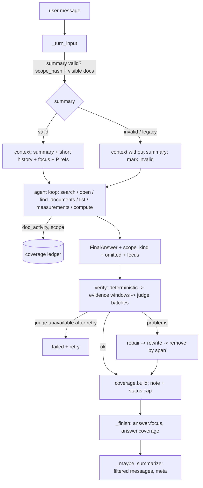

# Conversational RAG gaps - Plan

## Goal Capsule

- **Objective:** An appraiser using the chat gets answers they can rely on to the extent the answer claims:
  - no content from a document they may no longer see reaches the model or the answer, including through the conversation summary;
  - no unverified professional claim is shown as verified;
  - an answer about a set of documents, or about a table, says exactly what was covered and what was not;
  - a correction changes only what the user corrected.
  
  The evaluation measures correctness and completeness, not only keyword presence. Cost and latency are measured before and after the change on the same cases.
- **Means:**
  - permission-scoped summary metadata (KTD1);
  - fail-closed verification with claim-targeted evidence windows (KTD2, KTD3);
  - a server-side coverage ledger with paginated tools (KTD4, KTD5);
  - a structured conversation focus (KTD6);
  - structured eval checks with negative controls (KTD7);
  - token reductions that never drop permissions, evidence or verification (KTD8).
- **Authority hierarchy:** the order of precedence is:
  1. the user's request in this session;
  2. this plan's Product Contract (R-IDs and Key Decisions);
  3. the KTDs;
  4. each unit's Approach text.
  
  `docs/plans/2026-10-06-0856-feat-general-question-engine-plan.md` and the conversational RAG engine at commit 0ec7682 govern everything this plan does not change.
- **Stop conditions:** stop and report if any of these happens:
  - a fix would require weakening RLS, skipping verification or evidence, or sending office content to the cloud while the office flag is off;
  - real report content would have to enter git;
  - a settled decision proves infeasible.
- **Execution profile:** `ce-work` in return-to-caller mode inside `/lfg`, on branch `feat/general-question-engine`. Commits and push are allowed, and the PR on `origin` (public) may be updated. No merge, force-push, data deletion or production deploy.

---

## Product Contract

### Summary

The fixes stay inside the existing engine: `backend/app/chat/{api,engine,tools,verify}.py`, the chat UI and `backend/eval/chat_eval.py`. Ingestion, the measurement schema and the UI shell stay as they are.

- **Summaries:** a summary records the documents it was built from and the permission scope it was built under. A summary that is unverifiable, or no longer allowed, is not used, and is rebuilt only from messages whose sources are allowed now.
- **Verification fails closed:** a sentence counts as non-factual only when a safe structural rule says so. If the judge cannot be reached, the turn fails with a retry; it is never shown as verified.
- **Judge evidence:** the judge sees the evidence that covers each claim, selected from the whole source (table headers, units and notes included), deduplicated per call, with no arbitrary prefix cut.
- **Coverage:** questions over a set of documents, or over a table, get an explicit scope and a server-built coverage ledger. Results that hit a tool's limit are paginated, never silently capped.
- **Focus:** the datum at the centre of the conversation is kept as structured focus, so a correction changes only what was corrected.
- **Evaluation:** the eval gains structured correctness and completeness checks with negative controls. v3 and v4 are re-run as regression, and a new set v5 (references fixed before running) is run once.
- **Efficiency:** per-turn input is reduced (duplicate passages, verbatim history, repeated judge sources) and cached tokens are measured. Quality, cost and latency are compared before and after on the same cases.

### Problem Frame

At 0ec7682 the engine answers well on focused questions, but several gaps were confirmed in the current code:

- **Summary permissions:**
  - `backend/app/chat/api.py::_turn_input` drops assistant messages whose sources are hidden but passes `conversations.summary` unchecked.
  - `_maybe_summarize` folds every `done` message into the summary with no permission filter.
  - So a document revoked or deleted after the summary was written can still reach the model through the summary.
- **Verification:** `backend/app/chat/verify.py::verify_answer` lets a sentence without a verdict pass unless it carries an id or a number. A judge timeout therefore leaves verbal professional claims standing. The UI then says "בדיקת האימות לא הושלמה", but the claims are still shown.
- **Judge evidence:** `judge` cuts every source to its first 1,800 characters (`JUDGE_SOURCE_CHARS`), and to 600 when the total exceeds 40,000. The evidence for a claim made from an opened section (up to 9,000 characters) or a table (up to 14,000) can lie past the cut, so correct claims are rejected and wrong ones are judged against unrelated text.
- **Coverage:**
  - A city-level question was answered from one of two matching appraisals without mentioning the other (v3 run 2).
  - `list_documents` (LIST_MAX=60) and `find_measurements` (MEASUREMENTS_MAX=120) silently cap results.
  - A table with nine asking rents was answered with one value (v4, manual review).
- **Corrections:** "התכוונתי לשווי" after a rent-per-m² question returned the total value. The only carrier of the previous metric's definition is free text in history.
- **Evaluation:** the scorer checks regexes and source titles only, so an answer with every keyword can omit a document, change a unit, or show one value instead of a set, and still pass.
- **Cost:** about 5 model calls and about 38k input tokens per turn, about $0.035. History is passed verbatim (up to 10 messages × 2,500 characters). Search output is resent at every agent step, and judge calls repeat the same source for every unit that cites it. Cached tokens are not recorded, so the real cost is unknown.

### Requirements

**Permissions in conversation context**
- R1. No content of a document the user cannot see now (revoked group, moved document, deleted document) reaches the model through the conversation summary, history, focus documents, prior references or focus state. This holds for the model's input, the tool results and the answer.
- R2. A summary records the documents behind the messages it folded, the permission scope (`scope_hash`) it was built under, and the range of messages it covers. A summary without this metadata (legacy) is never used.
- R3. A summary is used only when its scope still matches and every recorded document is visible now. Otherwise the turn runs without it, and the summary is rebuilt after the turn only from messages that are allowed now. Assistant messages whose answer cites a document that is not visible are skipped. The user's own messages are kept.

**Verification**
- R4. A unit without a verdict fails verification unless a deterministic structural rule classifies it as non-factual: a Markdown heading, a short label line ending with ':' with no number, a question, or an empty connective. Lacking a number or citation never makes a unit non-factual.
- R5. A judge `not_factual` verdict is accepted only for a unit with no number. A unit with a number that the judge calls not_factual is judged as a claim.
- R6. A judge call that fails (timeout, rate limit, invalid output) is retried once. If verification still cannot complete, the turn ends as `failed` with a clear retry message. It is never shown as verified, nor as an answer whose claims were not checked.
- R7. A judge reply that leaves units out triggers one re-judge of those units. Units still without a verdict fail per R4.

**Evidence for the judge**
- R8. For each claim, the judge receives the parts of each cited source that cover the claim: the segments that contain its numbers or its content words, with neighbouring context. A table keeps its caption, title, header row and notes. A source within budget is sent whole.
- R9. When selected excerpts are sent instead of the whole source, they are labelled as excerpts with the omitted spans marked. When a claim's number occurs in several places in the source, every occurrence is included, so the judge decides by meaning.
- R10. Judge calls are packed by character budget, not by a fixed unit count. Each source is sent once per call. Evidence that does not fit is never truncated: the batch is split, and a single unit over budget gets its own narrower excerpt set.
- R11. The judge's rules keep faithful explanations and explicitly marked inferences ("מכאן עולה") supportable. Verification is never weakened to pass them.

**Completeness and coverage**
- R12. For a question about a set (overview, comparison, list, computation, or "in city/area X"), the turn has an explicit scope: which documents match it, found through a document-level search tool that returns every match with paging. The answer declares whether it is focused or set-level.
- R13. The server keeps a coverage ledger per turn, recording for each document in scope:
  - whether it was checked (searched, opened, or its measurements read);
  - whether it was read partially;
  - whether it contributed a cited datum.
  
  The model also lists the data it omitted, with a reason.
- R14. When a set-level answer covers only part of its scope, the server appends a deterministic coverage note naming what was not checked, and the answer status is at most `partial`. A focused answer that did not name a document, given while other documents match the question's distinctive title words, gets a note naming those documents.
- R15. `list_documents` and `find_measurements` page their results and report the total. A truncated result says how many remain, and the coverage ledger records whether every page was read. A computation or "all documents" claim over a truncated result is refused or marked partial.
- R16. An answer about a table keeps its multiplicity: it presents all values of the requested kind, or their count and range. One value shown alone must be called an example, with the table's size. The judge flags a unit that presents one value of a multi-value table as the whole.
- R17. A focused question does not trigger a whole-repository scan. Coverage effort follows the request.

**Follow-ups**
- R18. Each answer records a structured focus: the metric as written, metric kind, unit, period, area basis, VAT if stated, subject/property, value role, document ids and scope kind. The next turn receives it, filtered to visible documents.
- R19. A correction changes only the corrected element and keeps the others. For example, "value" after "rent per m²" keeps per-m², the area basis, the property and the documents. "זה" refers to the focus. A topic change drops the focus. Material ambiguity leads to a short clarification.

**Evaluation**
- R20. The regex checks stay as regression checks. Structured checks are added:
  - `required_documents` and `forbidden_documents` (by citation);
  - `value_set` (all listed values present, or the answer states it is an example and gives the count);
  - `value_meaning` (a value's sentence must contain or exclude unit, period or VAT words);
  - `attribution` (a value's sentence cites the named document and does not carry another role's words);
  - `coverage` (the answer's coverage ledger and note must match the expected scope, and hedging must match what was checked).
- R21. Negative controls exist as unit tests of the scorer. A synthetic answer that contains every keyword but omits a document, changes a unit, presents one value instead of the set, or claims full coverage when the ledger is partial must fail.
- R22. v3 and v4 are re-run as regression before and after the changes. A new set v5 is written before its first run, with its references fixed in advance. It uses phrasings not used for any fix and more documents, and it covers corrections, "זה", switching properties, topic change, set questions and table multiplicity. Automated results and a manual reading are reported separately.

**Efficiency**
- R23. Per-turn usage records input, cached-input and output tokens per call. The report compares calls, input tokens, cached tokens, cost and latency before and after on the same cases, next to the quality results.
- R24. Input is reduced without dropping permissions, evidence or verification:
  - a passage already returned in the turn is referenced, not resent;
  - assistant messages in history are shortened, since the focus state carries the needed definition;
  - judge sources are deduplicated per call;
  - reading depth follows question complexity.
- R25. `OPENAI_KEY` (with `OPENAI_API_KEY` as fallback) and `OPENAI_MODEL` remain configuration. No budget mechanism is added.

### Key Decisions

- **Summaries are scoped and invalidated, never trusted on legacy data.** (session-settled: user-directed — chosen over passing `conv.summary` unchecked and summarizing unfiltered messages: no reintroduction of revoked or deleted content). Governs R1, R2, R3.
- **Missing verdicts fail closed, and judge outage fails the turn with retry.** (session-settled: user-directed — chosen over removing only sentences with an id or a number: unverified professional claims must not appear verified). Governs R4, R5, R6, R7.
- **The judge gets claim-relevant evidence windows, and verification is never relaxed to pass explanations.** (session-settled: user-directed — chosen over the first-1,800-character prefix and over removing verification to stop rejections: verification must see the actual evidence). Governs R8, R9, R10, R11.
- **Set questions get explicit scope, coverage tracking and pagination, with effort matched to the request.** (session-settled: user-directed — chosen over a result cap silently acting as the repository boundary, and over scanning the whole repository for every question: completeness claims must be honest without needless cost). Governs R12, R13, R14, R15, R16, R17.
- **The conversation focus keeps the datum's definition, and a correction changes only the corrected part.** (session-settled: user-directed — chosen over reinterpreting a correction from scratch: correct follow-ups). Governs R18, R19.
- **Phrase checks stay as regression, alongside structured correctness/completeness checks with negative controls, a fresh held-out set, and automated and manual results reported separately.** (session-settled: user-directed — chosen over phrase-only scoring: keyword presence does not prove correctness or completeness). Governs R20, R21, R22.
- **Efficiency never comes from skipping checks, and quality is compared before and after on the same cases.** (session-settled: user-directed — chosen over savings by skipping permissions, evidence or verification, and over a budget system: quality first). Governs R23, R24, R25.
- **Carried constraints stay in force** (session-settled: user-directed — chosen over free SQL and a client-side key: isolation and correctness):
  - official OpenAI SDK with the Responses API, key server-side only;
  - defined tools only, with RLS and tool I/O validation;
  - exact computation that never mixes kinds;
  - no internet or general knowledge for repository facts.
  
  Governs R1, R13, R25.
- **Git and data rules stay in force** (session-settled: user-directed — chosen over committing or publishing evaluation data: customer data, public repo):
  - public repo: real reports, their values, and the eval questions and answers stay in gitignored `real_documents/eval/`;
  - public docs and the PR carry aggregated numbers only;
  - automated tests run on isolated data (office B or the test DB).
  
  Governs R22.

### Acceptance Examples

- AE1. Covers R1, R3. Steps:
  1. A 20-message conversation cites documents A and B, so a summary exists.
  2. A is moved to a group the employee is not in.
  3. The user asks a follow-up.
  
  Result: no text unique to A appears in the model's input items, any tool output or the answer. The stored summary is rebuilt without A's answers.
- AE2. Covers R4, R6. Steps:
  1. The judge times out twice.
  2. The answer contains a verbal claim with no number or citation.
  
  Result: the turn ends `failed` with "לא ניתן היה לאמת את התשובה מול המקורות. אפשר לנסות שוב." No answer text is shown.
- AE3. Covers R7, R4. The judge returns verdicts for units 1–5 of 7, and the re-judge again omits unit 7, a verbal claim. Result: unit 7 is a problem. After repair and rewrite it is removed, and the answer says so.
- AE4. Covers R8, R9. A claim cites a 6,000-character section whose supporting sentence starts at character 4,200. Result: the judge input contains that sentence. A different sentence at character 300 holding the same number with another meaning is also included, labelled as an excerpt.
- AE5. Covers R12, R13, R14. Steps:
  1. Two visible appraisals are in city X.
  2. The user asks for the value per m² "in X".
  3. The model reads only one of them.
  
  Result: the answer carries a coverage note naming the unread one, and its status is `partial`.
- AE6. Covers R16. The user asks "what rents appear in the survey table?" about a table with nine rent rows. Result: the answer lists all nine values, or their count and range. An answer that shows one value without the word "example" and the count fails the eval check.
- AE7. Covers R18, R19. Steps:
  1. The user asks "what is the rent per m² in document D?".
  2. Then the user says "I meant the value".
  
  Result: the second answer gives a value per m² from D, with the same area basis wording, and not the total value.
- AE8. Covers R15. Steps:
  1. 75 documents are visible.
  2. `list_documents` with no query is called.
  
  Result: it returns 60 with "75 בסך הכול, עמוד 1 מתוך 2". The ledger records `complete=false` until page 2 is read.

### Success Criteria

- AE1–AE8 hold in automated tests: scripted-provider integration tests for AE1–AE5, AE7 and AE8, scorer tests for AE6.
- v3 and v4 regression after the change: no case that passed before fails after, unless the before-pass was a false pass the new structured checks expose. Such a case is reported, not hidden.
- v5 results are reported once, held-out, with automated and manual results kept separate.
- Before/after usage table on the v3+v4 cases: calls, input, cached and output tokens, cost and latency per turn.

### Scope Boundaries

- No change to DOCX ingestion, the measurement extraction schema, the provider abstraction beyond usage fields, or the UI shell and layout. The UI only renders the new coverage and verification states.
- No budget system, and no model switch.
- No streaming of answer text.

### Deferred to Follow-Up Work

- A separate whole-answer completeness judge, an LLM call comparing the answer to every uncited source. The deterministic ledger plus the per-unit multiplicity rule covers the reported failures first.
- Answering from the earlier (legacy) question engine's conversations.

---

## Planning Contract

### Key Technical Decisions

- **KTD1. Summary metadata lives on `conversations`, and validity is checked at turn start.** (session-settled: user-directed — chosen over passing `conv.summary` unchecked: no reintroduction of revoked or deleted content.)
  - Migration 0007 adds `summary_meta jsonb`, holding `{document_ids: [...], scope_hash, data_version, through_message_id, built_at}`.
  - `_turn_input` uses the summary only when all of these hold: the metadata exists, its `scope_hash` equals the current `scope_hash(ctx)`, and every document id in it is visible under RLS now (the same check as `_visible_documents`).
  - When any of these fails, `summary_meta.invalid=true` is set. After the turn, `_maybe_summarize` rebuilds the summary from the `done` messages up to the window, skipping assistant messages that are `_hidden`. It never reuses the old summary text when the old one was invalid.
  - Rebuild mode bypasses the `SUMMARY_EVERY` gate. It folds at most the last 40 allowed messages before the window, each clipped to 1,500 characters as today, and then sets `summary_message_count` to `upto`. This keeps the rebuild's cost bounded.
  - `_answer_documents` (the source of `_hidden`, history filtering and summary document ids) also counts the document ids that an answer's coverage ledger (`answer.ledger`) and focus (`answer.focus`) name. A document that was only listed, in scope or in focus, and was later revoked, therefore hides the message, just as a cited document does.
  - A valid summary is extended incrementally as today: the new messages are filtered the same way and the document ids are merged.
  - A data_version change alone does not invalidate the summary. Deletion and visibility are checked by the document-visibility test, and permission changes by `scope_hash` and visibility. The summary is not a fact source; prior refs are reopened under the current permissions.
  - Considered and rejected: rebuilding synchronously at turn start, which adds an LLM call to the user's wait while the turn can run without the summary.
- **KTD2. Structural classification is deterministic and conservative, and the judge's not_factual is trusted only without numbers.** (session-settled: user-directed — chosen over removing only sentences with an id or a number: unverified professional claims must not appear verified.)
  - `structural_kind(unit)` returns `heading`, `label`, `question`, `connective` or `None`, matching R4 exactly:
    - `heading`: a Markdown heading;
    - `label`: a line of at most 8 words ending with ':' and holding no digits, or a bold-only line of at most 8 words holding no digits;
    - `question`: text ending with '?' with no citation;
    - `connective`: at most 3 words, no digits, no citation.
  - Everything else is a claim.
  - Judge calls go through `call_structured` with a verification deadline (the turn deadline plus a fixed verification allowance), which disables the SDK's own retry. A batch that fails with a timeout, rate limit or invalid output is retried once. A batch that comes back `incomplete` is split in half instead of being resent. A call refused for lack of time counts as a failure. If a batch still fails, `verify_answer` raises `VerificationUnavailable`. The engine turns that into `ProviderFailure("verify_unavailable")`, and the API maps it to a failed message with retry.
  - Considered and rejected: showing the answer marked "unverified". The user asked that unverified claims never look verified, and the earlier request said not to show unverified claims as final.
- **KTD3. Evidence windows are pure functions over source text, and judge calls share sources.** (session-settled: user-directed — chosen over the first-1,800-character prefix: verification must see the actual evidence.)
  - `evidence.select(unit_text, source_text, kind, budget)`:
    1. split into segments: lines; long lines into sentences; table rows are their own segments;
    2. mark header segments: caption, title, header row and the table size line (row count and per-column value counts, U6) for table and table-from-picture sources; notes are trailing lines starting with `*`, `(*)` or `הערה`;
    3. score segments: an exact normalized number match (via `numbers_in`) is strong, and content-word overlap (prefix variants, abbreviation variants) is weak;
    4. take every segment holding any of the unit's numbers, plus the top-k segments by word score, plus ±1 neighbours, plus the header segments;
    5. merge into windows joined with `…[הושמט]…`;
    6. if the whole source is at most `JUDGE_WHOLE_SOURCE_CHARS` (4,000), send it whole.
  - The judge input puts `<sources>` once per call, each source holding the union of the windows needed by that call's units, with `excerpt="true"` when cut. Units reference source ids.
  - Calls are packed up to `JUDGE_CALL_CHARS` (about 30,000).
  - Considered and rejected:
    - embedding-based window selection: there is no extra model or latency budget for it, and numbers and words decide most claims;
    - raising the prefix size: the cost grows and the evidence is still not guaranteed.
- **KTD4. Coverage is a server ledger; the model declares only the scope kind, its query, and omissions.** (session-settled: user-directed — chosen over a result cap silently acting as the repository boundary: completeness claims must be honest.)
  - New tool `find_documents(query, page)`: a document-level match over visible current documents.
    - **Title matches:** the normalized title words of the query, every match returned.
    - **Content matches:** a document is in scope only when **every** term of the scope query (each with its prefix and abbreviation variants, place names kept) appears in some current chunk of that document. This is an AND per document, not the existing OR search. POLICY tells the model that the scope query names the terms that define the set (place, document type), not the metric.
    - No semantic top-k.
    - It returns `total`, the page (30 per page) and per-document match reasons (matched terms, hit count), and records `ws.scope = {query, ids, total, pages_read, complete}`.
  - `list_documents` without a query also records a scope: all visible current documents, with `complete=false` until every page is read. `list_documents` with a title query is a paged inventory only and never defines the set.
  - `Workspace.doc_activity[document_id]` is updated by every tool: `searched` when a hit is returned, `opened`, `measurements_read`, and `partial` (the reading flag).
  - `FinalAnswer` gains these fields; a `scope_kind` of `focused` uses no scope query:

    ```
    scope_kind: "focused" | "set"
    scope_query: str
    omitted: [{what, why}]
    ```
  - After verification, `coverage.build(ws, answer)` computes the ledger and stores it under a new key, `answer.ledger`. `answer.coverage` keeps today's extraction-coverage list, so stored messages and baseline results still render and rescore.
    - `matching` comes from `ws.scope`;
    - `checked`, `cited` and `partial` come from `doc_activity` and the cited sources.
    
    For `set`, it appends the deterministic note and caps the status at partial when either holds:
    - a matching document was not checked;
    - a matching document was checked (for example, it came up in a search) but contributed no cited datum and is not explained in `omitted`. The note names it as "נבדק, לא נמצא בו נתון שנכלל בתשובה".
  - Focused-answer guard (R14): if `scope_kind=focused`, the question names no document (`documents_named` is empty), and `find_documents` was not called, the server runs `documents_matching_title`:
    - A question word of at least 2 characters, not a stopword, that matches between 2 and 8 visible current titles triggers the check.
    - If the answer cites only some of those documents, a note names up to 5 of the others and gives the total.
    - This is a cheap deterministic query, with no topic vocabulary, and it does not depend on `documents_named`'s at-most-2 limit.
  - Considered and rejected: trusting the model's own completeness statement, which is not verifiable.
- **KTD5. Pagination by an explicit `page` argument, never silent.**
  - `list_documents(query, page)` returns 60 per page and `find_measurements(..., page)` returns 120 per page. Both report `total` and `page/pages`.
  - Paged queries have a total order: `m.id` is appended to the `find_measurements` ORDER BY, and `d.id` to `list_documents` and `find_documents`. Without it, tied rows (several measurements per table row, NULL block_index, duplicate titles) could be skipped across a page boundary.
  - Measurement ids stay stable across pages, since `known` already dedupes.
  - `compute` over measurements from an incompletely read `find_measurements` result for the same filter returns a note: the result is partial, because not every page was read.
  - The coverage ledger records `complete`.
- **KTD6. The focus is part of `FinalAnswer` and stored in `answer.focus`.** (session-settled: user-directed — chosen over reinterpreting a correction from scratch: correct follow-ups.)
  - It holds `{metric_as_written, metric_kind, unit, period, area_basis, vat, subject, value_role, document_ids, scope_kind}`, with enums matching the measurement labels and free strings where needed.
  - The server validates it: `document_ids` must be a subset of the documents cited or listed in this turn. When it is read back, a focus with any document id that is no longer visible is dropped as a whole: its free-text fields came from that document. `focus.document_ids` are also counted by `_answer_documents` (KTD1).
  - `_turn_input` passes the last visible focus as "הנתון שבמרכז השיחה" and POLICY states the correction rule.
  - Considered and rejected: inferring the focus server-side from measurements, which would fail for text-only answers.
- **KTD7. Structured eval checks read the answer payload, not only its markdown.**
  - They use `answer.sources[*].document_id/title`, `answer.ledger` (skipped when absent, as in baseline results), and per-sentence citation spans (reusing `split_units`).
  - Values are matched with `numbers_in` normalization.
  - Negative controls are scorer unit tests on synthetic answers in `backend/tests/unit/test_chat_eval_scoring.py`, which is public and has no real data.
  - Re-scoring stored results is supported: the results JSON keeps the full answer payload from now on.
- **KTD8. The efficiency levers are deterministic.** (session-settled: user-directed — chosen over savings by skipping checks: quality first.)
  - `search` and `open_source` return `<source id="S7" same_as="S3"/>` for a chunk or block range already returned in the turn, instead of resending its text. The id is still registered, so it can be cited and the judge resolves it.
  - Assistant history messages are cut to 600 characters, with the focus carrying the definition. User messages are kept.
  - The default search limit drops from 8 to 6.
  - POLICY tells the model to answer a focused fact after one search, and to open context only when the meaning of a number is unclear.
  - Cached input tokens are read from `usage.input_tokens_details.cached_tokens`.
  - The prompt's stable prefix (instructions and tools) is unchanged, so automatic prompt caching keeps working.
- **KTD9. Before/after on the same cases.**
  - A baseline v3+v4 run on the current head is recorded before any engine change, with usage pulled from `messages.usage` by conversation id.
  - The same run is repeated after the changes, and the eval report gains a usage summary per run.

### High-Level Technical Design



### Assumptions

- **Scoping confirmation was skipped.** `/lfg` runs without stopping for it, and the user's request is detailed enough. Inferred bets are recorded here.
- **v5 documents.** Office A holds only five real reports. The user's "more documents" is met by:
  - new questions on the five real reports, with phrasings never used for fixes;
  - three or four new synthetic appraisal-style DOCX documents. These are uploaded to a separate isolated eval office C, created by a local seed script, never office A. They are built so that two share a city, one has a multi-value rent table, and one has a value/rent sentence pair.
  
  The final report notes that adding more real reports would strengthen v5.
- **Document-level matching is lexical.** It uses title and content FTS, which is honest about what it counts: documents that mention the terms. Semantic-only matches are not counted as in scope.
- **The judge retry budget.** One extra judge call happens only on failure.

### Sequencing

Baseline measurement first (U1), then the engine fixes in the order permissions → verification → evidence → coverage → focus → efficiency. The eval scorer is extended alongside, and evaluation and docs come last.

### Risks and Mitigations

- **Fail-closed verification raises failure rates when the judge is flaky.** Mitigated by one retry per failed call, and by smaller deduplicated judge inputs, which time out less. Measured in the v3/v4 rerun.
- **The coverage note becomes noise on focused answers.** The focused guard fires only on distinctive title-word overlap with at least 2 documents and incomplete citation. Checked by eval cases that must have no note.
- **`same_as` references confuse the model.** The id remains citable, and the text is reachable via `open_source`. Covered by the integration test, which checks that the answer can cite the deduplicated id and the judge resolves it.
- **Summary rebuild cost.** It runs only when the summary is invalid, after the turn, and folds at most 40 messages clipped to 1,500 characters each, so its cost is bounded.

### System-Wide Impact

- **Migration 0007:** adds a column to `conversations`. No RLS change, since conversations are already per-user.
- **Answer payload:** gains `focus`, `ledger` (a new key; the existing `coverage` list is unchanged) and `scope_kind`. The frontend types and `Message.tsx` render the coverage ledger and the "verification unavailable" failure.
- **Eval results format:** gains the full answer payload and usage. Results stay private.

---

## Implementation Units

### U1. Baseline run and usage accounting

**Goal:** record a before-state on the same cases (R23, KTD9).

**Requirements:** R22, R23, R25.

**Dependencies:** none.

**Files:**
- `backend/app/providers/llm.py` (cached tokens on result objects)
- `backend/app/chat/engine.py` and `backend/app/chat/verify.py` (usage entries carry `cached_input_tokens`)
- `backend/eval/chat_eval.py` (store the full answer payload and usage per turn; add a usage summary to the report)
- `backend/tests/unit/test_llm_usage.py`
- private: `real_documents/eval/results-baseline-*`

**Approach:**
1. Read `usage.input_tokens_details.cached_tokens` when present, and record it as `cached_input_tokens` in every usage dict.
2. In `chat_eval`, keep `answer` (the full payload) and fetch `usage` and `model` per assistant message. If the message JSON lacks usage, expose `usage` in `_message_json` for the owner only. It holds no content, only token counts.
3. Add a report section with turns, calls per turn, input, cached and output tokens, cost (a configurable price table in the eval script, not the app) and latency percentiles.
4. Run v3 and v4 on the current engine and save the results as the baseline.

`backend/app/chat/api.py` is also touched in this unit (`_message_json` exposes usage token counts to the owner). The direct read from `messages.usage` by conversation id is the fallback.

**Patterns to follow:** existing `usage` list in `engine.run_turn`; `report()` in `chat_eval.py`.

**Test scenarios:**
- A provider response with `input_tokens_details.cached_tokens=512` yields `cached_input_tokens=512` in the usage dict.
- A response without details yields `cached_input_tokens=None`, and the report treats None as 0 and counts it as "unknown".
- Message JSON exposes usage token counts and no content for the owner.

**Verification:** the baseline report exists privately with the usage table; unit tests pass.

---

### U2. Permission-scoped conversation summaries

**Goal:** close the summary leak (R1–R3, KTD1).

**Requirements:** R1, R2, R3.

**Dependencies:** none.

**Files:**
- `backend/alembic/versions/0007_summary_scope.sql`, `backend/alembic/versions/0007_summary_scope.py`
- `backend/app/chat/api.py` (`_turn_input`, `_maybe_summarize`, the summary validity helper)
- `backend/tests/integration/test_chat_permissions.py` (new)
- `backend/tests/conftest.py` (if table lists need the column)

**Approach:**
1. Migration: add `conversations.summary_meta jsonb`. Existing rows get NULL, which means legacy and therefore invalid.
2. Add `_summary_usable(conn, ctx, conv)`. It returns True only when the metadata exists, `scope_hash` matches, and every document id is visible (an RLS-filtered select on `documents` with `deleted_at IS NULL`).
3. `_turn_input`: pass the summary only when it is usable. Otherwise set `summary_meta = summary_meta || {"invalid": true}`, or `{"invalid": true}` for a legacy summary.
4. `_maybe_summarize`:
   - Rebuild mode, when the summary is invalid or legacy, or there is none: read all `done` messages up to `upto` and filter assistant messages by `_hidden`.
   - Incremental mode: read only the new range, filtered the same way.
   - Collect the document ids of the included assistant answers.
   - Store the summary with `{document_ids, scope_hash, data_version, through_message_id: upto, built_at}`. Never fold the old text into an invalid rebuild. Rebuild mode bypasses the `SUMMARY_EVERY` gate and folds at most the last 40 allowed messages (KTD1).
   - Extend `_answer_documents` to count `answer.ledger` and `answer.focus` document ids (KTD1).
5. Focus documents and prior refs are already built from filtered rows. Add a regression test that keeps them so.

**Execution note:** start with the failing AE1 integration test.

**Patterns to follow:** `_visible_documents` and `_hidden` in `api.py`; `tests/integration/test_chat.py` fixtures (`office`, `cloud`, `ScriptedAgent`).

**Test scenarios:**
- Covers AE1. Steps:
  1. Set HISTORY_MESSAGES and SUMMARY_EVERY small through monkeypatch.
  2. Run turns citing document A (unique marker text "MARKER-A-...") and document B, so a summary is written. The scripted summarizer echoes its input, so the summary contains the marker.
  3. Move A to another group so the employee loses it.
  4. Ask a follow-up.
  
  Check: no agent input item, tool output or answer contains the marker. The stored summary after the turn is rebuilt and has no marker, and its metadata lacks A.
- Deleting document A (soft delete) has the same effect.
- A legacy summary (metadata NULL) is not passed to the model and is rebuilt after the turn.
- A summary built under scope hash X is not used after the user's groups change, even when the document ids are still visible.
- The incremental path merges document ids and keeps the metadata valid when nothing changed. The summary is passed on the next turn.
- A document that was only in a turn's scope (named by its coverage note, never cited) is revoked. Its title then appears in no model input, no displayed message and no rebuilt summary: the message is hidden through `_answer_documents`.
- The user's own messages that mention A's title stay in the rebuilt summary input. They are the user's words, not A's content. This is documented in the test.

**Verification:** the new integration tests pass; the existing `test_chat.py` passes.

---

### U3. Fail-closed verification

**Goal:** R4–R7 (KTD2).

**Requirements:** R4, R5, R6, R7.

**Dependencies:** none.

**Files:**
- `backend/app/chat/verify.py` (`structural_kind`, missing-verdict rule, not_factual rule, judge retry, `VerificationUnavailable`)
- `backend/app/chat/engine.py` (map to `ProviderFailure("verify_unavailable")`)
- `backend/app/chat/api.py` (`FAILURE_TEXT["verify_unavailable"]`)
- `frontend/components/chat/Message.tsx` (the "בדיקת האימות לא הושלמה" branch no longer shows claims; it becomes unreachable for new turns but stays for old messages, clearly labelled)
- `backend/tests/unit/test_verify_units.py` (new)
- `backend/tests/integration/test_chat.py` (new cases)
- `backend/tests/support/scripted_agent.py` (a judge callable that can time out or omit units)

**Approach:**
1. Add `structural_kind` as defined in KTD2. In `verify_answer`, a unit without a verdict is a problem unless `structural_kind` is not None.
2. A not_factual verdict on a unit with numbers becomes a problem: "טענה עם מספר סווגה כלא-עובדתית".
3. `_judge_all`: make the calls through `call_structured` with a verification deadline. Retry a timed-out, rate-limited or invalid batch once, and split an `incomplete` batch in half. If a batch still fails, raise `VerificationUnavailable(status)`. The re-judge of missing units stays (KTD2).
4. Engine: catch `VerificationUnavailable` in all three attempts and raise `ProviderFailure("verify_unavailable")`. The API failure text is "לא ניתן היה לאמת את התשובה מול המקורות." followed by retry wording.

**Test scenarios:**
- Covers AE2. The judge returns TIMEOUT on both calls, so the message is `failed` with the verify text and no answer stored. Exactly two judge attempts are made.
- An `incomplete` judge result for a batch of 20 units leads to two calls of 10 units each, not a resend of the same 20.
- The judge times out once and then succeeds, so the answer is verified normally, with 2 verify usage entries.
- Covers AE3. The judge omits unit 7 (a verbal claim with no number or citation) in both calls. Unit 7 is a problem, and after repair and rewrite in the scripted steps it is removed with a note.
- A wrong verbal claim marked unsupported sits next to two supported numeric claims. Only the verbal one is removed, and the numeric ones keep their citations.
- In a long answer of 40 units whose wrong claim is unit 39, the second batch is judged, unit 39 is removed, and units 1–38 are kept.
- `structural_kind` returns heading for "## סיכום", label for "**הנתונים:**" and for "להלן הנתונים:", question for "האם תרצה פירוט נוסף?", and connective for "בנוסף,".
- `structural_kind` returns None for a bold line holding a number ("**השווי: 9,500 ₪**").
- `structural_kind` returns None for "השמאי קבע כי הנכס פנוי.", for "להלן השווי: 12 ₪" (has a digit), and for a 12-word line ending with ':'.
- A not_factual verdict on "השווי הוא 9,500 ₪ [S1]" is a problem.
- A not_factual verdict on "להלן הפירוט [S1]:" passes.

**Verification:** unit and integration tests pass; AE2's integration test proves the failed message with retry.

---

### U4. Claim-targeted evidence for the judge

**Goal:** R8–R11 (KTD3).

**Requirements:** R8, R9, R10, R11.

**Dependencies:** U3 (same module, retry semantics).

**Files:**
- `backend/app/chat/evidence.py` (new: segmenting, header and notes detection, scoring, windows)
- `backend/app/chat/verify.py` (judge input built from shared sources and packed by budget; JUDGE_POLICY adds the excerpt rule, the multiplicity rule from R16, and the marked-inference rule)
- `backend/tests/unit/test_evidence.py` (new)
- `backend/tests/integration/test_chat.py` (the judge input captured by the scripted judge)

**Approach:**
1. `evidence.select` as in KTD3. Number matching uses `numbers_in(..., words=True)` on both sides. Content words use `normalize_text` prefix variants and abbreviation variants; reuse `app.extraction.normalize_text` and `abbreviations`.
2. The judge builder iterates over units and gathers `(sid → set of segment ranges)`. Each source's windows are rendered once, and units reference ids. Calls are packed by chars. A unit whose evidence alone exceeds the call budget gets a narrower selection: only number-matched segments and headers.
3. Policy additions:
   - an excerpt marked `excerpt="true"` is the relevant part of a longer source, and an omitted part is not evidence of absence;
   - an absence claim against an excerpt is `partial`, not `supported`;
   - a unit presenting a single value from a source that shows several values of the same kind for the same question, as if it were the only one, is `partial` with the reason "ריבוי ערכים";
   - "מכאן עולה…" inferences are judged on whether they follow from the cited content.

**Test scenarios:**
- Covers AE4. In a 6,000-char section, the claim "שכר הדירה החודשי הוא 55 ₪ למ"ר" has its evidence at 4,200. The selection contains that sentence and its neighbours, and the output is marked as an excerpt.
- Covers AE4 (control). The same "55" appears at character 300 in "55 חניות". Both segments are included.
- In a table source (caption, header row, 12 rows, a "(*) לא כולל מע"מ" note), the claim cites row 9. The selection has the caption, header, row 9 and the note.
- A source of 3,000 chars is sent whole and not marked as an excerpt.
- A claim with no numbers and no word overlap gets the source whole if it fits. Otherwise it gets the top word-scored segments, marked, and never a prefix-only cut.
- Ten units citing the same S3 in one call: S3 appears once in the judge input.
- Packing: units whose evidence totals 70k chars produce 3 calls, each within budget, with no unit's evidence truncated.
- Integration: a scripted judge asserts that the late evidence string is present in its input.

**Verification:** unit and integration tests pass; v3 and v4 judge-related cases are re-checked in U9.

---

### U5. Document scope, pagination and the coverage ledger

**Goal:** R12–R15, R17 (KTD4, KTD5).

**Requirements:** R12, R13, R14, R15, R17.

**Dependencies:** none (independent of U3 and U4).

**Files:**
- `backend/app/chat/tools.py` (`find_documents`, `page` on `list_documents` and `find_measurements`, `doc_activity`, `scope`, compute partial note)
- `backend/app/chat/coverage.py` (new: ledger build, note text, focused guard)
- `backend/app/chat/engine.py` (FinalAnswer `scope_kind`, `scope_query`, `omitted`; POLICY scope instructions; call coverage after verify)
- `backend/app/chat/api.py` (`_answer_payload` adds `answer.ledger`; `_answer_documents` counts ledger and focus ids)
- `backend/app/platform/search.py` (an exported title-match helper reused by the guard, `documents_matching_title`)
- `frontend/lib/chatTypes.ts`, `frontend/components/chat/Message.tsx`, `frontend/components/chat/chat.css` (render the ledger in the details area)
- `backend/tests/integration/test_chat_coverage.py` (new)
- `backend/tests/unit/test_coverage.py` (new)

**Approach:**
1. `find_documents(query, page)` over visible current documents (KTD4).
   - Title matches use the query's normalized words.
   - Content matches require every query term (with variants) in the document's current chunks: an AND per document, built from the normalized term variants of `search.py`, with place names kept.
   - Results are ordered by title match, then hit count. Each page holds 30 documents and shows `total`, with a reason per document such as "בכותרת: …" or "N קטעים בתוכן".
2. Add a `page` argument (nullable) to `list_documents` and `find_measurements`, with a total via `count(*) OVER ()` and a total order (`m.id` and `d.id` tie-breakers, KTD5). Output: "עמוד k מתוך n; סה"כ N". The ledger records `pages_read`.
3. `Workspace.doc_activity` is updated in each tool. `ws.scope` is set by `find_documents`, and by `list_documents` without a query (all visible documents). A title-query `list_documents` never defines the set.
4. `coverage.build(ws, answer, question)` stores `answer.ledger` and leaves the existing `answer.coverage` list unchanged:
   - for `set`: compute `matching`, `checked`, `with_data`, `not_checked`, `partially_read`, `omitted` and `complete`. Append the deterministic note and cap the status at partial when a matching document was not checked, or was checked but contributed no cited datum and is not in `omitted`, or the scope is not complete (KTD4);
   - for `focused`: run the guard per KTD4.
5. The UI shows a "כיסוי" block: matching N, checked M, list of unchecked and partial, omitted with reasons.

**Test scenarios:**
- Covers AE5. Two documents titled "… עיר-בדיקה …" (synthetic) are seeded. The scripted model calls `find_documents`, opens only one, and answers with scope_kind=set. The answer has a note naming the second document, the status is partial, and the ledger lists the second document as not checked.
- Covers AE5 (the reported shape). The scripted search returns hits from both documents and the answer cites only one. The note names the other as checked with no datum used, and the status is partial.
- A third document that contains only a generic word of the query, and not the place term, is not in `find_documents` `total`.
- Paging with several measurements sharing one block_index and row_index across the page boundary: every row appears exactly once across the pages.
- In the same setup, a scripted model that reads both gets no note and the status stays answered.
- Covers AE8. With 75 documents, `list_documents` page 1 shows 60 and "עמוד 1 מתוך 2", and the ledger has complete=false. After page 2, complete=true.
- `find_measurements` with 130 matching rows: page 1 shows 120 and "סה"כ 130". `compute` over page-1 ids returns a note that not every page was read.
- Focused guard: the question "מה השווי בעיר-בדיקה?" (no document named), two documents with that title word, and an answer citing one, gives a note naming the other.
- Focused guard with three documents sharing the city word: the note names the two uncited ones.
- Focused guard (control): a question naming one document by title number gives no note.
- `find_documents` respects RLS: a document in another group is not counted in `total`.
- A focused question with one search makes no `find_documents` call and adds no note (R17).

**Verification:** tests pass; the UI shows the ledger in a browser check (U10).

---

### U6. Table multiplicity

**Goal:** R16.

**Requirements:** R16, R11.

**Dependencies:** U4 (the judge rule), U5 (the ledger).

**Files:**
- `backend/app/chat/engine.py` (POLICY: a table answer keeps all values, or the count and range; an example must be called an example and give the size)
- `backend/app/chat/tools.py` (a table size line, with row count and per-column value counts from `extracted_tables`, e.g. "הטבלה: 9 שורות", in `open_source(table)` and in the registered text of every `table` and `table_row` search hit)
- `backend/tests/integration/test_chat_coverage.py`

**Approach:** give the model and the judge the table's size explicitly. The judge rule from U4 flags a lone value. The eval `value_set` check (U8) measures it on real data.

**Test scenarios:**
- `open_source` on a 9-row table output includes "9 שורות".
- A `table_row` search hit from that table carries the size line. An answer citing it produces a judge input that contains "9 שורות", kept by `evidence.select` as a header segment.
- A scripted answer presenting one value from a 9-row table gets a judge input that contains the rule. The scripted judge returns partial, and the answer is marked "(אומת חלקית)". This tests the plumbing; the real-model behaviour is measured in U9.

**Verification:** tests pass.

---

### U7. Conversation focus and corrections

**Goal:** R18, R19 (KTD6).

**Requirements:** R18, R19.

**Dependencies:** U2 (the visibility filtering in `_turn_input`).

**Files:**
- `backend/app/chat/engine.py` (FinalAnswer.focus; `_context_message` renders the focus; POLICY rules for corrections, "זה", topic change and short clarification)
- `backend/app/chat/api.py` (persist `answer.focus`; `_turn_input` reads the last visible focus and drops document ids that are not visible; the payload)
- `frontend/lib/chatTypes.ts` (type only)
- `backend/tests/integration/test_chat.py`

**Approach:**
1. The focus schema is strict, with enums from `KIND_LABELS`, `UNIT_LABELS`, `PERIOD_LABELS`, `VAT_LABELS` and `ROLE_LABELS` plus "unknown".
2. Validation on save: invalid focus document ids are dropped. A focus is not stored when the status is `not_found` and no documents are given. On read: a focus with any document id that is no longer visible is dropped whole (KTD6).
3. In the context, the focus block reads "הנתון שבמרכז השיחה (מהתור הקודם; לא מקור עובדתי): …". POLICY: on a correction, change only the corrected element; "זה" means the focus; on a new topic, ignore the focus; ask one short clarification when two readings change the answer.

**Test scenarios:**
- Covers AE7 (plumbing). After a scripted answer with a focus of rent_per_area per sqm, period month, basis "בנוי", document D, the next turn's context contains the focus block with those fields.
- A focus whose document D is revoked: the next turn gets no focus at all, and neither D's title nor the focus subject string appears in the context.
- An invalid focus document id (not in the turn's sources) is dropped on save.
- A topic change does not clear the stored focus. The model decides, and that is measured by v5 real-model cases.

**Verification:** tests pass; v5 correction, "זה", property-switch and topic-change cases are measured in U9.

---

### U8. Structured eval checks and negative controls

**Goal:** R20, R21 (KTD7).

**Requirements:** R20, R21, R22.

**Dependencies:** U1 (payload kept in results), U5 (coverage in payload).

**Files:**
- `backend/eval/chat_eval.py` (`required_documents`, `forbidden_documents`, `value_set`, `value_meaning`, `attribution`, `coverage` checks; `--rescore <results.json>`)
- `backend/eval/scoring.py` (new: pure scoring functions, testable)
- `backend/tests/unit/test_chat_eval_scoring.py` (new: negative controls)
- private: `real_documents/eval/real_v3.yaml`, `real_v4.yaml` (structured expectations added only where the existing reference already implies them; recorded as a scorer change, not a reference change)

**Approach:**
1. `scoring.py` takes `(answer_payload, expect)` and returns problems.
   - **Values:** match by `numbers_in` normalization.
   - **Sentence-level checks:** sentences come from `split_units` on the markdown, with each unit's cited ids mapped to `answer.sources` document ids.
   - **`value_set`:** `{values: [...], allow_example: {count: N}}` passes when all values are present, or when one value is present together with the word "דוגמה" (or a configured regex) and N.
   - **`coverage`:** `{expect_complete: bool, must_list_unchecked: [...]}` compares against `answer.ledger`.
   - **Hedge consistency:** if `answer.ledger.complete` is false, the markdown must contain the coverage note; if it is true, the markdown must not claim partial coverage.
2. Keep regex `must` and `must_not` as the regression layer and report both layers separately.
3. Add `--rescore` to re-grade stored results with new expectations, for before/after comparison on identical answers.

**Test scenarios (negative controls):**
- An answer with all must-keywords, citing only document A while B is required, fails with "אין ציטוט מהמסמך B".
- In an answer "55 ₪ למ"ר לשנה" where `value_meaning` requires "חודש" near 55, the unit change fails.
- An answer listing one value of a 9-value set without "דוגמה" and 9 fails. The same answer with "לדוגמה … מתוך 9 ערכים" passes.
- An answer whose ledger has complete=false but whose markdown has no note fails the hedge check.
- An answer with a value cited to the wrong document fails attribution.
- Positive controls: a fully correct answer passes every check.

**Verification:** scorer tests pass; re-scoring the baseline results runs.

---

### U9. Efficiency changes, regression runs, v5 and before/after comparison

**Goal:** R22–R24 (KTD8, KTD9), plus measured quality.

**Requirements:** R22, R23, R24.

**Dependencies:** U2–U8.

**Files:**
- `backend/app/chat/tools.py` (`same_as` dedup for repeated chunks and blocks; default limit 6)
- `backend/app/chat/engine.py` (assistant history clipped to 600 chars; POLICY depth guidance)
- `backend/app/chat/verify.py` (`same_as` sources resolve to the original text)
- `backend/tests/integration/test_chat.py` (dedup and history clip)
- `scripts/seed_eval_office.py` (new: creates isolated eval office C with its users; public code with no real data)
- `scripts/make_eval_docs.py` (new: synthetic DOCX for v5, public, invented content)
- private: `real_documents/eval/real_v5.yaml`, results directories
- `docs/evaluation/conversational-rag.md` (aggregated results only)

**Approach:**
1. Add the dedup: a key per returned source (chunk id, or version + block range + scope). A repeated return yields `<source id="S9" same_as="S3" .../>` with no text. `ws.sources["S9"]` aliases the text of S3, so citation and judging work.
2. Clip history and add the POLICY depth rules.
3. Run v3 and v4 after the changes. Then write v5 with references fixed in advance, before any run:
   - questions on the 5 real reports;
   - the synthetic eval documents in office C (two in one city, a multi-value rent table, a value/rent pair);
   - categories: corrections, "זה", property switch, topic change in new phrasings, a city-level set, table multiplicity, set computation with pagination, and missing information.
4. Run v5 once, with one `chat_eval` invocation per office (office A for real reports, office C for synthetic ones), and merge the reports. Read every answer manually and record the manual verdicts separately.
5. Compare usage before and after on v3 and v4.

**Test scenarios:**
- A second search returning a chunk already given as S3 yields `same_as="S3"` and no text. Citing S9 verifies against S3's text.
- An assistant history message of 3,000 chars reaches the model as 600 chars plus "…", while user messages arrive whole.
- `seed_eval_office.py` is idempotent and refuses to touch office A. It refuses when the target office has documents not created by the script.

**Verification:**
- Private reports exist.
- The aggregated before/after table and the separate automated and manual results are in `docs/evaluation/conversational-rag.md`, with no real names or values.

---

### U10. Frontend states, browser tests and documentation

**Goal:** make the new states visible and tested, and update the docs.

**Requirements:** R6, R13, R14.

**Dependencies:** U3, U5, U7.

**Files:**
- `frontend/components/chat/Message.tsx`, `frontend/lib/chatTypes.ts`, `frontend/components/chat/chat.css`
- `frontend/e2e/chat.spec.ts` (coverage block visible on a set question in office B)
- `docs/architecture.md`, `docs/api-contract.md` (summary metadata, coverage payload, focus, find_documents, pagination, verify_unavailable)

**Approach:**
- Render the coverage block and keep the failure UI consistent: retry shows for `failed` with the verify text.
- No test-only failure switch is added: there is no such pattern in the repo, and AE2's integration test covers the failure path. The e2e covers the coverage block and the legacy `judged=false` label.

**Test scenarios:**
- e2e: in office B, a set question over two synthetic documents shows "כיסוי" with counts.
- e2e: an older message whose answer has `judged=false` still renders, with the old label.
- Frontend `typecheck` and `lint` pass.

**Verification:** the Playwright suite passes in office B; the docs are updated.

---

## Verification Contract

- Backend: run `cd backend && uv run pytest -q -p no:warnings` alone (rag_test is shared). All tests pass, including the new unit and integration files.
- Lint: `cd backend && uv run ruff check .`; frontend `npm run typecheck && npm run lint`.
- E2E: Playwright in `frontend/e2e` against the local stack (office B, real model).
- The topic guard `tests/unit/test_no_topic_vocabulary.py` stays green: no topic keywords in `backend/app`.
- Real-model:
  - v3 and v4 before (U1) and after (U9);
  - v5 once;
  - automated and manual results reported separately;
  - usage before/after.
- A deploy to the local stack is required before the real-model runs: `docker compose build migrate`, then `docker compose up -d --force-recreate backend worker`.

## Definition of Done

- U1–U10 implemented, with every test scenario above present and passing.
- AE1–AE8 proven by named tests.
- The v3/v4 regression and v5 results recorded privately, with aggregated numbers in `docs/evaluation/conversational-rag.md` and the PR body:
  - no real names, addresses or values;
  - remaining failures listed by stage.
- The before/after cost and latency table on identical cases is recorded.
- No dead or experimental code is left from abandoned approaches. The legacy `JUDGE_SOURCE_CHARS` path is removed.
- No secret, real document or eval set in git; `git diff` scanned for real strings before the push.
- PR #2 is updated, not merged, and nothing is deployed.

## Appendix

### Sources and research

Code read at 0ec7682:
- `backend/app/chat/api.py`: `_turn_input`, `_maybe_summarize`, `_hidden`, `_visible_documents`.
- `backend/app/chat/verify.py`: `JUDGE_SOURCE_CHARS=1800`, the missing-verdict rule, `JUDGE_BATCH=30`.
- `backend/app/chat/tools.py`: `LIST_MAX=60`, `MEASUREMENTS_MAX=120`, `SEARCH_LIMIT=8`, `PASSAGE_CHARS=1600`, `CONTEXT_CHARS`.
- `backend/app/chat/engine.py`: POLICY, the history at 2,500 chars per message.
- `backend/app/platform/search.py::documents_named`.
- `backend/app/answering/turn.py::scope_hash`, which hashes the user's group ids.
- `backend/app/platform/admin.py`: user and group changes bump the data version.
- `backend/alembic/versions/0001_initial.sql`: the `document_access` policy through `user_groups`.
- `backend/eval/chat_eval.py`.
- `frontend/components/chat/Message.tsx`: coverage rendering and the judged=false label.

Evaluation results: `docs/evaluation/conversational-rag.md` (v3 run 1 11/19, v4 16/16 with a manual multiplicity finding, v3 run 2 16/19 with the city-level and correction failures).

Learnings: `docs/solutions/force-rls-security-definer-lookups-need-bypassrls-owner.md`, which explains why visibility checks rely on RLS-filtered selects.

External research was not run: local patterns are strong, and OpenAI automatic prompt caching and `input_tokens_details.cached_tokens` are documented provider behaviour, already used through the official SDK.
