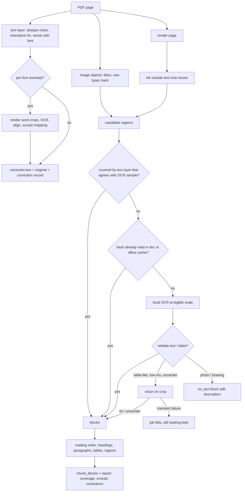
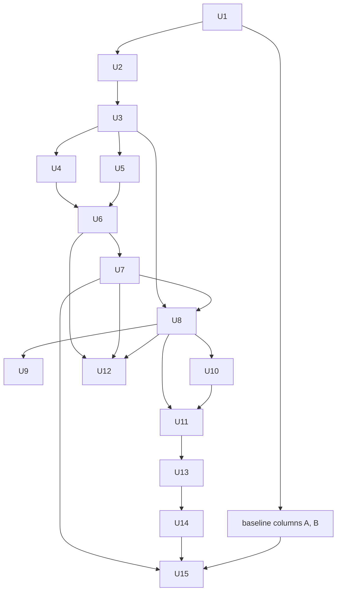

# Reliable reading of mixed PDFs and garbled Hebrew, independent reading and calculation tools, per-purpose cheap model - Plan

## Goal Capsule

- **Objective:** An appraiser can ask the Hebrew chat assistant factual, explanatory, comparative, overview, calculation, and scenario questions about the reports they may see. They get an answer:
  - built from what the documents actually say, including tables embedded as pictures and text in fonts with a broken character map;
  - with sources they can open;
  - with an exact statement of what could not be found or read.
  Each answer costs substantially less in model spend than before, and the cost can be shown per answer.
- **Means:**
  - PDF ingestion that finds and reads content the text layer does not cover, and repairs broken font maps with verified evidence (KTD3–KTD6);
  - safe reprocessing (KTD7);
  - reading tools that open any part of a document without a prior search hit (KTD8, KTD9);
  - a general calculator over server-verified values (KTD10);
  - verification of support and of request coverage (KTD11);
  - per-purpose model configuration defaulting to `gpt-6-luna`, with measured cost accounting and prompt-cache-aware context handling (KTD1, KTD2, KTD12);
  - an evaluation that separates ingestion, retrieval, meaning, calculation, and completeness, and separates the model effect from the code effect (KTD13).
- **Authority hierarchy:**
  1. the user's request in this session;
  2. this plan's Product Contract;
  3. the KTDs;
  4. each unit's Approach.
- **Stop conditions:** stop and report instead of proceeding when any of these holds:
  - a change would put real report content, addresses, page images, eval questions, or private results into git or the PR;
  - reprocessing would delete or overwrite a good reading without a verified backup;
  - a model call would need a parameter `gpt-6-luna` does not support, or a fallback to a more expensive model;
  - verification would have to be weakened to pass;
  - a merge, force-push, data deletion, or production deploy would be required.
- **Execution profile:** Deep. Ingestion and the chat engine change together, and there are migrations and a data reprocess. Land the work in the unit order below as separate commits on `feat/general-question-engine`.
- **Who finishes:** the executing agent implements, tests, reprocesses locally, evaluates against the real model, and updates PR AriGabay/rag#2. Merging and deployment stay with the user.

---

## Product Contract

### Summary

Rebuild how PDFs are read so that every meaningful region of a page is either read, by text layer, OCR or a focused visual reading, or reported as unread. Repair Hebrew from broken font maps only on verified evidence, keeping the original. Give the model general tools to open pages, sections, tables, and regions, and to compute on values the server verified from the source. Run every model purpose on `gpt-6-luna` with explicit reasoning effort, record cost per purpose and model, and keep per-turn context small and cache-friendly.

### Problem Frame

At `875b392`, three general failures were reproduced on the local stack against the real model. The results are 0/2 ingestion checks, 0/2 retrieval checks, and 0/3 answers; private evidence is in `real_documents/eval/round5-analysis.md`.

**A table embedded as a picture.** The table sits on a PDF page whose text layer is valid. The page was accepted at quality 1.0, the numbers never reached any searchable passage, and the document was reported as fully read. A second table on the next page is a low-resolution picture from which local OCR recovers almost nothing. That case shows that few OCR words is not evidence of no information.

**Hebrew from a broken font map.** In another PDF, one Hebrew letter never appears: two fonts map it to `ð`. The quality score still passes every page, and searches for ordinary words fail.

**What the conversation layer could not do.** It could not recover from either failure. There is no tool to open a page or a table without a prior search hit. The calculator only works on pre-extracted measurements, cannot multiply by a user's constant or chain results, and rounds early. A clipped read can still support an "it is not in the section" claim.

**Cost.** Each turn makes 7–12 calls, with up to about 40K input tokens per agent step, on a model that is no longer the cheapest adequate option.

### Requirements

**Ingestion and reading status**
- R1. A PDF page whose text layer passes is still checked for meaningful content the text layer does not cover. This covers raster pictures, scanned regions, and vector content that carries text. Such content is read or reported as unread.
- R2. A region is never dropped only because it is small relative to the page. A repeated picture (logo, signature, watermark) is read at most once per document and office, not once per page.
- R3. Regions are read at a resolution where table cells and numbers stay legible. Local OCR comes first. A focused visual reading is used when OCR is weak, uncertain, or the region is table-like. A low OCR word count never alone classifies a region as having no text.
- R4. Every meaningful block keeps the following, and tables also keep headers, row headers, cells, notes, and units:
  - its document and processing version;
  - its PDF page, and its region when known;
  - its content kind and extraction method;
  - its reading order;
  - its reading status and limits;
  - a link to the original.
- R5. Reading order follows the document: headings with sub-sections, paragraphs, tables with their notes, and pictures in their context. PDF citations name pages. DOCX citations name section, paragraph, or table, and never an invented page.
- R6. Ingestion quality measures coverage and content validity, not only a valid heading. A document with meaningful unread regions is marked as partly read. The model and the documents screen both see which pages and regions are affected and why.
- R7. Encoding, font-map, and language corruption inside text that looks valid is detected. Corrected text is produced only from verified evidence (the glyph's own rendering, OCR, or visual reading), and never by blanket character replacement across documents or languages. Numbers, symbols, units, and addresses are never changed.
- R8. The original text, the corrected text used for search and reading, and a record of each correction are kept. Unverifiable corruption leaves the text marked uncertain, and the document partly read.

**Reading tools**
- R9. The model can open a page or page range by document and page, a section or sub-section by a stable handle, a table with all its headers and notes, and the next part of anything it opened via a continuation. It can also get an outline whose entries can actually be opened. None of this needs a prior search hit.
- R10. The model can request a visual reading of a page or region when text extraction is missing or uncertain.
- R11. Every reading result states:
  - a citable source and its location;
  - the document version;
  - the reading status;
  - whether it was clipped;
  - whether more remains, and how to read it.
- R12. A section is never presented as fully read when only part was returned. An absence conclusion ("the section does not state X") requires a complete read of that section with no unread region inside it.
- R13. Permissions are checked on the server at every access: reads, continuations, visual readings, cached results, sources carried from earlier turns, values, and calculations. The model never supplies SQL, storage keys, or file paths.

**Calculation**
- R14. The model can propose a value from a source it read in this turn. The server records the value only after verifying that the number belongs to the row, column, or quoted description the model chose. A number appearing somewhere in the quote is not enough. The recorded value carries:
  - value and unit;
  - metric meaning;
  - subject (property, stage, period, or data set);
  - VAT and area basis when known;
  - role (income, cost, total, comparison, …);
  - source, quote, and row/column;
  - certainty.
- R15. Calculations support addition, subtraction, multiplication, division, percentages, aggregates, and intermediate results as inputs to later calculations. They run through a restricted, validated expression language, never through code evaluation.
- R16. A constant the user gave for a scenario (for example a 5% increase) is recorded as a user assumption, quoted from the user's message, and shown separately from document data.
- R17. Compatibility depends on the operation:
  - income minus cost in the same unit and scope is valid;
  - monthly rent cannot combine with capital value;
  - a sum cannot include both a total and its own components;
  - mixing units or area bases requires a stated justification, or a clarification.
- R18. Computation keeps full precision internally and rounds only for display. A result states its formula, inputs, assumptions, and sources, and whether it reproduces a value written in the report or is a scenario computed on request.

**Answers and verification**
- R19. Each answer is verified on two planes: whether every claim is supported by sources and calculations, and whether the answer covers what the user asked. A multi-part question gets an answer per part or a clear statement of what is missing.
- R20. The existing meaning distinctions are kept:
  - rent per m² per month, value per built m², total value;
  - area basis, period, VAT, value role;
  - exact, approximate, bound, or range.
  A number is never attributed to another metric because its quote contains it.
- R21. A limitation names exactly one of these:
  - not found in the search performed;
  - the source was read only in part;
  - the relevant sources were read and do not show the datum;
  - the sources conflict.
- R22. Answers read naturally. Verification never leaves sentence fragments, duplicated absence sentences, or a wrong-metric notice, and never splits a numbered heading. Sources and verification details appear in the sources panel, not as diagnostic lists in the answer.
- R23. Unverified factual text is never shown as the final answer. Progress may be shown while the answer is verified.

**Search and conversation**
- R24. Search reaches corrected text, abbreviations, table titles, and varied phrasings. A matched table row lets the model open the full table. A diversity cap on rows never hides the steps an answer needs.
- R25. A general question on a new topic searches every authorized document, not only the previous one. A true follow-up keeps its context, and a metric correction keeps only the unchanged conditions. These are the round-4 behaviors and must not regress.
- R26. No routing by specific examples, addresses, or single topic words. Professional appraisal terms, schemas, and unit rules may appear in code. No test forbids a professional term's mere presence.

**Model, cost, and limits**
- R27. Every model purpose runs on a model chosen in configuration, with an explicit reasoning effort per purpose. The purposes are: conversation, follow-up resolution, measurement extraction, visual reading, verification, and summary. `gpt-6-luna` is the default for all of them. No unsupported parameter is sent, and there is no automatic fallback to a more expensive model. `gpt-5.4-mini` remains an explicit option for comparison only.
- R28. Usage is recorded per call, by purpose and model, including on failed, cancelled, and limit-ended turns. It covers calls, input, cached input, cache-write and output tokens, time, and estimated cost at the verified price. It is kept in internal diagnostics with no keys or document content.
- R29. Extraction, OCR, embeddings, and visual readings are stored and reused. The same content is not reprocessed per question. Cache keys include office, document version, reader version, and model configuration. Permissions are rechecked before any cached reading is served.
- R30. Limits on steps, tool output, visual readings, retries, and time are configurable. Hitting one produces a visible limitation, never an answer that looks complete. Cost limits never justify hiding sources or claiming information is missing.

**Reprocessing**
- R31. The local documents and their dependent indexes and measurements are reprocessed. The following hold:
  - a backup is taken first;
  - review decisions and approvals are preserved;
  - a failed or worse reading never replaces a good one;
  - the swap is consistent and checkable;
  - stale caches are invalidated;
  - every service runs the same build before evaluation.

**Evaluation**
- R32. The evaluation reports ingestion, locating and reading sources, meaning, calculation, and answer/conversation completeness separately, and checks the following:
  - ingested numbers against their heading, row, column, unit, and location;
  - retrieval against every required source.
- R33. The model's effect and the code's effect are measured separately, on a small comparison sample defined before any run.
- R34. A new held-out set is written and frozen before running, then run once on the final build. Real-document questions, references, and results stay out of git, and the PR reports aggregates only.

### Key Decisions

- **The three reported cases are regression tests for general failures, never answers to encode.** They stay in the private set and never enter prompts or production logic. Governs R26, R32. (session-settled: user-directed — chosen over fixing the three questions: the goal is general reading ability)
- **The cheap model is the default for every purpose, with quality checked separately.** Governs R27, R33. (session-settled: user-directed — chosen over keeping gpt-5.4-mini as default or routing by complexity: cost, with attribution measured apart)
- **Unread content is reported, never hidden.** A partly read document is visible as such to the model and on the documents screen. Governs R6, R12, R21. (session-settled: user-directed — chosen over accepting a page because its text layer passes: the reproduced page-54 failure)
- **Verified correction only.** Governs R7, R8. (session-settled: user-directed — chosen over a blind `ð`→`נ` replacement: correctness across documents and languages)

### Acceptance Examples

- AE1. Covers R1, R3, R6.
  - **Given:** a synthetic PDF page with a heading and a valid text paragraph, a raster table of numbers below it, and the same logo on every page.
  - **When:** the document is ingested in an office with cloud reading allowed.
  - **Then:** the table's cells are blocks on that page in reading order, read by OCR or vision, and the logo is read at most once. If vision is unavailable, the table region is `unread` and the document is partly read, with that page named.
- AE2. Covers R7, R8.
  - **Given:** a synthetic PDF whose font maps one Hebrew letter to a Latin-1 letter.
  - **When:** it is ingested.
  - **Then:** search for a word containing that letter finds the passage, the original text is kept beside the corrected one with a correction record, and every number on the page is byte-identical.
- AE3. Covers R9, R11, R12.
  - **Given:** a section longer than one read.
  - **When:** the model opens it and claims a datum is absent after the first part.
  - **Then:** the absence becomes "the source was read only in part". After it continues to the end with no unread region, "read and not shown" is allowed.
- AE4. Covers R14–R18.
  - **Given:** a table with income and cost totals and a user's "costs rise 5%".
  - **When:** the model takes both values, records the 5% as a user assumption, and computes the new profit and the ratio.
  - **Then:** the server verifies each value's cell, accepts income − cost, keeps full precision through the ratio, and labels the result a scenario on totals.
- AE5. Covers R17.
  - **When:** the model sums a total row with its component rows, or adds monthly rent to a capital value.
  - **Then:** the calculator refuses with the reason.
- AE6. Covers R25, R26.
  - **Given:** a focused question about one report.
  - **When:** the user asks a general professional question that report does not cover.
  - **Then:** the search spans every authorized document and finds the relevant one.
- AE7. Covers R13.
  - **Given:** a user whose access to a document is revoked between two tool calls.
  - **Then:** every later read, continuation, cached visual reading, value, or calculation from that document fails without revealing content, and the answer cannot cite it.
- AE8. Covers R30.
  - **When:** the step or tool-output budget runs out before the model finishes reading.
  - **Then:** the answer is verified, marked partial, and names the limitation. No unverified text is shown.

### Scope Boundaries

- No new embedding model, retrieval framework, or hosted search. Search is measured on corrected content first (R24).
- No chat answer cache this round. Answers are recomputed per turn. The legacy answer cache keeps its existing permission rechecks and is invalidated by reprocessing.
- No budget dashboard, billing system, or cost target. Usage is visible in diagnostics and the eval report.
- No Ollama or local LLM path.

#### Deferred to Follow-Up Work

- Writing chat-time visual readings back into the document's ingestion. A chat-time `inspect` result is cached and reported, not merged into blocks.
- User editing or approval of a recorded assumption in the UI.
- Re-linking reviewed measurements whose anchor was lost after reprocessing. They are flagged, not re-linked automatically.
- Asking for clarification when the previous assistant answer is hidden by a permission change. Today a follow-up resolves against the last visible answer.
- A per-document reprocess state on the documents screen. Job state stays on the admin jobs view.

---

## Planning Contract

### Key Technical Decisions

- KTD1. **Per-purpose model settings with a capability table.**
  - Each `Purpose` (agent, resolve, verify, measure, vision, summary) gets a model and effort setting in `backend/app/config.py`. Defaults:
    - `gpt-6-luna` for every purpose;
    - effort `low` for agent, verify, vision, and measure;
    - effort `none` for resolve and summary.
  - These starting values are re-checked against the comparison sample (U15).
  - A small per-model capability table drives which parameters are sent: allowed efforts, prompt-cache options, image detail values. `minimal` is never sent to `gpt-6-luna`, and neither is `temperature`.
  - Providers are cached per (model, effort), so purposes that share a model share a client.
  - `resolve` and `summary` get real `Purpose` values with timeout settings, instead of riding on `Purpose.AGENT`.
  - What happens when a purpose's model fails:
    - vision at ingestion and verify fail closed: the job is retried, or the turn fails;
    - resolve degrades to no resolution, with a diagnostics flag;
    - summary keeps the previous summary;
    - measure fails its job.
  - (session-settled: user-directed — chosen over one global model or a complexity router: cost with explicit, checkable effort per task) Governs R27.
- KTD2. **Prompt caching per purpose, priced in three buckets.**
  - On `gpt-6-luna` a cache write costs 1.25× uncached input (framework-docs research).
  - One-shot purposes (vision, measure, verify, summary) send `prompt_cache_options` in explicit mode with no breakpoints, so they pay no write surcharge.
  - The agent loop keeps implicit caching, with a stable `prompt_cache_key` per office (hashed) and an append-only item list within a turn.
  - Usage records `cached_tokens` and `cache_write_tokens`. Cost is `uncached×in + write×write_price + cached×cached_price + output×out`, from a price table in configuration. An unknown price shows as unknown, not zero.
  - Governs R28, R29.
- KTD3. **PDF produces real blocks through the DOCX block model.**
  - `extract_pdf` returns `Block`s in reading order: headings including `N.M` sub-sections, paragraphs, tables with caption and notes, and image regions. Each block carries a page and a bbox.
  - Chunking goes through `chunk_blocks`, retiring `_blocks_of` and `chunk_document` for PDFs.
  - Doubled bold glyphs are removed with pdfplumber's char dedupe, PDF titles get the same orientation fix as body lines, and a heading split inside a word is rejoined before heading detection.
  - Migration 0011 adds block provenance:
    - region bbox;
    - extraction method;
    - reader version;
    - content hash;
    - original text when corrected;
    - an `uncertain` reading status reason.
  - It also extends the `pages.method` CHECK.
  - Governs R4, R5.
- KTD4. **Coverage is "ink not explained by the text layer".**
  - Each page yields candidate regions from two sources: image objects with their bbox, and rendered-page ink outside text-layer character boxes. The second source catches vector glyphs and charts.
  - A region whose text-layer characters agree with a local OCR sample counts as covered. This handles searchable scans with an invisible text layer.
  - Ruled lines and borders without text are ignored.
  - Each remaining region is classified by local OCR and image analysis:
    - text or table, read by OCR when reliable;
    - table-like, low effective resolution, or uncertain OCR, sent to a focused vision reading of the cropped region at legible scale;
    - photo or drawing, recorded `no_text` with a one-line description.
  - Vision outcomes are split by cause:
    - timeout, rate limit, or a network error fails the ingestion job for retry, and the old reading stays;
    - auth, quota, or an unavailable model fails the job as a configuration error;
    - refusal, invalid output, or truncated output gets one careful retry. If that also fails, the region is `unread` (or `read_uncertain` when OCR text exists), with the status as its reason.
  - A failing call therefore never silently produces an `unread` region, and a deterministic failure never blocks a document forever.
  - DOCX pictures keep today's OCR fallback.
  - Governs R1, R3, R6.
- KTD5. **Repeated content is read once, per office, by content hash.**
  - Image objects are hashed on their raw stream bytes, with the object id as a fast key.
  - Within a document, one reading applies to every occurrence. Across documents, an office-scoped table `image_readings` holds the result, keyed by (office, content hash, reader version, model config, crop scale). It has no `document_id`, is under FORCE RLS on `app_office()`, and is read only by ingestion under the system context of that office.
  - The vision prompt carries no page context, so the cache key stays content-only.
  - Only OK and uncertain readings are cached, never failures.
  - Repeated is not decorative: a repeated stamp with text is still read once.
  - The size thresholds in `images.py` stop classifying a region as decorative by size alone.
  - Governs R2, R29.
- KTD6. **Font-map repair by OCR-verified glyph alignment.**
  - **Detection, per font in a document:**
    - Latin-1 or other non-Hebrew letters appearing inside otherwise Hebrew words;
    - an expected high-frequency Hebrew letter that never appears;
    - character-level quality scored per font.
  - **Repair:**
    1. Render word crops that contain the suspect character, at OCR scale, using pdfium. It draws glyph outlines, so its output is independent of ToUnicode.
    2. OCR them with `heb+eng`.
    3. Align each OCR word with the extracted word of the same length.
    4. Accept a mapping `font × suspect char → Hebrew letter` only when enough samples agree.
  - The mapping applies to letters only, within that document and font. Digits, punctuation, Latin words, and numbers are untouched.
  - Without an accepted mapping, the affected blocks are `read_uncertain`, the document is partly read, and the reason is recorded.
  - Corrected text is the text of record for every machine consumer: lexical search, embeddings, measurement extraction, agent reads, and verification quotes. `original_text` is kept for display and audit only, so a quote the model copies always matches the text the verifier checks.
  - No fontTools dependency: the render-and-OCR route uses installed libraries.
  - (session-settled: user-directed — chosen over a blind replacement: correctness across documents) Governs R7, R8.
- KTD7. **Reprocessing swaps atomically, with a no-regression gate and a reading id.**
  - Extraction and embedding both run before the write transaction. The swap transaction then:
    - deletes and inserts every derived table, with embeddings already computed;
    - stamps a new `reading_id` in `document_versions.ingestion`;
    - invalidates the legacy answer cache;
    - bumps the data version.
  - Before the swap, a gate compares the new reading with the current one, per page, on measures both readers produce:
    - the number tokens present in the old page text;
    - pages with `ok=false`;
    - the table count.
  - Newly reported unread or uncertain regions never count as worse, because the old reader could not detect them.
  - Any regression on those measures, transient or not, keeps the old reading and fails the job with the regression recorded (R31). Accepting it requires an explicit admin re-run flag.
  - Answer sources and P# references carry the `reading_id`. A reference to an older reading returns `stale` instead of opening renumbered blocks.
  - Measurements are re-extracted, and unreviewed ones are replaced.
  - Reviewed ones are re-anchored by value and normalized quote, after applying the version's accepted font-map corrections and char dedupe to the stored quote. Table measurements are matched by table caption, normalized header, and row label, not by table index.
  - If re-anchoring fails, they keep the decision but are marked `anchor_lost` and are not offered as cell-verified inputs.
  - A `pg_dump` backup and file-volume archive (`scripts/backup.sh`) precede the batch reprocess.
  - Rejected: a generation column on every derived table, which touches every query, and new document version rows per reprocess, which would show as user-visible versions.
  - Governs R31.
- KTD8. **One reader layer serves the source panel and the model.** A server function over `document_blocks`, `pages` and `extracted_tables` returns block windows with page, region, status, section path and table structure. The `/blocks` endpoint and the agent tools call it, so a citation click opens exactly what the agent read.
- KTD9. **Few tools, typed locators, turn-local handles.**
  - `open_source` becomes `read`. It takes one locator: `source` (S#/P#), `pages` (document, from, to), `section` (§#), `table` (T#, optional rows), or `cursor` (K#).
  - `outline(document)` returns openable section and table handles with sizes and unread-region counts.
  - `inspect(page | region)` is separate because it is the costly one: it is counted and capped per turn, and returns a text transcription, never an image, into the loop. Its results go to an RLS table `region_readings` with `document_id` under the `document_access` policy.
  - Handles are turn-local short ids (`D#`, `§#`, `T#`, `R#`, `K#`), mapped by the server.
  - Reads are deduplicated per block: a later read sends only blocks not yet returned, with a pointer to the earlier source. The verifier still sees full text.
  - Every result carries a header with these fields: `status` (`complete`, `clipped`, `has_unread_regions`, `uncertain_reading`), location, version, `reading_id`, and `more`.
  - The block-level dedupe replaces the text-equality `ws.once` key that collided between neighbors and section.
  - Governs R9–R13.
- KTD10. **Calculator: `take_value`, `assume`, `calculate`, replacing `compute`.**
  - **`take_value`** registers a V#:
    - a table cell is verified against `extracted_tables.structure` at the named row and column;
    - prose is verified by an exact quote in the source's stored text, with the number inside it, and qualifiers checked by `meaning.parse_source`;
    - unattested qualifiers are kept as `model_asserted` and lower the certainty.
  - **`assume`** registers an A#. Its value must be quoted from the current or an earlier user message visible to this turn, never from assistant or document text, and the A# records which turn it quotes.
  - **`calculate`** evaluates a whitelisted expression over M#/V#/A#/C# ids:
    - allowed: `+ − × ÷ %`, parentheses, named aggregates, and the structural literals 1, 100 and 12;
    - parsed with a node-whitelisted parser; no `eval`.
  - Compatibility is dimensional and per operation (R17). A justification string makes a mixed-basis result `conditional`.
  - Results hold an exact `Decimal` and their display forms. The verifier matches a displayed number to a result rounded to the shown precision.
  - Governs R14–R18.
- KTD11. **Verification gains a coverage plane and loses its mechanical slips.**
  - The judge is given the resolved request with its parts and checks each part is answered or explicitly missing.
  - Absence claims are classified into the four R21 kinds from the coverage ledger:
    - read-complete;
    - read-partial;
    - search-only;
    - conflicting values.
  - Sentence splitting treats `N.` and `N.M` headings as atomic.
  - Removal works on whole sentences.
  - Absence sentences are deduplicated by kind and label.
  - Request metric kinds include income, cost, profit, ratio, and rate, so a profit question is not judged as a value question.
  - `_finish` rechecks visibility of every cited and referenced document. On a loss, the turn fails with a "permissions changed" message instead of storing and hiding.
  - Governs R12, R19–R23.
- KTD12. **Cost in the agent loop comes from small results, not rewriting history.**
  - Per-result size defaults: a section page of about 3–4K characters, table pages of about 40 rows, each with `more`.
  - A per-turn tool-output budget and an `inspect` cap.
  - A verification reserve on time and steps.
  - Earlier tool outputs are never rewritten within a turn, because rewriting breaks the cached prefix.
  - Between turns, context stays the existing short summary plus recent turns.
  - The resolve call is skipped when there is no history or focus, as today.
  - Every limit maps to a visible outcome: the answer is `partial` with a named limitation and `limits_hit` in diagnostics, or the turn fails with a specific message when verification cannot run.
  - The forced final step keeps the same tool list and order, sets `tool_choice` to none, and appends an item telling the model it ran out, so the cached prefix survives.
  - Governs R30.
- KTD13. **Accounting first, then a 2×2 comparison.**
  - Usage accounting (U1) lands in its own commit. The baseline columns run from that commit.
  - The predefined comparison sample runs in four columns:
    - pre-change code and ingestion on `gpt-5.4-mini`;
    - the same on `gpt-6-luna`;
    - new code and reprocessed ingestion on `gpt-5.4-mini`;
    - new code and reprocessed ingestion on `gpt-6-luna`.
  - Each column runs twice.
  - The pre-reprocess database snapshot serves the old columns.
  - Each new-code column answers over an ingestion made with its own model. The comparison sample's documents are reprocessed a second time with every purpose on `gpt-5.4-mini`, into a separate snapshot that serves the new-code `gpt-5.4-mini` column. Its one-time spend is reported apart.
  - Ingestion and vision spend is one-time and reported apart from per-turn cost.
  - Governs R28, R33.

### High-Level Technical Design

PDF page reading, per page (directional):



Reprocessing swap (directional):

```mermaid
sequenceDiagram
  participant W as worker
  participant X as extractor
  participant E as embedder
  participant DB as database
  W->>X: extract new reading (outside tx)
  X-->>W: blocks, tables, chunks, report
  W->>E: embed new chunks (outside tx)
  W->>DB: read current report
  W->>W: no-regression gate
  alt worse and transient
    W-->>DB: job failed, old reading stays
  else accepted
    W->>DB: one tx: replace derived rows, new reading_id, bump data version
    W->>DB: enqueue measurements; re-anchor reviewed
  end
```

Chat tool surface (directional grammar for `calculate`):

```text
expr    := term (("+" | "-") term)*
term    := factor (("*" | "/") factor)*
factor  := id | literal | "(" expr ")" | func "(" id ("," id)* ")" | factor "%"
id      := ("M" | "V" | "A" | "C") digits
literal := "1" | "100" | "12"
func    := sum | mean | median | min | max | count
```

### Assumptions

- The starting reasoning efforts in KTD1 are adequate for `gpt-6-luna`. U15's comparison sample confirms or adjusts them, and any change is recorded with its evidence.
- Local OCR plus focused vision on crops is enough for the real PDFs in office A. The office mode allows cloud reading for office A; if it did not, those regions would stay `unread` and visible.
- One real-model probe confirms that a strict locator object with nullable fields gets exactly one locator filled at effort `low`. If it does not, `read` splits into `read_source` and `read_document`.
- Reprocessing all current documents in offices A, B, and C fits the local machine's time and spend. Vision is limited to regions not covered by the text layer.
- The test `backend/tests/unit/test_no_topic_vocabulary.py` is retired. The user directed that no test forbid professional terms.

### System-Wide Impact

- **Permission boundary.** Three new kinds of derived content can leak a document if a lookup skips RLS:
  - cached visual readings (`image_readings` office-scoped, `region_readings` per document);
  - PDF region images;
  - recorded values and calculations.

  Each document-scoped store is reached only after the owning document is resolved under `tenant_tx`, with `deleted_at` checked (R13). The office-scoped `image_readings` is the exception: it is content-addressed, so its key is a content hash, which identifies content more strictly than a document version. It is read only by ingestion under that office's system context, never from a user request.
- **Stale state after reprocessing.** Reprocessing bumps the office data version, so every earlier answer in that office shows as stale. That is expected, and the operations doc states it. P# references and stored sources are additionally bound to `reading_id` (KTD7).
- **Verifier coupling.** `verify._source_parts`, `_all_numbers`, and `meaning.Fetcher` read the `Workspace`. New source kinds (V#, A#, C#, inspect transcriptions, delta reads) must reach them with full text, or correct claims will be removed (U8, U10).
- **Measurement anchors.** Measurements keep positional block, table, and row indexes. Reprocessing re-anchors them (KTD7).
- **Agent and UI parity.** The agent's `read` and the source panel share one reader, so a citation opens what the agent read (KTD8).
- **Prompt cache.** Any change to the tool list, its order, the final schema, or the effort per purpose invalidates cached prefixes. They stay fixed per purpose (KTD2).

### Implementation Constraints

- The repo is public. Synthetic fixtures only. Real-document evaluation lives under the gitignored `real_documents/eval/`.
- Every new table uses ENABLE + FORCE RLS with `app_office()`, explicit grants to `rag_app`, a migration test, and a `tests/conftest.py` `_TABLES` entry.
- New columns on derived tables are added to `_insert_outputs`, `clone_outputs`, and `get_blocks` together.
- Tesseract stays `heb+eng`.
- The backend image is rebuilt via `docker compose build migrate`, then `docker compose up -d --force-recreate backend worker`. Run `scripts/check-model-egress.sh` before any real-model run or reprocess.

### Sequencing



---

## Implementation Units

| U-ID | Title | Key files | Depends on |
|---|---|---|---|
| U1 | Usage and cost accounting | `backend/app/providers/llm.py`, `backend/app/chat/api.py`, `backend/eval/chat_eval.py` | — |
| U2 | Per-purpose model configuration | `backend/app/config.py`, `backend/app/providers/llm.py`, `backend/app/providers/status.py` | U1 |
| U3 | PDF blocks in reading order | `backend/app/extraction/pdf.py`, `backend/app/extraction/chunking.py`, `backend/app/platform/pipeline.py` | U2 |
| U4 | Uncovered-region detection and reading | `backend/app/extraction/regions.py` (new), `backend/app/extraction/images.py`, `backend/app/extraction/vision.py` | U3 |
| U5 | Font-map corruption detection and verified repair | `backend/app/extraction/fontmap.py` (new), `backend/app/extraction/hebrew.py` | U3 |
| U6 | Reading report, documents screen, PDF region view | `backend/app/platform/documents.py`, `frontend/app/documents/page.tsx`, `frontend/components/chat/SourcePanel.tsx` | U4, U5 |
| U7 | Safe reprocessing | `backend/app/platform/pipeline.py`, `backend/app/measurements/extract.py`, `scripts/backup.sh` | U6 |
| U8 | Reader layer and reading tools | `backend/app/chat/reader.py` (new), `backend/app/chat/tools.py`, `backend/app/chat/coverage.py` | U3, U7 |
| U9 | Visual inspection tool | `backend/app/chat/tools.py`, `backend/app/extraction/vision.py` | U8 |
| U10 | Calculator over verified values | `backend/app/chat/calc.py` (new), `backend/app/chat/tools.py`, `backend/app/chat/verify.py` | U8 |
| U11 | Verification: coverage plane and mechanical fixes | `backend/app/chat/verify.py`, `backend/app/chat/coverage.py`, `backend/app/chat/api.py` | U8, U10 |
| U12 | Search on corrected content | `backend/app/platform/search.py`, `backend/app/chat/tools.py` | U6, U7, U8 |
| U13 | Agent loop budgets, limits and cache-friendly context | `backend/app/chat/engine.py`, `backend/app/chat/tools.py` | U11 |
| U14 | Layered evaluation harness and fixtures | `backend/eval/chat_eval.py`, `backend/eval/scoring.py` | U13 |
| U15 | Reprocess, evaluate, document | `docs/evaluation/conversational-rag.md` | U7, U14 |

### U1. Usage and cost accounting

- **Goal:** Every model call is recorded per purpose and model, with uncached, cached, cache-write, and output tokens, latency, status, and estimated cost. This includes calls on failed, cancelled, and limit-ended turns.
- **Requirements:** R28; KTD2, KTD13.
- **Dependencies:** none.
- **Files:**
  - `backend/app/providers/llm.py`
  - `backend/app/config.py` (price table)
  - `backend/app/chat/api.py`
  - `backend/app/chat/engine.py`
  - `backend/app/answering/content.py`
  - `backend/app/extraction/vision.py`
  - `backend/app/measurements/extract.py`
  - `backend/alembic/versions/0010_usage_cache_and_cost.py` (new)
  - `backend/eval/chat_eval.py`
  - `backend/tests/unit/test_providers.py`
  - `backend/tests/integration/test_usage_accounting.py` (new)
  - `backend/tests/integration/test_migration_0010.py` (new)
- **Approach:**
  1. `StructuredResult` and `AgentStep` carry `cache_write_tokens` and the model that served them. `usage_entry` includes both.
  2. Migration 0010 adds `cached_input_tokens`, `cache_write_tokens`, and `cost_usd` (nullable) to `provider_usage`.
  3. A price table in settings is keyed by model: input, cached input, cache write, output, and long-context multipliers. Cost is computed at log time. An unknown model gets null cost.
  4. `run_turn` keeps its usage list on the outcome and on raised `TurnCancelled` and `ProviderFailure`. `run_message` logs it on every exit path. `_U` stops dropping cached tokens.
  5. `chat_eval` reads per-call model and cost from the message usage, and reports cost per purpose and model and cache shares. The hard-coded rates are removed.
- **Patterns to follow:** the existing `usage_entry` and `log_usage`. Migration 0009 style for small `ALTER TABLE` changes.
- **Test scenarios:**
  - A scripted turn with agent, verify, and resolve calls stores one usage row per call, each with its purpose, model, tokens, and cost.
  - A turn that raises `ProviderFailure` after two calls still logs both calls.
  - A cancelled turn logs the calls made before cancellation.
  - A provider response with `cache_write_tokens` and `cached_tokens` prices each bucket separately. Cost equals the formula for `gpt-6-luna` prices.
  - A model absent from the price table yields a null cost, not 0.
  - The migration adds and drops the columns. Old rows keep null cost.
- **Verification:** diagnostics for a real message show per-call purpose, model, all token buckets, and cost. The eval report prints cost per purpose.

### U2. Per-purpose model configuration

- **Goal:** Each purpose resolves its model and effort from configuration, with `gpt-6-luna` as the default, and sends only parameters the model supports.
- **Requirements:** R27; KTD1, KTD2.
- **Dependencies:** U1.
- **Files:**
  - `backend/app/config.py`
  - `backend/app/providers/llm.py`
  - `backend/app/providers/status.py`
  - `backend/app/chat/resolve.py`
  - `backend/app/chat/verify.py`
  - `backend/app/chat/engine.py`
  - `backend/app/chat/api.py` (summary)
  - `backend/app/extraction/vision.py`
  - `backend/app/measurements/extract.py`
  - `.env.example`
  - `docker-compose.yml` (env passthrough only if needed)
  - `backend/tests/unit/test_settings.py`
  - `backend/tests/unit/test_providers.py`
  - `backend/tests/integration/test_admin_lifecycle.py`
  - `backend/tests/fixtures/scripted_plans/general_plans.json`
- **Approach:**
  1. Settings `model_<purpose>` and `effort_<purpose>`. The old `openai_model` stays as a single override applied to every purpose, for the comparison columns. Add `Purpose.RESOLVE` and `Purpose.SUMMARY` with timeout settings.
  2. A capability table for `gpt-6-luna` and `gpt-5.4-mini` lists allowed efforts, whether `prompt_cache_options` is accepted, and image detail values. Unknown models send no optional parameters.
  3. `get_provider(purpose)` returns a cached provider per (model, effort). Call sites pass their purpose instead of a raw effort.
  4. One-shot purposes send explicit-mode cache options with no breakpoints. The agent purpose sends a per-office hashed `prompt_cache_key`.
  5. The admin status screen lists the model and effort per purpose.
  6. A real probe script (not in pytest) checks one call per purpose against `gpt-6-luna`: Hebrew, tool call, strict output, image. It never prints the key.
- **Execution note:** run the real probe before switching the default, and record the per-purpose result in the PR.
- **Test scenarios:**
  - With no env overrides, every purpose resolves to `gpt-6-luna` with its configured effort.
  - Setting the single override to `gpt-5.4-mini` switches every purpose.
  - Setting `model_vision` alone switches only vision.
  - A request built for `gpt-6-luna` with effort `none` or `low` contains no `temperature` and no `minimal`.
  - A one-shot vision request carries explicit-mode cache options with no breakpoint. An agent step carries a `prompt_cache_key` that differs between two offices and contains no raw office id.
  - An unsupported effort in configuration fails at startup with a clear settings error. It is never sent.
  - Resolve and summary calls are logged with their own purpose, not `agent`.
- **Verification:** the real probe passes per purpose. Usage rows show `gpt-6-luna` for every purpose.

### U3. PDF blocks in reading order

- **Goal:** PDFs produce the same block model as DOCX, with pages, bboxes, `N.M` sub-sections, tables with captions and notes, and image-region placeholders, all in reading order and chunked by `chunk_blocks`.
- **Requirements:** R4, R5; KTD3, KTD8.
- **Dependencies:** U2.
- **Files:**
  - `backend/app/extraction/pdf.py`
  - `backend/app/extraction/hebrew.py`
  - `backend/app/extraction/chunking.py`
  - `backend/app/extraction/base.py`
  - `backend/app/extraction/tables.py`
  - `backend/app/platform/pipeline.py`
  - `backend/alembic/versions/0011_block_provenance.py` (new)
  - `backend/scripts/generate_fixtures.py`
  - `backend/tests/fixtures/` (new synthetic PDFs)
  - `backend/tests/unit/test_pdf_blocks.py` (new)
  - `backend/tests/integration/test_extraction_pipeline.py`
  - `backend/tests/integration/test_migration_0011.py` (new)
- **Approach:**
  1. `_text_layer` dedupes chars before line and table extraction. It keeps words with font names for U5, applies the orientation fix to titles, and rejoins a heading line split inside a word.
  2. Heading detection accepts `N.`, `N.M`, and `N.M.K` labels and builds a `section_path`.
  3. Tables found on the page become table blocks at their vertical position, with the text above as caption and following note lines as notes. Their cells are removed from paragraph text.
  4. Image regions become placeholder `image` blocks with bbox and hash. U4 fills them.
  5. `Block` gains `bbox`, `method`, `reader_version`, `content_hash`, and `original_text`. Migration 0011 adds the matching columns and extends the `pages.method` CHECK with `mixed`. `_insert_outputs`, `clone_outputs`, and `get_blocks` carry them.
  6. `INGESTION_VERSION` is bumped for PDFs.
- **Execution note:** build the synthetic fixtures first and assert block order and pages on them before changing `pdf.py`. The fixtures are: bold drawn twice, reversed title, a heading split mid-word, a table between two paragraphs, and a two-page table.
- **Patterns to follow:**
  - DOCX `_Walker` and `chunk_blocks`;
  - `RawTable` and `assemble_tables` for cross-page tables;
  - fixture generation in `backend/scripts/generate_fixtures.py`.
- **Test scenarios:**
  - A page with paragraph, table, and paragraph yields blocks in that order, each with page 1. Chunks follow the same order.
  - A `9.1` sub-heading under `9.` yields `section_path` [9, 9.1]. Text under it is cited as `9.1`, not `9.`.
  - Bold text drawn twice yields single letters.
  - A visually ordered title is stored in logical order.
  - A heading split into two lines inside a word is one heading.
  - A table continuing onto the next page is one table, with rows carrying their own pages.
  - DOCX extraction output is unchanged on the existing fixtures (characterization).
  - Clone and reindex copy the new columns.
- **Verification:** existing extraction ground truth passes. New PDF fixtures produce blocks with pages, and `ingestion.blocks` counts are non-empty for PDFs.

### U4. Uncovered-region detection and reading

- **Goal:** On every PDF page, content the text layer does not cover is found, deduplicated by content, read by OCR or focused vision, or recorded as unread with a reason.
- **Requirements:** R1, R2, R3, R6, R29; KTD4, KTD5.
- **Dependencies:** U3.
- **Files:**
  - `backend/app/extraction/regions.py` (new)
  - `backend/app/extraction/images.py`
  - `backend/app/extraction/vision.py`
  - `backend/app/extraction/ocr.py`
  - `backend/app/extraction/default.py`
  - `backend/app/extraction/pdf.py`
  - `backend/app/platform/pipeline.py`
  - `backend/alembic/versions/0012_image_readings.py` (new)
  - `backend/tests/conftest.py`
  - `backend/tests/unit/test_regions.py` (new)
  - `backend/tests/integration/test_pdf_regions.py` (new)
  - `backend/tests/integration/test_migration_0012.py` (new)
- **Approach:**
  1. `DefaultExtractor` passes the vision reader to `extract_pdf`.
  2. `regions.py` finds candidate regions:
     - image objects from pdfplumber with raw-bytes hash and effective DPI;
     - ink components from a rendered page with text-char boxes masked out, ignoring thin rules and borders.
  3. A region with text-layer chars inside that agree with OCR on a sample is covered.
  4. Uncovered regions go through `read_picture` with a cropped render at legible scale. Large sides are capped to the model's high-detail bound, and an explicit `detail` is always sent.
  5. `images.py` changes:
     - size-only `decorative` classification is removed in favor of content checks;
     - a large region with few OCR words, table-like structure, or low effective DPI goes to vision instead of `no_text`;
     - vision outcomes are classified per KTD4: transient causes raise a typed failure that fails the job, and deterministic ones leave the region `unread` or `read_uncertain` with the status as reason.
  6. Migration 0012 creates `image_readings`, an office-scoped FORCE RLS table without `document_id`.
  7. Within a document, the first reading of a hash applies to every occurrence.
- **Execution note:** start with fixtures that mirror the reproduced shapes:
  - a text page with a raster table;
  - a low-resolution raster table;
  - a logo and watermark on every page;
  - a searchable scan with an invisible text layer;
  - a ruled vector table with a text layer;
  - vector text without a text layer.
- **Test scenarios:**
  - Covers AE1. A text page with a raster table yields table blocks at that position, read by OCR or scripted vision. The page is not counted fully read until they are.
  - A logo repeated on 10 pages triggers one reading. All 10 occurrences are marked read from it.
  - A second document in the same office with the same logo hits `image_readings`. A document in another office does not.
  - A searchable scan whose invisible text agrees with OCR triggers no vision call and is not partial.
  - A ruled vector table with a text layer is not flagged as uncovered.
  - Vector text without a text layer is found as uncovered and read by OCR.
  - A low-resolution table where OCR finds 2 words goes to vision, not `no_text`.
  - A small stamp with text is read, not dropped as decorative.
  - A vision call returning a rate-limit status fails the job, and the previous reading is untouched.
  - A scripted vision returning invalid output twice leaves the region `unread` with that reason, and the job completes.
  - DOCX characterization: a failed vision call on a picture keeps today's OCR fallback.
  - An office without cloud reading leaves uncovered table regions `unread`, with reason, and the document partial.
  - Vision numbers that OCR did not see make the region `read_uncertain` (the existing cross-check).
- **Verification:** the fixtures meet the expected covered, unread, and partial results and vision call counts. Re-ingesting a document makes no new vision calls for already-read hashes.

### U5. Font-map corruption detection and verified repair

- **Goal:** Hebrew text from broken font maps is detected and corrected only on verified evidence, with original text and a correction record kept.
- **Requirements:** R7, R8; KTD6.
- **Dependencies:** U3.
- **Files:**
  - `backend/app/extraction/fontmap.py` (new)
  - `backend/app/extraction/hebrew.py`
  - `backend/app/extraction/pdf.py`
  - `backend/scripts/generate_fixtures.py` (broken-ToUnicode fixture via `pypdf`)
  - `backend/tests/unit/test_fontmap.py` (new)
  - `backend/tests/integration/test_extraction_pipeline.py`
- **Approach:**
  1. Per document, group extracted chars by font. Flag a font when non-Hebrew letters sit inside Hebrew words, or when a frequent Hebrew letter never occurs while the font emits Hebrew.
  2. For flagged (font, char) pairs, render word crops containing them with pypdfium2 and OCR them with `heb+eng`. Align each OCR word with the extracted word of the same length. Accept a mapping when it has at least a configured number of agreeing samples and a high agreement share.
  3. Apply accepted mappings to letters of that font only. Store `original_text` on blocks whose text changed, and a correction list (font, from, to, samples, agreement) in the ingestion report.
  4. `quality_score` adds a per-font corruption signal, so an unrepaired corruption lowers page quality and marks blocks `read_uncertain`.
- **Execution note:** test-first on a synthetic fixture whose ToUnicode maps one Hebrew letter to `ð`, and another that maps it inconsistently, which must not be repaired.
- **Test scenarios:**
  - Covers AE2. A one-letter broken map is repaired, and searching for a word containing that letter finds the passage. Every digit, `%`, `₪`, `/`, and Latin word on the page is byte-identical before and after.
  - An English document containing `ð` legitimately, outside Hebrew words, is not changed.
  - Inconsistent OCR evidence (agreement below threshold) produces no mapping, and the blocks are `read_uncertain` with the reason.
  - A mapping found in one font is not applied to another font in the same document.
  - The correction record lists the font, characters, sample count, and agreement.
- **Verification:** the reproduced PDF is repaired locally (private check), and its pages no longer contain `ð` in Hebrew words.

### U6. Reading report, documents screen, PDF region view

- **Goal:** The ingestion report states coverage per page and region, corrections, and partial status. The documents screen and the model see it, and a PDF page or region can be opened as an image under permission checks.
- **Requirements:** R4, R6, R8, R11, R13; KTD8.
- **Dependencies:** U4, U5.
- **Files:**
  - `backend/app/extraction/base.py` (`components`)
  - `backend/app/platform/pipeline.py`
  - `backend/app/platform/documents.py`
  - `backend/app/chat/tools.py` (`list_documents` reading status)
  - `frontend/lib/types.ts`
  - `frontend/app/documents/page.tsx`
  - `frontend/components/chat/SourcePanel.tsx`
  - `docs/api-contract.md`
  - `backend/tests/integration/test_documents_api.py`
  - `frontend/e2e/documents.spec.ts`
- **Approach:**
  1. `components` reports per-page coverage, unread and uncertain regions keyed by page and region (not only DOCX media), the number of corrections, and repeated images read once.
  2. The documents screen shows "read in part" with an expandable, keyboard-operable list: one row per page, its unread or uncertain regions with Hebrew reason labels, and "text corrected" with the correction count. This replaces the hover tooltip.
  3. A new endpoint renders a PDF page or a region crop for a visible version, with the same version-row check and `source_view` audit as `get_media`.
  4. `SourcePanel` shows region markers and opens the region image. It shows corrected text with the original available. The region view has these states:
     - loading: a placeholder;
     - a failed image or 404: "התמונה אינה זמינה", falling back to the block's extracted text, never content of a revoked document;
     - an unread region: its reason instead of an image.
- **Test scenarios:**
  - A partly read PDF lists the page and region with reason on `/documents`. A fully read one shows no partial badge.
  - The region endpoint returns an image for a permitted user, and 404 for a user outside the document's group and for a deleted document.
  - The source panel for a corrected block shows corrected text and an original-text toggle.
  - E2E: the documents page shows the partial badge for a synthetic partly read PDF.
- **Verification:** API contract updated. Browser check of the documents screen and source panel in office B.

### U7. Safe reprocessing

- **Goal:** Reprocessing replaces a reading only with one that is complete and not worse, atomically with its embeddings. Review decisions survive, and old references report `stale`.
- **Requirements:** R31; KTD7.
- **Dependencies:** U6.
- **Files:**
  - `backend/app/platform/pipeline.py`
  - `backend/app/platform/admin.py`
  - `backend/app/measurements/extract.py`
  - `backend/app/chat/api.py` (sources carry `reading_id`)
  - `backend/app/platform/documents.py` (`/blocks` stale marker)
  - `frontend/lib/api.ts`
  - `frontend/components/chat/SourcePanel.tsx` (stale state)
  - `scripts/backup.sh`
  - `docs/operations/reprocessing.md` (new)
  - `backend/tests/integration/test_reindex.py`
  - `backend/tests/integration/test_reprocess_gate.py` (new)
- **Approach:**
  1. `reindex_version` extracts and embeds outside the transaction, reads the current report, and runs the no-regression gate. Then one transaction replaces the derived rows with embeddings, sets a new `reading_id`, clears the legacy answer cache, and bumps the data version.
  2. A gate failure, transient or not, fails the job and leaves the reading in place, with the regression recorded on the job (KTD7). An explicit admin flag can accept a recorded regression on a re-run.
  3. Measurement re-extraction replaces unreviewed rows. Reviewed rows are re-anchored per KTD7, with corrections and dedupe applied to the stored quote and table rows matched by caption, header and row label. Unmatched rows are kept with `anchor_lost` and excluded from cell-verified use.
  4. U7 stamps `reading_id` and stores it on answer sources. U8 consumes it for P# references.
  5. The `/blocks` request from the source panel carries the source's `reading_id`. On a mismatch the endpoint returns a stale marker. The panel then shows the answer's stored cited text with a note that the document was reprocessed and the exact location is unavailable, and highlights no blocks.
  5. The operations doc gives the backup, reprocess, verify, and restore drill steps, with the `restore.sh` volume-wipe caveat.
- **Test scenarios:**
  - A reindex whose extraction raises leaves blocks, chunks, and embeddings identical.
  - A reindex whose vision calls fail transiently fails the job and keeps the old reading.
  - A successful reindex leaves no chunk without an embedding at any committed point.
  - A reviewed measurement is re-anchored when its value and quote reappear. It is kept with `anchor_lost` when they do not.
  - A page that loses a number token on reindex keeps the old reading, and the job fails with the regression recorded.
  - A reading that only adds unread-region reports swaps.
  - A reviewed measurement whose quote contains the broken letter re-anchors after the font-map repair.
  - Clicking a citation from before the reindex shows the stored cited text with the reprocessed note, and highlights no blocks.
  - The answers from before the reindex are marked stale through the data version, as today.
- **Verification:** reprocess a synthetic office end to end. After the drill, a restored backup logs in and serves the old reading.

### U8. Reader layer and reading tools

- **Goal:** The model can open pages, sections, tables, and continuations, and an openable outline, without a prior search hit. Every result states completeness and permission is checked on every access.
- **Requirements:** R9, R11, R12, R13; KTD8, KTD9.
- **Dependencies:** U3, U7 (`reading_id`).
- **Files:**
  - `backend/app/chat/reader.py` (new)
  - `backend/app/chat/tools.py`
  - `backend/app/chat/engine.py` (`_announce`, POLICY lines)
  - `backend/app/chat/coverage.py`
  - `backend/app/chat/meaning.py` (`Fetcher` uses the reader)
  - `backend/app/platform/documents.py` (`/blocks` uses the reader)
  - `backend/app/chat/api.py` (P# refs with `reading_id` and resume point)
  - `frontend/lib/chatTypes.ts`
  - `backend/tests/integration/test_chat_reading_tools.py` (new)
  - `backend/tests/integration/test_chat_coverage.py`
- **Approach:**
  1. `reader.py` resolves a document handle to the current version under `tenant_tx`, with `deleted_at` checked. It returns block windows by page range, section path, or table, plus a continuation position.
  2. `read` replaces `open_source` with the KTD9 locators. `outline` returns section and table handles with sizes and unread counts. Handles live in the `Workspace` and are bound to `reading_id`.
  3. Block-level dedupe: the `Workspace` tracks returned block ranges per version. A later read sends only new blocks plus a reference to the earlier S#. The `Source` keeps the full text for verification.
  4. `Source` gains `status`, `clipped`, `unread_regions`, and `more`.
  5. `touch` records `read_complete` or `read_partial`. `validate_requested` accepts `section_checked_absent` only on a complete read with no unread region.
- **Execution note:** probe the strict locator schema once against `gpt-6-luna` before fixing the tool shape (Assumptions).
- **Test scenarios:**
  - Covers AE3. Opening a long section returns a clipped result with `more`. An absence claim after it becomes "read only in part". After reading to the end it is accepted.
  - `read(pages)` on a PDF returns the blocks of those pages, with an unread-region marker at its reading-order position.
  - `outline` handles open the same blocks the `/blocks` endpoint returns for that window (parity).
  - Reading a section after its neighbors sends only the new blocks. The verifier receives the full section text.
  - `read` by a document handle the user cannot see returns "not available", with no title or size leak.
  - A cursor used after the document was revoked fails.
  - A P# from a previous turn opens when its reading is current, and returns `stale` after reprocessing.
- **Verification:** a scripted agent reads a section to completion without any search. Existing `open_source` tests pass through `read`.

### U9. Visual inspection tool

- **Goal:** The model can get a visual reading of a page or region when text is missing or uncertain, cached per region under document permissions and capped per turn.
- **Requirements:** R10, R11, R13, R29, R30; KTD9.
- **Dependencies:** U8.
- **Files:**
  - `backend/app/chat/tools.py`
  - `backend/app/chat/reader.py`
  - `backend/app/extraction/vision.py`
  - `backend/alembic/versions/0013_region_readings.py` (new)
  - `backend/tests/conftest.py`
  - `backend/tests/integration/test_chat_inspect.py` (new)
  - `backend/tests/integration/test_migration_0013.py` (new)
- **Approach:**
  1. `inspect(R# | page)` returns the stored ingestion reading when the region was read at ingestion.
  2. Otherwise it renders the crop and runs one vision call under purpose `vision`. It stores the transcription in `region_readings`, which has `document_id`, the `document_access` policy, and FORCE RLS, keyed by version, `reading_id`, region, reader version, and model config. It returns an S# with `uncertain_reading` status.
  3. Inspections are capped per turn by configuration. One `source_view` audit row is written per (turn, document).
- **Test scenarios:**
  - A region already read at ingestion returns its reading without a model call.
  - The first inspect of an unread region makes one vision call. A second inspect of the same region in a later turn makes none.
  - A user outside the document's group gets "not available" even when a cached reading exists.
  - The cap stops further inspections with a visible limitation in the tool result.
  - The office mode without cloud reading refuses with a reason.
- **Verification:** a scripted turn reads an unread table region through `inspect` and cites it.

### U10. Calculator over verified values

- **Goal:** The model can register values from sources it read, user assumptions, and chained calculations, with operation-dependent compatibility and full precision.
- **Requirements:** R14–R18; KTD10.
- **Dependencies:** U8.
- **Files:**
  - `backend/app/chat/calc.py` (new)
  - `backend/app/chat/tools.py`
  - `backend/app/chat/verify.py` (V#/A#/C# sources and number matching)
  - `backend/app/chat/meaning.py`
  - `backend/app/chat/engine.py` (POLICY lines)
  - `frontend/components/chat/Message.tsx` (calculations section)
  - `frontend/lib/chatTypes.ts`
  - `frontend/e2e/chat-ledger.spec.ts`
  - `backend/tests/unit/test_calc.py` (new)
  - `backend/tests/integration/test_chat_calculation.py` (new)
- **Approach:**
  1. `take_value` resolves its S# through the `Workspace`, then verifies the cell (table) or the exact quote (prose), and the qualifiers via `meaning.parse_source`. It records a V# with the R14 fields.
  2. `assume` checks the value occurs in the current or an earlier visible user message, and records an A# with that quote and its turn (KTD10).
  3. `calculate` parses the KTD10 grammar with a node-whitelisted parser, checks compatibility per operation, and computes exact `Decimal`. It records a C# with formula (ids and Hebrew labels), inputs, assumptions, sources, kind, full value, and display forms.
  4. `compute`'s aggregates fold into `calculate`.
  5. `verify` treats V#, A#, and C# as evidence. A displayed number matches a C# when it equals the full value rounded to the shown precision.
  6. The answer's calculations section shows each result's formula in Hebrew labels, its inputs linked to their sources, user assumptions in their own group with the quoted user text, a badge reading either "scenario on request" or "reproduces a value in the report", and a visible "conditional" note with its justification.
- **Execution note:** implement the parser and compatibility rules test-first in `test_calc.py`.
- **Test scenarios:**
  - Covers AE4. A table with income and cost totals and the user's "5%" gives V#1 income and V#2 cost from cells, and A#1 = 5% quoted. `calculate(V1 - V2*(1+A1%))` and the ratio on it keep full precision. The result is labelled a scenario.
  - Covers AE5. A sum of a total row and its component rows is refused. Monthly rent plus capital value is refused.
  - Income minus cost with the same unit and VAT is accepted.
  - A per-m² value times an area value yields a total with a derived unit.
  - Mixed area bases are refused without a justification, and accepted as `conditional` with one.
  - `take_value` on a number present in the quote but in another row of the table is refused.
  - `assume` with a value not in the user message is refused with an instruction to ask the user.
  - A C# used as input to another calculation works. Displaying 14.3% for a full ratio of 0.143155… verifies. Displaying 14.4% does not.
  - Expressions with names, attribute access, function calls outside the whitelist, or exponentiation are rejected.
  - A revoked document's V# cannot be used in `calculate`.
  - A 5% given in turn 1 and a ratio requested in turn 2 verify without asking the user again.
  - E2E: a scenario answer shows the assumption outside the document-data group, with the scenario badge.
- **Verification:** the scripted scenario turn verifies with no removed claims.

### U11. Verification: coverage plane and mechanical fixes

- **Goal:** Answers are checked for request coverage per part, absence kinds are exact, and the mechanical slips are gone.
- **Requirements:** R12, R19–R23; KTD11.
- **Dependencies:** U8, U10.
- **Files:**
  - `backend/app/chat/verify.py`
  - `backend/app/chat/coverage.py`
  - `backend/app/chat/resolve.py` (metric kinds)
  - `backend/app/chat/engine.py` (FinalAnswer parts)
  - `backend/app/chat/api.py` (`_finish` visibility recheck)
  - `backend/tests/integration/test_chat_verify.py`
  - `backend/tests/integration/test_chat_coverage.py`
  - `backend/tests/unit/test_verify_units.py`
- **Approach:**
  1. The final answer lists the request's parts. The judge prompt receives them and returns per-part coverage. A missing part becomes an explicit missing statement, not a silent omission.
  2. Absence kinds come from the coverage ledger states. `absence_sentence` dedupes by kind and label.
  3. `split_units` keeps `N.` and `N.M` headings atomic. `apply` removes whole sentences and never leaves fragments.
  4. Request metric kinds add income, cost, profit, ratio, and rate. `mismatch` compares kinds within the same family.
  5. `_finish` rechecks the visibility of every cited and referenced document, and fails the turn with a specific message on a loss.
- **Test scenarios:**
  - A two-part question answered for one part gets an explicit "not found" sentence for the other. The answer is partial.
  - A heading "9. השומה" followed by text is one unit and is never split.
  - Removing a claim in the middle of a sentence removes the whole sentence. No fragment remains.
  - Two absence claims for the same label produce one sentence.
  - A profit question answered with a profit figure produces no mismatch notice.
  - Covers AE7. A document revoked during the turn fails the message with "permissions changed". Nothing is stored as answered.
  - The existing meaning checks keep passing: rent per month, built value, VAT, and area basis.
- **Verification:** the existing verification and coverage suites pass alongside the new cases.

### U12. Search on corrected content

- **Goal:** Search finds corrected text, abbreviations, table titles, and the rows an answer needs. The professional-term ban is retired.
- **Requirements:** R24, R25, R26.
- **Dependencies:** U6, U7 (trial reprocess), U8 (table handles).
- **Files:**
  - `backend/app/platform/search.py`
  - `backend/app/extraction/abbreviations.py`
  - `backend/app/chat/tools.py` (search result table hints)
  - `backend/tests/unit/test_no_topic_vocabulary.py` (removed)
  - `backend/tests/integration/test_search.py`
- **Approach:**
  1. Measure first: reprocess, on a trial basis in office A, only the documents the private retrieval checks name, then run those checks before any ranking change. Change only what fails. The full reprocess stays in U15.
  2. Table chunks carry caption and title for PDFs (U3). The row-diversity cap keeps the table chunk and adds an "open table T#" hint when rows are capped.
  3. Corrected text feeds `normalized_text` and embeddings. The original is not indexed.
  4. Remove the vocabulary-ban test, and record the user's direction in the PR.
- **Test scenarios:**
  - A search for a word with the repaired letter hits the corrected passage.
  - A query matching three rows of one table returns the table chunk and a hint naming the table handle.
  - An abbreviation and its expansion retrieve the same passage.
  - Covers AE6. After a focused turn about one document, a general question searches all authorized documents.
- **Verification:** private retrieval checks pass on reprocessed content. Round-4 follow-up tests still pass.

### U13. Agent loop budgets, limits and cache-friendly context

- **Goal:** Per-turn spend drops through small results, an append-only loop, and budgets. Every limit produces a visible, verified outcome.
- **Requirements:** R28, R29, R30; KTD2, KTD12.
- **Dependencies:** U11.
- **Files:**
  - `backend/app/chat/engine.py`
  - `backend/app/chat/tools.py`
  - `backend/app/config.py`
  - `backend/app/chat/api.py`
  - `backend/tests/integration/test_chat_limits.py` (new)
  - `backend/tests/integration/test_chat.py`
- **Approach:**
  1. Configurable per-result sizes, a per-turn tool-output budget, an inspect cap, and a verification reserve on time and steps.
  2. When the budget runs out, tools return headers and `more` only. The engine records `limits_hit` and makes the answer partial with a named limitation.
  3. The forced final step keeps the same tools with `tool_choice` none and appends an item telling the model it ran out (KTD12).
  4. POLICY, tools, and the context message keep a stable order and content for prefix caching. Tool outputs are never rewritten within a turn.
  5. Limits that leave no time for verification fail the turn with a specific message.
- **Test scenarios:**
  - Covers AE8. A scripted model that keeps reading exhausts the budget. The answer is partial, names the limit, and is verified.
  - The step limit produces the same outcome.
  - A turn whose verification cannot run in the remaining time fails with the specific message and logs usage.
  - Two agent steps in one turn send identical prefix items, with step 2 only appending.
  - The tool list and order are identical across turns, including on the forced final step.
- **Verification:** on the comparison sample, input tokens per step and calls per turn are below the baseline, with cache shares recorded.

### U14. Layered evaluation harness and fixtures

- **Goal:** The eval reports ingestion, retrieval, meaning, calculation, and completeness separately, checks ingestion structurally, and prices by model.
- **Requirements:** R32, R33, R34; KTD13.
- **Dependencies:** U13.
- **Files:**
  - `backend/eval/chat_eval.py`
  - `backend/eval/scoring.py`
  - `backend/tests/unit/test_chat_eval_scoring.py`
  - `docs/evaluation/conversational-rag.md` (method only)
- **Approach:**
  1. Ingestion checks name a document, page, table title or heading, row label, column, and unit, and look the value up in the table structure from `/blocks`.
  2. Retrieval checks list every required source.
  3. Calculation checks compare a result number at a stated precision.
  4. Reports record build commit, image id, model per purpose, `ingestion_version` and `reading_id` per document used, and cost per purpose and model with cache buckets.
- **Test scenarios:**
  - A structural ingestion check passes when the value is in the named row and column, and fails when the same number is in another row.
  - A retrieval check with two required sources fails when only one is found.
  - A calculation check accepts 8.87% for 8.8719…% at two decimals, and rejects 8.9 at two decimals.
  - The cost table sums cache-write tokens at the write price.
- **Verification:** `--rescore` on stored round-5 baseline results runs without model calls.

### U15. Reprocess, evaluate, document

- **Goal:** All local documents are reprocessed safely, and the comparison sample, regressions, and new held-out set run on the final build. Aggregate results go into the PR.
- **Requirements:** R31–R34; KTD7, KTD13.
- **Dependencies:** U7, U14 and the baseline columns.
- **Files:**
  - `docs/evaluation/conversational-rag.md`
  - `docs/operations/reprocessing.md`
  - `docs/solutions/` (learnings, via ce-compound)
  - Private, not in git: `real_documents/eval/` sets and results
- **Approach:**
  1. Before code changes, on the U1 commit, run the predefined comparison sample on `gpt-5.4-mini` and `gpt-6-luna`, twice each. The sample is the private v9 regression set plus a fixed subset of prior regression conversations, listed in the private analysis before the run.
  2. Back up, then reprocess offices A, B, and C on the final build. Verify no job failed and every service runs the same image.
  3. Run the comparison sample on new code with `gpt-5.4-mini` (over the `gpt-5.4-mini` reprocess snapshot, KTD13) and with `gpt-6-luna`, twice each. The new-code `gpt-6-luna` column, which contains the v9 set, is the final-build regression result.
  4. Write and freeze the new held-out set, then run it once. Its references come from the original files, before anyone reads office C's new ingestion output.
  5. Review answers and sources manually in the professional sample. Classify each failure as professional error, phrasing, partial, or justified abstention.
  6. Publish aggregates only.
- **Test expectation:** none -- this unit runs and records evaluations; its correctness checks are U14's.
- **Verification:**
  - the eval reports exist privately;
  - the public doc has aggregates only;
  - the UI check (switching properties, a total request, opening a PDF region source, the partial badge) passes in office B.

---

## Verification Contract

| Gate | Command or check | Applies to |
|---|---|---|
| Backend tests | `cd backend && uv run pytest -q -p no:warnings` (DB tests against compose Postgres) | every unit |
| Lint | `cd backend && uv run ruff check .` | every unit |
| Frontend | `cd frontend && npm run typecheck && npm run lint` | U6, U8 |
| Browser | Playwright `frontend/e2e` against the seeded stack, then a manual UI check in office B | U6, U8, U11, U15 |
| Migrations | `test_migration_00NN.py` for 0010–0013; `alembic upgrade head` in the migrate service | U1, U3, U4, U9 |
| Real model probe | per-purpose probe script inside the backend container, key never printed | U2 |
| Egress | `scripts/check-model-egress.sh` before any real-model run or reprocess | U2, U7, U15 |
| Same build | backend, worker and frontend image ids recorded; app files hashed against the commit | U15 |
| Evaluation | `uv run python -m eval.chat_eval --set ../real_documents/eval/<set>.yaml --out ...` (private) | U15 |

Mock and scripted passes prove behavior and contracts only. Quality claims rest on the real-model evaluation in U15.

---

## Definition of Done

- Every unit's verification holds, and the full backend suite, ruff, frontend typecheck and lint, and Playwright pass.
- The reproduced PDF table, low-resolution table, and broken font map read correctly after reprocessing (private check), or are visibly reported as partly read with reasons.
- The three private regression cases and the comparison sample have before/after results, with model and code effects reported apart. The held-out set ran once on the final build.
- Usage diagnostics show model, purpose, tokens with cache buckets, and cost per call. The PR reports cost per turn, calls, and latency for the sample.
- No real content in git or the PR. The PR is updated, not merged, and nothing is deployed.
- Code from abandoned approaches is removed from the diff.

---

## Risks & Dependencies

| Risk | Mitigation |
|---|---|
| Vision rate limits during the batch reprocess | Transient failures fail the job and keep the old reading (KTD4, KTD7). Reprocess documents serially with retries. |
| Ink-difference detection flags borders or backgrounds as content | Thin-rule filtering and text-layer agreement. Fixtures for ruled tables and searchable scans (U4). |
| Font repair maps a letter wrongly | Acceptance thresholds, per-font scope, letters only, original kept, uncertain on weak evidence (KTD6). |
| `gpt-6-luna` at low effort reasons less well than `gpt-5.4-mini` | The 2×2 comparison isolates the effect. Efforts are configuration and are adjusted only with evidence (KTD1, KTD13). |
| Verifier strips correct computed numbers | V#/A#/C# evidence and display-precision matching in U10, with tests. |
| Stale references after reprocessing | `reading_id` on sources and P# returns `stale` (KTD7). |
| Prompt cache misses raise cost on one-shot calls | Explicit mode without breakpoints for one-shot purposes (KTD2). |
| Region reading inside the serial page loop exceeds the 900 s job deadline, which fails permanently | Read regions in a bounded worker pool like DOCX pictures, and size the deadline for the slowest real document during U4. |

---

## Sources & Research

- Private reproduction and reference checks: `real_documents/eval/round5-analysis.md`, `real_documents/eval/real_v9_regression.yaml` (gitignored).
- `gpt-6-luna` model page, prompt-caching, reasoning and images-vision guides on developers.openai.com. These cover price, efforts, `prompt_cache_options`, `cache_write_tokens`, and image `detail`.
- Installed libraries: openai 3.24.0, pdfplumber 0.11.10, pdfminer.six 20260107, pypdfium2 5.14.0, pytesseract 0.3.13.
- `docs/solutions/workflow-issues/real-model-before-after-eval-on-the-local-stack.md` (baseline worktree, two runs, held-out discipline).
- `docs/solutions/database-issues/force-rls-security-definer-lookups-need-bypassrls-owner.md` (new tables, backup and restore owners).
- `docs/solutions/logic-errors/hebrew-follow-up-entity-lookup-pitfalls.md` (tokenizer limits for lexical search).
- `docs/evaluation/extraction-experiment.md` (extractor choice rested on fpdf2-only fixtures; keep `heb+eng`).
- Code anchors:
  - `backend/app/extraction/default.py` (vision not passed to PDF);
  - `backend/app/extraction/pdf.py` `_process_page` (character-share acceptance);
  - `backend/app/extraction/base.py` `components` (empty for PDFs);
  - `backend/app/platform/pipeline.py` `_blocks_of`, `reindex_version`;
  - `backend/app/chat/tools.py` `_clip`, `_ref`, `tool_compute`, `ws.once`;
  - `backend/app/chat/coverage.py` `validate_requested`;
  - `backend/app/extraction/chunking.py` `_HEADING`;
  - `backend/app/providers/llm.py` `_provider`;
  - `backend/tests/unit/test_no_topic_vocabulary.py`.
