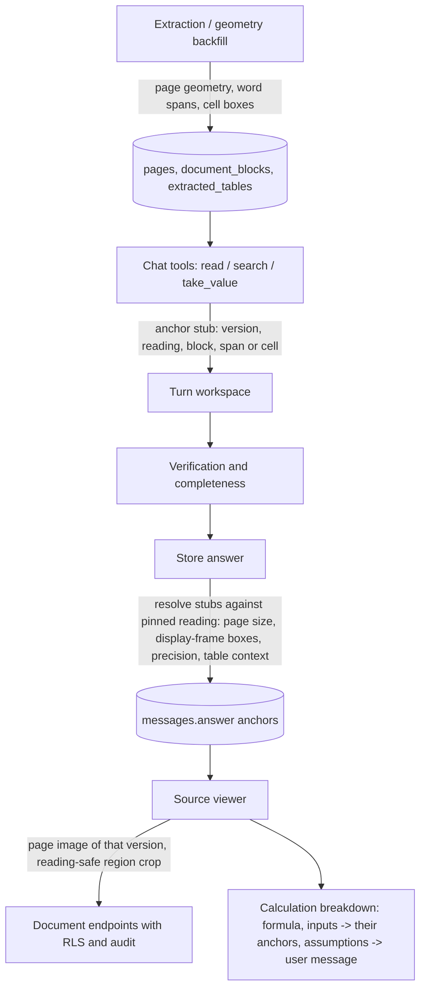
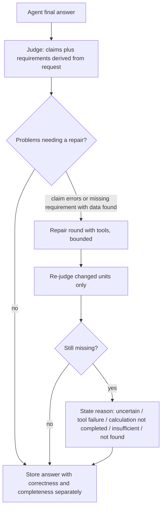
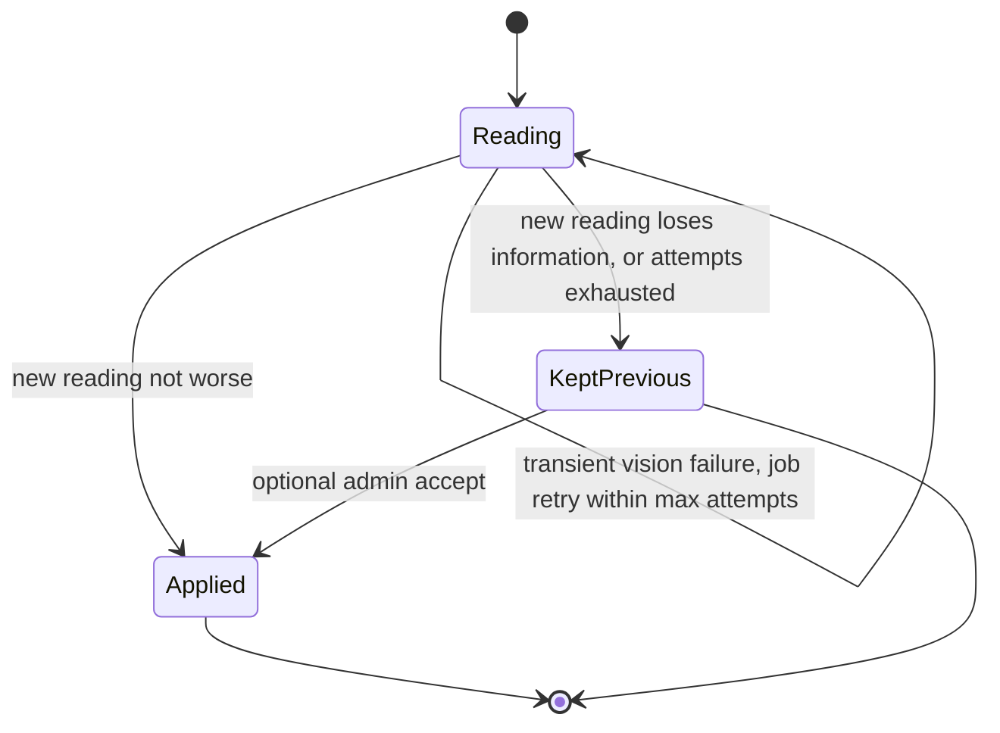

# Precise source references, computed results that verify, complete and correctly attributed answers, use without manual approval - Plan

## Goal Capsule

- **Objective:** An appraiser can upload reports, ask about them immediately, and check every answer. Clicking a citation shows the exact sentence, row or cell in the original document. Clicking a computed result shows its formula and the clickable sources of its inputs. Answers cover every part of the question, attribute each value to whoever stated it, and say precisely why a part is missing when it is.
- **Means:** anchors stored at extraction and snapshotted into answers (KTD1–KTD4); a source viewer over server-rendered original pages (KTD5); computed results verified as computations (KTD6); request requirements derived by the judge independently of the answer (KTD7); value stance recorded and judged (KTD8); reprocess regressions resolved without an admin (KTD9); cheaper repair rounds (KTD10); reading-cache keys that include OCR languages (KTD11); verified values cached per reading (KTD12).
- **Authority hierarchy:**
  1. the user's request in this session;
  2. this plan's Product Contract;
  3. the KTDs;
  4. each unit's Approach.
- **Stop conditions:** stop and report instead of proceeding when any of these holds:
  - real reports, addresses, page images, eval questions or private answers would enter git or the PR;
  - a change would delete a database, a document, a backup or a good reading;
  - verification, attribution or permission checks would have to be weakened to pass;
  - a model call would need an automatic fallback to a more expensive model;
  - a merge, force-push or production deploy would be required.
- **Execution profile:** Deep. One migration, an extraction reader-version bump with a non-destructive position backfill, chat engine and verification changes, and a new source viewer. Land the units in Sequencing order as separate commits on `feat/general-question-engine`.
- **Who finishes:** the executing agent implements, tests on the host (never pytest inside Docker), runs the planned real-model comparison, and updates PR AriGabay/rag#2. Merging and deployment stay with the user.

---

## Product Contract

### Summary

Store where every block, line, word and text-layer table cell sits on its page, and carry that anchor into each answer so a citation opens the original page at the right version with the exact place highlighted. Treat a computed result as a computation: verify its inputs, assumptions, formula and displayed number, never require it in the report, and let its citation open a calculation breakdown. Derive what the question requires independently of the answer, complete missing parts with tools when the data is already found, record who stated each value and whether it was adopted, and let readings and values be used without human approval.

### Problem Frame

Round 5 made mixed PDFs and garbled Hebrew readable and cut cost about tenfold, but the answers it produced still fail the appraiser at the moment of checking them.

**Sources are hard to check.** A citation opens a window of extracted blocks with the cited block range marked. A specific number in a table, or a sentence inside a paragraph, is not located; the original page is not shown (a page-image endpoint exists but nothing uses it); citations to calculations open nothing. After a reprocess, an old conversation's citation can no longer be opened, because blocks are replaced per version, and a region image of an old citation renders the new reading's block at the same index.

**Computed results are treated as document claims.** A result cited through its inputs rather than its computation, written with a scale word ("1.53 מיליון"), or phrased with VAT is removed as unsupported. Notes such as "not yet reviewed by a person" push the judge to "partially verified". The model sometimes declines to compute a difference whose inputs it already found.

**Answers are incomplete and the limits are mislabelled.** The parts the answer must cover come only from the parts the model declared about its own answer. A missing part never triggers a repair with tools. Any uncovered part is described as "not found in the search", even when its values were found. On the last real-model evaluation, all three regression questions were professionally correct but partial.

**Attribution is missing.** Nothing records who stated a value or whether a decision adopted it. In an arbitrator's decision, an answer took one party's figure as the decision's own.

**Approval and environment friction.** A reprocess that loses information is held and needs an admin to accept a new reading. CI has failed since `c17692b` on a test that assumes OCR is unavailable without pinning it.

### Requirements

**Environment and CI**
- R1. `test_a_pdf_is_stored_as_blocks_with_their_provenance` passes in CI and on the host, by pinning the condition it asserts and covering the OCR-available outcome separately.
- R2. Local verification runs against one consistent stack: shared file storage between backend and worker, and one active worker per queue; no database, document or backup is deleted to arrange it.

**Source anchors and the viewer**
- R3. Every citation carries an anchor built from stored data: document, version, reading id, page (PDF), block, and a word span or table cell when known, with boxes only when a reliable position exists, and a stated precision (span, cell, block, region, page, or structured for DOCX).
- R4. Positions are expressed in the frame of the rendered page, correctly handling page rotation, CropBox offsets and scale; a page whose positions cannot be converted reliably falls back to page-level precision, labelled.
- R5. One click on a citation opens the original page of that version, scrolled and centred on the highlighted place, with the extracted text available in a separate view.
- R6. A table citation shows the table title, the row name, the column header and the unit note next to the highlight; a cell is highlighted only with stored cell coordinates, otherwise the table or image region is highlighted and labelled as table-level.
- R7. The viewer is readable and expandable on desktop, full-screen with zoom and a clear way back on mobile, keyboard-operable, RTL, closes easily, and moves between the answer's citations.
- R8. The location shown is a readable title, page and section; the printed page number is shown beside the file page when it is detected and differs; technical ids and garbled file names are never the main location.
- R9. A DOCX citation opens a structured view of the section, paragraph or table cell with the cited place highlighted, and never shows an invented page number.
- R10. When a value's meaning comes from a column header, header row or nearby note, that context is anchored too and reachable from the citation.
- R11. An old conversation keeps its original anchor: it never moves silently to a newer reading or version; the original page is shown when it is still available and permitted, and otherwise the viewer says the location is unavailable and why.
- R12. Access is checked on every view of the original file, page image, region crop and old-conversation source; a render or storage failure is distinguished from lost access.
- R13. Existing documents gain positions gradually, from the stored file and the existing reading, without re-running visual reading over the corpus and without invalidating existing citations.

**Calculations**
- R14. An answer distinguishes document values, user assumptions and computed results, and says which numbers are written in the report and which were computed now on request.
- R15. A computed result is never required to appear in the document; it is verified by its inputs' grounding and subject, stage and scenario, by its assumptions against the request, by its formula including percentage base and denominator, by its units, and by the displayed number matching the calculator's result at the shown precision and scale.
- R16. A citation next to a computed result opens a breakdown: formula, steps, unrounded result and display rounding, each document input clickable to its anchor, each user assumption shown as quoted from the question, and chained computations navigable.
- R17. When a material assumption was not given, the answer asks for it or presents the calculation explicitly as a conditional scenario; when all inputs were found but the calculation failed, the answer says so as a calculation failure.

**Completeness**
- R18. What the question requires is derived from the question and the conversation context, independently of the parts the answer declares about itself.
- R19. Each requirement is judged full, partial, missing or undeterminable, and claim correctness is reported separately from answer completeness.
- R20. A missing or partial requirement whose data was already found is completed by a bounded repair round that may call the reading and calculation tools; what remains missing is stated with its reason.
- R21. A missing part's reason is one of: not found after an adequate search, found but uncertain, tool or provider failure, calculation not completed, or insufficient to conclude; "not found in the search" never appears when the needed values were found.
- R22. After removals or repairs the answer reads naturally, without broken sentences, duplicates or editing remnants.

**Attribution and meaning**
- R23. A value taken from a document records who stated it, whether it is a claim, proposal, estimate or the adopted conclusion, and the property, stage, date or scenario it belongs to, from the surrounding text.
- R24. A value presented as a decision's or appraiser's conclusion must be supported as adopted; a party's figure is attributed to that party, and an unclear stance is stated as such.

**Use without manual approval**
- R25. A value that passed the source and meaning checks is usable in answers and calculations without human approval; the status shown distinguishes automatically verified, verified or corrected by a person, uncertain, and unread, and nothing is marked human-approved that was not.
- R26. Earlier human decisions, including rejections, survive re-extraction and reprocessing.
- R27. A reprocess whose new reading loses information keeps the previous reading automatically, records and shows why, and retries transiently failed regions a bounded number of times without an admin; the document stays available throughout, and an admin may still choose to apply the held reading.
- R28. An unclear value gets a bounded focused re-read; a material uncertain value is never used in a calculation presented as certain; uncertainty in a region irrelevant to the question does not make the answer partial.

**Sources, extraction and cost**
- R29. A new question can be answered by finding sources, reading them, taking a verified value and computing with it in the same turn, without pre-extracted measurements; verified values taken this way are cached with their meaning, source and reading, and re-checked for access and staleness on reuse.
- R30. Reading caches are keyed by every setting that changes a reading, including the reader version and the OCR languages.
- R31. A simple question takes as few model calls as the structure allows; repair rounds re-judge only what changed and are not triggered by problems the server resolves itself; calls, tokens, cache use, cost and latency are recorded per turn.

**Evaluation**
- R32. The three original regression questions, and new synthetic tests for each failure class in this contract, pass in their automated layers; a new held-out set, written and frozen before its single run on the final build, is reported separately.
- R33. A real end-to-end test uploads synthetic documents with known positions, gets an answer, clicks the citation, and checks the version, page and highlighted place against an independently known position in the rendered view.

### Key Decisions

- **gpt-6-luna for every purpose, agent effort medium, no automatic costlier fallback.** (session-settled: user-directed — chosen over changing the default model or raising cost: cost and quality were measured last round.) Governs R31.
- **No example-specific logic; synthetic public tests; private material stays out of git.** (session-settled: user-directed — chosen over example-specific fixes: generality and privacy.) Governs R32, R33.
- **Manual review is never a precondition for use.** (session-settled: user-directed — chosen over review as a gate: the user wants to upload and ask immediately.) Governs R25, R26, R27, R28.
- **A computed result is verified as a computation, never as a document claim.** (session-settled: user-directed — chosen over requiring the result in the report: reproduced removals and refusals.) Governs R14, R15, R16, R17.
- **Completeness is judged against requirements derived from the question.** (session-settled: user-directed — chosen over trusting the model's self-declared parts: reproduced partial answers.) Governs R18, R19, R20, R21, R22.
- **Attribution records who stated a value and whether it was adopted.** (session-settled: user-directed — chosen over treating any number in a decision as the decision's: reproduced party-figure error.) Governs R23, R24.
- **Anchors come from stored data only.** (session-settled: user-directed — chosen over first-occurrence search or model-invented coordinates: a number can occur in several places.) Governs R3, R4, R6, R9, R11, R13.
- **Cache keys include the OCR languages.** (session-settled: user-directed — chosen over keys that ignore settings changing a reading: last round's open residual.) Governs R30.
- **The chat UI keeps its ChatGPT-like shape; details stay expandable.** (session-settled: user-directed — chosen over a diagnostics-first answer view: readability.) Governs R7, R19.

### Acceptance Examples

- AE1. **Covers R3, R6.** Given a text-layer table where the same number appears in a summary paragraph and in a table cell, when the answer cites the table cell value, then the viewer highlights that cell, not the paragraph occurrence.
- AE2. **Covers R4.** Given a page rotated 90° with an offset CropBox, when a sentence on it is cited, then the highlight box lies on that sentence in the rendered page image.
- AE3. **Covers R6.** Given a table read from an image by the vision model, when a value from it is cited, then the image region is highlighted and the viewer says the mark is at table level.
- AE4. **Covers R11.** Given a conversation answered before a reprocess, when its citation is opened after the reprocess, then the original page of the same version opens with the original highlight; if the version was replaced by an upload, the original page still opens; if access was revoked, the viewer says the source is unavailable.
- AE5. **Covers R15, R16.** Given income and costs found in a report and a user asking for profit with costs up 5%, when the answer shows the new profit and its rate, then both numbers are kept, their citation opens a breakdown with the formula, two clickable document inputs and one assumption quoted from the question.
- AE6. **Covers R20, R21.** Given a question with three parts whose data were all found, when the first answer omits the threshold comparison, then a repair round adds it; when the comparison still fails, the answer says it was not completed, not that it was not found.
- AE7. **Covers R24.** Given a decision quoting a respondent's figure and adopting a different one, when asked for the decision's figure, then the answer gives the adopted one and, if it mentions the respondent's, attributes it to the respondent.
- AE8. **Covers R27.** Given a reprocess whose new reading loses numbers on one page, when the job ends, then the previous reading stays current, the job is marked "kept previous" with the reason, no admin action is required, and the document answers questions as before.

### Scope Boundaries

- Character-exact highlights inside a word, and cell coordinates for OCR, vision or DOCX tables, are out of scope; those get block, region or structured precision as R3 and R6 define.
- A generated PDF rendering of DOCX files is out of scope; DOCX uses the structured view (R9).
- No new billing dashboard, budget target, or model change.
- No production deploy, merge, or force-push.

#### Deferred to Follow-Up Work

- Splitting `backend/app/chat/reader.py`, `tools.py` and `verify.py` into smaller modules (review 20261008-153734-494ab50c, findings #1–#3).
- Per-page adoption of a held reading (applying the improved pages of a worse reading).
- Word positions for scanned (OCR) pages; this round gives them region precision when a region box is stored and page precision otherwise (KTD2).

---

## Planning Contract

### Key Technical Decisions

- KTD1. **Anchors are born at tool time and snapshotted into the stored answer.** The read, search, table and take-value tools record each source's block, word span or table cell and pinned reading id as they produce it. When the answer is stored, each cited anchor is resolved against the turn's pinned reading into page geometry and boxes and stored inside the answer payload; a mismatch with the pinned reading degrades that anchor to page precision. Structured (DOCX) anchors also keep the cited paragraph or cell text and its section path, so a stale DOCX citation can still be shown. Snapshotting needs no migration of old rows and keeps old conversations' anchors after reprocess, because blocks are replaced per version (`pipeline.py` deletes and reinserts them). Rejected: versioning blocks and tables by reading id, which would change the primary key of `document_blocks` and every join on it. Governs R3, R11.
- KTD2. **Positions are stored at extraction in the display frame of the rendered page.** A `pages` geometry record keeps MediaBox, CropBox, rotation, display size and the printed page label (from `/PageLabels` or a detected page-number line). Blocks gain word spans (line, word, character range in the final logical block text, box) produced by the corrected second read on font-map pages. Text-layer tables keep pdfplumber cell boxes carried through the right-to-left column reversal and row filtering, so a stored body-row index matches `take_value`'s `row_number`. pdfplumber coordinates are already in display rotation, relative to the rotated MediaBox; one conversion function subtracts the CropBox offset computed from the raw `/MediaBox`, `/CropBox` and `/Rotate`. Stored `document_blocks.bbox` keeps its pdfplumber frame, and the anchor resolver converts block boxes with the same function at snapshot time. Pages it cannot convert keep block boxes only and degrade to page precision for highlights. OCR, vision and DOCX tables keep no cell boxes. Governs R3, R4, R6.
- KTD3. **Existing documents gain positions through a geometry-only pass that keeps their reading id.** A worker job reads the stored PDF's text layer (no OCR, no vision), aligns lines and words to the existing blocks by normalized text, and writes page geometry, spans and cell boxes in place; a block that does not align gets none. A `positions` marker in the version's ingestion record, set by new extraction and by this pass, selects the versions still to backfill; the PDF reader version is not bumped for these additive fields, so routine reprocess does not re-read the corpus. Font-map-repaired pages are re-read through the corrections already recorded in the ingestion report, with no OCR or vision call. It is enqueued lazily and is idempotent. A full reindex would mint a new reading id and turn every earlier citation stale at once. Governs R13.
- KTD4. **A quote anchor is located within the cited block range and never by first occurrence across the document.** When a quote occurs more than once in the cited range, `take_value` refuses only if the occurrences carry different numbers; if they carry the same number it accepts the value at block precision over the blocks containing it. Otherwise it records the block and word span. An S# citation highlights its block range; a V# or M# citation highlights its span or cell. Governs R3, R6.
- KTD5. **The viewer shows server-rendered page images with a client-side overlay.** It reuses `render_png` under the existing permission checks with `Cache-Control: private, no-store` (as the file route), adds two zoom scales whose `max_side` lets a full page reach the nominal scale, and draws the snapshot's display-frame boxes as fractions of the page size. Rendering on the server keeps file access behind the same checks and adds no client PDF library. Region and page routes accept the anchor's reading id. After the visibility check passes, a render or storage failure returns a typed error, so the viewer can fall back to the text view instead of treating it as revoked access. Governs R5, R7, R12.
- KTD6. **Computed claims are verified as computations.**
  - A unit whose number equals a turn computation's result at its precision and scale is bound to that C#, with a server citation attached like the existing `supported_by` path, unless the unit presents the number as stated by the report, a party or the decision; such framing of a computed number is unsupported.
  - `display_matches` accepts the Hebrew scale words (אלף, מיליון, מיליארד) and their abbreviations.
  - A computation carries the VAT basis its inputs share, and VAT phrasing is checked against it.
  - The judge prompt checks computed claims for inputs, scenario, assumptions, formula, base and units.

  Governs R14, R15, R17.
- KTD7. **Requirements are derived by the verification judge from the request, with no extra model call.** The judge already receives the resolved request. The first judge call of the turn's first verification derives the requirement list from the resolved request (the model's declared parts are hints only), and always runs, as a coverage-only call when no unit reaches the judge. The list is frozen in the turn workspace with stable ids and passed as the fixed requirement list to every later batch, split batch, missing-unit call and repair-round re-judge; each call scores the requirements full, partial, missing or undeterminable by unit index, and coverage is merged by requirement id across fresh and cached verdicts. The resolve call stays limited to follow-ups. A missing or partial requirement whose values or computations already exist in the turn workspace becomes a repair problem routed to a tool-capable repair round; the limitation reason is computed from the workspace (values found, computations failed, tools failed) rather than defaulted. Rejected: a separate requirements call on every turn, which adds latency to first turns. Governs R18, R19, R20, R21.
- KTD8. **Value stance is captured by `take_value` and checked against the source section.** A V# records `stated_by`, `stance` (adopted, claim, proposal, estimate, other or unknown) and the scenario, period or date. Each is marked as found in the cited text or asserted by the model, like the existing meaning fields. The judge sees the source's section path and stance. It rejects a value presented as adopted when its section or text presents it as a party's position, and treats an unknown stance as a stated uncertainty. Measurement extraction gains the same fields as optional. Governs R23, R24.
- KTD9. **A reprocess regression ends as "kept previous" without admin action.** The job finishes with that state, and the reason is stored and shown on the documents screen and in the admin jobs list. A transient vision failure during the reprocess uses the job's existing bounded attempts: regions already read come back from the `image_readings` cache, so only the failed regions call the model again; when the attempts run out the job ends as `kept_previous` with the reason, and the current reading stays. `accept_regression` stays as an optional admin override, and `kept_previous` jobs can be re-queued for it. Governs R27.
- KTD10. **Repair rounds re-judge only changed units and skip server-resolved problems.** Verdicts are cached within a turn by unit text, cited evidence ids and the unit's context (table header and preceding line). A missing qualifier the server annotates, and a needs-citation the server attaches, no longer set the report as failing. A judge "partial" on a computed claim triggers a repair only when it names a concrete input, scenario or formula problem. Governs R31, R22.
- KTD11. **OCR languages enter the reading-cache keys through the configuration component of the key.** The `model_config` string of `image_readings` and `region_readings` keys includes the OCR languages, so no primary key changes and a language change misses the cache naturally. Migration `0016` rewrites the configuration component of existing rows with `heb+eng`, the only languages ever configured, so existing readings stay reusable. Governs R30.
- KTD12. **Verified values taken in chat are cached per reading.** A new `verified_values` table, keyed by version, reading id and locator, stores the fields of a V# whose provenance is the source (value, unit, quote, locator, reading id, anchor, and meaning or stance fields found in the cited text); model-asserted fields are never cached and are re-derived by each `take_value`. `take_value` reuses a cached value whose reading is still current and whose document is visible; `find_measurements` lists cached chat values beside extracted measurements, each with its verification status. The table uses the per-document RLS pattern of `region_readings`. Governs R29.

### High-Level Technical Design

Anchor lifecycle from extraction to the viewer:

Anchor precision ladder (the viewer states which one applies):

| Precision | Source of position | Highlight |
|---|---|---|
| span | stored word boxes of a text-layer block | words of the cited quote |
| cell | stored pdfplumber cell box | one cell, plus row and column headers |
| block | stored block box | the block |
| region | picture or table-image region box | the region, labelled table-level |
| page | page known, no reliable box (page not convertible, OCR page without a region box, reading mismatch when the answer is stored) | none, page opened and labelled |
| structured | DOCX block, paragraph or normalized table cell | the paragraph or cell in the structured view |

An anchor whose reading was replaced after the answer was stored keeps its snapshot precision and rectangles; the viewer adds a stale note over the unchanged page image (PDF) or the snapshot text (DOCX).

Completeness and repair within a turn:

Reprocess outcome without admin:

### Assumptions

- Defaults taken from the flow analysis, without a synchronous answer from the user:
  - anchors are born at tool time (KTD1);
  - backfill keeps the reading id (KTD3);
  - an ambiguous quote is refused (KTD4);
  - an S# citation highlights its block range;
  - a typed render failure is distinguished from lost access (KTD5);
  - Back on mobile closes the viewer through browser history without leaving the conversation;
  - A# chips link to the user message that stated the assumption;
  - two zoom scales (1.5× and 3×);
  - the kept-previous reason is shown on the documents screen and to admins.
- Party stance is shown in the calculation breakdown and value details only when the source supports it; it is not a new filter in search.
- Printed page labels are detected from `/PageLabels`, or from a page-number line the walker already drops as a footer, when it is consistent across pages; otherwise only the file page is shown.
- E2E answers for the real citation test come from limited mode (search results with citations, no model) plus one real-model scenario; every upload, reprocess and group move of these tests runs in office B (cloud mode enabled there for the real-model scenario), and office A, which holds real reports, stays read-only; chat engine behavior is otherwise proven by scripted-model integration tests.

### System-Wide Impact

- **Data:**
  - One migration adds:
    - page geometry columns;
    - nullable block span and table cell-box fields;
    - the `verified_values` table;
    - a `kept_previous` job outcome.
  - Old rows keep working with null positions.
  - The answer payload grows by the anchor snapshots, bounded per citation.
- **Permissions:**
  - Every new read path goes through `tenant_tx` and the per-document RLS policy, and writes the `source_view` audit.
  - New answer fields that name documents are added to `_answer_documents`, so revoking access hides old answers.
- **Reprocessing:**
  - Positions are additive: no reader-version bump, so routine reprocess does not re-read the corpus; the geometry backfill fills existing versions without new reading ids.
  - The regression gate keeps its guarantees: a worse reading never silently replaces a good one, and page furniture counts on every page.
- **Agent context:** tool outputs gain no large position payloads; anchors live in the workspace and the stored answer, not in the prompt.

### Sequencing

1. U1 (CI and environment) lands first, so CI is green before larger changes.
2. U2 → U3 → U4 → U5 → U6 → U7: positions, backfill, anchors in answers, endpoints, then the viewer and the breakdown.
3. U8 → U9 → U10 → U11: verification of computed results, completeness, attribution and cheaper repairs. These can proceed in parallel with steps 2's frontend work once U4's anchor stubs exist.
4. U12, U13: no-approval reprocess and value caching.
5. U14: synthetic fixtures and end-to-end citation tests. Fixture generation can start with U2.
6. U15: evaluation and documentation last, on the final build.

---

## Implementation Units

| U-ID | Title | Key files | Depends on |
|---|---|---|---|
| U1 | CI test pinning and one consistent local stack | `backend/tests/integration/test_reindex.py` | — |
| U2 | Page geometry, word spans and cell boxes at extraction | `backend/app/extraction/pdf.py`, `tables.py`, `geometry.py`, migration `0016` | U1 |
| U3 | Geometry-only backfill for existing versions | `backend/app/platform/pipeline.py`, `jobs.py`, `worker.py` | U2 |
| U4 | Anchors born in tools and snapshotted into answers | `backend/app/chat/tools.py`, `anchors.py`, `api.py` | U2 |
| U5 | Reading-safe page and region endpoints with typed failures | `backend/app/platform/documents.py` | U4 |
| U6 | Source viewer | `frontend/components/chat/SourceViewer.tsx`, `SourcePanel.tsx`, `chat.css` | U5 |
| U7 | Calculation breakdown view | `frontend/components/chat/CalculationView.tsx`, `Message.tsx` | U6 |
| U8 | Computed results verified as computations | `backend/app/chat/verify.py`, `calc.py`, `tools.py` | U4 |
| U9 | Requirements derived by the judge, completeness and limitation reasons | `backend/app/chat/verify.py`, `coverage.py`, `engine.py` | U8 |
| U10 | Value stance and attribution | `backend/app/chat/calc.py`, `tools.py`, `verify.py`, `backend/app/measurements/extract.py` | U4 |
| U11 | Cheaper repair rounds | `backend/app/chat/engine.py`, `verify.py` | U9 |
| U12 | Reprocess regressions kept without admin, statuses without approval | `backend/app/platform/pipeline.py`, `admin.py`, `frontend/components/admin/ReprocessPanel.tsx` | U1, U2 |
| U13 | Verified-value cache and OCR languages in cache keys | `backend/app/chat/tools.py`, `backend/app/extraction/regions.py`, `docx.py` | U4 |
| U14 | Synthetic positioned fixtures and end-to-end citation tests | `backend/scripts/generate_fixtures.py`, `frontend/e2e/citations.spec.ts` | U2, U6, U7 |
| U15 | Evaluation, reprocess and documentation | `docs/evaluation/conversational-rag.md`, private `real_documents/eval/` | all |

### U1. CI test pinning and one consistent local stack

- **Goal:** CI green again for the right reason, and a verified single-stack local environment.
- **Requirements:** R1, R2.
- **Dependencies:** none.
- **Files:** `backend/tests/integration/test_reindex.py`; `docs/operations/local-model-egress.md` (note on host servers and shared storage).
- **Approach:**
  1. Pin `app.extraction.ocr.ocr_available` to False in the `pdf_office` fixture (pattern: the `no_ocr` fixture in `backend/tests/unit/test_regions.py`), so the test asserts the no-OCR, no-model path it describes.
  2. Add a separate test for the OCR-available outcome with scripted OCR words, asserting pictures read as `no_text` by `ocr` and the document is not partial.
  3. Document that host-run servers must not run beside the compose backend and worker on the same database, because their file storage differs.
- **Patterns to follow:** `backend/tests/unit/test_regions.py` (`no_ocr`, `scripted_ocr`).
- **Test scenarios:**
  - With OCR pinned off, all three B2 pictures are `unread` / `none` and the document is partial.
  - With scripted OCR returning no confident words, all three are `no_text` / `ocr` and the document is not partial.
- **Verification:** the integration test passes on the host; the CI backend job passes on the pushed branch.

### U2. Page geometry, word spans and cell boxes at extraction

- **Goal:** Store reliable display-frame positions for pages, words and text-layer table cells.
- **Requirements:** R3, R4, R6, R8, R10 (KTD2).
- **Dependencies:** U1.
- **Files:**
  - `backend/alembic/versions/0016_source_positions.py`
  - `backend/app/extraction/geometry.py` (new)
  - `backend/app/extraction/pdf.py`
  - `backend/app/extraction/tables.py`
  - `backend/app/extraction/base.py`
  - `backend/app/platform/pipeline.py` (`_insert_outputs`, `clone_outputs`, `_delete_outputs`)
  - `backend/tests/unit/test_geometry.py`
  - `backend/tests/unit/test_pdf_positions.py`
  - `backend/tests/integration/test_migration_0016.py`
  - `backend/tests/conftest.py` (`_TABLES`)
- **Approach:**
  1. Migration `0016`:
     - nullable `pages` columns for MediaBox, CropBox, rotation, display width and height, and printed label;
     - nullable `document_blocks.spans jsonb`;
     - cell boxes stored inside `extracted_tables.structure.rows[k].cell_boxes` (nullable, no column change);
     - nullable `measurements.stated_by` and `measurements.stance` with a CHECK on the KTD8 vocabulary (used by U10);
     - the `verified_values` table (used by U13);
     - `kept_previous` added to the `jobs.status` CHECK and `positions` to the `jobs_kind_check` (used by U12, U3);
     - the rewrite of existing `image_readings` and `region_readings` configuration keys with the OCR languages (KTD11), lifting FORCE RLS for that statement as `0006` does.
     These other units' schema changes are front-loaded into this one migration. Follow `0011` for added columns and `0014` for the new table's RLS.
  2. `geometry.py`: the conversion KTD2 defines (subtract the CropBox offset from pdfplumber's already-rotated coordinates), for rotations 0/90/180/270. Return none when the page cannot be converted.
  3. In `pdf.py`, keep per-line char boxes from `extract_text_lines(return_chars=True)` through `_rejoin` and the logical reordering. Build word spans as (line, word, character range in the final block text, box) in the display frame. Produce them from the corrected read on font-map pages.
  4. In `tables.py`, carry `Table.rows[i].cells` boxes through `logical_row` reversal and `assemble_tables` row filtering and continuation, into `TableRow`.
  5. Detect printed page labels (KTD2, Assumptions).
  6. Set the `positions` marker in the ingestion record (KTD3); do not bump `READER_VERSION`.
- **Patterns to follow:** `backend/alembic/versions/0011_block_provenance.py`, `0014_region_readings.py`; `backend/app/extraction/hebrew.py` (`visual_to_logical` is length-preserving, so an index permutation exists).
- **Test scenarios:**
  - A synthetic page rotated 90° with an offset CropBox: a known sentence's stored box, converted, lies within 2pt of its independently computed display box.
  - Rotation 0 with CropBox equal to MediaBox: stored boxes equal pdfplumber boxes.
  - A right-to-left Hebrew line with an embedded number: each word's character range in the block text selects that word, and its box covers its glyphs.
  - A font-map-repaired page: spans index the corrected text, not the original.
  - A text-layer table with an empty row and a cross-page continuation: the cell box at body row k, column j belongs to the value at `structure.rows[k].cells[j]`.
  - An OCR page and a vision table: no spans or cell boxes are stored, and blocks keep their region box.
  - A page whose geometry cannot be converted: spans are omitted and the page geometry records why.
  - Migration upgrade and downgrade keep FORCE RLS on the new table, and other offices cannot read its rows.
- **Verification:** positions exist for text-layer blocks and cells of new readings, and every geometry test passes.

### U3. Geometry-only backfill for existing versions

- **Goal:** Existing documents gain positions without a new reading id or visual reading.
- **Requirements:** R13 (KTD3).
- **Dependencies:** U2.
- **Files:**
  - `backend/app/platform/pipeline.py`
  - `backend/app/platform/jobs.py`
  - `backend/app/worker.py`
  - `backend/app/platform/admin.py` (progress counts in the jobs summary)
  - `backend/tests/integration/test_geometry_backfill.py`
- **Approach:**
  1. A `positions` job kind (dispatched explicitly in `worker.run_one`, ranked below `process` by the existing claim order) reads the stored PDF text layer only, re-reading font-map-repaired pages through the corrections recorded in the ingestion report. It aligns lines and words to the existing blocks by normalized text and writes page geometry, spans and cell boxes in place, in one transaction.
  2. It keeps `reading_id` and the ingestion version unchanged.
  3. A block or table that does not align gets nothing, and the count of aligned and unaligned blocks is recorded on the version.
  4. Enqueue lazily for current PDF versions without the `positions` marker, with an idempotent job key.
- **Patterns to follow:** `enqueue_reindex` and `_requeue` in `backend/app/platform/jobs.py`; `reanchor_measurements` in `backend/app/measurements/store.py` (align by content, not index).
- **Test scenarios:**
  - A version ingested without positions: after the job, its blocks have spans, its tables have cell boxes, and its `reading_id` is unchanged.
  - A font-map-repaired version: its corrected pages align through the recorded corrections and get spans. A block whose re-read still differs gets no spans, and the others do.
  - A version whose stored file is missing: the job ends without changing anything and records why.
  - Running the job twice changes nothing the second time.
  - An existing message citing that version still opens its blocks as not stale.
- **Verification:** backfilled versions have positions, and no citation becomes stale.

### U4. Anchors born in tools and snapshotted into answers

- **Goal:** Every citation in a stored answer carries a self-contained anchor of the right precision.
- **Requirements:** R3, R6, R8, R10, R11 (KTD1, KTD4).
- **Dependencies:** U2.
- **Files:**
  - `backend/app/chat/anchors.py` (new)
  - `backend/app/chat/tools.py`: `Source`, `tool_search` (keep `row_index`), `_take_cell`, `_take_quote`
  - `backend/app/chat/api.py`: `_answer_payload`, `_answer_documents`
  - `frontend/lib/chatTypes.ts`
  - `backend/tests/unit/test_anchors.py`
  - `backend/tests/integration/test_chat_anchors.py`
- **Approach:**
  1. Tools attach an anchor stub to each S#, V# and M#: version, reading id, block range, plus a word span or a table cell `(table_index, row_number, column_number)`.
  2. `_take_quote` applies KTD4 and records the block and word span.
  3. Table-row search hits keep their row index.
  4. At store time, `anchors.resolve` checks each stub against the turn's pinned reading. It then builds the snapshot:
     - precision;
     - pages, each with its size and display-frame rectangles as fractions;
     - the table context: title, row label, column header and unit note;
     - the header or note anchors;
     - the printed label;
     - a readable location.
     A reading mismatch degrades the anchor to page precision.
  5. Bound the snapshot size per citation, and add every new document id to `_answer_documents`.
- **Patterns to follow:** the `supported_by` citation attach in `backend/app/chat/verify.py`; `_location` in `tools.py` (readable location string).
- **Test scenarios:**
  - Covers AE1. A number that appears in a summary paragraph and in a table cell: the V# taken from the cell anchors to that cell's box.
  - A quote that occurs twice in the cited range with different numbers: `take_value` asks for a longer quote. With the same number: the value is accepted at block precision.
  - A reprocess between the tool call and storing the answer: the anchor is stored with page precision and the pinned reading id, never the new reading's boxes.
  - A DOCX source: the anchor has structured precision with section, paragraph number or normalized cell, and no page.
  - An image-table value: region precision with the table-level label.
  - Old answers without anchors still render, and their sources open as before.
  - Revoking access to a document hides the answer whose anchors name it.
- **Verification:** stored answers carry anchors for every cited source and value, and old answers are unaffected.

### U5. Reading-safe page and region endpoints with typed failures

- **Goal:** The viewer can show the original page or region of the anchor's version and reading, and tell render failures from lost access.
- **Requirements:** R5, R11, R12 (KTD5).
- **Dependencies:** U4.
- **Files:**
  - `backend/app/platform/documents.py`
  - `backend/app/extraction/render.py` (zoom scales)
  - `backend/tests/integration/test_documents_api.py`
- **Approach:**
  1. The page image route accepts a scale from two tiers, passes a `max_side` that lets a full page reach that scale, and returns the display size in headers. Page and region images use `Cache-Control: private, no-store`.
  2. The region route requires the anchor's reading id, and refuses with the stale state when the stored reading differs. A stale anchor's highlight comes from the snapshot over the page image, which belongs to the file and never changes.
  3. After the visibility check passes, return a typed failure (render or missing file) distinct from 404.
  4. Every view writes the `source_view` audit with page or block.
- **Patterns to follow:** `_version_row`, `NOT_FOUND`, and `audit` in `documents.py`.
- **Test scenarios:**
  - A visible PDF page at both scales returns PNGs of the expected sizes, computed with the cap applied, and both routes send `private, no-store`.
  - A page beyond `page_count`, or of another office's document, returns 404.
  - A region request with an old reading id after a reprocess returns the stale state, not the new block's crop.
  - A version whose file was removed from storage returns the typed storage failure, not 404 and not 500.
  - A user without access to the document's group gets 404 for page, region and file.
- **Verification:** the endpoints serve the original page of any visible version, and stale and failure states are typed.

### U6. Source viewer

- **Goal:** One click opens the original page with the cited place highlighted, readable on desktop and mobile.
- **Requirements:** R5, R6, R7, R8, R9, R10, R11 (KTD5).
- **Dependencies:** U5.
- **Files:**
  - `frontend/components/chat/SourceViewer.tsx` (new)
  - `frontend/components/chat/SourcePanel.tsx` (becomes the extracted-text view)
  - `frontend/components/chat/ChatApp.tsx`, `Message.tsx`
  - `frontend/components/chat/chat.css`
  - `frontend/lib/api.ts`, `frontend/lib/chatTypes.ts`
  - `frontend/e2e/source-viewer.spec.ts`
- **Approach:**
  1. PDF anchors open the page image with an overlay of the snapshot rectangles, scrolled and centred. An anchor spanning several pages stacks those pages in one scroll container, centres the first rectangle, shows the page range in the header, and adds previous/next-page controls.
  2. A header shows the readable title, the file page, the printed page and the section, and the precision label.
  3. Table anchors show the title, row label, column header and unit note, with a link to the header or note anchor.
  4. A tab switches to the extracted text view, which is the existing block window with the cited block marked.
  5. Zoom uses the two scales. On desktop, the panel is resizable to a wide mode. On mobile it opens full-screen with a browser-history entry, so Back returns to the conversation.
  6. Panel stack: each level (breakdown, nested breakdown, viewer) pushes one browser-history entry; Esc, Back and close pop only the top level, and focus returns to the element that opened it. Previous/next in a viewer opened from a chip moves through the answer's citations in answer order; from a breakdown, through that breakdown's document inputs.
  7. DOCX anchors open the structured view, which is the block window restyled: the section heading path, the cited paragraph or normalized table with the cell marked, one paragraph of context each side, and a header with the title, section path and "מבנה המסמך (ללא עמודים)". DOCX has no tab switch, and its table context is shown as for PDF cells.
  8. States: stale (the original page with the snapshot highlight, plus a note), revoked (unavailable), and render failure (switch to the text view).
  9. Read `node_modules/next/dist/docs/` before Next-specific code (`frontend/AGENTS.md`).
- **Patterns to follow:** `RegionView` permission recheck in `SourcePanel.tsx`; `<bdi>` around numbers; Hebrew aria-labels.
- **Test scenarios:**
  - A span anchor: the page image loads at its version, and the highlight rectangle is positioned at the anchor's fractions of the image.
  - A cell anchor: the cell highlight plus title, row, column and unit text.
  - A region anchor shows the table-level label.
  - A page-precision anchor: no rectangle, and the page label is shown.
  - A DOCX anchor: the structured view with the paragraph highlighted and no page text.
  - Mobile viewport: the viewer is full-screen, zoom works, and browser Back closes it with the conversation still shown.
  - Keyboard: Tab reaches previous and next, arrows or buttons move between citations, and Esc closes only the top panel and returns focus to its opener.
  - A block range spanning pages 3–4: both pages stacked, the first rectangle centred, the header shows the range.
  - Stale anchor: the original page with the snapshot highlight and the stale note.
  - Revoked: the unavailable message, and no image request retried.
  - A render failure falls back to the text view.
- **Verification:** the viewer passes its Playwright spec on desktop and mobile, and typecheck and lint pass.

### U7. Calculation breakdown view

- **Goal:** A citation next to a computed result opens its formula and clickable inputs.
- **Requirements:** R14, R16 (KTD6).
- **Dependencies:** U6.
- **Files:**
  - `frontend/components/chat/CalculationView.tsx` (new)
  - `frontend/components/chat/Message.tsx` (`citedSource` handles C# and A#)
  - `frontend/components/chat/ChatApp.tsx` (panel stack)
  - `backend/app/chat/api.py` (assumption gets its user message id and quote)
  - `frontend/e2e/calculation-view.spec.ts`
- **Approach:**
  1. C# opens the breakdown:
     - the formula and steps;
     - the unrounded result and the display rounding;
     - the result kind: written in the report, or computed now on request;
     - conditions.
  2. Each document input opens the source viewer at its anchor, stacked above the breakdown with a back step.
  3. Each A# shows the quote from the user's message and scrolls to that message.
  4. A chained C# input opens its own breakdown.
  5. Model-asserted assumptions are labelled as such.
- **Patterns to follow:** `CalculationsSection` and `InputLine` in `Message.tsx` (existing breakdown in details).
- **Test scenarios:**
  - Covers AE5. A C# with two V# inputs and one A#: the breakdown lists the formula, and two input links open the viewer at each anchor. The assumption shows the user's words.
  - A chained computation: clicking the inner C# opens its breakdown, and back returns to the outer one.
  - A result that reproduces a report value is labelled as written in the report. A scenario result is labelled computed on request.
  - Old answers with computations but no anchors still show the formula, with input links falling back to the source window.
- **Verification:** C# and A# chips open their views, and the e2e spec passes.

### U8. Computed results verified as computations

- **Goal:** Correct computed results are kept and checked by their evidence chain.
- **Requirements:** R14, R15, R17 (KTD6).
- **Dependencies:** U4.
- **Files:**
  - `backend/app/chat/verify.py` (`deterministic`, `_computed_numbers`, `_vat_problems`, judge policy, `computation_text`)
  - `backend/app/chat/calc.py` (`display_matches`, computation VAT basis)
  - `backend/app/chat/tools.py` (computation note)
  - `backend/app/chat/engine.py` (policy: compute when inputs are found; conditional or ask when an assumption is missing; calculation failure wording)
  - `backend/tests/unit/test_verify_computed.py`
  - `backend/tests/integration/test_chat_calculation.py`
- **Approach:**
  1. Bind a unit's number to a turn computation with a matching result, and attach that C# citation.
  2. Add scale words to `display_matches`.
  3. Derive a computation's VAT basis from its inputs when they agree, and render it in `computation_text`.
  4. Extend the judge policy for computed claims: inputs, subject, stage, scenario, assumptions against the request, formula, base, denominator and units.
  5. Report a calculator error after all inputs were found as a calculation failure.
- **Patterns to follow:** `supported_by` attach (round 5) in `verify.py`; `_computed_numbers`.
- **Test scenarios:**
  - A computed profit cited only through its input V#s: kept, and C# attached.
  - "1.53 מיליון ₪" for a result 1,530,000 is kept. "1.6 מיליון" for 1,530,000 is removed.
  - A computed amount phrased "ללא מע״מ" whose inputs are VAT-excluded is kept. Phrased "כולל מע״מ" with VAT-excluded inputs, it is removed.
  - A rate whose denominator is income while the user asked for profit over costs: the judge marks the unit, and it is not presented as correct.
  - Wrong inputs: a cost from another stage is rejected by subject or stage.
  - A scenario using an assumption the user never gave is presented as conditional, or a clarification is asked.
  - A difference of two found values, a rate from two sums, a threshold comparison, coefficients applied, and a two-step chain: each result is kept and shown.
  - The calculator fails on found inputs (division by zero): the answer says the calculation failed, not that data is missing.
  - A computed number written as "the report states a profit of …": not bound to the C#, and judged unsupported.
- **Verification:** none of the round-5 removal paths for correct computed results remains, and the negative tests reject wrong ones.

### U9. Requirements derived by the judge, completeness and limitation reasons

- **Goal:** Answers cover what the question asks, and say precisely why anything is missing.
- **Requirements:** R18, R19, R20, R21, R22 (KTD7).
- **Dependencies:** U8.
- **Files:**
  - `backend/app/chat/verify.py` (judge schema and policy, `part_outcomes`, report problems)
  - `backend/app/chat/coverage.py` (`_part_limitation`, `validate_requested`, `state_parts`)
  - `backend/app/chat/engine.py` (repair loop, REPAIR prompt for missing requirements)
  - `backend/app/chat/api.py` and `frontend/components/chat/Message.tsx` (correctness and completeness shown separately)
  - `backend/tests/unit/test_coverage.py`
  - `backend/tests/integration/test_chat_completeness.py`
- **Approach:**
  1. Requirements are derived once per turn and frozen as KTD7 defines; every judge call scores them by id.
  2. A missing or partial requirement whose values, measurements or computations exist in the workspace becomes a repair problem. The repair round may call tools; the existing round bound applies.
  3. The limitation reason is computed from the workspace:
     - values found but unused → calculation not completed, or insufficient;
     - a tool or provider failure → that;
     - an uncertain value → found but uncertain;
     - sources disagree → insufficient to conclude, naming the conflict;
     - a cited document read only in part where the requirement needs it → found but uncertain, naming the partial reading;
     - otherwise, not found after search, only when a search covered it; a requirement with no covering search becomes a repair problem (the repair round may search), and if still unsearched after the bound it is stated as not searched, never as not found.
  4. A model-declared `not_found_search` is checked against the workspace.
  5. Removal by whole sentence (existing) plus a final cleanup pass for orphan list markers and duplicate absence sentences.
- **Patterns to follow:** `planned_statements` and `state_absence` in `coverage.py`; scripted judge in `backend/tests/support/scripted_agent.py`.
- **Test scenarios:**
  - Covers AE6. A three-part question where the answer omits part three whose inputs exist: a repair round with tools adds it.
  - The same question where part three's calculation fails: the answer says the calculation was not completed.
  - An answer that declares no parts: requirements still come from the judge, and a missing one is stated.
  - A part whose value was found but the model wrote "not found in the search": corrected to the right reason.
  - An undeterminable requirement (the documents do not allow a conclusion) is stated as insufficient to conclude.
  - After removing one of three sentences, no orphan bullet or duplicate absence line remains.
  - A complete, verified answer shows no indicator. A partial or unverified answer shows one line under the text listing each missing requirement with its R21 reason; per-requirement scores and per-claim detail stay in the expandable details.
  - Requirements derived in the first judge batch are scored in a second batch and in a repair-round re-judge by the same ids.
- **Verification:** the three regression questions' scripted equivalents produce complete answers, or precise reasons.

### U10. Value stance and attribution

- **Goal:** Values are attributed to who stated them, and adopted conclusions are not confused with positions.
- **Requirements:** R23, R24 (KTD8).
- **Dependencies:** U4.
- **Files:**
  - `backend/app/chat/calc.py` (`Value` fields)
  - `backend/app/chat/tools.py` (`take_value` schema and evidence check, find_measurements listing)
  - `backend/app/chat/verify.py` (V# evidence text includes section path and stance; judge rule)
  - `backend/app/measurements/extract.py` (optional fields)
  - `backend/app/chat/engine.py` (policy)
  - `backend/tests/unit/test_value_stance.py`
  - `backend/tests/integration/test_chat_attribution.py`
- **Approach:**
  1. `take_value` accepts `stated_by`, `stance` and `scenario`. Each is marked as found in the cited text, or asserted by the model, like the existing meaning provenance.
  2. The V# evidence given to the judge names the section path of its block.
  3. The judge rejects a claim that presents a value as adopted when the evidence shows a party's position.
  4. An unknown stance must be stated as unknown when the question asks for the adopted value.
- **Patterns to follow:** `provenance` per field on `calc.Value`; `subject_role`/`value_role` vocabulary in measurements.
- **Test scenarios:**
  - Covers AE7. A synthetic decision: respondent section states 200, decision section adopts 190. Asking for the decision's value: an answer giving 200 as the decision's is removed or repaired. 190 is kept, and 200 is kept when attributed to the respondent.
  - A value with stance unknown answers a question about the adopted value: the answer states the uncertainty.
  - A unit appearing only in a table header: the V# meaning carries the unit, with the header anchor recorded (R10).
  - A model-asserted stance not found in the cited text is marked asserted, and is not treated as verified.
- **Verification:** attribution tests pass, and existing meaning tests still pass.

### U11. Cheaper repair rounds

- **Goal:** Fewer model calls per turn at equal quality.
- **Requirements:** R31, R22 (KTD10).
- **Dependencies:** U9.
- **Files:**
  - `backend/app/chat/engine.py` (repair loop)
  - `backend/app/chat/verify.py` (`VerifyReport.ok`, verdict cache)
  - `backend/tests/unit/test_verify_cache.py`
  - `backend/tests/integration/test_chat_engine.py`
- **Approach:**
  1. Cache judge verdicts within the turn by unit text plus cited evidence ids, and re-judge only new or changed units.
  2. `ok` ignores problems the server resolves itself (an annotated missing qualifier, an attached citation).
  3. A judge `partial` triggers a repair only when it names a concrete defect.
  4. Usage records stay per call. The turn summary reports calls, tokens, cache use, cost and latency.
- **Patterns to follow:** `_judge_all` batching; `usage_entry` logging.
- **Test scenarios:**
  - A repair round that changes one sentence re-judges one unit; the scripted judge sees one unit in its second call.
  - A repair that changes a table's column header re-judges the rows under it.
  - An answer whose only problem is a missing qualifier: no repair round, and the annotation is applied.
  - A simple first-turn question needs agent steps plus one verify call, with no resolve call.
- **Verification:** the per-turn call count drops on scripted turns, and the same answers pass.

### U12. Reprocess regressions kept without admin, statuses without approval

- **Goal:** Documents stay usable and readings never regress, with no admin step and honest statuses.
- **Requirements:** R25, R26, R27, R28 (KTD9).
- **Dependencies:** U1.
- **Files:**
  - `backend/app/platform/pipeline.py` (regression outcome)
  - `backend/app/platform/jobs.py`
  - `backend/app/platform/admin.py` (jobs summary)
  - `backend/app/extraction/regions.py` (bounded retry of transient region failures)
  - `frontend/components/admin/ReprocessPanel.tsx`
  - `frontend/app/documents/page.tsx` (reason shown)
  - `frontend/lib/format.ts`
  - `backend/app/chat/tools.py`, `frontend/components/chat/Message.tsx` (status labels)
  - `backend/tests/integration/test_reindex.py`
  - `backend/tests/integration/test_measurements_review.py`
- **Approach:**
  1. A regression ends the job as `kept_previous`, with the reason recorded on the version and shown on the documents screen.
  2. A transient vision failure uses the job's existing bounded attempts (KTD9); when they run out the job ends `kept_previous` with the reason.
  3. `accept_regression` remains as an optional admin action; `_requeue` resets `kept_previous` jobs too.
  4. Measurement and value statuses: four distinct Hebrew text labels with icons (never colour alone) — "נבדק אוטומטית", verified or corrected by a person (only when a review record exists), uncertain, unread — shown in value details and the V#/M# source header. The calculation note states the inputs' statuses and no longer implies a review is needed.
  5. A value flagged unclear by `take_value` gets one focused `inspect` re-read of its region, at most twice per value per turn (`backend/app/chat/tools.py`); if still unclear it is marked uncertain.
  5. Partial-reading labels on an answer apply only when a cited or required region is unread.
- **Patterns to follow:** `reading_regression`, `regression_within`; `store.py` `REVIEWED`.
- **Test scenarios:**
  - Covers AE8. A reprocess that loses numbers: the job state is `kept_previous`, not failed. The previous reading stays current, and chat search still finds its passages.
  - A transient vision failure: the job retries within its attempts, reading only the failed regions again; after the last attempt it ends `kept_previous` and the current reading stays.
  - An admin accept after `kept_previous` re-queues the job.
  - An unclear value is re-read at most twice and then reported as uncertain.
  - An admin accept still applies a held reading.
  - A rejected measurement stays rejected after reprocess. A verified one keeps its status.
  - An answer citing a page without unread regions in a partly read document is not marked partial.
  - An uncertain value used in a calculation makes the result conditional, not certain.
- **Verification:** no admin action is required for any reprocess outcome, and the status labels are distinct in the UI.

### U13. Verified-value cache and OCR languages in cache keys

- **Goal:** On-demand extraction works and is reused, and caches never serve a reading made with other settings.
- **Requirements:** R29, R30 (KTD11, KTD12).
- **Dependencies:** U4.
- **Files:**
  - `backend/app/chat/tools.py` (`take_value` cache read and write, `find_measurements` listing)
  - `backend/app/extraction/regions.py` (`model_config` key component)
  - `backend/app/extraction/docx.py` (picture reading key)
  - `backend/app/chat/inspect` path in `tools.py` (region readings key)
  - `backend/tests/integration/test_verified_values.py`
  - `backend/tests/unit/test_regions.py`
- **Approach:**
  1. Write each verified V# to `verified_values`, keyed by (version, reading id, locator), with its public record.
  2. `take_value` with the same locator on a current reading reuses it after the visibility check.
  3. `find_measurements` lists cached values beside measurements.
  4. The cache key's configuration component appends the OCR languages for picture and region readings.
- **Patterns to follow:** `ImageReadingStore` in `pipeline.py`; `region_readings` RLS in `0014`.
- **Test scenarios:**
  - A question answered with no pre-extracted measurements: the agent reads a table, takes a cell, computes, and the value is cached.
  - The same value requested in a later turn is reused without a new read.
  - After a reprocess (new reading id), the cached value is not reused.
  - After access to the document is revoked, the cached value is not listed or used.
  - Changing the OCR languages misses the picture-reading cache. The same languages hit it, including rows cached before the migration.
  - A V# whose VAT and stance were model-asserted in one conversation is reused by another user's turn without those asserted fields.
- **Verification:** on-demand turns pass without measurements, and the cache honours staleness and access.

### U14. Synthetic positioned fixtures and end-to-end citation tests

- **Goal:** Prove that a citation highlights the right place in a real rendered document.
- **Requirements:** R32, R33.
- **Dependencies:** U2, U6, U7.
- **Files:**
  - `backend/scripts/generate_fixtures.py` (new `citations` fixtures with an expected-positions manifest)
  - `backend/tests/fixtures/citations/`
  - `frontend/e2e/citations.spec.ts`
  - `frontend/e2e/helpers.ts`
- **Approach:**
  1. Generate synthetic documents with a manifest of expected display-frame boxes, computed independently from the generator's own layout:
     - a digital PDF;
     - a scanned PDF;
     - a mixed PDF with a table image;
     - a page rotated 90° with an offset CropBox;
     - a number repeated in a paragraph and a table cell;
     - a cross-page table;
     - a DOCX with a table.
  2. The e2e test uploads them to office B, waits for processing, and asks in limited mode (search results with citations). It clicks the citation, then checks:
     - the requested page image URL (version and page);
     - the overlay rectangle against the manifest box, within a tolerance;
     - the rendered pixel at the rectangle centre being text-coloured.
  3. One scenario on the real model computes from two inputs and opens the breakdown and an input.
  4. Cover these too:
     - mobile viewport;
     - zoom;
     - an old conversation after reprocess;
     - revoked access, by moving the document to a group the user lacks.
- **Patterns to follow:** `full-flow.spec.ts` (limited-mode upload and answer), `ensureOfficeBDocument` in `helpers.ts`.
- **Test scenarios:**
  - Covers AE1, AE2, AE3, AE4. Each listed document type opens the right page and highlights within tolerance. The repeated number highlights the cited occurrence. The rotated page highlight lies on the sentence. The image table shows the table-level label. The old conversation opens the original highlight after a reprocess. Revoked access shows unavailable.
  - DOCX: the structured view highlights the cell.
  - Computed result: the breakdown opens, and the input opens its anchor.
- **Verification:** the spec passes against the compose stack, and the full Playwright suite passes.

### U15. Evaluation, reprocess and documentation

- **Goal:** Measure the round honestly and publish aggregates only.
- **Requirements:** R32.
- **Dependencies:** all.
- **Files:**
  - `docs/evaluation/conversational-rag.md`
  - private `real_documents/eval/` (new held-out set, analysis)
  - `docs/operations/reprocessing.md` (kept-previous outcome, geometry backfill)
- **Approach:**
  1. Before the final evaluation, write and freeze a new held-out set from original files not used for fixes.
  2. Baseline: run the regression sample twice on `50e8079`, from a detached worktree image, against the same data.
  3. After: run the sample twice on the final build, and the held-out set once.
  4. Run the geometry backfill on all offices, after a backup.
  5. Review the answers manually.
  6. Report separately:
     - ingestion completeness;
     - source finding;
     - answer correctness and completeness;
     - attribution;
     - calculation correctness;
     - citation precision (citations checked against the original page);
     - calls, cost and latency.
- **Test expectation:** none -- evaluation and documentation; correctness is covered by U1–U14.
- **Verification:** the private analysis and the public aggregates are written, and the PR body is updated.

---

## Verification Contract

| Gate | Command or check | Applies to |
|---|---|---|
| Backend tests (host only, `rag_test` guard) | `cd backend && uv run pytest -q -p no:warnings` | every unit |
| Backend lint | `cd backend && uv run ruff check .` | every backend unit |
| Frontend types and lint | `cd frontend && npm run typecheck && npm run lint` | U6, U7, U12, U14 |
| Playwright | `cd frontend && npx playwright test` against the compose stack | U6, U7, U14 |
| CI | GitHub Actions backend and frontend jobs on the pushed branch | U1, final |
| Real-model comparison | `uv run python -m eval.chat_eval` on the private sample (twice before, twice after) and the new held-out set (once) | U15 |
| Never | pytest or DB tests inside Docker containers | all |

## Definition of Done

- All requirements R1–R33 are met or stated as residuals with reasons in the PR body.
- CI is green on the pushed head.
- Every unit's test scenarios exist and pass on the host. The Playwright suite and the end-to-end citation spec pass on the compose stack.
- Existing data and conversation history keep working, the geometry backfill has run on the local offices after a backup, and no citation became stale because of it.
- The evaluation report separates the measured layers, and private material stays outside git.
- Abandoned experimental code is removed from the diff.
- PR AriGabay/rag#2 is updated, with no merge and no deploy.

## Risks & Dependencies

| Risk | Mitigation |
|---|---|
| Coordinate conversion wrong on some PDFs (rotation, CropBox, unusual producers) | Synthetic rotated and cropped fixtures; pages not convertible fall back to page precision, labelled |
| Word spans misaligned by bidi reordering or inferred spaces | Spans built during the final logical text assembly, tested on mixed Hebrew/number lines; misaligned blocks get no spans |
| Answer payload growth | Bounded snapshot per citation; rectangles stored as fractions with limited precision |
| Judge-derived requirements over-demand (strict judge marks complete answers partial) | Requirements scored with explicit "undeterminable"; scripted tests plus the real-model comparison |
| More repair rounds raise cost | Verdict cache and skip of server-resolved problems (U11); calls measured before and after |
| Backfill alignment fails on font-map-repaired documents | Those blocks get no spans; the counts are recorded; a later reprocess gives full positions |
| Docker egress to the model provider intermittently blocked | `docs/operations/local-model-egress.md`; host-run backend only with shared storage and no compose backend/worker running |

## Sources & Research

- Repository research for this round (code locations cited in units): `backend/app/extraction/pdf.py` text layer and table extraction, `regions.py` frame-skip, `render.py`, `backend/app/platform/pipeline.py` write path and regression gate, `backend/app/platform/documents.py` endpoints, `backend/app/chat/tools.py` sources, `take_value`, `calc.py`, `verify.py`, `coverage.py`, `engine.py`, `frontend/components/chat/SourcePanel.tsx`, `Message.tsx`.
- Learnings: `docs/solutions/logic-errors/pdf-text-layer-passes-but-content-is-missing.md` (cache keys, gate guarantees), `docs/solutions/database-issues/force-rls-security-definer-lookups-need-bypassrls-owner.md` (RLS on new tables), `docs/solutions/workflow-issues/real-model-before-after-eval-on-the-local-stack.md` (before/after protocol), `docs/solutions/database-issues/db-tests-inside-compose-containers-wipe-the-office-database.md`.
- Previous plan: `docs/plans/2026-10-08-0127-fix-reliable-reading-cheaper-model-plan.md`.
