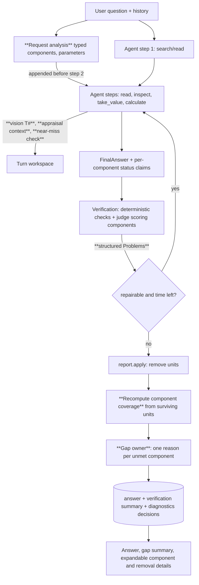
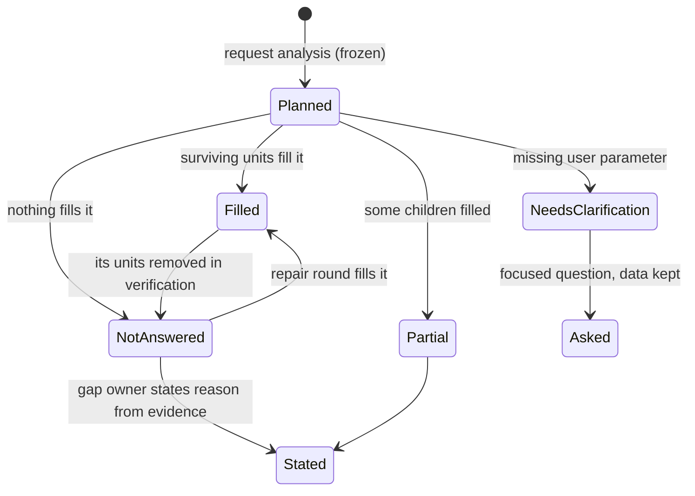

# Request components, precise gaps, inspectable removals, in-turn tables, appraisal context and input choice - Plan

## Goal Capsule

- **Objective:** An appraiser can ask a compound, instruction-laden question about any report and get an answer that:
  - covers what was asked, component by component;
  - says precisely, and only once, what is missing and why;
  - shows what verification removed and why;
  - uses a table read during the turn in a calculation at once;
  - never mixes figures across appraisals in one file;
  - computes from the right inputs, or asks for a missing assumption.
- **Means:**
  - a typed request analysis frozen before the answer (KTD1, KTD2);
  - one owner for gap statements, fed by component coverage and workspace evidence (KTD3, KTD4);
  - structured removal decisions (KTD5);
  - a vision-table carrier with OCR-confirmed cells (KTD6);
  - appraisal context derived from stored structure (KTD7);
  - an explicit-amount check in the calculator and a clarification path for missing parameters (KTD8, KTD9).
- **Authority hierarchy:**
  1. the user's request in this session;
  2. this plan's Product Contract;
  3. the KTDs;
  4. each unit's Approach.
- **Stop conditions:** stop and report instead of proceeding when any of these holds:
  - real reports, client data, private answers or screenshots would enter git or the PR;
  - a change would delete a database, a document, a backup, a good reading, or a prior human decision;
  - verification, meaning, attribution or permission checks would have to be weakened to pass a test or a measurement;
  - a model call would need an automatic fallback to a more expensive model, or unbounded repair;
  - a merge, force-push or production deploy would be required.
- **Execution profile:** Deep. Chat engine, verification, coverage and tool changes, a reader-version bump for inspected regions, a narrow UI extension, and real-model and browser acceptance. Land the units in Sequencing order as separate commits on `feat/general-question-engine`.
- **Who finishes:** the executing agent implements, tests on the host (never pytest inside Docker), runs the planned real-model measurement, and updates PR AriGabay/rag#2. Merging and deployment stay with the user.

---

## Product Contract

### Summary

Represent each request, before the answer is written, as typed components:
- information to ground in sources;
- calculations to perform;
- instructions about the answer itself;
- assumptions the user gave;
- details the user still has to supply.

Judge coverage per component against the answer actually shown. A single server-side owner states each gap with a reason taken from what the turn actually did. Every removal records why it happened and is inspectable.

Fix four connected mechanisms:
- a table read visually during the turn feeds `take_value` and `calculate` in the same turn;
- figures stay with their own appraisal inside a multi-appraisal file;
- an explicit amount is preferred over a rounded rate;
- a missing material assumption leads to a focused clarification that keeps the data already found.

### Problem Frame

Round 6 made citations precise and computed results verifiable. On compound requests the turn still fails the appraiser in ways the user reproduced, the round-6 evaluation recorded, and this session's trace located.

**A typical failure.** A request asks to write a chapter that includes a list of items "as far as they appear", to use professional style, to distinguish approved from proposed, and to attach a precise citation to every datum. The answer comes back with three defects:
- writing instructions reported as information not found in the documents;
- a whole category declared missing while part of it is in the answer;
- a bare count of removed claims.

**Root causes the trace found** (`backend/app/chat/`):
- **Requirements are formed too late.** There is no request representation before the tools run on a first turn. The judge derives requirements after the answer exists, while it sees that answer. The only typing is `calculation: bool` (`verify.py` `JudgeRequirement`, `TurnRequirements`).
- **Instructions get searched.** A missing instruction becomes `REQ_NOT_SEARCHED`, which tells the model to search for it.
- **Two gap vocabularies compete.** The model-declared `requested` statuses (`coverage.ABSENCE_KINDS`, `absence_sentence`) and the judge's `Q#` limitations (`coverage.LIMITATIONS`, `state_parts`) each write sentences. `not_found_search` is never checked against the searches that ran. The precise reason is suppressed whenever another sentence "states" the requirement.
- **Removals keep no structure.** `Problem.as_dict` keeps text, reason, severity and kind only. `message_diagnostics.removed` holds every problem, not only removals. The UI never reads the detail.
- **An inspected table is a dead end.**
  - `_visual` registers it as an image source with no table index, always `uncertain_reading`.
  - Cell and row locators are refused.
  - The per-number OCR agreement computed by `images._from_vision` is discarded.
  - A value from it is uncertain, so its calculation is conditional.
- **Property identity stops at the file.** No property identity exists below the document:
  - `meaning.subject_measurements` takes every appraised-property measurement of the whole file;
  - a value's subject is model free text with no provenance;
  - `×` and `÷` merge subjects silently;
  - `conflicting` reads two appraisals as a source conflict.
- **Calculation inputs are unchecked.** Nothing compares a computed input against an explicit amount the report states for the same quantity.
- **Missing assumptions have no path.** The rules are prompt-only and partly contradictory (`engine.py` POLICY). `resolve` does not run on a first turn, and nothing detects a calculation that rests on a parameter the user never gave.

The repair-round timeout that discarded a verified long answer was fixed in `ee88a58` and stays in force.

### Requirements

**Request representation**
- R1. Before the answer is written, the request is represented as typed components:
  - information (grounded in sources);
  - calculation (performed from data and assumptions);
  - instruction (about the answer: citations, style, layout, presentation of a distinction, units);
  - assumption (given by the user);
  - clarification (a detail the user must supply to choose a datum, formula or scenario).

  The representation is built from the question and the conversation context, never from the answer.
- R2. Each component has:
  - a stable id;
  - a description;
  - a kind;
  - a parent when it refines a broader component;
  - a flag saying whether it is conditional on availability ("as far as it appears");
  - the subject it concerns, when the request names one.

  A compound requirement is split into separately checkable components. Refinement keeps the link to the original component and adds nothing the user did not ask for.
- R3. The model cannot remove or narrow components after the fact. A component can only be scored, never dropped.
- R4. Instruction components are never sent to document search and never reported as missing from the documents. A citation instruction is checked deterministically against the shown answer: every material datum carries a valid citation attached to it. Style, layout and presentation instructions are judged against the shown answer.
- R5. A request to distinguish statuses (approved, proposed, an appraiser's assumption) yields two components:
  - an information component: find the correct status in the sources;
  - an instruction component: present the status clearly.

**Coverage and gaps**
- R6. Each component is scored as one of: full, partial, not answered, needs clarification, not relevant. The scoring keeps, separately:
  - the claims and computations that fill the component;
  - the supporting sources;
  - the reason;
  - the evidence state.

  Several claims can fill one component, and one claim can fill several.
- R7. Coverage is recomputed after verification against the answer actually shown. A removed claim fills nothing.
- R8. A gap reason is chosen from what the turn actually did and is one of:
  - not located by the searches performed;
  - not present in the specific part of the source that was read and checked;
  - the relevant region was not fully read;
  - found, but the reading or meaning could not be verified;
  - sources conflict, only after checking the same property, date, unit, scenario and status;
  - a detail is missing from the request;
  - data found but the calculation was not completed;
  - a tool or provider failed;
  - an instruction was not met;
  - removed in verification.

  Absence is never inferred from a search alone.
- R9. One owner states each gap:
  - a model-written absence statement about a component is replaced by the server's statement for that component;
  - linkage is structured (component and evidence ids), never by matching a phrase;
  - no answer carries two reasons for the same gap.
- R10. For a component conditional on availability, a part that does not appear is reported as a precise gap for that part only. It never fails the whole task, and it never declares the parent category missing when part of it was answered.
- R11. The answer shows a short summary of the relevant gaps. The per-component detail is expandable, and it never repeats the whole request as a list.

**Removals**
- R12. Every removed claim has a structured decision:
  - the claim text;
  - its component;
  - the sources checked;
  - the check that fired;
  - the failure kind;
  - a short factual reason;
  - whether a repair was attempted.

  The failure kinds are:
  - absent from the source;
  - wrong property or party;
  - wrong unit;
  - uncertain reading;
  - contradicts the source;
  - wrong calculation;
  - invalid citation;
  - not successfully checked.

  A technical failure or an unfinished check is classified as not checked, never as wrong.
- R13. The UI shows a short removal explanation with expandable detail. Removed text appears only as an unverified draft and never as fact beside the verified answer. A source is openable only while the user may see it. Nothing from a document whose permission was revoked is shown. Check reasons and results are shown; model reasoning is not.
- R14. A valid claim is never removed for punctuation, an equivalent number representation, or correct rounding. Meaning and attribution checks are not weakened.
- R15. A bounded repair (another source, a calculation, a re-attribution) is attempted before removal when the failure kind admits one. After removal the text stays readable: no broken sentences, and no conclusion that rests on the removed claim.

**In-turn visual tables**
- R16. A table read visually during the turn can be used in the same turn by `take_value`, verification and `calculate`, without reprocessing or approval.
- R17. Each value taken from such a table keeps its link to:
  - the image, version, reading, page and region;
  - its row, column, headers, units and context.
- R18. A value from such a table is verified only with evidence beyond the model's own transcription:
  - OCR of the same crop agrees on the number;
  - or the stored text layer of the region carries it;
  - or a focused re-read confirms it against OCR.

  Otherwise the value stays uncertain, and a calculation using it is conditional.
- R19. Such a value is highlighted at cell precision only when a reliable position exists (an OCR word box for that number inside the region). Otherwise the whole table is highlighted, with its context.

**Appraisal context inside one file**
- R20. Within a file holding several appraisals, appendices or comparison properties, each source carries the appraisal context it belongs to (page or section range and the property it refers to). That context travels through search, read, `take_value`, `calculate` and claim verification.
- R21. File permission, file title or the conversation's focus never proves that a number belongs to the asked property:
  - a value from another appraisal's context is rejected as wrong-property attribution;
  - unclear boundaries lead to reading the needed context or asking;
  - a split is never invented from page numbers alone.
- R22. In multi-party documents, who stated a value and whether it was adopted stay checked (round-6 attribution), within the right appraisal context.

**Input choice and assumptions**
- R23. When the report states an explicit amount for a quantity and a rounded rate that describes it, the amount is not rebuilt from the rate unless needed. A user-requested rate is used and shown as the requested assumption. A near-miss between a computed input and a stated amount is reported, never silently replaced, and kept in the calculation record.
- R24. The three categories stay distinct, as in round 6: document value, user assumption and computed result. A computed result need not appear in the document. Arithmetic runs server-side at full precision and is rounded only for display.
- R25. A missing material assumption (such as a change rate the user did not give) is never assumed:
  - the turn asks one focused clarification that names the missing detail and keeps the data already found;
  - the user's reply continues the task;
  - a general formula may be shown, but never a determined result.

**Evaluation and safety**
- R26. Each failure in this contract has a test that reproduces it before the fix and passes after:
  - several phrasings and several synthetic documents;
  - real-model tests and browser tests over the full path;
  - mocked answers alone are not proof.
- R27. Earlier evaluation results stay attached to the commits they were measured on:
  - the relevant cases are re-run as regression, and the new result is recorded;
  - generalization is measured on a new set, frozen before its single run on the final build;
  - grading accepts several correct phrasings, but catches missing answers, wrong attribution, unsuitable inputs and unfounded conclusions.
- R28. Correctness, completeness, attribution, justified and wrongful removals, calculations, model calls, cost and time are measured before and after. Verification is never removed to improve speed or score.
- R29. Existing permission, history and citation tests keep passing. Verification details never expose content of a document the viewer can no longer see.

### Key Decisions

- **gpt-6-luna with the existing per-purpose settings; no automatic costlier fallback; bounded repair only.** (session-settled: user-directed — chosen over a costlier model or unbounded repair: cost measured in earlier rounds.) Governs R15, R28.
- **No question-specific routing, keyword lists or dedicated paths; synthetic public tests; private material stays out of git.** (session-settled: user-directed — chosen over example-specific fixes: generality and privacy.) Governs R1, R26.
- **The request is a typed structure built before the answer.** (session-settled: user-directed — chosen over one flat list of parts derived after the answer: execution instructions were reported as missing information.) Governs R1, R2, R3, R4, R5.
- **Coverage is component-level and recomputed after removals.** (session-settled: user-directed — chosen over category-level coverage: whole categories were declared missing while partly answered.) Governs R6, R7, R10.
- **Gap statements are precise, grounded in read scope, and owned once.** (session-settled: user-directed — chosen over a default "not found in the search" sentence: absence was stated where data had been found.) Governs R8, R9, R11.
- **Every removal has a structured, inspectable decision.** (session-settled: user-directed — chosen over a removal count: removals could not be checked.) Governs R12, R13, R14, R15.
- **An in-turn visual table is usable at once, with evidence beyond the transcription.** (session-settled: user-directed — chosen over waiting for reprocessing or accepting the model's number: the table could not enter a calculation.) Governs R16, R17, R18, R19.
- **Appraisal context below the file travels through every tool.** (session-settled: user-directed — chosen over file-level identity: a figure crossed appraisals.) Governs R20, R21, R22.
- **Explicit amounts over rounded rates; clarification for missing assumptions.** (session-settled: user-directed — chosen over silently rebuilding from a rate or assuming a rate: a wrong v11 answer and a missing clarification.) Governs R23, R24, R25.
- **Evaluation discipline.** (session-settled: user-directed — chosen over re-labelling earlier results or reusing a read set as held-out: honest measurement.) Governs R27, R28.

### Acceptance Examples

- AE1. **Covers R1, R4.**
  - **Given:** a request to list plan items "as far as they appear", in professional style, with a citation for every datum.
  - **When:** answered.
  - **Then:**
    - neither style nor citations is searched or reported as missing from the documents;
    - the citation instruction is reported unmet only when a material datum in the shown answer lacks a valid citation.
- AE2. **Covers R2, R6, R10.**
  - **Given:** a request for uses, housing units, areas, height, floors and building lines of a synthetic plan where the source states uses, units and floors only.
  - **When:** answered.
  - **Then:**
    - the three found components are full;
    - height, areas and building lines are each stated as not present in the part read (naming the section);
    - no sentence says the category is missing.
- AE3. **Covers R7, R12.**
  - **Given:** an answer whose sentence about one component cites a value of another property.
  - **When:** verification removes it.
  - **Then:**
    - that component is no longer full;
    - the removal detail says "wrong property", with the checked source openable;
    - the gap summary names the component.
- AE4. **Covers R8, R9.**
  - **Given:** a component whose values were found, but whose calculation failed.
  - **When:** the model writes "not found in the search".
  - **Then:** that sentence is replaced by the single statement "calculation not completed".
- AE5. **Covers R16, R18.**
  - **Given:** a synthetic PDF whose cost table is an image not read at ingestion.
  - **When:** the question needs a total from it.
  - **Then:** the turn reads the region, takes two OCR-confirmed cells, computes, and answers in the same turn with a non-conditional result whose inputs open the table.
- AE6. **Covers R20, R21.**
  - **Given:** one synthetic file holding two appraisals with similar values.
  - **When:** asked about the second property.
  - **Then:**
    - the answer uses the second appraisal's figure and cites its page;
    - a claim using the first appraisal's figure for it is removed as wrong property.
- AE7. **Covers R23.**
  - **Given:** a report stating developer profit as an explicit amount and as a rounded percentage of cost.
  - **When:** asked for the gap to a threshold.
  - **Then:**
    - the computation uses the explicit amount;
    - if the model multiplies cost by the rounded rate instead, the calculator reports the near-miss and the repair uses the amount.
- AE8. **Covers R25.**
  - **Given:** "what would the profit be if costs rose?" with no rate given, where cost and income are found.
  - **When:** answered.
  - **Then:**
    - the answer gives the found values and asks one question for the rate;
    - the user's reply "8%" produces the computed result in the next turn without searching again.

### Scope Boundaries

- No new model, no change of per-purpose model settings, no full-corpus reading per question.
- No generic redesign of the chat UI. The short gap summary (R11) and a one-line removal notice sit in the existing answer-quality line above the details. The per-component and per-removal detail is added inside the existing collapsed answer details.
- A file holding several appraisals without labelled property identifiers in its headings or title blocks stays one context. This is a known limit, reported in the PR body.
- Appraisal context is derived from stored structure at query time. No re-extraction of the corpus, and no vision calls to segment files.
- Illustrative scenarios with a number the user did not give are not computed. A general formula may be shown (R25).

#### Deferred to Follow-Up Work

- Persisting appraisal segments in a table, if the derivation proves expensive at query time.
- Splitting `backend/app/chat/tools.py`, `verify.py` and `coverage.py` into smaller modules (review findings from round 5).
- `jobs_claim` dead-lease handling (round-6 review #12).

---

## Planning Contract

### Key Technical Decisions

- KTD1. **A typed request analysis runs before the answer, concurrently with the agent's first step.**
  - **When:**
    - on a first turn, one small structured call (the resolve purpose's model and effort) runs in a worker thread alongside the agent's first step, and its result is appended to the agent's items before step two;
    - on a follow-up, the existing `resolve` call's schema gains the same component list, so no extra call is added.
  - **What it returns:**
    - the components (R1, R2);
    - for each calculation component, its parameters with a source: given by the user, or not given by the user. Whether the documents supply a parameter is decided later, from the workspace (KTD9);
    - for a calculation component that compares subjects, a `compares` list naming them (empty otherwise).
  - **Freezing:** the result is frozen in the turn as `TurnRequirements` with stable ids and replaces the judge's post-hoc derivation. The ids use a prefix no workspace handle uses (for example `N1`, `N1.2`), because cached values already use `Q#`.
  - **Follow-ups:** the `resolve` call's output budget is raised to fit the component list. If the component part is invalid, the rest of the resolution is still used and the components fall back to judge derivation.
  - **Fallback:** if the call fails or times out, the judge derives them as today, with the new typed schema, and the turn records that it fell back.
  - **Supersedes round-6 KTD7** ("requirements derived by the judge, no extra call") on the user's direction in this session.
  - **Cost:** recorded per turn (R28).
  - Rejected: a sequential pre-tool call, which adds its latency to every first turn. Rejected: deriving in the agent's first step, which lets the answering model shape its own requirements.
  - Governs R1, R2, R3.
- KTD2. **Instruction components are checked against the shown answer, never searched.**
  - The citation instruction is checked deterministically from the verification units: a material number or claim without a valid, attached citation leaves it unmet, with the unit named.
  - Style, layout, units and presentation instructions are scored by the judge, which receives them as a separate list.
  - Both checks run inside verification, before the repair decision. An unmet instruction becomes a repair problem that tells the model to change the answer, never to search. If it is still unmet after the bound, the gap reason is "instruction not met". An unmet instruction is a gap, never a claim removal.
  - `REQ_NOT_SEARCHED` applies only to information components.
  - Governs R4, R5.
- KTD3. **The judge scores components; coverage is computed from surviving units.**
  - The judge's verdict schema maps each unit to the component ids it fills. Many-to-many is allowed.
  - Each component gets one of the R6 statuses: full, partial, not answered, needs clarification, not relevant. The judge's existing "undeterminable" score becomes an evidence state on a not-answered or partial component (reason "found, not verifiable" or "sources conflict"), not a sixth status.
  - After `report.apply`, component outcomes are recomputed from the surviving units only: a component filled only by removed units falls back to not answered, with the reason "removed in verification".
  - A parent's status is derived from its children.
  - Governs R6, R7, R10.
- KTD4. **One gap owner: the server, with a single reason vocabulary.**
  - `ABSENCE_KINDS` and `LIMITATIONS` merge into one taxonomy (R8).
  - Each reason is chosen from workspace evidence:
    - searches `H#`/`S#` with their scope;
    - the sources read and checked;
    - unread regions of the cited documents;
    - value statuses;
    - conflicts after the same-property, date, unit, scenario and status check;
    - `F#`/`E#` failures;
    - request components that need clarification;
    - unmet instructions;
    - removals.
  - The model no longer writes absence sentences:
    - its `parts` and `requested` declarations become per-component status claims, which the server validates and may downgrade;
    - the judge marks any unit that states an absence with the component it concerns;
    - such a unit is removed when the server states that component.
  - The server writes one compact gap paragraph after the answer, grouped by reason. It is the single gap summary the user sees, stored in the answer text so copy and history keep it, plus the per-component detail for the UI. The UI's completeness line shows only the status, never the reasons again (U8).
  - A component no search covered after the repair bound is stated as "not located by the searches performed", saying no search covered it; it is never stated as "not present".
  - **Backstop:** when verification ran but the judge did not mark a uncited unit that states an absence of a component the server states, that unit is removed as needing a citation (an absence statement carries no source), so a model "not found" sentence cannot survive beside the server's statement.
  - Governs R8, R9, R11.
- KTD5. **Removal decisions are structured at the point each check fires.**
  - `Problem` gains:
    - `failure_kind` (R12);
    - `check` (the deterministic check's name, or `judge`);
    - `component`;
    - `checked_ids` (cited S/V/M/C ids);
    - `repair_attempted`.
  - Deterministic checks set the kind directly. The judge's verdict gains a `failure` enum alongside `defect`.
  - Provider or verification failures set `not_checked`. A not-checked unit is still kept out of the verified answer, because unverified text is never shown as fact, but it is reported as not checked, never as wrong.
  - Problem kinds that are not R12 failure kinds map onto them: `input_choice` and an unrequested assumption remove a claim as "wrong calculation". An unmet instruction is a gap (KTD2), never a removal.
  - `message_diagnostics.removed` keeps only the problems that removed units.
  - The public verification gains a removal summary per removal: the failure kind, the component id, and a fixed server sentence for that kind. It never carries `Problem.reason` or claim text, following the 0008 decision to keep that detail off the normal message path.
  - The factual reason, draft text and sources are served only by the existing `GET /messages/{id}/diagnostics` route, under its existing all-or-nothing gate: each removal's checked documents are added to the row's `document_ids`, so revoking any of them returns 404 for the whole row. The message itself is already hidden when any touched document is revoked.
  - Governs R12, R13.
- KTD6. **An inspected table becomes a vision-table source with OCR-confirmed cells.**
  - `transcribe` already OCRs the crop. The per-number agreement and the confident OCR word boxes are kept in the stored region reading.
  - `INSPECT_READER_VERSION` is bumped, so older cached readings without that evidence are read again once.
  - `_visual` registers the vision tables as addressable table sources (a vision `T#` with rows, columns and headers from the transcription).
  - `take_value` cell and quote locators accept them.
  - **When a cell is auto-verified:** OCR confirms not only the number but its place. The confirming OCR word box must lie in the row band of that row's label words and the column band of its column header, both located by OCR word boxes in the crop. The region's stored text layer is accepted under the same placement test.
  - **When a cell stays uncertain:** a number that occurs more than once in the crop, or whose row or column cannot be located, stays uncertain and may get one focused OCR-confirmed re-read (round-6 `_reread_value`).
  - **The cell's box:** the confirming OCR word box is mapped into rendered-page fractions. It is divided by the OCR upscale factor and the render scale actually applied to the crop, then offset by the crop's rendered-frame origin, which `display_box_of` gives for the region. It is never passed through `display_box_of` itself, because it is already in the rendered frame.
  - **The anchor stub:** it carries the region key and this box, never an `extracted_tables` index.
  - **Precision:** the snapshot uses the stored box for cell precision, else table precision (the whole table region with its context, R19).
  - Governs R16, R17, R18, R19.
- KTD7. **Appraisal context is derived from stored structure at query time.**
  - **Derivation:**
    - The first context's identity is the subject identifiers in the file's title block.
    - Only labelled property identifiers count: a block and parcel pair parsed as in `appraisal/normalize.parse_block_parcel` and the labelled block/parcel pattern in `answering/entities.py`, and an address with a street label and house number as in `answering/entities.py`.
    - A new context opens only where a heading or title block restates a complete identifier set of the same kinds that differs from the current one.
    - Section numbers, bare numbers, plan numbers, years, and identifiers inside tables or comparison lists never open a context, and no boundary is drawn from page numbers alone.
    - A context's label is its identifier set. A file with one identifier set is a single context.
  - **Measured before enforced:** U1 counts the derived contexts per report across the v9–v11 regression reports. The enforcement below is enabled only once every single-appraisal report in those sets derives exactly one context.
  - **Caching:** the result is cached per reading.
  - **Exposure:** search hits, read output, outline and `take_value` show each source's context label.
  - **Provenance:** a V# records its context with provenance from the source, and its subject provenance is checked against it.
  - **Where it is enforced:**
    - `meaning.subject_measurements` restricts to the same context;
    - `calc` refuses to combine values from different contexts unless a frozen calculation component of the turn has a `compares` list matching those contexts' identifiers (KTD1);
    - `conflicting` keys on context;
    - verification removes a claim about the asked property that rests on another context (wrong property).
  - **Ambiguity:** when the asked property matches no context, or matches several, the tools say so, and the turn reads the context or asks.
  - Rejected: a migration and an extraction pass for segments, deferred until query-time cost is measured.
  - Governs R20, R21, R22.
- KTD8. **The calculator checks inputs against stated amounts.**
  - **Trigger:** a product with a document rate, or a sum or difference whose operand was itself computed from one.
  - **Check:** the result is compared with the amounts stated in the rate's source block and its section.
  - **Near-miss:** an amount within the rate's rounding interval (half a unit of the rate's last written digit, times the base) is reported in the tool output and kept in the calculation record as `explicit_amount_available`, with the amount's quote. The agent is told to take the stated amount unless the user asked for the rate.
  - **Verification:** a computed claim built from a rounded rate when a stated amount was available gets the repairable problem `input_choice`. A user assumption `A#` is never flagged.
  - Governs R23, R24.
- KTD9. **Missing parameters lead to a clarification that keeps the turn's data.**
  - **Marking:** a calculation component whose parameter is not given by the user (KTD1) is marked `needs_clarification` only when the workspace fills that parameter with neither a user `A#` nor a cited document `V#` (for example a rate the report itself states in a sensitivity section). A computation whose parameter is a document `V#` fills the component normally.
  - **Before verification:** a computation that fills such a component with a number that is neither a user `A#` nor a cited `V#` is an unrequested assumption (problem kind `scenario`). It goes first to the bounded repair, which rewrites the answer as found values, general formula and one focused question, or uses a user-given or document value if one exists. If the claim is still there after the bound, it is removed as "wrong calculation".
  - **The turn's status:** the answer gets status `clarification` with the found values and their citations kept. The pending parameter is stored on the message, so the next user reply is resolved against it and turned into an `A#` quoting that reply.
  - **POLICY:** the rules on assumptions are made consistent.
  - Governs R25.
- KTD10. **Repair attempts stay bounded, and every failure kind maps to a repair or a removal.**
  - Repairable kinds:
    - wrong property (re-attribute or re-take from the right context);
    - input choice and other wrong calculations (recompute from the right inputs);
    - an unrequested assumption (KTD9);
    - uncertain reading (one focused re-read);
    - unmet instruction (an answer change, KTD2).
  - These are sent to the existing repair round with the kind and checked ids.
  - The repair-round budget and `REPAIR_TIME_FACTOR` (`ee88a58`) stay as they are.
  - A sentence removal keeps the text readable with the existing `_sentence_cuts` and `tidy`. The judge also flags any surviving unit whose conclusion depends on a removed unit, and that unit is removed too.
  - Governs R14, R15.

### High-Level Technical Design

Turn flow with the new pieces (new in bold):

Component lifecycle:

Gap reason decision (directional; first match wins):

| Evidence in the workspace | Reason |
|---|---|
| Component is an instruction and the shown answer violates it | instruction not met |
| Component filled only by removed units | removed in verification (with the removal kind) |
| Tool or provider failure tied to the component | tool failure |
| Calculation component with its inputs found and its C# failed or absent | calculation not completed |
| Parameter not given by the user and filled by neither a user `A#` nor a cited `V#` | detail missing from the request |
| Values found but uncertain | found, not verifiable |
| Different values for the same property, date, unit, scenario and status | sources conflict |
| Cited document region relevant to the component unread | region not fully read |
| Relevant section read and checked, value absent | not present in the part read (names the section) |
| Search covered the component, nothing read | not located by the searches performed |
| No covering search after the repair bound | not located by the searches performed, saying no search covered it (never "not present") |

### Assumptions

- The judge can score typed components and map units many-to-many within its current call. The batch size may need lowering if the output grows. The real-model measurement checks this.
- Labelled property identifiers in headings and title blocks are enough to separate appraisals in the files this office uses. A file without them is one context and raises no ambiguity; that is a known limit, reported in the PR body. U1's context count checks the assumption before enforcement is enabled.
- OCR word boxes inside an inspected crop locate the cell of a confirmed number reliably enough for cell highlight. When a number occurs twice in the crop, the cell falls back to table precision.
- If the office has no unused original reports left for a new held-out set, the new set uses new questions on reports not in v11. Its independence is reported honestly in the evaluation.
- The extra request-analysis call on first turns costs well under the per-turn cost recorded in round 6. If the measurement shows otherwise, the cost is reported, not hidden.

### System-Wide Impact

- **Agent output contract:** the `FinalAnswer` schema changes (per-component status claims replace free absence statuses), so the cached prompt prefix changes once.
- **Stored answers:**
  - the answer payload gains component outcomes and a removal summary;
  - old messages render as before, because missing fields are optional in `chatTypes.ts`;
  - `message_diagnostics.removed` keeps its column with a richer item shape;
  - old rows stay readable.
- **Reading cache:** `INSPECT_READER_VERSION` bump. Inspected regions are re-read once when next inspected, with vision cost per region at first use.
- **Permissions:** the diagnostics route keeps its all-or-nothing gate and audit. Its document set grows to include every removal's checked documents. The public removal summary carries only fixed server sentences.

### Sequencing

1. U1, to establish the baseline and the failing reproductions.
2. U2, then U3, then U4 (the request, then coverage, then removals).
3. U5, U6 and U7, independent of each other, after U2.
4. U8 (the UI), after U3 and U4.
5. U9 (acceptance on synthetic documents with the real model and browser).
6. U10 (measurement, docs, PR).

---

## Implementation Units

### U1. Baseline, failure map and failing reproductions

- **Goal:** Know where each failure arises, and hold a test that fails for each before any fix.
- **Requirements:** R26, R27, R28.
- **Dependencies:** none.
- **Files:**
  - `docs/evaluation/conversational-rag.md` (round-7 section, aggregates and mechanisms only)
  - `real_documents/eval/round7-failure-map.md` (private, gitignored)
  - `backend/tests/integration/test_chat_round7_reproductions.py`
  - `backend/tests/fixtures/round7/` (synthetic PDFs: multi-item plan chapter, two appraisals in one file, image cost table, explicit amount next to a rounded rate)
- **Approach:**
  1. Confirm the running stack serves `ee88a58` (a constant inside the container), per the compose image rule.
  2. Run the regression sets v9, v10 and v11 on `ee88a58` and record them as the round-7 baseline for that commit. Earlier results stay attached to their commits.
  3. Write the failure map privately. The public evaluation section carries only the mechanisms and their locations.
  4. Count the appraisal contexts KTD7 derives for each report in v9–v11 (a read-only script over stored blocks). Record the count as the gate for enabling KTD7's enforcement in U6.
  5. Build synthetic fixtures with known contents, and scripted-turn reproductions for F1–F8 that fail on `ee88a58`.
- **Execution note:** Start with the failing reproductions. Each later unit turns some of them green.
- **Patterns to follow:**
  - `docs/solutions/workflow-issues/real-model-before-after-eval-on-the-local-stack.md`;
  - the round-6 synthetic fixture generators under `backend/tests/fixtures/citations`.
- **Test scenarios:**
  - Instructions in the request are reported as not found (fails on `ee88a58`).
  - A category with three of six items found is declared missing (fails).
  - The model's "not found" appears beside data that were found (fails).
  - A removal has no kind (fails).
  - An inspected image table's cell cannot be taken (fails).
  - A second appraisal's figure is accepted for the first property (fails).
  - Cost × rounded rate is accepted next to an explicit amount (fails).
  - A missing rate leads to a computed answer with no question (fails).
- **Verification:** each reproduction fails on `ee88a58` for the traced reason, not for a fixture error.

### U2. Typed request analysis before the answer

- **Goal:** Build and freeze the components before the answer, without adding latency.
- **Requirements:** R1, R2, R3, R5 (KTD1).
- **Dependencies:** U1.
- **Files:**
  - `backend/app/chat/request.py` (new: schema, policy, `analyze`)
  - `backend/app/chat/resolve.py` (follow-up schema gains components)
  - `backend/app/chat/engine.py` (concurrent call, injection before step two, freezing)
  - `backend/app/chat/verify.py` (`TurnRequirements` typed; judge derivation kept only as fallback)
  - `backend/tests/unit/test_request.py`
  - `backend/tests/unit/test_verify_cache.py`
  - `backend/tests/support/scripted_agent.py` (scripted analysis responder)
- **Approach:**
  1. Components carry id, text, kind, parent, conditional flag, subject and parameters (KTD1). The policy forbids listing instructions as information, and forbids splitting beyond what the user asked.
  2. A first turn runs `analyze` in a thread when the agent's first step starts. Its result is appended as one user item before step two, so the cached prefix is unchanged. A follow-up takes the components from `resolve`.
  3. The judge receives the frozen components and only scores them. Derivation from `<derive_requirements>` remains as the fallback when analysis failed.
  4. Usage records the analysis call under its own purpose label for measurement.
- **Patterns to follow:** `resolve.py` strict schema and `Purpose.RESOLVE` settings; `TurnRequirements.freeze`.
- **Test scenarios:**
  - A request mixing three information items, a style instruction and a citation instruction yields three information components and two instruction components.
  - "Distinguish approved from proposed" yields one information and one instruction component (Covers R5).
  - "As far as they appear" sets the conditional flag on the listed children.
  - A compound "uses, units, areas, height" becomes four children of one parent.
  - A cost-increase question without a rate yields a calculation component whose parameter is not given by the user. With "by 5%" the source is "given by the user".
  - "The difference between the two appraisals' values" yields a calculation component whose `compares` list names both subjects.
  - Component ids never collide with workspace handles (`Q#` cached values, `S#`, `V#`, `C#`, `A#`).
  - A follow-up whose component list is invalid still uses the rest of its resolution, and its components fall back to judge derivation.
  - A follow-up's components come from `resolve`: no extra call is recorded.
  - An analysis timeout falls back to judge derivation, and the turn completes and records the fallback.
  - The agent's final `parts` cannot remove a frozen component.
- **Verification:** scripted turns show the analysis call concurrent with step one (one call on first turns, none extra on follow-ups) and frozen ids scored by the judge.

### U3. Component coverage and a single gap owner

- **Goal:** State every unmet component once, precisely, from evidence.
- **Requirements:** R4, R6, R7, R8, R9, R10, R11 (KTD2, KTD3, KTD4).
- **Dependencies:** U2.
- **Files:**
  - `backend/app/chat/coverage.py` (one taxonomy, evidence-based reasons, gap paragraph)
  - `backend/app/chat/verify.py` (judge maps units to components, absence-unit marking, instruction scoring, deterministic citation-instruction check, recompute after apply)
  - `backend/app/chat/engine.py` (`FinalAnswer` per-component status claims, `finish` order, POLICY)
  - `backend/app/chat/api.py` (component outcomes in the payload)
  - `backend/tests/unit/test_coverage.py`
  - `backend/tests/unit/test_absence.py`
  - `backend/tests/unit/test_verify_units.py`
  - `backend/tests/integration/test_chat_completeness.py`
- **Approach:**
  1. Merge `ABSENCE_KINDS` and `LIMITATIONS` into one reason set. Choose each reason by the KTD4 table.
  2. Validate the model's per-component claims against `ws.searches`, read sources and unread regions. Downgrade, never upgrade.
  3. The judge marks units that state an absence with the component they concern. They are removed when the server states that component, with the KTD4 backstop for an unmarked one.
  4. The instruction checks (KTD2) run inside verification, before the repair decision, so an unmet instruction can enter the repair round.
  5. `finish` order:
     - apply removals;
     - recompute component outcomes from surviving units;
     - write the gap paragraph;
     - build the ledger.
  6. Information-only `REQ_NOT_SEARCHED`. Instruction problems ask for an answer change.
- **Patterns to follow:** `coverage.limitation`, `related_evidence`, `state_parts`; the `withdrawn` mechanism for server statements.
- **Test scenarios:**
  - Covers AE1. Style and citation instructions are never searched or reported as document gaps. A datum without a citation leaves the citation instruction unmet, naming it.
  - Covers AE2. Three of six conditional children found: three gap lines for the missing children, none for the parent category.
  - Covers AE4. Found values with a failed C#: a model "not found" sentence is removed, and "calculation not completed" is stated once.
  - Each R8 reason is produced by its evidence:
    - a search with no hits gives "not located by the searches";
    - a read section without the value gives "not present in section X";
    - an unread region gives "not fully read";
    - an uncertain value gives "found, not verifiable";
    - two values for different properties give no conflict;
    - the same property with different values gives a conflict;
    - an `E#` gives "tool failure";
    - a missing parameter gives "detail missing from the request";
    - a removed sole filler gives "removed in verification".
  - A `not_found_search` claim with no covering search is downgraded to "not located by the searches performed", saying no search covered it.
  - An unmet style instruction in the first answer triggers a repair round that changes the answer, with no search call.
  - A model "not found" sentence the judge did not mark, about a component the server states, is removed by the backstop.
  - A component filled by two claims, one removed, stays full. Filled by one removed claim, it becomes missing (Covers R7).
  - One claim filling two components counts for both.
  - The gap paragraph lists only unmet components, grouped by reason, with no restatement of the request.
- **Verification:** the U1 reproductions for F1–F3 pass, and the round-6 completeness tests keep passing or are updated only where they asserted the old double statement.

### U4. Structured removal decisions

- **Goal:** Make every removal checkable, and never remove a valid claim for form.
- **Requirements:** R12, R13 (backend), R14, R15, R29 (KTD5, KTD10).
- **Dependencies:** U3.
- **Files:**
  - `backend/app/chat/verify.py` (`Problem` fields, judge `failure` enum, deterministic kinds, dependent-conclusion flag)
  - `backend/app/chat/api.py` (diagnostics persistence of removals only, public removal summary with fixed sentences, removal documents added to the diagnostics row's document set)
  - `backend/app/chat/engine.py` (repair prompt carries kind and checked ids)
  - `backend/tests/unit/test_verify.py`
  - `backend/tests/unit/test_verify_computed.py`
  - `backend/tests/integration/test_chat_verify.py`
  - the existing diagnostics tests in `backend/tests/integration/test_chat_permissions.py` and `test_chat_verify.py` (extend)
- **Approach:**
  1. Map each deterministic check to a failure kind:
     - unknown id gives invalid citation;
     - unstated number gives absent from the source;
     - misattribution gives wrong property or party;
     - VAT or unit mismatch gives wrong unit;
     - an uncertain value gives uncertain reading;
     - a computation mismatch gives wrong calculation.
  2. The judge's `unsupported` verdict carries a `failure` value. `VerificationUnavailable` or a judge timeout on a unit gives not checked.
  3. Persist the decision list (removed units only) with checked ids. The public summary carries kind, component and the fixed server sentence for that kind (KTD5).
  4. The diagnostics route keeps its all-or-nothing gate and audit. Each removal's checked documents join the row's document set, so the draft text, factual reason and sources are served only while every one of them is visible.
- **Test scenarios:**
  - Covers AE3. A wrong-property claim is removed with failure kind "wrong property" and its checked S# listed.
  - A claim "1.53 מיליון" against a source "1,530,000" is kept; so is "כ-14 אלף" against "14,250" with a rounding note (Covers R14).
  - A claim with the correct number but the wrong party is removed as wrong property or party.
  - A judge timeout on a unit records not checked, and the summary does not call it wrong.
  - A repairable kind triggers one repair with the kind in the prompt. The final decision records `repair_attempted`.
  - A surviving sentence whose conclusion rests on a removed claim is removed too, and no broken list item remains.
  - After access to a document a removal cites is revoked, the message is hidden and its diagnostics route returns 404 (Covers R29).
  - The normal message payload's removal summary contains no claim text and no judge-written reason.
  - `message_diagnostics.removed` holds only removed units.
- **Verification:** removal counts in the UI equal the persisted decisions, and every decision has a kind.

### U5. Inspected tables usable in the same turn

- **Goal:** Read an image table during the turn and calculate from it at once, with independent evidence.
- **Requirements:** R16, R17, R18, R19 (KTD6).
- **Dependencies:** U2.
- **Files:**
  - `backend/app/extraction/images.py` (keep per-number agreement and OCR word boxes in the reading)
  - `backend/app/extraction/vision.py` (`INSPECT_READER_VERSION` bump)
  - `backend/app/chat/tools.py` (`_visual` vision `T#`, `_table_of`/`_take_cell` for vision tables, quote locator for vision rows, value status from OCR evidence, cell anchors)
  - `backend/app/chat/anchors.py` (cell box from an OCR word box through `display_box_of`)
  - `backend/tests/integration/test_chat_inspect.py`
  - `backend/tests/integration/test_chat_value_status.py`
  - `backend/tests/unit/test_value_status.py`
- **Approach:**
  1. The stored region reading keeps, per transcribed number, whether OCR of the same crop confirms it, plus the confirming word's box.
  2. A vision table becomes addressable (rows, columns, headers, unit note from the transcription). Its cells resolve through the reading, not `extracted_tables`.
  3. A cell value is auto-verified when OCR confirms it or the region's text layer carries it. Otherwise it is uncertain, with one OCR-confirmed focused re-read allowed (existing bound).
  4. The anchor is cell-precise with the OCR word box, else table precision with context.
- **Patterns to follow:**
  - `_reread_value`, `_crop_ocr_words` and `_stored_region` in `tools.py`;
  - `docs/solutions/logic-errors/stored-pdf-boxes-are-not-in-the-rendered-page-frame.md`, for the crop frame and the reader-version bump.
- **Test scenarios:**
  - Covers AE5. A scripted inspect of an image table whose OCR confirms two numbers: `take_value` by cell succeeds, `calculate` is not conditional, and the answer verifies in the same turn.
  - The model transcribes a number OCR does not see: the value stays uncertain, and the calculation is conditional and says why.
  - A number appears twice in the crop: the cell stays uncertain and the anchor is at table precision.
  - The transcription swaps two rows' values, so both numbers are present in OCR but in the wrong row bands: both cells stay uncertain, and a calculation using them is conditional.
  - The cell box of a confirmed number, mapped from the OCR word box with the upscale and render scales, lands on that cell in the rendered page; it is not passed through the stored-box conversion a second time.
  - On a rotated, CropBox-offset fixture, the cell box lands on the cell in the rendered page.
  - A cached reading from `inspect-v2` is read again once under the new version.
  - A user without access to the document gets no cell value or crop.
- **Verification:** the U1 reproduction for F5 passes with a non-conditional computation.

### U6. Appraisal context inside one file

- **Goal:** Keep each figure with its own appraisal or property within a file.
- **Requirements:** R20, R21, R22 (KTD7).
- **Dependencies:** U2.
- **Files:**
  - `backend/app/chat/reader.py` (context derivation from headings and title blocks with identifiers, cached per reading)
  - `backend/app/chat/tools.py` (context label in search, read, outline and `take_value`; V# context and subject provenance)
  - `backend/app/chat/meaning.py` (`subject_measurements` restricted to context)
  - `backend/app/chat/calc.py` (combining values across contexts)
  - `backend/app/chat/coverage.py` (`conflicting` keyed on context)
  - `backend/app/chat/verify.py` (wrong-property check against the asked subject)
  - `backend/tests/unit/test_appraisal_context.py`
  - `backend/tests/integration/test_chat_attribution.py`
- **Approach:**
  1. Derive contexts per KTD7. A file without distinct identifier sets is one context, so existing single-appraisal behaviour is unchanged.
  2. A V# records its context. The model's subject is marked as asserted unless the context's identifiers support it.
  3. The request components' subject (U2) is checked against the context of each cited value.
  4. Two contexts matching the asked property, or none, make the tools return an explicit ambiguity, which leads to a read of the context or a clarification.
- **Test scenarios:**
  - Covers AE6. Two appraisals in one synthetic file with similar values: a question about the second uses the second's figure and cites its page. A claim using the first's figure is removed as wrong property.
  - A file with a comparison-property appendix: an appendix figure is not taken as the appraised value.
  - A single-appraisal file behaves exactly as before (no context labels needed).
  - Headings without identifiers create no boundary, and the page number alone never creates one.
  - A single appraisal with numbered headings ("1. מבוא", "2. תיאור הנכס"), a planning chapter listing plan numbers, and a comparison table listing other parcels stays one context.
  - `calculate` of values from two contexts without a comparison component is refused, with the reason. With a frozen component whose `compares` list names both contexts, it is allowed.
  - Enforcement stays off until U1's context count shows exactly one context for every single-appraisal regression report.
  - Two contexts with different values do not register as a source conflict.
  - A party's figure inside the second appraisal keeps its stance (round-6 attribution) within that context.
- **Verification:** the U1 reproduction for F6 passes, and the round-6 attribution tests keep passing.

### U7. Input choice and missing assumptions

- **Goal:** Compute from the right inputs, and ask for what the user must supply.
- **Requirements:** R23, R24, R25 (KTD8, KTD9).
- **Dependencies:** U2.
- **Files:**
  - `backend/app/chat/tools.py` (`tool_calculate` near-miss check, record field, assume of a pending parameter)
  - `backend/app/chat/calc.py` (rounding interval of a written rate)
  - `backend/app/chat/verify.py` (`input_choice` and unrequested-assumption problems)
  - `backend/app/chat/engine.py` (POLICY made consistent; clarification answer keeping found values)
  - `backend/app/chat/resolve.py` (a reply resolved against the pending parameter)
  - `backend/app/chat/api.py` (pending parameter stored on the message)
  - `backend/tests/unit/test_calc.py`
  - `backend/tests/integration/test_chat_calculation.py`
  - `backend/tests/unit/test_answer_assumptions.py`
- **Approach:**
  1. Near-miss per KTD8: the interval comes from the rate's written precision. Only amounts in the same block or section as the rate are compared.
  2. A clarification answer keeps the found values with their citations, names the one missing detail, and may show the general formula without a number.
  3. The next turn's `resolve` binds the reply to the pending parameter and the agent registers it with `assume`. The values found earlier are reused through `prior_refs` without a new search.
- **Test scenarios:**
  - Covers AE7. Cost × 20% while the section states the profit amount, within 0.5% × cost: the tool reports the stated amount, and the repaired answer uses it.
  - A cost-increase question without a rate, where the report states a cost-increase rate in a sensitivity section: the answer computes from that cited rate, presents it as the report's scenario, and asks nothing.
  - The same, with the user asking "use 20%": no flag, and the rate is shown as the requested assumption.
  - The stated amount is outside the rounding interval: no near-miss, and both figures are shown as a material gap.
  - Covers AE8. A cost-increase question without a rate: the answer keeps cost and income with citations and asks one question. The reply "8%" computes the new profit in the next turn with no search call.
  - A rate the user never gave, used in a computation: the claim is removed as an unrequested assumption, and the repair turns it into a clarification.
  - Chained computations keep full precision. Display rounding happens once.
- **Verification:** the U1 reproductions for F7 and F8 pass. The regression v11 case that used the rounded rate is re-run in U10.

### U8. Gap and removal details in the answer UI

- **Goal:** Show the short gap summary and expandable component and removal details, without new UI shape.
- **Requirements:** R11, R13 (UI), R29.
- **Dependencies:** U3, U4.
- **Files:**
  - `frontend/lib/chatTypes.ts`
  - `frontend/lib/format.ts`
  - `frontend/components/chat/Message.tsx` (completeness line per component, `RequirementsSection` per component with reason and evidence, removals list with kind, reason, "unverified draft" disclosure and source links)
  - `frontend/e2e/source-viewer.spec.ts` (mocked payload cases)
  - `frontend/e2e/chat-gaps-removals.spec.ts` (new)
- **Approach:**
  1. **Above the collapsed details:**
     - The server's gap paragraph in the answer text is the single gap summary (KTD4).
     - The existing answer-quality line shows only the completeness status, never the reasons again.
     - When any unit was removed, the answer-quality line adds one short removal notice: the count and the dominant failure kind, with no draft text.
     - A `clarification` answer shows a clarification lead naming the pending detail instead of the partial-answer wording.
  2. **Inside the collapsed details:**
     - The component list shows unmet and partial components with status, reason and their claims.
     - Fully answered components collapse into one count line, and not-relevant components are not shown.
  3. **Labels:** one label table in `format.ts` maps each gap reason and failure kind to fixed Hebrew text. The not-checked label says the claim could not be checked and never that it was wrong.
  4. **Removals:**
     - Each removal shows its kind and fixed sentence.
     - On expand, the draft text and factual reason load from the diagnostics route, labelled "טיוטה שלא אומתה" and never shown inline with the answer.
     - While loading, a busy indicator shows and the kind stays visible.
     - On a failure, a short retry message shows.
     - A 404 shows the kind only.
     - The UI never falls back to cached draft text.
  5. **Sources:** sources open in the existing viewer only when the route returned them. RTL, keyboard and mobile behaviour follow the existing details.
- **Test scenarios:**
  - A partial answer shows the gap paragraph once, and the answer-quality line shows the status without repeating the reasons. A complete answer shows neither.
  - An answer with two removals shows the one-line removal notice outside the collapsed details.
  - Expanding a removal shows its kind, the reason and the draft text under an unverified label, and the source opens the viewer at the cited place.
  - A diagnostics request that fails shows the retry message and the kind, and no draft text.
  - A not-checked removal reads as "could not be checked", not as wrong. A not-relevant component is not listed.
  - A clarification answer shows the clarification lead, and a reply typed in the normal input continues the task.
  - An old message without component outcomes renders as before.
- **Verification:** typecheck, lint and the Playwright suite pass. The details stay collapsed by default.

### U9. Synthetic real-model and browser acceptance

- **Goal:** Prove the fixes on the full path with the real model, not only with scripts.
- **Requirements:** R26, R29.
- **Dependencies:** U3–U8.
- **Files:**
  - `backend/tests/integration/test_round7_real_model.py` (marker `real_model`, `rag_test` database, synthetic fixtures)
  - `frontend/e2e/round7-acceptance.spec.ts` (real model, upload, ask, gaps, removals, source opening)
  - `frontend/e2e/helpers.ts`
- **Approach:**
  1. Upload the U1 fixtures to office B through the API.
  2. Ask several phrasings per failure class, including follow-ups and a property switch.
  3. Assert outcomes by structure (component statuses, reasons, removal kinds, computation inputs, cited pages), not by wording.
  4. In the browser: ask, wait, check the gap summary, expand a removal, open its source, open a computation's input from an inspected table.
- **Test scenarios:**
  - The mixed information-and-instructions request: no instruction appears as a document gap.
  - A partly found category: only missing children are stated.
  - An inspected image table feeds a computation in the same turn, and the input opens the table region.
  - Two appraisals in one file: the asked property's figure is used and cited.
  - The explicit amount is used over the rounded rate.
  - A missing rate gives one question, and the reply computes.
  - A follow-up keeps the property. "And the other property?" switches it without carrying values across.
  - A valid paraphrased or rounded claim survives. A correct number with wrong attribution is removed.
- **Verification:** both suites pass on the final build in office B. Failures are fixed, or reported with evidence in U10.

### U10. Measurement, documentation and PR

- **Goal:** Measure the effect honestly and hand over.
- **Requirements:** R27, R28.
- **Dependencies:** U9.
- **Files:**
  - `docs/evaluation/conversational-rag.md` (round-7 section, aggregates only)
  - `real_documents/eval/` (private runs, the new frozen set, the analysis)
  - `docs/operations/` (any changed runbook)
  - PR body of AriGabay/rag#2
- **Approach:**
  1. Re-run v9, v10 and v11 as regression on the final build, twice each where round 6 did. Score correctness, completeness, attribution, justified and wrongful removals, calculations, calls, cost and time.
  2. Write a new set from original files, freeze it (hash recorded) before its single run on the final build, and grade it manually and automatically.
  3. Record the baseline, after and held-out results with their commits.
  4. Record residuals with evidence.
- **Test expectation:** none — measurement and documentation.
- **Verification:**
  - the PR body lists each failure with its root cause, fix and proving test, the tested commit and the running image;
  - nothing private is in git.

---

## Verification Contract

| Gate | Command or check | Applies to |
|---|---|---|
| Backend tests (host only, `rag_test` guard) | `cd backend && uv run pytest -q -p no:warnings` | every backend unit |
| Backend lint | `cd backend && uv run ruff check .` | every backend unit |
| Real-model backend acceptance | `uv run pytest -m real_model tests/integration/test_round7_real_model.py` on the host against `rag_test` | U9 |
| Frontend types and lint | `cd frontend && npm run typecheck && npm run lint` | U8, U9 |
| Playwright | `cd frontend && npx playwright test` against the compose stack | U8, U9 |
| Running version | constant read inside the backend container equals the commit's value; image built through `migrate` | U1, U9, U10 |
| CI | GitHub Actions on the pushed head | final |
| Real-model measurement | `eval.chat_eval` on v9, v10, v11 (regression) and the new frozen set (once) | U1, U10 |
| Never | pytest or DB tests inside Docker containers; real data in git | all |

## Definition of Done

- Every requirement R1–R29 is met, or stated as a residual with a reason and evidence in the PR body.
- Each failure F1–F8 has:
  - its root cause;
  - the fix;
  - a reproduction that failed on `ee88a58` and passes now;
  - a real-model or browser test on the full path.
- CI is green on the pushed head, and the Playwright suite passes on the compose stack.
- The measurement reports baseline and after on the same model, the new held-out set once, and calls, cost and time.
- PR AriGabay/rag#2 is updated, with no merge and no deploy.

## Risks & Dependencies

| Risk | Mitigation |
|---|---|
| The analysis call over-splits or under-splits components | Policy forbids unrequested splits; scripted and real-model tests with several phrasings; the judge may mark a child not relevant |
| More components raise judge output and cost | Components scored by id with short reasons; measure, and lower batch size if outputs truncate |
| Identifier-based contexts split a single appraisal wrongly | Only labelled property identifiers open a context; numbered headings, plan numbers and comparison tables never do; enforcement waits for U1's per-report context count on the regression reports |
| Near-miss check flags legitimate rate-based scenarios | Only rates written in the document; never user assumptions; the tool advises and verification flags, and nothing is silently replaced |
| Inspect reader bump costs vision calls | Re-read lazily on next inspection only; the cap of 3 inspections per turn stays |
| Removal drafts leak revoked content | The diagnostics route keeps its all-or-nothing gate over a document set that includes every removal's sources; the public summary carries only fixed sentences; tested with revoked access |
| A model "not found" sentence survives when the judge misses it | Deterministic backstop: an uncited absence unit about a component the server states is removed (KTD4) |
| The turn exceeds its time budget with added checks | Analysis runs concurrently; deterministic checks run in `finish` without model calls; `REPAIR_TIME_FACTOR` holds |

## Sources & Research

- Single-pass trace of F1–F8 through `backend/app/chat/` (`engine.py`, `verify.py`, `coverage.py`, `tools.py`, `calc.py`, `meaning.py`, `resolve.py`, `api.py`) and `frontend/components/chat/Message.tsx`.
- Repository pattern research: requirement freezing, the `withdrawn` mechanism, `_reread_value`, `_stored_region`, scripted agent helpers, and the test files listed in the units.
- Learnings:
  - `docs/solutions/logic-errors/stored-pdf-boxes-are-not-in-the-rendered-page-frame.md` (crop frame, reader-version bump, OCR evidence);
  - `docs/solutions/logic-errors/hebrew-follow-up-entity-lookup-pitfalls.md` (identifier extraction);
  - `docs/solutions/workflow-issues/real-model-before-after-eval-on-the-local-stack.md`;
  - `docs/solutions/database-issues/db-tests-inside-compose-containers-wipe-the-office-database.md`.
- Previous plan: `docs/plans/2026-10-09-0140-feat-precise-sources-computed-results-plan.md`. Its KTD7 is superseded by KTD1 here.
- Round-6 evaluation residuals: `docs/evaluation/conversational-rag.md`.
